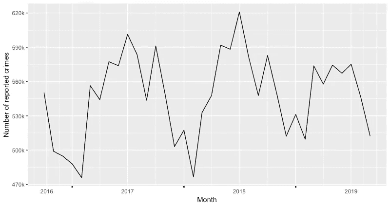
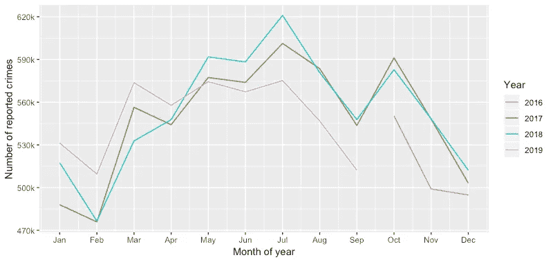
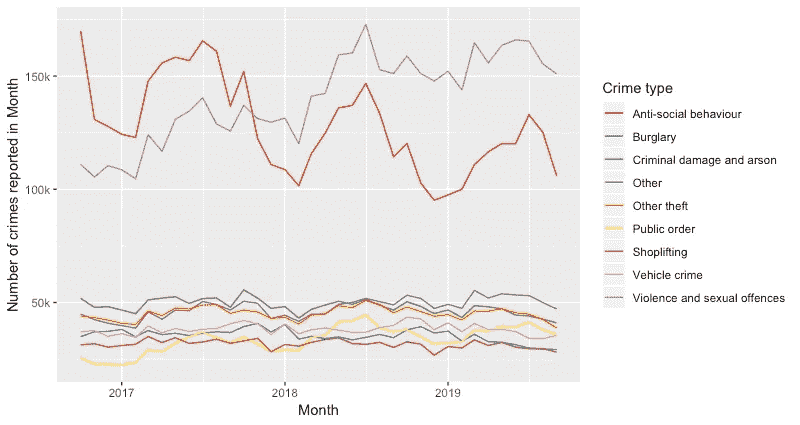
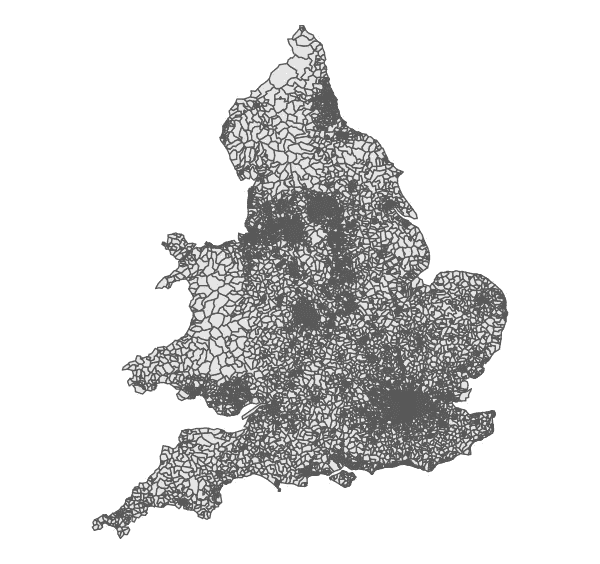
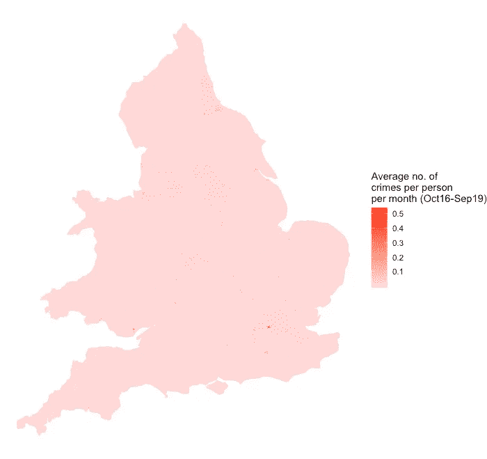
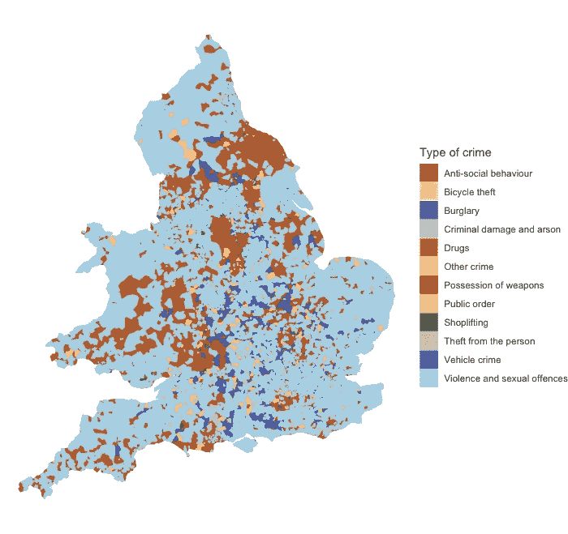
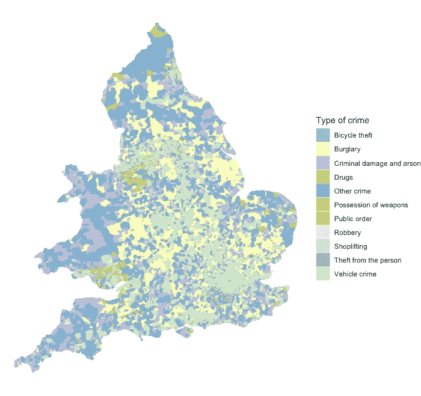

# 犯罪模式

> 原文：<https://towardsdatascience.com/patterns-in-crime-90efacb25923?source=collection_archive---------12----------------------->

## 对过去三年警察数据的分析

犯罪是许多人每天都担心的事情。无论是确保出门时锁好门，还是避开不安定的社区，或是安装安全警报，预防犯罪占据了我们生活的重要部分。尽管事实上在过去的 25 年里，英国的犯罪率几乎一直在下降。

在这篇文章中，我将调查由英国警方提供的公开数据集，以揭示任何有趣或令人惊讶的模式、趋势或异常现象。

这里使用的数据可以从 data.police.uk 网站上公开获得，包含了从 2016 年 10 月**到 2019 年 9 月**英格兰 43 个地理警察部队中的**超过 1900 万报告的** **个人犯罪和反社会行为**、威尔士& NI(加上两支特种部队:英国交通警察和司法部)的信息。这包括关于地点、日期、犯罪类型和最新调查状况的信息。和我的文章一样，分析和可视化是用 r。

## 罪恶的循环

可视化这些数据的最简单方法是查看一段时间内犯罪的绝对数量:

Graph showing the number of reported crimes each month across all police forces in the UK from October 2016 to September 2019.

*   显而易见，这里存在某种季节性趋势，犯罪数量在冬季月份下降，在年中上升到最高点-最高值出现在 2018 年 7 月(全英国报告的犯罪数量为 621，005 起)。

为了更清楚地显示这种循环模式，我们可以将每年的图表叠加起来，跨日历月显示。所有 45 支部队每个日历月报告的犯罪总数见下图。

The total number of reported crimes by calendar month and year from Oct 2016 to Sep 2019.

*   犯罪水平的这种季节性趋势是一个有据可查的现象，自 19 世纪以来一直是犯罪学家研究和辩论的来源。然而，对于为什么会出现这种情况，仍然没有一致的意见，因为季节性的确切特征取决于你所研究的犯罪、地点和时间段。在这里，季节性遵循日历，夏季报告的犯罪数量更多，但情况并非总是如此。
*   这种模式没有单一的原因，简单的解释如天气已经被证明是错误的。然而，温度/天气很可能是环境和社会影响之间复杂相互作用的一部分，从而导致这种季节性。

导致这种模式的一些因素包括:

*   事实上，在夏季的几个月里，会有更多的人出国(这意味着入室盗窃更有可能/可行)。
*   一个潜在的循环:高犯罪率导致警察“镇压”——导致犯罪减少——随后资源撤出——导致更高的犯罪率，等等。
*   还有证据表明，高于平均温度会增加人类攻击性的可能性。

## 各种违法行为

上面的这些图表掩盖了不同类型犯罪之间的差异。在英国，每起已报告的犯罪都被归为 14 类中的一类，如“入室盗窃”、“毒品”或“暴力和性犯罪”。类别和解释的完整列表在的[中。](https://www.police.uk/about-this-site/faqs/#what-do-the-crime-categories-mean)

下图显示了各类犯罪数量随时间的变化情况。

请注意，为了使图表更容易阅读，我将犯罪数量最少的六个类别(“毒品”、“其他犯罪”、“抢劫”、“持有武器”、“盗窃他人财物”和“盗窃自行车”)合并为一个“其他”类别。这不能与“其他盗窃”相混淆，其他盗窃包括员工盗窃、勒索和不付款就走。

Number of reported crimes over time, by type of crime. From Oct 2016 to Sep 2019.

*   两种最常见的犯罪类型是“反社会行为”和“暴力和性犯罪”。
*   2016 年 10 月以来，ASB 不断下跌，VSO 不断增加。
*   ASB 似乎非常接近前面描述的季节性趋势。这是有道理的，因为它往往涉及到人们在外面(13 种 ASB 中只有 2 种与近邻有关，即大多数只能通过离开房子来犯下)，所以可能会随着温度的变化而发生很大变化。这也可以从本质上与 ASB 非常相似的“公共秩序”罪中看出。
*   另一方面，VSO 完全不遵循周期性模式。VSO 可以(而且经常)在家庭或室内进行，所以温度不会有太大的影响。

## 当地违法行为

所提供的数据还提供了所报告犯罪的地理细节，包括 LSOA(“低层超级输出区”)。出于统计报告的目的，英国在地理上被划分为 34，000 多个地方自治市。它们大小不一，较大的区域在农村地区，较小的集水区在城市中心。下面你可以看到这些在英格兰和威尔士是如何划分的。

Map of the 34,700 Lower Layer Super Output Areas (LSOAs) in England & Wales as of 2016.

你可以在一些地方看到，LSOAs 是如此之小，以至于它看起来是一个深色的块。这无意中导致了人口密度的热图——因为在人口密集的地区，人口密度往往更小。

我们可以通过在图中包含 LSOA 的人口密度来验证这一点。下图显示了每个 LSOA 的人口密度(每平方公里的人口数)，颜色越深，人口越密集。

Map showing the population density of LSOAs across England and Wales. Darker colours indicate a higher population density, measured as the number of people per square kilometre. The log value of population per sq. km. is used for readability.

在这里，我们可以看到英格兰和威尔士的大城市的位置，以及该国人口最稀少的地区。

在我们的警方数据中，98%的犯罪都与 LSOA 相关联，因此我现在可以将人口和犯罪的数据集结合起来，以可视化每个 LSOA 的人均犯罪水平。生成的地图如下所示。

Map showing the average number of crimes per person per month in the three years leading up to September 2019.

很明显，这张地图并不像我们希望的那样有用。有少量的地方自治市的犯罪率极高，而且这些地方都位于全国的城市中心(这些地方也很小，所以很难在地图上找到)。

要了解这种差异有多大，请考虑以下情况:

*   在 LSOA，人均每月犯罪数量的**中位数**是 **0.006 起犯罪**。
*   **90%的 LSOAs 的人均月犯罪率**低于 0.0155 起**。**
*   **最大值**比中值 ***高 82 倍*** ，比 90%的 LSOAs 高 ***34 倍*** 。这是在伦敦威斯敏斯特市中心，平均每人每月 0.532 起犯罪。

英格兰和威尔士犯罪率最高的 10 个地方行政区位于伦敦、曼彻斯特、伯明翰、纽卡斯尔、加的夫和格洛斯特，这些都是英国最大的城市(格洛斯特和加的夫除外)。

城市遭受更高的犯罪率也许不足为奇——这是有据可查的事实——但这将是另一篇博文的主题。我使用的数据包含了每起已报告犯罪的大致坐标，因此可以在英国一些最大的城市中绘制一些有趣的地图。

## 时髦的重罪

为了将本文的所有主题联系在一起，最后要看的是调查全国范围内最常见的**型*型*** 型犯罪是否存在差异，以及是否有任何可见的模式。

再看下面一张 LSOAs 的地图，每张地图都根据 14 种犯罪中哪一种最常见来着色。

Map showing the most commonly reported crime for each LSOA in the three years leading up to September 2019.

正如本文前面所讨论的，两种最广泛的犯罪类型(“反社会行为”和“暴力和性犯罪”)远比其他类型更常见，这反映在上面的地图中，它们淹没了其他类型的比较。

为了更深入地挖掘，我们可以从分析中移除这些类型的犯罪，并检查剩余的数据。

Map showing the most common type of reported crime (excluding ‘Anti-social behaviour’ and ‘Violence and sexual offences crimes’) in the three years leading up to September 2019.

这里可以得出一些更有趣的结论:

*   如果你将这张地图与之前的人口密度地图进行比较，你会发现人口密度与**车辆失窃**之间有很强的相关性——城镇中的汽车比农村地区更容易被盗。
*   离开市中心稍微远一点，在建筑密集区的郊区，T2 的入室盗窃似乎很常见。在伦敦周围，中部和西北部的城市都能看到。
*   这与非常偏远的地区形成了鲜明的对比，在那里**刑事破坏**和**公共秩序**犯罪似乎是最常见的犯罪。
*   地图上为数不多的几个彩色点之一显示了威尔士的毒品犯罪报告。这与威尔士目前正在打击的毒品流行率的上升相对应，特别是在加的夫和南海岸。
*   在东南海岸地图右下方的多佛可以看到另一种颜色的下降。这是通过汽车或火车从英国到欧洲其他地方的门户。拥有武器的高犯罪率清楚地表明有人试图通过欧洲向该国走私武器。

## 感谢阅读

如果你喜欢，那么请分享这个，关注并给数据片一个关注，以保持最新的文章！

正如我提到的，将会有一篇后续文章，在那里我将可视化城市中的犯罪，并回答一些问题，如:犯罪在住宅区、工业区还是零售园区更常见？还有警察局的存在对当地的犯罪有影响吗？我还将调查对犯罪的调查有多成功，比较不同地点、犯罪类型和一年中不同时间的定罪率。如果你有任何其他的建议或细节需要我分析，请不要犹豫，在下面评论或发电子邮件给 editor@data-slice.co.uk。