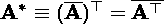

# 用 numpy 解释 PCA 和 SVD

> 原文：<https://towardsdatascience.com/pca-and-svd-explained-with-numpy-5d13b0d2a4d8?source=collection_archive---------0----------------------->

主成分分析和奇异值分解到底有什么关系，如何用 numpy 实现？

主成分分析和奇异值分解是探索性数据分析和机器学习中常用的降维方法。它们都是经典的线性降维方法，试图在原始高维数据矩阵中找到特征的线性组合，以构建数据集的有意义的表示。当涉及到降低维度时，它们受到不同领域的青睐:生物学家经常使用 PCA 来分析和可视化来自群体遗传学、转录组学、蛋白质组学和微生物组的数据集中的源差异。与此同时，奇异值分解，尤其是其简化的截断奇异值分解，在自然语言处理领域更受欢迎，以实现对庞大而稀疏的词频矩阵的表示。

人们可以发现从 PCA 和 SVD 得到的表示在某些数据中是相似的。实际上，PCA 和 SVD 是密切相关的。在这篇文章中，我将使用一些线性代数和几行 [numpy](http://www.numpy.org/) 代码来说明它们之间的关系。

# 0.线性代数复习者

让我们首先快速回顾一下线性代数的一些基础知识，因为 PCA 和 SVD 都涉及一些矩阵分解。

*   **矩阵转置**:重新索引一个二维矩阵 ***A*** 来切换行和列索引，有效地用 *a_{ji}* 替换它的所有元素 *a_{ij}* 。转置的符号是矩阵上上标的⊤或 *'* 。在 numpy 中，可以调用[。T](https://docs.scipy.org/doc/numpy/reference/generated/numpy.ndarray.T.html) 或[。transpose()](https://docs.scipy.org/doc/numpy/reference/generated/numpy.ndarray.transpose.html)NP . ndarray 对象的方法来转置一个矩阵。
*   **点积与矩阵乘法**:两个矩阵***A****(n×m)****B***【m×p】的乘积**=***AB***两个矩阵可以相乘 *n×p.* 合成矩阵 ***C*** 中的元素 *c_{ij}* 计算如下:**

****

**Elements in the product matrix of two matrices are the dot products of the corresponding row vectors and column vectors**

**你可能会意识到，乘积矩阵 ***C*** 中的元素分别是矩阵 ***A*** 和 ***B*** 中对应的行向量和列向量的点积。**

*   ****矩阵求逆**:只有方阵才能求逆，一个矩阵***a****(n×n)*与其逆的乘积***a^****(-1)*是一个单位矩阵 ***I*** ，其中对角线上的元素是 1，其他地方的元素都是 0**
*   ****共轭转置**:定义为共轭矩阵的转置。通常用上标 a *或 *H* (埃尔米特语)表示。共轭矩阵是通过取原始矩阵中所有元素的复共轭而获得的矩阵:**

****

**Conjugate transpose**

**回想一下复数，一个数由一个实部和一个虚部组成。例如， *a + i b* 是一个复数，其中 *i* 是等于-1 的平方根的虚数单位。 *a + i b* 的复共轭为 *a - i b.* 由于我们处理的大部分数据集都是实数的矩阵，所以矩阵的共轭转置等价于普通的转置。**

****

*   ****酉矩阵**:定义为共轭转置也是其逆矩阵的方阵。对于酉矩阵，我们有它的转置等于它的逆:**

****

**Unitary matrix, where the conjugate transpose equates the matrix inverse**

*   ****协方差矩阵**:协方差量化两个随机变量 *X* 和 *Y* 之间的联合变异性，计算如下:**

****

**Covariance**

**协方差矩阵 ***C*** 是来自数据矩阵 ***X*** *(n 个样本× m 个特征)*的特征的两两协方差的方阵。从协方差的定义观察，如果两个随机变量都以 0 为中心，则随机变量的期望变成 0 的，协方差可以计算为两个特征向量 ***x*** 和 ***y*** 的点积。因此，所有要素都居中的数据矩阵的协方差矩阵可计算如下:**

****

**Covariance matrix of a 0-centered matrix ***X*****

**好的，这带来了一些大学线性代数的美好回忆。现在我们来认识一下这个帖子的主角们。**

# **1.主成分分析**

**PCA 旨在寻找线性不相关的正交轴，这些轴也称为主分量(PC)在 *m* 维空间中，以将数据点投影到这些 PC 上。第一台 PC 捕获数据中的最大差异。让我们通过将 PCA 拟合到二维数据矩阵上来直观地理解它，二维数据矩阵可以方便地用二维散点图来表示:**

****

**Making sense of PCA by fitting on a 2-D dataset ([source](https://stats.stackexchange.com/questions/2691/making-sense-of-principal-component-analysis-eigenvectors-eigenvalues))**

**因为所有的 PC 都是相互正交的，所以我们可以使用二维空间中的一对垂直线作为这两个 PC。为了让第一台电脑捕捉到最大的方差，我们旋转了一对电脑，使其中一台电脑与数据点的分布最佳对齐。接下来，可以将所有数据点投影到 PCs 上，它们的投影(PC1 上的红点)本质上是数据集的最终降维表示。Viola，我们刚刚将矩阵从二维减少到一维，同时保留了最大的方差！**

**PCs 可以通过协方差矩阵 ***C*** 的特征分解来确定。毕竟特征分解的几何意义就是通过旋转为 ***C*** 找到特征向量的新坐标系。**

****

**Eigendecomposition of the covariance matrix **C****

**在上式中，协方差矩阵***C****(m×m)*分解为一个特征向量矩阵***W****(m×m)*和一个对角矩阵 *m* 特征值***λ***。特征向量，即 ***W*** 中的列向量，实际上就是我们要寻找的 PC。然后，我们可以使用矩阵乘法将数据投影到 PC 空间。出于降维的目的，我们可以将数据点投影到第一个 *k 个*PC 上作为数据的表示:**

****

**Project data onto the first k PCs**

**PCA 可以非常容易地实现，因为 numpy 是执行特征分解的关键函数( [np.linalg.eig](https://docs.scipy.org/doc/numpy/reference/generated/numpy.linalg.eig.html) )已经内置:**

# **2.德拉贡诺夫狙击步枪（Snayperskaya Vinyovka Dragunov 的缩写）**

**SVD 是实矩阵和复矩阵的另一种分解方法。它将一个矩阵分解成两个酉矩阵( ***U*** ， ***V*** *)和一个奇异值的矩形对角矩阵(***σ***)的乘积:**

****

**Illustration of SVD, modified from [source](https://en.wikipedia.org/wiki/Singular_value_decomposition#/media/File:Singular_value_decomposition_visualisation.svg).**

**在大多数情况下，我们处理的是实矩阵 ***X*** ，得到的酉矩阵****V***也将是实矩阵。因此， ***U*** 的共轭转置就是简单的正则转置。***

***SVD 也已经在 numpy 中实现为 [np.linalg.svd](https://docs.scipy.org/doc/numpy/reference/generated/numpy.linalg.svd.html) 。要使用 SVD 转换数据:***

# ***3.主成分分析和奇异值分解的关系***

***PCA 和 SVD 是密切相关的方法，并且都可以应用于分解任何矩形矩阵。我们可以通过对协方差矩阵 ***C*** 进行奇异值分解来研究它们的关系:***

******

***从上面的推导中，我们注意到结果与 ***C*** 的特征值分解形式相同，我们可以很容易地看出奇异值(***【σ***)与特征值(***λ***)之间的关系:***

******

***Relationship between eigenvalue and singular values***

***要使用 numpy 确认这一点:***

***那么这意味着什么呢？这表明我们实际上可以使用 SVD 来执行 PCA，反之亦然。事实上，PCA 的大多数实现实际上使用在遮光罩下执行 SVD，而不是对协方差矩阵进行特征分解，因为 SVD 可以更有效，并且能够处理稀疏矩阵。此外，还有简化形式的奇异值分解，计算起来更加经济。***

***在下一篇文章中，我将深入研究不同 SVD 解算器和实现的复杂性，包括 numpy、scipy 和新开发的自动签名库[谷歌 JAX](https://github.com/google/jax) 。***

# ***参考资料:***

*   ***[沃尔夫拉姆数学世界](http://mathworld.wolfram.com/)***
*   ***[主成分分析，特征向量&特征值](https://stats.stackexchange.com/questions/2691/making-sense-of-principal-component-analysis-eigenvectors-eigenvalues)***
*   ***[奇异值分解和主成分分析的关系](https://stats.stackexchange.com/questions/134282/relationship-between-svd-and-pca-how-to-use-svd-to-perform-pca)***