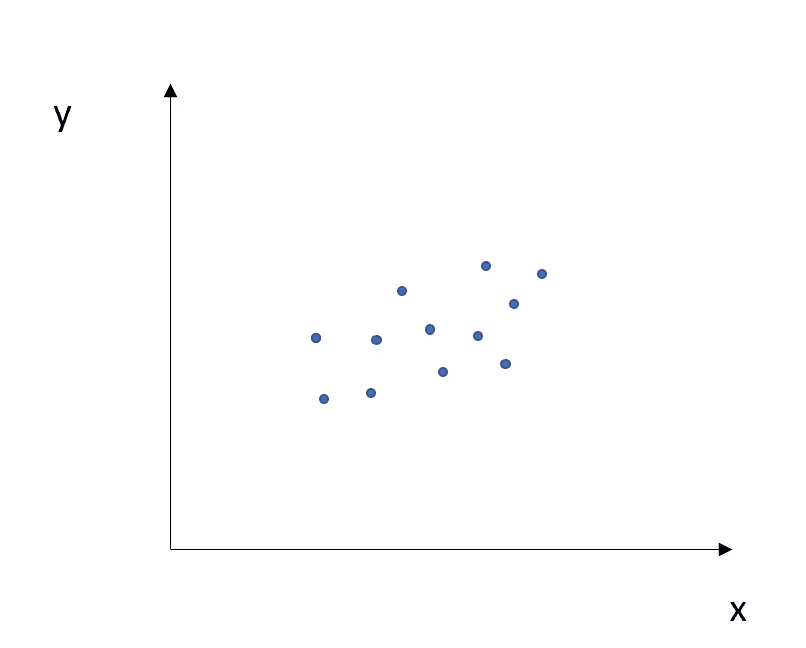
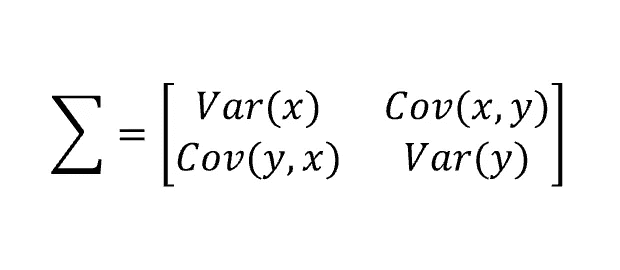
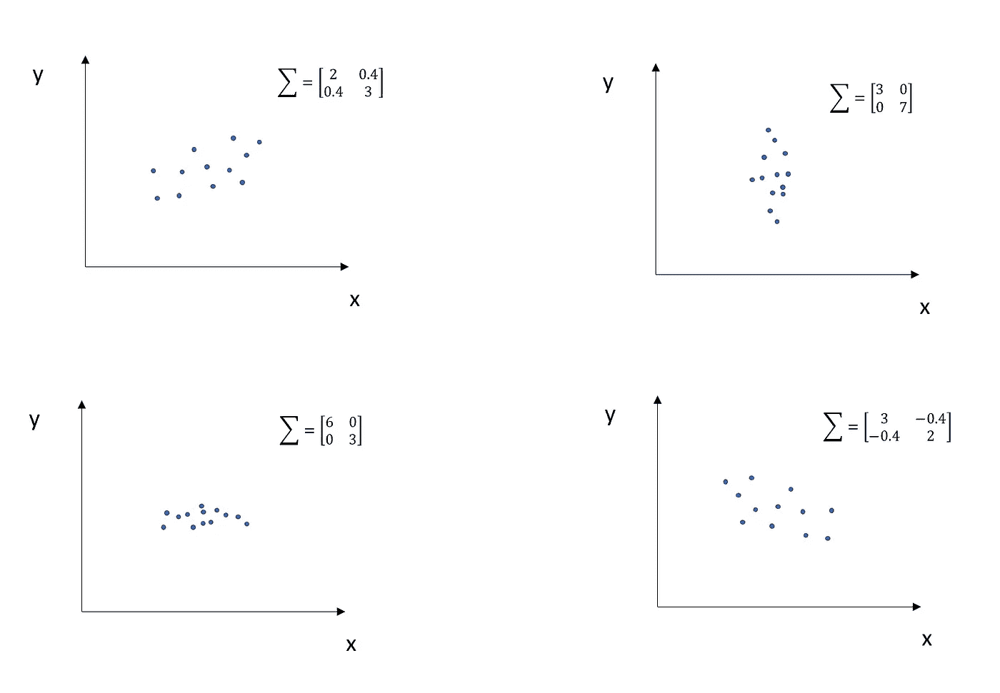
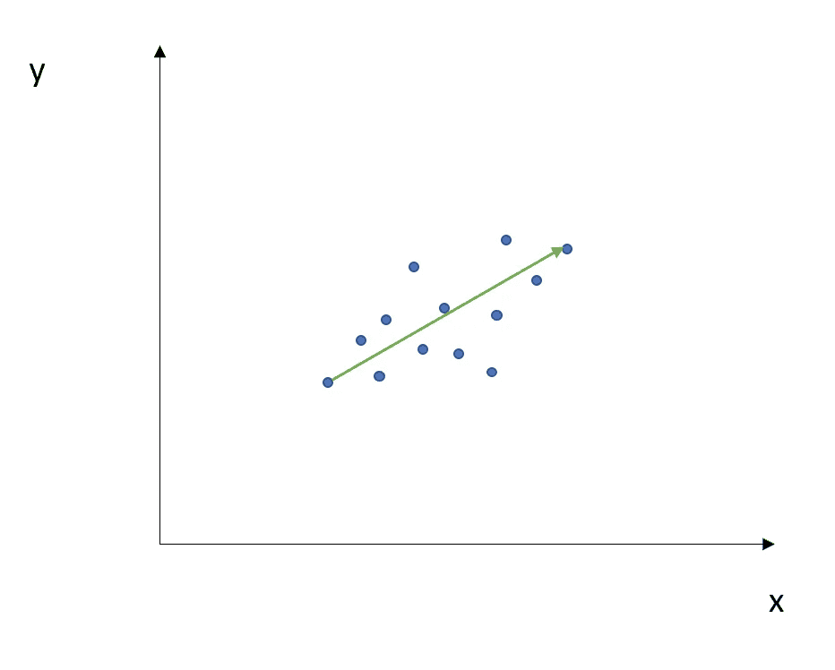
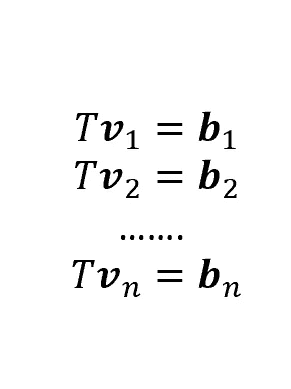
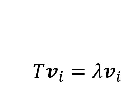
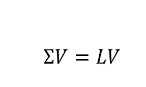
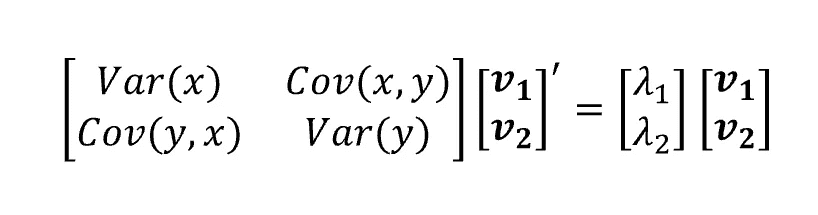

# 主成分分析:特征向量和特征值

> 原文：<https://towardsdatascience.com/pca-eigenvectors-and-eigenvalues-1f968bc6777a?source=collection_archive---------1----------------------->

每当你在处理数据的时候，你总是会面对相对的特征。后者是我们在描述数据时考虑的变量。也就是说，如果你正在收集一些关于米兰房屋的数据，典型的特征可能是位置、尺寸、楼层等等。

然而，经常发生的情况是，你的数据提供给你许多功能，有时是数百个…但是你需要全部吗？好吧，记住简约法则，我们宁愿处理一个只有很少特征的数据集:训练起来会容易得多，也快得多。另一方面，我们不希望在删除某些功能时丢失重要信息。

我们如何处理简单性和信息量之间的权衡呢？这个问题的答案是主成分分析(PCA)的结果。

主成分是由初始变量的线性组合构成的新变量。这些组合是以这样的方式完成的，即这些新变量是不相关的，并且初始变量中的大部分信息被存储到第一分量中。因此，这个想法是， *k* 维数据给你 *k* 主成分，但是 PCA 试图把最大可能的信息放在第一个主成分中，这样，如果你想减少数据集的维数，你可以把你的分析集中在前几个成分上，而不会遭受信息损失的巨大损失。

在这种分析中，度量信息量的是方差，并且主成分可以在几何上被视为高维数据的方向，其捕捉最大数量的方差并将其投影到较小维度的子空间，同时保留大部分信息。因此，第一主成分占最大可能的方差；第二个分量将直观地说明第二大方差(在一个条件下:它必须与第一个主分量不相关)等等。

为了更深入地理解 PCA，我们需要引入一些进一步的概念。

## 协方差矩阵

让我们考虑一个场景，其中我们只有两个特征，x 和 y。我们可以在 2D 图中表示我们的数据如下:

现在，我们可以计算所谓的协方差矩阵:它是一个对称的， *dxd* 矩阵(其中 *d* 是特征的数量，因此在这种情况下 *d* =2 ),其中存储了每个特征的方差和交叉特征协方差:

因为 Cov(x，y)等于 Cov(y，x)，所以如前所述，矩阵是对称的，并且特征的方差位于主对角线上。

协方差矩阵可以根据数据的形状采用不同的值。让我们检查一些场景:

当两个特征正相关时，协方差大于零，否则，它具有负值。此外，如果没有证据表明它们之间存在相关性，则协方差等于零。

如您所见，协方差矩阵定义了数据的分布(方差)和方向(协方差)。这个矩阵还可以分配两个元素:一个代表向量和一个表示其大小的数。向量将指向数据的较大分布的方向，数字将等于该方向的分布(方差)。这两个元素分别是特征向量和特征值。让我们想象一下:

绿色的方向是特征向量，它有一个对应的值，叫做特征值，特征值描述了它的大小。让我们更详细地看看它是如何工作的。

## 特征向量和特征值

为了更好地理解这些概念，让我们考虑下面的情况。我们被提供了二维向量 v1，v2，…，vn。然后，如果我们将线性变换 T(一个 2x2 矩阵)应用于我们的向量，我们将获得新的向量，称为 b1，b2，…，bn。

但是，其中的一些(更具体地说，与特征的数量一样多)有一个非常有趣的特性:确实，一旦应用了变换 T，它们会改变长度，但不会改变方向。这些向量称为特征向量，代表特征向量倍数的标量称为特征值。

因此，每个特征向量都有一个对应的特征值。现在，如果我们考虑我们的矩阵σ，并将所有相应的特征向量收集到矩阵 V 中(其中，作为特征向量的列数将等于σ的行数)，我们将获得如下结果:

其中 L 是存储所有特征值(与特征向量一样多)的向量。如果我们考虑两个特征(x 和 y)的例子，我们将获得以下结果:

然后，如果我们按照特征值降序排列我们的特征向量，我们将得到第一特征向量占数据中最大的分布，第二特征向量占第二大的分布，等等(在描述新空间的所有这些新方向是独立的，因此彼此正交的条件下)。

现在，如果我们想降低数据集的维度，我们应该怎么做呢？假设我们从 5 个特性开始，我们想要处理 2 个特性。因此，程序如下:

*   计算σ矩阵我们的数据，这将是 5x5
*   计算特征向量矩阵和相应的特征值
*   按降序排列我们的特征向量
*   构建所谓的投影矩阵 W，其中将存储我们想要保留的 k 个特征向量(在本例中，2 是我们想要处理的特征的数量)。因此，在我们的例子中，我们的 W 将是一个 5x2 矩阵(通常，它是一个 *dxk* 矩阵，其中*d*=原始特征的数量，*k*=期望特征的数量)。
*   通过投影矩阵 W 变换原始数据，原始数据可以表示为矩阵 X(其中,*n*=观察值的数量，而*d*=特征的数量),从而获得新的数据集或矩阵 Y，其将为 *nxk* 。

这个新的，转换后的空间 Y 的两列，是我们用来代替原始变量的主要成分。如上所述，它们被构造成存储尽可能多的信息。

PCA 广泛用于机器学习任务:事实上，为了使我们的算法有效，训练过程必须尽可能快，但这并不意味着我们可以在没有特定标准的情况下降低维度，从而有丢失相关信息的风险。