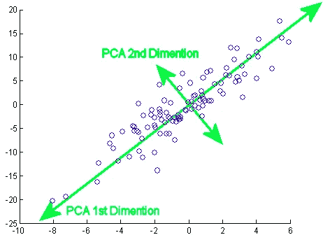

# PCA 不是特征选择

> 原文：<https://towardsdatascience.com/pca-is-not-feature-selection-3344fb764ae6?source=collection_archive---------2----------------------->

## 它实际上是做什么的，什么时候可以用，什么时候不能用。

几乎没有数据科学家会要求更少的数据，但是[维数灾难](https://en.wikipedia.org/wiki/Curse_of_dimensionality)使得必须采取一些措施来管理数据集中的许多变量。主成分分析(PCA)是一种非常有用的工具，但关于 PCA 有一些常见的误解和/或错误，妨碍了初级数据科学家正确应用它。

PCA 是数据从一个坐标系到另一个坐标系的旋转。新数据科学家犯的一个常见错误是将 PCA 应用于非连续变量。虽然在技术上可以对离散变量或作为热编码变量之一的分类变量使用 PCA，但您不应该这样做。简单地说，如果你的变量不属于一个坐标平面，那么就不要对它们应用 PCA。应用后，在我们的新坐标系中，第一维具有最大的方差，然后第二维具有最大的剩余方差，依此类推。

[weigend.com](http://weigend.com/files/teaching/stanford/2008/stanford2008.wikispaces.com/file/view/pca_example.gif)

在相对较小的数据集上，前几个组件可以解释数据集中几乎所有的差异。我见过其他数据科学家错误地认为，这意味着最后几个组件可以忽略不计，前几个组件才是最重要的特性。PCA 是特征选择的有效方法的唯一途径是，如果最重要的变量恰好是那些变化最大的变量。然而，这通常不是真的。作为一个例子，假设您想要对一个 NFL 球队进入季后赛的概率进行建模。NFL 球队的胜利数(0 到 16)比球队的总冲刺码(以千计)更有助于预测进入季后赛的概率，但 PCA 会选择冲刺码作为第一部分的最大贡献者。

有应用 PCA 的好时机。假设我们对调查标准普尔 500 股票的波动性感兴趣。我们可以将 PCA 应用于一个有 500 列(每家公司一列)和 1000 行(每只股票在过去 1000 天的收盘价)的数据集。价格变化大的股票对第一部分的贡献最大。一旦你完成了主成分分析，你现在就有了不相关的变量，它们是旧变量的线性组合。理想情况下，前几个成分可以解释标准普尔 500 中几乎所有的差异。处理这几个变量要比处理 500 个变量(每个公司一个)容易得多。这是一个很好的应用程序，因为每只股票都有相同的标度，也就是说，它们都用美元表示价格。知道什么时候可以，什么时候不可以应用 PCA，对于使用它是必不可少的！