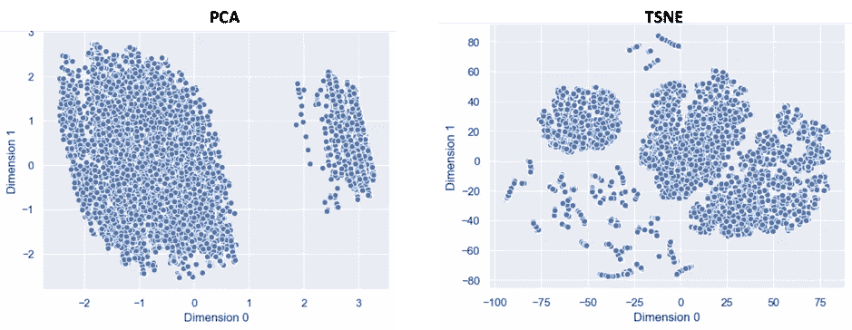
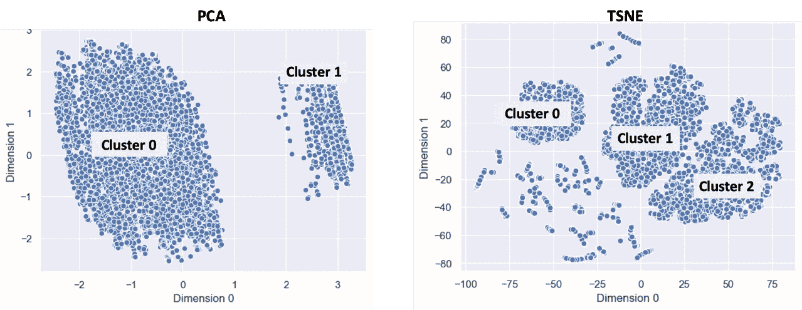
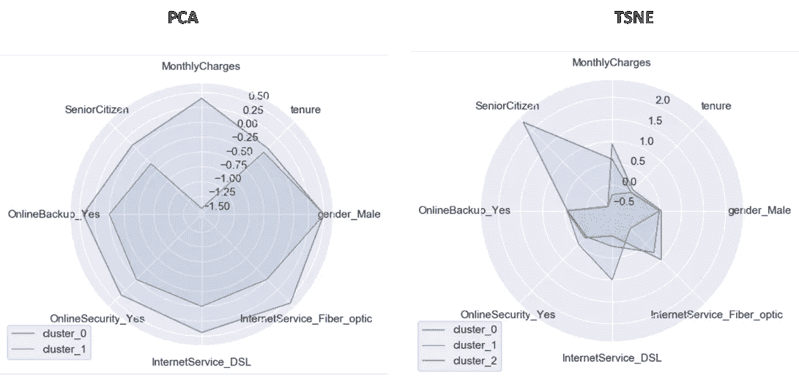
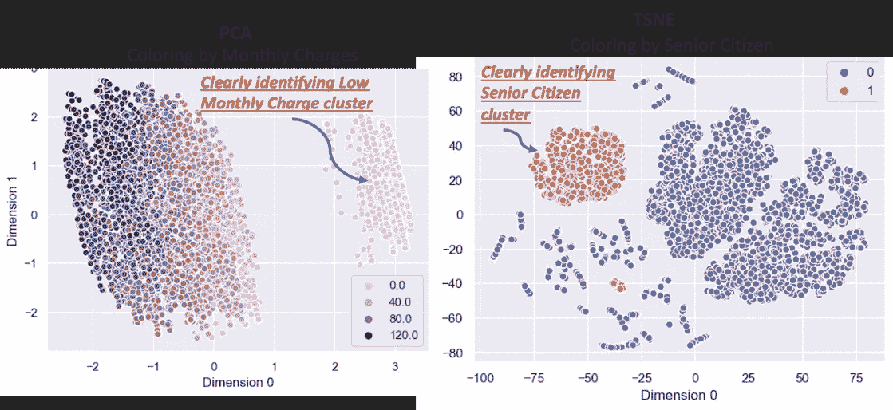
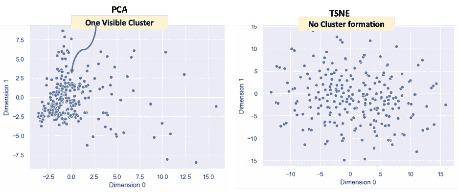
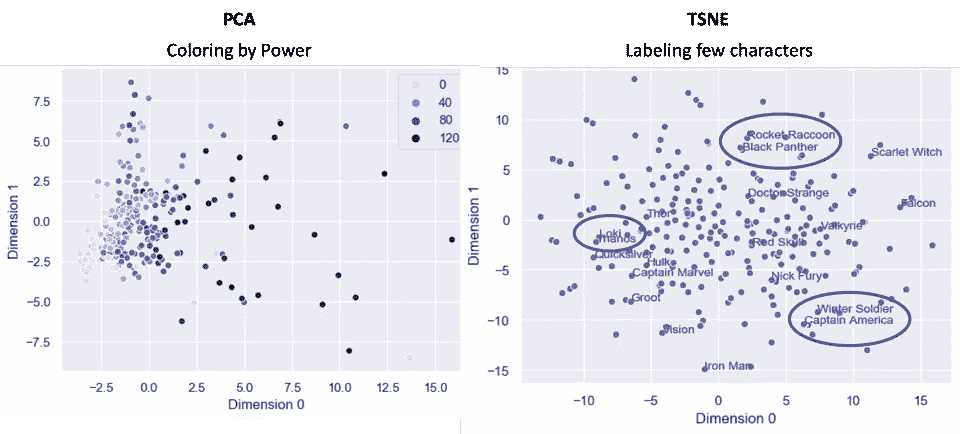

# PCA vs TSNE——El clásico

> 原文：<https://towardsdatascience.com/pca-vs-tsne-el-cl%C3%A1sico-9948181a5f87?source=collection_archive---------14----------------------->

## PCA vs TSNE——这场比赛让我们所有人都兴奋不已

Photo by [Hermes Rivera](https://unsplash.com/@hermez777?utm_source=unsplash&utm_medium=referral&utm_content=creditCopyText) on [Unsplash](https://unsplash.com/s/photos/boxing?utm_source=unsplash&utm_medium=referral&utm_content=creditCopyText)

皇家马德里对巴塞罗那的比赛总是让我们兴奋不已。两支球队都很棒，但都有不同的比赛风格。在数据科学领域，我们有自己的 El clásico——PCA vs TSNE。两者都是流行的降维技术。两者都有自己的风格。

有足够多的关于主成分分析和 TSNE 的文献从数学的角度或者从视觉化的角度探讨了两者的区别。在这个故事中，我想用一种数据故事讲述的方法来展示两者的区别。我将举两个例子，一个是电信客户数据集，另一个是漫威复仇者数据集。激动。然后继续读下去

# 示例 1 —电信数据集的降维

电信公司收集了大量客户信息。客户数据集信息量很大。这里显示了一个这样的样本数据集

Sample Telco dataset

该数据集具有大约 20 个字段，这些字段具有各种信息，例如客户人口统计、订购的服务以及计费费用。它是分类字段和数值字段的混合。

现在让我们在这个数据集上应用两种技术 PCA 和 TSNE，并比较结果

## 步骤 1 —比较输出

使用这两种技术将维数减少到 2 维的结果如下所示

PCA vs TSNE — comparing the output

看着这些观想，我们可以做一些观察。PCA 形成了两个集群。TSNE 已经形成了三个集群，并且有一些数据点从集群中分离出来。

因此，只要比较两种算法的输出，就会发现一些重要的差异。那么这意味着什么呢？让我们在下一步回答这个问题

## 步骤 2 —解释集群

为了理解这种差异，我们必须首先解释集群的含义。出于解释的目的，下面给出了每个集群的名称。在 PCA 端，簇的名称是 Cluster0 和 Cluster1。在 t-SNE 端，集群的名称为集群 0、集群 1 和集群 2

Giving some cluster names

一个简单快捷的解释星团的方法是使用雷达图，如图所示。雷达图显示了每个聚类的重要特征(或列)的平均值

Radar chart to interpret cluster

我们观察到

*   对于 PCA，每月费用是集群之间的最大区别
*   对 TSNE 来说，老年人这一特征是集群之间的最大区别

让我们用一些颜色来验证这些观察。我们可以使用月费给 PCA 可视化中的点着色。类似地，用老年公民给 TSNE 观想中的点上色

这证实了我们已经观察到的雷达图。在 PCA 侧，低月费的集群是清楚可识别的。在 TSNE 一侧，一群老年人清晰可见

## 步骤 3——理解差异

那么，为什么 PCA 选择月费作为主要的差异化领域之一呢？原因是 PCA 是一种数学方法，它试图基于最高方差尽可能地分离点。月费是客户支付的金额，因客户而异

> 所以 PCA 本质上是通过 ***分离*** **点****基于最高变化场。**

**TSNE 选择了老年人作为重点区分领域之一。原因是 TSNE 是一种概率方法，它试图根据两个接近的点来自相同人口分布的概率来尽可能接近地对点进行分组。因此，一般来说，在现实生活中，老年人也可以被认为是一种类型人群，且他们很有可能表现出消费电信服务的类似行为**

> **所以 TSNE 基本上是通过 ***分组*** **点** **尽可能接近**点的特征**

**现在，让我们探索另一个基于漫威字符的数据集，并更深入地了解 PCA 和 TSNE 的内部工作**

# **示例 2-漫威字符数据集的降维**

**漫威给了我们一些很棒的超级英雄电影。幸运的是，它还提供了一个有趣的数据集，这样数据科学家就可以玩了。此处显示了该数据集中的一个样本**

**Marvel comic character data sample**

**这个数据集大约有 185 个字段。相当多的领域，你需要一些超级武器来理解这些大量的领域。幸运的是，在主成分分析和 TSNE 方面，我们拥有超级武器，可以进行一些很酷的降维**

**这里显示的是两种降维技术的输出。**

****

**我们可以观察到在 PCA 中有一个可见的簇，而在 TSNE 中没有形成簇。TSNE 没有任何集群的原因是因为所有的超级英雄都是非常不同的，并且没有相似的超级英雄的潜在群体。超级英雄是独一无二的。没有钢铁侠 100 的人口。只有一个铁人。**

**所以一个超级英雄和另一个超级英雄很接近的可能性很小。用数据科学术语来说，数据非常稀疏。当数据非常稀疏时，TSNE 不会形成任何聚类**

**为了解释 PCA 聚类，我们可以通过功率来给点着色，功率是变化最大的场。对 TSNE 来说，因为没有星团形成，所以给点着色没有意义。分析 TSNE 输出的唯一方法是用漫威角色的名字标记一些点，以便做出一些解释**

****

**在 PCA 输出中，我们看到该簇具有中低功率的字符。随着我们越走越远，角色的力量越来越大。**

**在 TSNE，没有群集，但我们可以分析一些字符之间的密切程度。我们可以看到洛基和灭霸很接近。这可能是因为它们在数据集中代表了一种邪恶的对齐方式。同样，冬季士兵和美国队长也很接近。这是因为他们有相似的军队背景和相似的性格。火箭浣熊和黑豹也是如此，它们具有相似的动物特征和力量**

**基于这个数据集，我们可以做一个更重要的观察**

> **只有当人口分布中有足够的点时(意味着当数据不稀疏时)，TSNE 才会形成聚类。然而，点的接近度可以用来观察两点之间的相似性**

**我的朋友们，这是用两个数据故事对两种降维技术的简单解释。总结一下**

*   **PCA 基本上是通过尽可能地分离点来工作的**
*   **TSNE 基本上是通过将点尽可能靠近地分组来工作的**
*   **只有当数据不稀疏时，TSNE 才会形成簇**

**这两种技术都有自己的风格，在不同的情况下都很有用**

**所以现在正如你所理解的不同，这不是一个对另一个。都是很棒的技术，都有自己的风格。**

****

**Photo by [Jonathan Tomas](https://unsplash.com/@jotomas?utm_source=unsplash&utm_medium=referral&utm_content=creditCopyText) on [Unsplash](https://unsplash.com/s/photos/boxing?utm_source=unsplash&utm_medium=referral&utm_content=creditCopyText)**

# **额外资源**

# **网站(全球资讯网的主机站)**

**你可以访问我的网站进行零编码分析。[https://experiencedatascience.com](https://experiencedatascience.com)**

**请**订阅**每当我发布一个新的故事时，请及时通知我。**

** [## 每当 Pranay Dave 发表文章时，您都会收到电子邮件。

### 每当 Pranay Dave 发表文章时，您都会收到电子邮件。通过注册，您将创建一个中型帐户，如果您还没有…

pranay-dave9.medium.com](https://pranay-dave9.medium.com/subscribe) 

你也可以通过我的推荐链接加入 Medium。

 [## 通过我的推荐链接加入 Medium—Pranay Dave

### 作为一个媒体会员，你的会员费的一部分会给你阅读的作家，你可以完全接触到每一个故事…

pranay-dave9.medium.com](https://pranay-dave9.medium.com/membership) 

https://www.youtube.com/c/DataScienceDemonstrated 的 YouTube 频道
这里是我的 Youtube 频道
[的链接](https://www.youtube.com/c/DataScienceDemonstrated)**