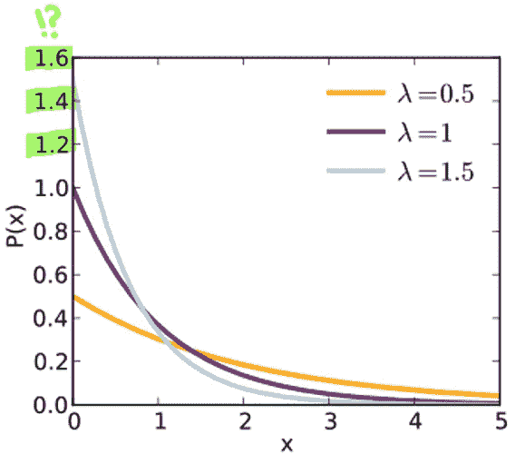
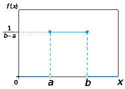
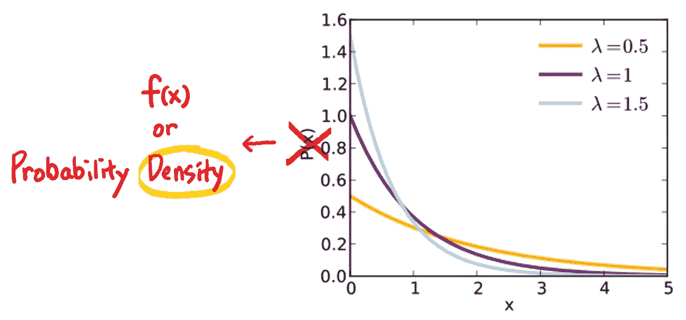

# PDF 不是概率。

> 原文：<https://towardsdatascience.com/pdf-is-not-a-probability-5a4b8a5d9531?source=collection_archive---------0----------------------->

## x 处的概率密度可以大于 1，但是它怎么能积分为 1 呢？

众所周知，**概率的最大值是 1** 。

但对于某些 PDF(如指数分布的 pdf，下图)，当 **λ= 1.5** 和 **𝒙 = 0** 时，概率密度为 **1.5** ，明显大于 **1** ！



[From Wikipedia: The PDF of Exponential Distribution](https://en.wikipedia.org/wiki/Exponential_distribution)

# 1.一个 PDF 的值怎么可能大于 1，概率仍然积分为 1？

即使 PDF **f(x)** 取大于 1 的值，如果它所积分的区域小于 **1** ，它加起来只能是 **1** 。让我们举一个最简单的 PDF 的例子——定义域**【0，0.5】**上定义的均匀分布。均匀分布的 PDF 为 **1/(b-a)** ，在整个中**恒定为 2。**



[The PDF of uniform distribution](https://en.wikipedia.org/wiki/Uniform_distribution_(continuous))

总概率就是图 f(x) ，
下的**总面积也就是 **2 * 0.5 = 1** 。**

如你所见，即使 PDF 大于 **1** ，因为它在小于 **1** 的域上积分，所以它可以累加到 **1** 。

# 2.概率密度函数和概率的区别

**PDF f(x)不是概率吗？**

否。因为 **f(x)可以大于 1** 。
(PDF 中的“PD”代表“概率密度”，不是概率。)

**f(𝒙)** 只是 PDF 图在 **X = 𝒙** 处的高度。([你是否混淆了 **𝐗** vs **𝒙** 的符号？点击这里查看](https://medium.com/@aerinykim/sum-of-exponential-random-variables-b023b61f0c0f#9437)。)

整个“PDF =概率”的误解是因为我们习惯了“ [PMF](https://en.wikipedia.org/wiki/Probability_mass_function) =概率”的概念，事实上，这是正确的。但是，**一个 PDF 和一个 PMF** 不是一回事，也不应该和一个 PMF 做同样的解读，因为离散随机变量和连续随机变量的定义是不一样的。

**对于离散随机变量，我们在单点查找 PMF 的值以找到它的概率 P(𝐗=𝒙)** (例如[还记得我们如何将](/poisson-distribution-intuition-and-derivation-1059aeab90d#4c74)**[插入泊松 PMF 吗？](/poisson-distribution-intuition-and-derivation-1059aeab90d#4c74) **)
对于连续的随机变量，我们在某个区间**上对一个 PDF 进行积分，求其 **X** 落在那个区间的概率。**

```
**f(x) ≠ P(X = 𝒙)*** **f(x): PDF for a continuous r.v.** * **P(X = x) : PMF for a discrete r.v.**
```

**当然，都很好。然而，你可能想知道…**

> **为什么我们必须整合 PDF？**
> 
> **我们能不能像处理 PMF 值一样，只对 PDF 值求和？**

**不会。因为，**对于连续随机变量，𝐗取任意特定值𝒙的概率为 0。****

# **3.为什么连续随机变量在每一点的概率为零？**

**我们来看前面的例子——均匀分布在**【0，0.5】。****

> **x=1 时的概率密度**为 2。但是为什么 x=1 时的**概率**为零呢？****

**要回答上面的问题，我们需要先回答下面的问题:
**【0，0.5】中我们总共有多少个实数？****

****无限∞。**(数学上彻底一点，[不可数无穷](https://en.wikipedia.org/wiki/Uncountable_set)。)
**0.1** ， **0.01** ， **0.001** ， **0.0001** ，…可以在最小的小数前面一直插入 0。**

**因此，**一个连续的随机变量有无限#的可能取值，即使定义域很小且固定。**假设**【0，0.5】**中每个值的概率密度取一个极小的值，例如 000000001。**尽管如此，无限(不可数)多个值的总和将达到无穷大，不管它们的值有多小。****

**那么，为了使概率之和为 1 **，单点的概率应该是 1/∞** ，**也就是 0** 。**

**嗯，这也说不通。如果你加上无穷多个零，你仍然会得到零。总概率加起来应该是 1，而不是 0。**

**问题是，我们不能对连续变量使用离散 PMF(一个值有一个匹配概率)的概念。我们不能像对离散变量那样定义连续变量的概率。**

# **4.那我们怎么从概率密度 f(x)计算概率呢？**

## ****我们将借用“积分”的思想。****

**如果 **X** 正好在点𝒙的概率为零，那么围绕点 **𝒙** 的一个极小的区间呢？说，**【𝒙，𝒙+d𝒙】？**假设 **d𝒙** 是 0.00000000001。**

**那么 **X** 落在**【𝒙，𝒙+d𝒙】**的概率就是 **f(𝒙)** 夹在**【𝒙，𝒙+d𝒙】**中间的曲线下的面积。**

**如果 **d𝒙** 无限小，这个近似值对**p(𝐗=𝒙**来说就足够好了。**

```
**f(𝒙)d𝒙** : The probability of **X** in **[𝒙, 𝒙+d𝒙]**.
**f(𝒙)**: Probability density.
**d𝒙** : Interval length.
```

**需要注意一些事情:**

**1.如果你看一下 PDF 和 PMF 的定义，它实际上只是把离散情况下的求和(PMF)变成了连续情况下的积分(PDF)。**

**2.为什么我们使用术语*【密度】**【质量】*？**

**这类似于物理学中的质量密度——将*密度*积分得到*质量*。如果你把一个*质量*想成一个概率，我们就对一个概率*密度*进行积分得到一个概率(*质量*)。**

**3.𝒙点的概率密度意味着什么？**

**意思是𝒙附近单位长度( **d** 𝒙)有多少概率集中，或者𝒙.附近概率有多密集**

**4.我们需要修正维基百科上的指数分布图。Y 轴的水平 **P(X)** 听起来像是概率。我们需要把它改成 **f(x)** 或者**“概率密度”**。**

****

**[Wikipedia: The PDF of Exponential Distribution](https://en.wikipedia.org/wiki/Exponential_distribution)**

## **你可能喜欢的其他直观的文章:**

**[](/poisson-distribution-intuition-and-derivation-1059aeab90d) [## 泊松分布直觉(和推导)

### 何时使用泊松分布？

towardsdatascience.com](/poisson-distribution-intuition-and-derivation-1059aeab90d) [](https://medium.com/@aerinykim/what-is-exponential-distribution-7bdd08590e2a) [## 指数分布直觉

### 它的派生词和例子

medium.com](https://medium.com/@aerinykim/what-is-exponential-distribution-7bdd08590e2a)**