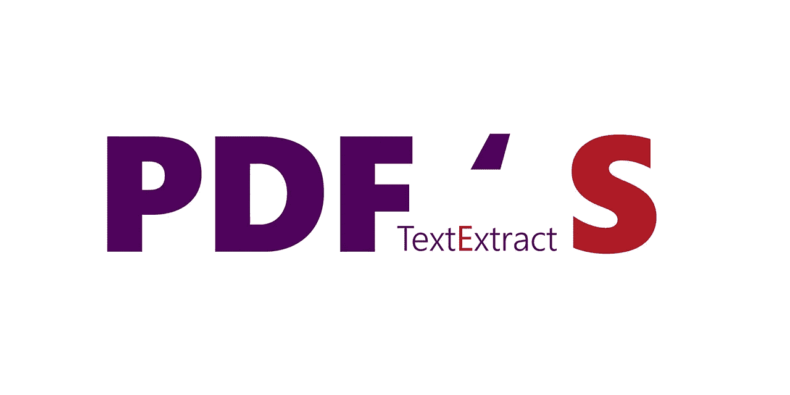

# 使用 Python 处理 PDF

> 原文：<https://towardsdatascience.com/pdf-preprocessing-with-python-19829752af9f?source=collection_archive---------2----------------------->


Photo by [James Harrison](https://unsplash.com/@jstrippa?utm_source=medium&utm_medium=referral) on [Unsplash](https://unsplash.com?utm_source=medium&utm_medium=referral)

## 介绍

作为一种语法相对简单的高级解释语言，Python 对于那些没有编程经验的人来说是完美的。流行的 Python 库被很好地集成在一起，提供了处理像 Pdf 这样的非结构化数据源的解决方案，并且可以用来使它更加合理和有用。

PDF 是最重要和使用最广泛的数字媒体之一。用于提交和交换文档。pdf 包含有用的信息、链接和按钮、表单域、音频、视频和业务逻辑。

## 1-为什么使用 Python 处理 PDF

如你所知，PDF 处理属于文本分析。

大多数文本分析库或框架都是仅用 Python 设计的。这为文本分析提供了杠杆作用。还有一点，你永远无法在现有的机器学习或自然语言处理框架中直接处理 pdf。除非他们为此提供一个明确的接口，否则我们必须首先将 pdf 转换成文本。

## 2-用于 PDF 处理的 Python 库

**作为一名数据科学家，你可能不会拘泥于数据格式。**

pdf 是一个很好的数据源，大多数组织只发布 pdf 格式的数据。

随着 AI 的成长，我们需要更多的数据进行预测和分类；因此，忽略 pdf 作为数据源可能是一个错误。实际上，PDF 处理有点困难，但是我们可以利用下面的 API 来简化它。

在这一节中，我们将发现**顶级 Python PDF 库:**

[pdf miner](https://euske.github.io/pdfminer/index.html)

PDFMiner 是一个从 PDF 文档中提取信息的工具。与其他 PDF 相关工具不同，它完全专注于获取和分析文本数据。PDFMiner 允许用户获得文本在页面上的确切位置，以及其他信息，如字体或线条。它包括一个 PDF 转换器，可以将 PDF 文件转换为其他文本格式(如 HTML)。它有一个可扩展的 PDF 解析器，可以用于文本分析之外的其他目的。

[**PyPDF2**](https://github.com/mstamy2/PyPDF2)

PyPDF2 是一个纯 python 的 PDF 库，能够拆分、合并、裁剪和转换 PDF 文件的页面。它还可以向 PDF 文件添加自定义数据、查看选项和密码。它可以从 pdf 中检索文本和元数据，还可以将整个文件合并在一起。

[pdfrw](https://github.com/pmaupin/pdfrw)

pdfrw 是一个 Python 库和实用程序，用于读取和写入 PDF 文件:

*   版本 0.4 已经过测试，可以在 Python 2.6、2.7、3.3、3.4、3.5 和 3.6 上运行
*   操作包括子集化、合并、旋转、修改元数据等。
*   最快的纯 Python PDF 解析器
*   多年来一直被印刷商用于印前生产
*   可与 rst2pdf 一起使用，忠实地再现矢量图像
*   可以单独使用，也可以与 report lab 结合使用，以便在新的 pdf 中重用现有的 pdf
*   特许的

**石板**

Slate 是一个 Python 包，它简化了从 PDF 文件中提取文本的过程。这取决于 PDFMiner 包。

## 3-设置环境

**第一步:**从【Python.org】**中选择要安装的 Python 版本。**

****第二步:**下载 Python 可执行安装程序。**

****第三步:**运行可执行安装程序。**

****步骤 4:** 验证 Python 是否安装在 Windows 上。**

****步骤 5:** 验证是否安装了 Pip。**

****第六步:**将 Python 路径添加到环境变量中(可选)。**

****步骤 7** :为你的 IDE 安装 Python 扩展。**

> **我在 visual studio 代码中使用 Python 3.7。有关如何设置环境和选择 Python inter inter ter 来开始用 VS 代码编码的更多信息，请查看 VS 代码文档中的**[**Python 入门。**](https://code.visualstudio.com/docs/python/python-tutorial)****

****第 7 步:现在你可以用你的 IDE 执行 python 脚本了。****

******步骤 8** :安装 **pdfminer.six******

```
**pip install pdfminer.six**
```

******第 9 步**:安装 **PyPDF2******

```
**pip install PyPDF2**
```

****搞定了。现在，你可以开始用 python 处理 pdf 文档了。****

## ******4-多个大型 Pdf 文档文本提取解决方案******

********

****pdf 文本提取解决方案基于三个主要步骤:****

*   ******将 PDF 文档分割成一组文档(逐页分割)******
*   ******处理分割文档并提取文本。******

******步骤 1:设置烧瓶应用端口和前缀:******

```
**import datetime
import numpy as np
import json

def myconverter(o):

    if isinstance(o, datetime.datetime):
        return o.__str__()
    if isinstance(o, np.bool_):
        return o.__str__()

def writeToJSONFile(filepath, data):
    with open(filepath, 'w') as file:
        json.dump(data, file, default=myconverter, indent=4)

ports = {
    "data_extraction": 5000
}

PREFIX = "/api"**
```

******第二步:分割 PDF 文档**:****

****该脚本包括:****

*   ****从上传文件夹中收集 Pdf 文件****
*   ****逐页分割 Pdf 文件****
*   ****将分割的 pdf 页面保存到输出文件夹****

```
**import os
from PyPDF2 import PdfFileReader, PdfFileWriter

def splitting(upload_folder, split_folder):
    '''Do collect PDF files, split pages and save them
    '''

    entries = os.listdir(upload_folder)
    path = os.path.abspath(split_folder)

    for entry in entries:

        uploaded_file = os.path.join(upload_folder, entry)
        output_file_folder = os.path.join(path, entry)

        if not os.path.isdir(output_file_folder):
            os.mkdir(output_file_folder)

            pdf = PdfFileReader(uploaded_file, strict=False)
            for page in range(pdf.getNumPages()):
                pdf_writer = PdfFileWriter()
                pdf_writer.addPage(pdf.getPage(page))
                output_filename = \
                    os.path.join(output_file_folder, f'{page+1}.pdf')
                with open(output_filename, 'wb') as out:
                    pdf_writer.write(out)** 
```

******第三步:从 PDF 文档中提取文本**:****

****该脚本包括:****

*   ****收集分割的 PDF 页面。****
*   ****将文本文件提取并保存到输出目录****

```
**import os
from io import StringIO
import re
from pdfminer.pdfinterp import PDFResourceManager, PDFPageInterpreter
from pdfminer.converter import TextConverter
from pdfminer.layout import LAParams
from pdfminer.pdfpage import PDFPage

def pdf_to_text(path):
    '''Extract text from pdf documents
    '''

    manager = PDFResourceManager()
    retstr = StringIO()
    layout = LAParams(all_texts=False, detect_vertical=True)
    device = TextConverter(manager, retstr, laparams=layout)
    interpreter = PDFPageInterpreter(manager, device)
    with open(path, 'rb') as filepath:
        for page in PDFPage.get_pages(filepath, check_extractable=True):
            interpreter.process_page(page)
    text = retstr.getvalue()
    device.close()
    retstr.close()
    return text

def extraction(split_path, text_path):
    '''Extract and save text files to output dir
    '''

    # entries names
    entries = os.listdir(split_path)

    # repeat the process for each entry
    for entry in entries:

        # define a custom list cotain entries files paths
        custom_list = os.listdir(os.path.join(split_path, entry))

        # list must be sorted
        custom_list.sort(key=lambda f: int(re.sub(r'\D', '', f)))

        # repeat the process for each file path
        for file_path in custom_list:

            text_output = pdf_to_text(
                os.path.join(split_path, entry, file_path))

            # save text file of each entry
            with open(os.path.join(text_path, f"{entry}.txt"),
                      "a",
                      encoding="utf-8") as text_file:
                text_file.write(text_output)**
```

******步骤 4:提取相关实用程序的烧瓶包装: (分离和提取烧瓶 API)******

```
**'''Flask wrapping of the extraction related utilities
'''

import os
from flask import Flask, request, jsonify
from werkzeug.utils import secure_filename

from global_common import ports
from global_common import PREFIX
from extraction import extraction
from splitting import splitting

app = Flask(__name__)
port = int(os.environ.get("PORT", ports["data_extraction"]))

path = os.getcwd()

# Project directories defined As follow:

# -data_dir-: data .
data = os.path.join(path, 'data')
if not os.path.isdir(data):
    os.mkdir(data)

# -upload_dir-: contain files uploaded.
uploads = os.path.join(data, 'uploads')
if not os.path.isdir(uploads):
    os.mkdir(uploads)

# -preparation_dir-: contain processed & prepared files.
prepare = os.path.join(data, 'files_preparation')
if not os.path.isdir(prepare):
    os.mkdir(prepare)

# -output_dir-: contain generated text files.
outputs = os.path.join(data, 'outputs')
if not os.path.isdir(outputs):
    os.mkdir(outputs)

# Verify and validate files extensions...
ALLOWED_EXTENSIONS = set(['.pdf'])

def allowed_file(filename):
    '''Assess if the file extension is in the allowed listdir
    '''
    lowercase_extension = os.path.splitext(filename)[1].lower()
    return lowercase_extension in ALLOWED_EXTENSIONS

@app.route(PREFIX + '/upload', methods=['POST'])
def upload():
    '''Upload files to process
    '''
    if request.method != 'POST':
        resp = jsonify({'message': 'Operation not supported'})
        resp.status_code = 500
        return resp

    # check if the post request has the file part
    if 'files[]' not in request.files:
        resp = jsonify({'message': 'No file part in the request'})
        resp.status_code = 500
        return resp

    files = request.files.getlist('files[]')

    errors = {}
    success = False

    # check if file allowed or not allowed.
    for file in files:
        if file and allowed_file(file.filename):
            filename = secure_filename(file.filename)
            file.save(os.path.join(uploads, filename))
            success = True
        else:
            errors[file.filename] = 'File type is not allowed'

    if success and errors:
        errors['message'] = 'File(s) successfully uploaded'
        resp = jsonify(errors)
        resp.status_code = 404
        return resp

    if success:
        resp = jsonify({'message': 'Files successfully uploaded'})
        resp.status_code = 200
        return resp

    resp = jsonify(errors)
    resp.status_code = 404
    return resp

@app.route(PREFIX + '/extraction', methods=['POST'])
def extract_function():
    '''Do extract data from files
    '''
    if request.method == 'POST':  # check request method
        if not os.listdir(uploads):  # if uploads dir is empty return -> error
            resp = jsonify({'message': 'Files not found'})
            resp.status_code = 500
            return resp

        try:

            # splitting : split docs into single pages.
            splitting(uploads, prepare)

            # extraction: extract text from pages.
            extraction(prepare, outputs)

            resp = jsonify({'message': 'Files successfully extracted '})
            resp.status_code = 200
            return resp

        except:

            resp = jsonify({'message': 'error occurs while extraction'})
            resp.status_code = 404
            return resp
    else:

        resp = jsonify({'message': 'Operation not supported'})
        resp.status_code = 500
        return resp

if __name__ == '__main__':
    app.run(debug=True, host='0.0.0.0', port=port)**
```

******第五步:编写 Dockerfile 文件******

```
**FROM python:3.7
COPY . /app/
WORKDIR /app
RUN pip install -r requirements.txt
ENTRYPOINT ["python3"]
CMD ["app.py"]**
```

******第六步:** **编写 App(编写 Docker-Compose 文件**)****

```
**version: '3'

services:
  web:
    build: '.'
    ports:
      - '5000:5000'**
```

******步骤 7:测试烧瓶应用程序(上传&提取)******

****另外，我在[的 pdf-text extract](https://github.com/ahmedkhemiri95/PDFs-TextExtract)GitHub 项目中附上了 postman 集合。****

```
**curl -X POST [http://127.0.0.1:5000/api/upload](http://127.0.0.1:5000/api/upload)
curl -X POST [http://127.0.0.1:5000/api/upload](http://127.0.0.1:5000/api/upload) --form 'files[]=@"toto.pdf"' --form 'files[]=@"toto2.pdf"'
curl -X POST [http://127.0.0.1:5000/api/extraction](http://127.0.0.1:5000/api/extraction)** 
```

****GitHub 上有完整版的 Extraction。****

******请通过**查看****

*******分叉*** *和* ***主演*** *资源库是支持项目的最佳方式。*****

****[](https://github.com/ahmedkhemiri95/PDFs-TextExtract) [## ahmedkhemiri 95/pdf-text extract

### Python 多 PDF 文档文本提取— Python 3.7 作为一名数据科学家，你可能不会拘泥于数据格式。PDFs

github.com](https://github.com/ahmedkhemiri95/PDFs-TextExtract)**** 

> ******如果你对我的文章有任何反馈、评论或有趣的见解，请随时通过我的 LinkedIn 社交媒体频道联系我******

******你可以在 Github 上关注我:【https://github.com/ahmedkhemiri95】T22******

****[](https://www.linkedin.com/in/ahmed-khemiri-b33400134/) [## Ahmed Khemiri -微软认证培训师-微软| LinkedIn

### 在世界上最大的职业社区 LinkedIn 上查看 Ahmed Khemiri 的个人资料。艾哈迈德有 3 个工作列在他们的…

www.linkedin.com](https://www.linkedin.com/in/ahmed-khemiri-b33400134/)****