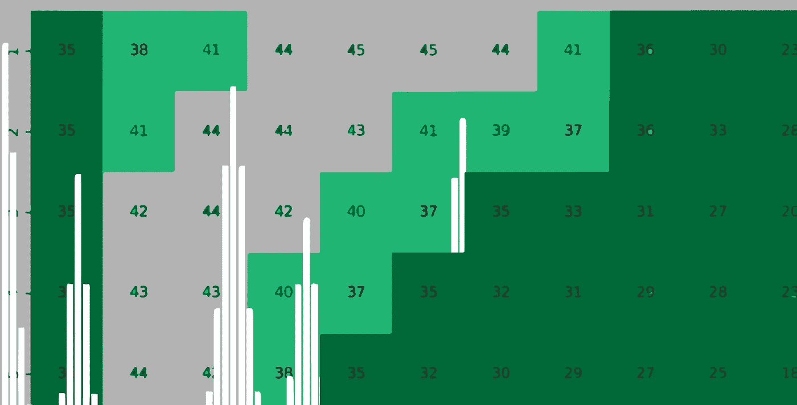
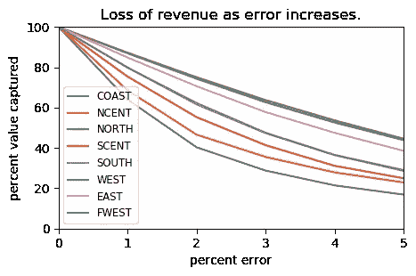
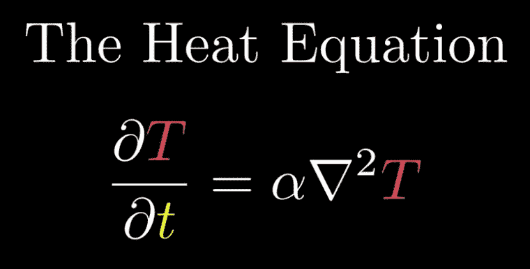
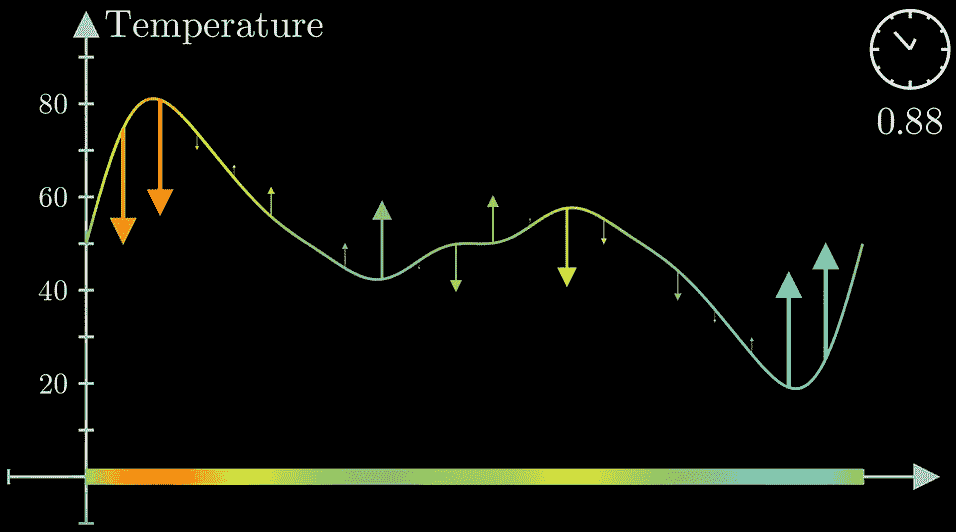
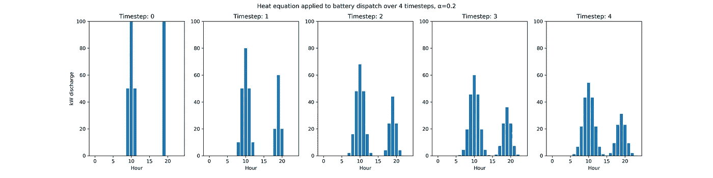
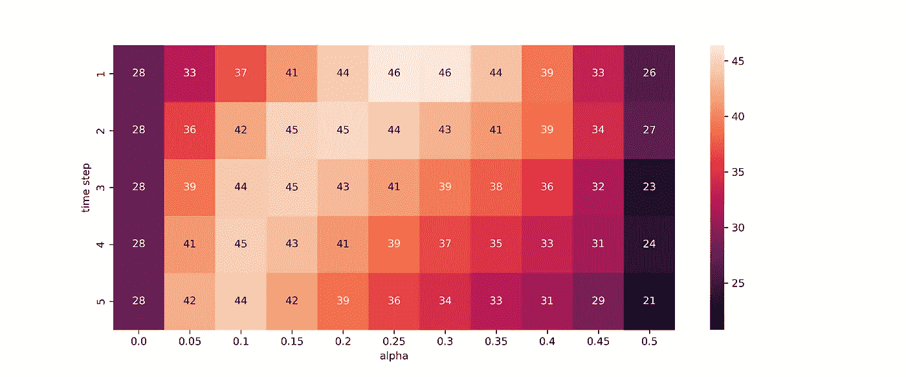
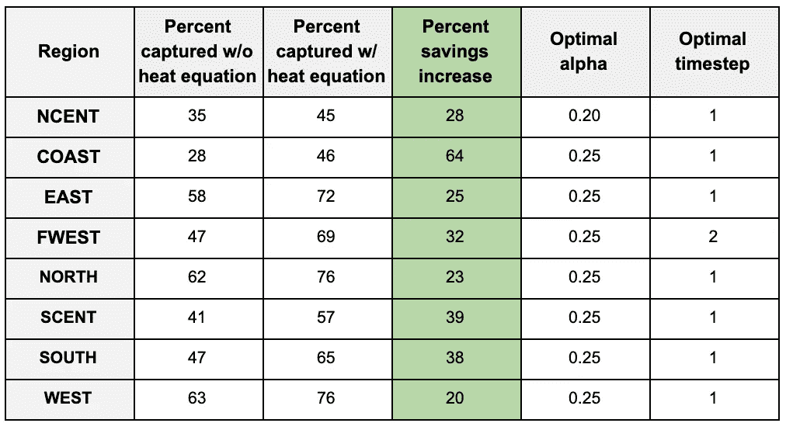

# 预测不可靠的调峰。

> 原文：<https://towardsdatascience.com/peak-shaving-with-unreliable-forecasts-78bb9623e6b0?source=collection_archive---------31----------------------->

## 神经网络调峰:第三部分

## 一个 19 世纪的物理方程如何能让电力公司节约超过 60%

*与* [合作研究*开放建模框架*](http://omf.coop/) *。*

*这是关于神经网络调峰的三部分系列文章中的第三部分。考虑一下另外两个:*

 [## 电力公司神经网络调峰三部曲指南。

### 电力分销商可以通过降低高峰需求费用来节省数十万美元。一些…

www.brownanalytics.com](https://www.brownanalytics.com/energy_forecasting) 

即使是预测能源消耗的最佳模型也不足以捕捉大部分调峰的可能价值。当一个预测只有 3%的误差时，结果是损失一半的可能节省并不罕见。考虑最小的误差如何显著影响这些电力公司预期的调峰成本节约(此处[测试](https://github.com/kmcelwee/mediumBlog/blob/master/load_forecast/How%20much%20value%20is%20captured%20with%20different%20prediction%20accuracy%3F.ipynb)):

考虑到这一点，在考虑第二天的负载预测的不确定性时，考虑公用事业公司应该部署哪种调度策略是很重要的。谢天谢地，我们可以用一个等式来为这种不确定性做打算，对冲我们的赌注，并重新获得一些在不完美预测中损失的价值。

# 设置

3D 热量方程如下所示。3Blue1Brown 的[对该主题的介绍](https://www.youtube.com/watch?v=ly4S0oi3Yz8)启发了这种方法。就我们的目的而言，您只需要知道热量方程是一个方便的函数，可以在曲线下的面积保持不变的情况下展平曲线。我们希望在使用所有可用资源的同时分散我们的派遣。

Left: The 3D heat equation, where T is temperature, alpha is some constant and t is time. Right: How the heat equation affects a curve. Source: 3Blue1Brown

考虑对明天负荷曲线的预测。我们知道，一般来说，3%的平均绝对误差是正确的。我们不能将所有鸡蛋放在一个篮子里(即，将我们所有的电池调度放在一个小时内)。我们根据预测的负载来计算理想的存储调度，然后将热量方程应用到附近的时间。这确保了最小的预测误差不会导致储蓄的显著下降。

下面是转化为 python 的热量方程及其对存储调度的影响:

## 其他详细信息

电力公司可能犯的最大错误是试图在错误的时间给电池充电。在我测试过的众多型号中，中午充电的电池持续增加本月的峰值(T2)。由于这个原因，最好总是安全地玩，并且总是在消耗处于绝对低的时候充电。从我收集的信息来看，这种保险策略只损失了大约 1-2%的最佳可能价值，而且非常值得，至少在预测软件变得更好之前是如此。

为了做出调度决策，我们使用线性编程 python 包`puLP`。软件包的细节可以在这里找到[——它对任何类型的运筹学都非常有用。我们陈述了一个目标函数，如“最小化最大负载”，同时提供了电池的限制。](https://pythonhosted.org/PuLP/)

# 结果呢

我测试了从 2002 年到 2018 年，热量等式将如何影响德克萨斯州八个 ERCOT 地区的收入。为了模拟预测精度，我添加了一个噪声的正态分布，在负载周围有 3%的标准偏差。我假设我们有 700 千瓦的存储，每小时最多可以调度 500 千瓦。功能和测试可以在[本 jupyter 笔记本](https://github.com/kmcelwee/mediumBlog/blob/master/load_forecast/How%20effective%20is%20the%20heat%20equation%3F.ipynb)中找到。

重要的是要澄清，测试是在每天的峰值上执行的，以收集更大的样本。我依赖的假设是月峰值和日峰值之间没有显著差异。

Percent of optimal value obtained if heat equation is applied with given values in the COAST region of ERCOT.

上面的热图显示了应用不同的 alpha 值和时间步长时获得的最佳值的百分比。在 ERCOT 的沿海地区，如果热量方程不适用，公用事业公司将收集 28%的最佳调峰值。如果适当地应用热量方程，它们捕获 46%的最优值。德克萨斯州每个地区的结果如下表所示。应用这个扩展公式可以帮助每个地区。这一公式将增加 20%到 64%的储蓄。

此外，最大化节约的常数对于每个地区来说都是相对相似的，这表明这些常数随着时间的推移是相对稳定的，并且是可推广的，尽管自然地，每个公用事业公司在应用它们之前都必须进行独立的分析。

对德克萨斯州 NCENT 地区的快速分析显示，即使有 99%的准确率，应用热量方程仍然可以提高储蓄。在我们的预测能力达到随机效应所允许的完美程度之前，应该应用并完善考虑到我们不确定性的优化公式。

*疑问？更正？数据科学笑话？联系我或者在* [*我的网站*](https://www.brownanalytics.com/) *上看到更多好玩的项目。*