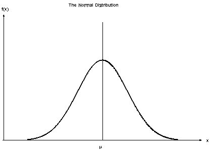
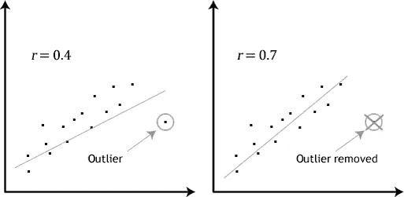
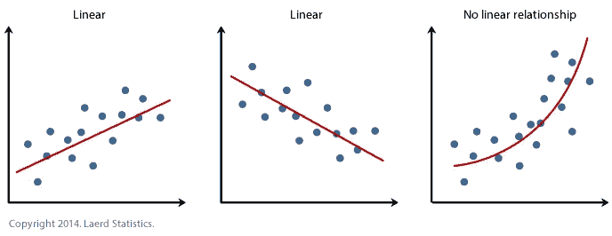
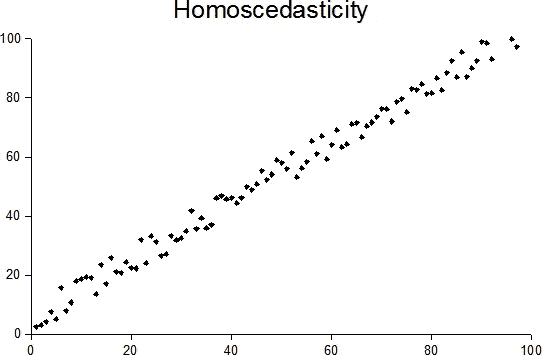

# 皮尔逊相关系数解释。

> 原文：<https://towardsdatascience.com/pearson-coefficient-of-correlation-explained-369991d93404?source=collection_archive---------1----------------------->

我开始意识到，对于可以在数据集上执行的不同类型的关联，存在许多困惑。让我先从皮尔逊相关系数开始，澄清一下这个问题。

## 什么是相关性？

相关性是一种双变量分析，衡量两个变量之间的关联强度和关系方向。就关系的强度而言，相关系数的值在+1 和-1 之间变化。值为 1 表示两个变量之间的完美关联程度。随着相关系数值趋向于 0，两个变量之间的关系将变弱。关系的方向由系数的符号表示；加号表示正相关，减号表示负相关。

通常，在统计学中，我们衡量四种类型的相关性:

*   皮尔逊相关
*   肯德尔等级相关
*   斯皮尔曼相关
*   点双列相关。

## **皮尔逊相关系数**

如题所示，我们将只讨论皮尔逊相关系数。我会尽量简短，但内容丰富，这样你就可以自己动手了。皮尔逊相关系数是对两个变量之间线性关联强度的度量，用 r 表示。您会遇到皮尔逊 r 相关

## 皮尔逊相关回答的问题

*   年龄和身高有统计学上的显著关系吗？
*   温度和冰淇淋销量有关系吗？
*   工作满意度、生产率和收入之间有关系吗？
*   哪两个变量在年龄、身高、体重、家庭规模和家庭收入之间有最强的相关性？

## 假设

1.对于皮尔逊 r 相关性，两个变量都应该是**正态分布**。即正态分布描述了变量的值是如何分布的。这有时被称为“钟形曲线”或“高斯曲线”。一个简单的方法是使用夏皮罗-维尔克检验分别确定每个变量的正态性。

Normal Distribution

2.应该有**没有明显的异常值**。我们都知道异常值是什么，但我们不知道异常值对皮尔逊相关系数 r 的影响。皮尔逊相关系数 r 对异常值非常敏感，这会对最佳拟合线和皮尔逊相关系数产生非常大的影响。这意味着-在分析中包含异常值会导致误导性结果。

Outliers

3.每个变量应该是**连续的**，即间隔或比率，例如体重、时间、身高、年龄等。如果一个或两个变量在测量中是有序的，那么可以进行 Spearman 相关。

4.这两个变量有一个线性关系。散点图将帮助您判断变量之间是否存在线性关系。如果数据点是直线(而不是曲线)，则数据满足线性假设。如果您拥有的数据不是线性相关的，您可能需要运行非参数。

Linear and non-Linear Relationships

5.这个观测值是**成对观测值。**也就是说，对于自变量的每一次观测，必然有因变量的相应观测。例如，如果你在计算年龄和体重之间的关系。如果有 12 个体重的观察值，你应该有 12 个年龄的观察值。**即没有空白。**

6.**同质性**。我把最好的留到了最后。hard 很难发音，但概念很简单。同方差描述了一种情况，其中误差项(即自变量和因变量之间关系中的“噪声”或随机扰动)在自变量的所有值上都是相同的。散点图使得检查这一点变得容易。如果这些点位于最佳拟合线的两侧，那么数据是同方差的。另外，同异方差的反义词是异方差(违反同异方差),当误差项的大小在自变量的值之间不同时，就会出现异方差。

Homoscedasticity

Heteroscedasticity

您还可以查看:

*   [皮尔逊相关系数- python](https://medium.com/@joseph.magiya/pearson-coefficient-of-correlation-using-pandas-ca68ce678c04)
*   [肯德尔等级相关性解释](https://medium.com/@joseph.magiya/kendall-rank-correlation-explained-dee01d99c535)
*   [肯德尔等级相关性— Python](https://medium.com/@joseph.magiya/kendall-rank-correlation-python-19524cb0e9a0)
*   [我的个人资料了解更多数据](https://medium.com/@joseph.magiya)