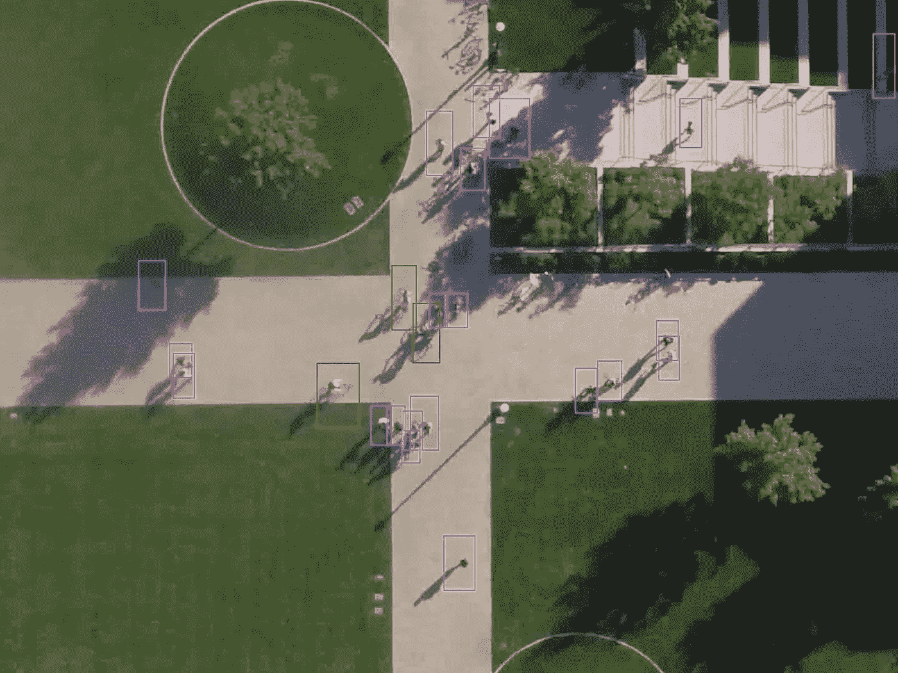
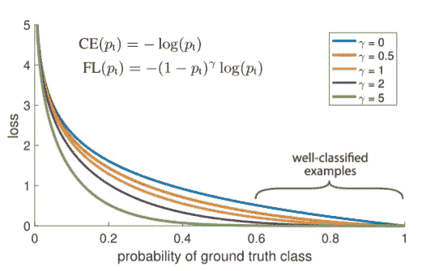
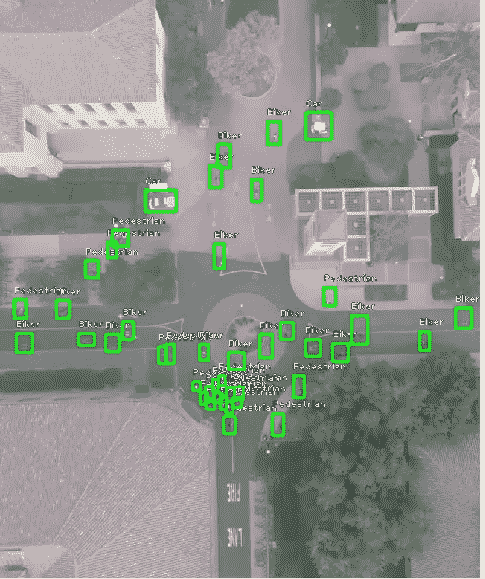

# 基于 RetinaNet 的航空图像行人检测

> 原文：<https://towardsdatascience.com/pedestrian-detection-in-aerial-images-using-retinanet-9053e8a72c6?source=collection_archive---------9----------------------->

## 用数据做很酷的事情！

# 介绍

航空图像中的目标检测是一个具有挑战性和有趣的问题。随着无人机成本的降低，产生的航空数据量激增。拥有能够从航空数据中提取有价值信息的模型将非常有用。 [Retina Net](https://arxiv.org/abs/1708.02002) 是最著名的单阶段探测器，在这篇博客中，我想在来自[斯坦福无人机数据集](http://cvgl.stanford.edu/projects/uav_data/)的行人和骑车人的航拍图像上测试它。请参见下面的示例图像。这是一个具有挑战性的问题，因为大多数物体只有几个像素宽，一些物体被遮挡，阴影中的物体更难检测。我读过几个关于空中图像或汽车/飞机上的物体检测的博客，但是只有几个关于空中行人检测的链接，这是特别具有挑战性的。



Aerial Images from Stanford drone dataset — Pedestrians in pink and Bikers in red

# 视网膜网

[RetinaNet](https://arxiv.org/abs/1708.02002) 是一款单级检测器，使用特征金字塔网络(FPN)和焦点损失进行训练。[特征金字塔网络](https://medium.com/@jonathan_hui/understanding-feature-pyramid-networks-for-object-detection-fpn-45b227b9106c)是这篇[论文](https://arxiv.org/abs/1612.03144)中介绍的一种多尺度物体检测结构。它通过自上而下的路径和横向连接将低分辨率、语义强的特征与高分辨率、语义弱的特征结合起来。最终结果是，它在网络的多个级别上产生不同比例的特征图，这有助于分类器和回归器网络。

焦点损失被设计成解决具有不平衡的单阶段对象检测问题，其中存在非常大量的可能背景类别，而只有少数前景类别。这导致训练效率低下，因为大多数位置是没有贡献有用信号的容易否定的，并且大量的这些否定例子淹没了训练并降低了模型性能。焦点损失基于交叉熵损失，如下所示，通过调整伽马参数，我们可以减少分类良好的示例的损失贡献。



Focal Loss Explanation

在这篇博客中，我想谈谈如何在 Keras 上训练一个 RetinaNet 模型。我没有对 RetinaNet 背后的理论做出足够的评价。我用这个[链接](https://medium.com/@14prakash/the-intuition-behind-retinanet-eb636755607d)来了解这个模型，并强烈推荐它。我的第一个训练模型在空中探测物体方面表现很好，如下图所示。我还在我的 [Github 链接](https://github.com/priya-dwivedi/keras_retinanet_cs230)上开源了代码。


Retina Net on Aerial Images of pedestrians and bikers

# 斯坦福无人机数据集

[斯坦福无人机数据](http://cvgl.stanford.edu/projects/uav_data/)是无人机在斯坦福校园上空收集的航拍图像的海量数据集。该数据集是理想的对象检测和跟踪问题。它包含大约 60 个空中视频。对于每个视频，我们有 6 个类的边界框坐标——“行人”、“骑车人”、“滑板者”、“手推车”、“汽车”和“公共汽车”。行人和骑车人的数据集非常丰富，这两个类别覆盖了大约 85%-95%的注释。

# 在斯坦福无人机数据集上训练 Keras 的 RetinaNet

为了训练视网膜网络，我在 Keras 中使用了[这个实现](https://github.com/fizyr/keras-retinanet)。它有很好的文档记录，并且工作时没有错误。非常感谢 Fizyr 开源他们的实现！

我遵循的主要步骤是:

*   从庞大的斯坦福无人机数据集中选择图像样本来构建模型。我拍摄了大约 2200 张训练图像和 30，000 多个公告，并保留了大约 1000 张图像进行验证。我已经把我的图像数据集放在 google drive [这里](https://drive.google.com/drive/u/0/folders/1QpE_iRDq1hUzYNBXSBSnmfe6SgTYE3J4)给任何有兴趣跳过这一步的人。
*   生成 Retina Net 所需格式的注释。Retina Net 要求所有注释都采用格式。

```
path/to/image.jpg,x1,y1,x2,y2,class_name
```

我将斯坦福注释转换成这种格式，我的训练和验证注释被上传到我的 [Github](https://github.com/priya-dwivedi/keras_retinanet_cs230) 。

*   调整锚点大小:Retina 网的默认锚点大小为 32、64、128、256、512。这些锚的大小对大多数物体来说都很好，但是因为我们是在航拍图像上工作，一些物体可能小于 32。这个回购协议提供了一个方便的工具来检查现有的锚是否足够。在下图中，绿色的注释被现有的锚点覆盖，红色的注释被忽略。可以看出，即使对于最小的锚尺寸，很大一部分注释也太小了。


Retina Net with default anchors

所以我调整了锚，去掉了最大的 512 号锚，代之以一个 16 号的小锚。这导致了显著的改进，如下所示:



After adding a small anchor

*   有了这些，我们准备开始训练。我保留了大多数其他默认参数，包括 Resnet50 主干，并通过以下方式开始训练:

```
keras_retinanet/bin/train.py --weights snapshots/resnet50_coco_best_v2.1.0.h5  --config config.ini csv train_annotations.csv labels.csv --val-annotations val_annotations.csv
```

这里的重量是可可重量，可用于跳跃开始训练。用于训练和验证的注释是输入数据，config.ini 具有更新的锚大小。所有文件也在我的 Github repo 上。

就是这样！模型训练起来很慢，我连夜训练。我通过在测试集上检查**平均精度(MAP)** 来测试训练模型的准确性。从下面可以看出，第一个经过训练的模型具有非常好的 0.63 的 MAP。在从空中容易看到的汽车和公共汽车类上，性能尤其好。骑自行车的人级别的地图很低，因为这经常被行人混淆。我目前正致力于进一步提高自行车手职业的准确性。

```
Biker: 0.4862
Car:0.9363
Bus: 0.7892
Pedestrian: 0.7059
Weighted: 0.6376
```

# 结论

Retina Net 是一个使用特征金字塔网络的强大模型。它能够在非常具有挑战性的数据集上检测空中的物体，其中物体尺寸非常小。我花了半天时间训练了一个视网膜网络。经过训练的模型的第一个版本具有相当好的性能。我仍然在探索如何进一步适应视网膜网络架构，以在空中检测中具有更高的准确性。这将在我的下一篇博客中讨论。

我希望你喜欢这个博客，并尝试自己训练模型。

我有自己的深度学习咨询公司，喜欢研究有趣的问题。我已经帮助许多初创公司部署了基于人工智能的创新解决方案。在 http://deeplearninganalytics.org/的[入住我们的酒店。](http://deeplearninganalytics.org/)

你也可以在[https://medium.com/@priya.dwivedi](https://medium.com/@priya.dwivedi)看到我的其他作品

如果你有一个我们可以合作的项目，请通过我的网站或 info@deeplearninganalytics.org 联系我

# 参考

*   [视网膜网](https://medium.com/@14prakash/the-intuition-behind-retinanet-eb636755607d)
*   [斯坦福无人机数据集](http://cvgl.stanford.edu/projects/uav_data/)
*   [视网膜网 Keras 实现](https://github.com/fizyr/keras-retinanet)