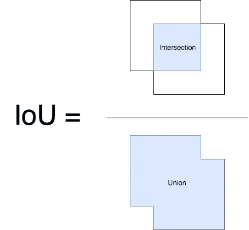

# 基于非最大抑制算法的行人检测

> 原文：<https://towardsdatascience.com/pedestrian-detection-using-non-maximum-suppression-b55b89cefc6?source=collection_archive---------11----------------------->

## 检测路上行人的完整管道

Photo by [David Marcu](https://unsplash.com/@davidmarcu?utm_source=unsplash&utm_medium=referral&utm_content=creditCopyText) on [Unsplash](https://unsplash.com/search/photos/pedestrians?utm_source=unsplash&utm_medium=referral&utm_content=creditCopyText)

被困在付费墙后面？点击[这里](https://medium.com/p/pedestrian-detection-using-non-maximum-suppression-b55b89cefc6?source=email-c3f5233f3441--writer.postDistributed&sk=996dc63e6fe2ca6cb15ad2934f527ecc)阅读完整故事与我的朋友链接！

行人检测仍然是计算机科学中尚未解决的问题。虽然已经研究了许多目标检测算法，如 YOLO、SSD、RCNN、快速 R-CNN 和更快 R-CNN，并取得了巨大的成功，但是拥挤场景中的行人检测仍然是一个公开的挑战。

近年来，在人的密度高的真实世界场景中，即机场、火车站、商场等，迫切需要行人检测。尽管已经取得了很大的进步，但是在这些场景中检测行人仍然是困难的，这由现有技术方法的显著性能下降所证明。在这篇文章中，我将介绍一种被称为**非最大抑制**的高效可扩展算法，用于解决拥挤场景中的行人/人物检测。

# 应用程序

1.  **自动驾驶汽车。**识别道路场景中的行人
2.  **安全。限制某些人进入某些地方**
3.  **零售。**分析超市内顾客的行为
4.  **时尚。**识别特定品牌和穿着它们的人

# 数据

我从 [**这里**](https://unsplash.com/search/photos/walking) 下载了测试用的图片。然后，我将图像压缩到 300*200 的大小，并使用这些图像作为这个项目的测试图像。

# 非最大抑制

**结合**支持向量机(SVM)** 的定向梯度历史(HOG)** 对于检测图像中的对象已经相当成功，但是这些算法的问题是它们检测图像中对象周围的多个边界框。因此，它们不适用于我们在拥挤的道路上检测行人的情况。这就是非最大抑制(NMS)来拯救更好地细化检测器给出的边界框的地方。在该算法中，我们提出了额外的惩罚来产生更紧凑的包围盒，从而变得对 NMS 阈值不太敏感。对于具有贪婪 NMS 的管道下的人群，理想的解决方案是设置高阈值以保留高度重叠的对象，并为所有实例预测非常紧凑的检测框以减少误报。

# 环境和工具

1.  sci kit-学习
2.  sci kit-图像
3.  numpy
4.  opencv

# 代码在哪里？

事不宜迟，让我们从代码开始吧。github 上的完整项目可以在这里找到[。](https://github.com/abhinavsagar/Pedestrian-detection)

我从计算我们的算法检测到的两个边界框之间的重叠区域开始。

然后我定义了一个函数，将包围盒矩形和阈值因子作为输入。我还按照右下角坐标值的降序排列了所有的边界框。之后，我将所有不在重叠区域 0.5 倍范围内的盒子附加到另一个盒子上。

加载所有需要的库的时间。

然后我创建了一个函数，将所有边界框的四个端点坐标添加到一个空列表中。

之后，我为图像定位创建了一些解析器参数，缩小它，可视化它，并对它应用阈值。

然后是算法的核心部分。我使用了一个 pickle 文件，它是在数千张有行人和没有行人的图像上训练后生成的。此外，我将图像转换为灰度，并在其上应用了步长。

之后，我创建了一个脚本来查找和定位所有在 nms 函数定义的阈值内的边界框，如上所示。请注意，下面的脚本乍一看可能有点吓人，但它只是简单的数学。

最后，我写了一些行来显示应用 NMS 前后的图像，并保存了我得到的输出图像。

# 评估行人检测模型

对象检测问题中的每个图像可能具有不同类别的不同对象。因此，在图像分类问题中使用的标准精度度量不能直接应用于此。这就是 mAP(平均精度)发挥作用的地方。

# 地面实况; 真值（机器学习）

对于任何算法，总是在与真实数据的比较中评估指标。我们只知道训练、验证和测试数据集的基本事实信息。

对于对象检测问题，基础事实包括图像、图像中对象的类别以及图像中每个对象的真实边界框。

Sample Example

# 计算地图

让我们说，原始图像和地面真相注释是我们在上面看到的。训练和验证数据以相同的方式对所有图像进行注释。该模型将返回大量预测，但其中大多数预测的相关置信度非常低，因此我们只考虑高于某个报告置信度的预测。我们通过我们的模型运行原始图像，这是在置信度阈值化之后对象检测算法返回的结果。

我们首先需要知道来判断这些检测中每一个的正确性。告诉我们给定边界框的正确性的度量是并集上的交集。

# 计算欠条

交集/并集是预测框和基础事实框的交集和并集之间的比率。

# 结果

Input Image

Output Image

# 结论

虽然像 **Mask R-CNN** 这样的算法已经突破了边界，并被认为是最先进的实例分割算法，但像行人检测这样的问题仍然提出了许多公开的挑战。如果图像包含聚集在一个位置的许多人，非最大抑制算法仍然失败。这个项目远未结束。事实上，它提出的问题比它回答的问题还多。无人驾驶汽车的未来在很大程度上取决于高效的行人检测算法。

# 参考资料/进一步阅读

 [## 使用 YOLOv3 实时跟踪行人

### 追踪行人的完整管道。

medium.com](https://medium.com/@abhinav.sagar/pedestrian-tracking-in-real-time-using-yolov3-33439125efdf)  [## 自适应 NMS:改进人群中的行人检测

### 人群中的行人检测是一个非常具有挑战性的问题。本文通过一种新颖的非最大值方法来解决这个问题

arxiv.org](http://arxiv.org/abs/1904.03629)  [## Python - PyImageSearch 中对象检测的非最大抑制

### 康涅狄格州很冷。非常冷。有时候早上起床都很难。老实说，如果没有…

www.pyimagesearch.com](https://www.pyimagesearch.com/2014/11/17/non-maximum-suppression-object-detection-python/) 

# 在你走之前

相应的源代码可以在这里找到。

 [## abhinavsagar/行人检测

### 使用非最大抑制的行人检测。行人检测仍然是计算机领域尚未解决的问题…

github.com](https://github.com/abhinavsagar/Pedestrian-detection) 

# 联系人

如果你想了解我最新的文章和项目[，请关注我的媒体](https://medium.com/@abhinav.sagar)。以下是我的一些联系人详细信息:

*   [个人网站](https://abhinavsagar.github.io)
*   [领英](https://in.linkedin.com/in/abhinavsagar4)
*   [中等轮廓](https://medium.com/@abhinav.sagar)
*   [GitHub](https://github.com/abhinavsagar)
*   [卡格尔](https://www.kaggle.com/abhinavsagar)

快乐阅读，快乐学习，快乐编码。