# 惩罚均值:调整异常值的新方法？

> 原文：<https://towardsdatascience.com/penalized-mean-a-new-way-to-regularize-outliers-ace66920b38f?source=collection_archive---------29----------------------->

在处理真实世界的数据时，知道如何处理异常值是一个标准，例如，[这篇](/5-ways-to-detect-outliers-that-every-data-scientist-should-know-python-code-70a54335a623)文章涵盖了检测异常值的统计和机器学习方法。一旦我们知道数据中有异常值，我们可以做以下两件事之一:

1.  扔掉它们。
2.  使他们正规化。

在接下来的部分中，我们将简要介绍两篇学术文章，介绍用于异常值正则化的离散函数，但是如果值为正，我们也定义一种正则化它们的新方法。我们所理解的离散函数是，给定一个变量 ***x*** ，它只能从给定的集合ω中取值，其中每个元素都是相互“分离”的。

# 1.L-1 范数误差函数稳健性和异常值正则化

这篇由丁宏强和蒋波撰写的文章的动机是使用线性函数来拟合数据。假设你在一个二维空间中有( ***x*** ， ***y*** )个真实数据，如图 1。其中拟合值(红线)由 ***f、*** 表示

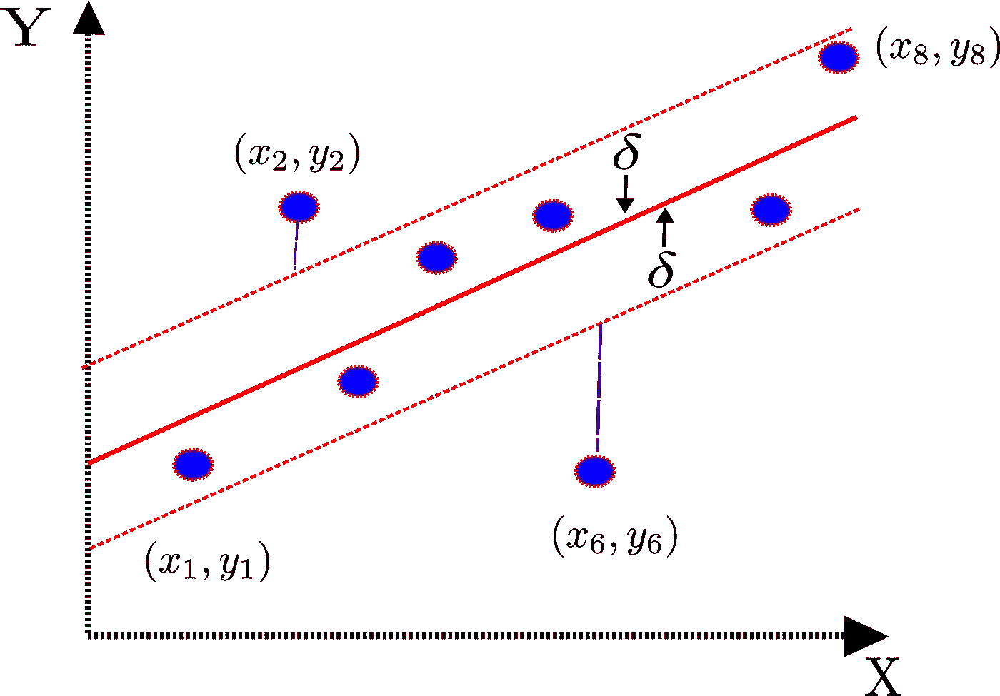

Figure 1\. The blue points represent observed data, the red line represents a linear fitted model and the dashed line a δ threshold.

那么我们说，如果理论预测值 ***f*** 与真实值 ***y*** 之差大于 ***δ，那么这个数据点就是异常值。*** 换言之，

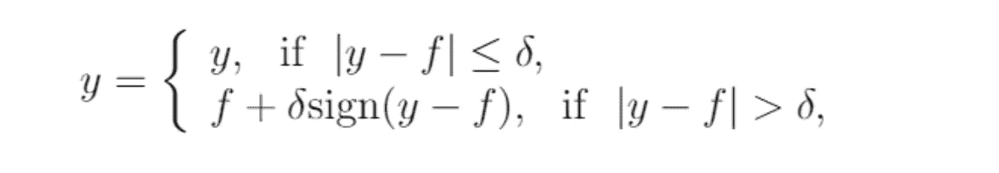

Figure 2

符号函数在哪里

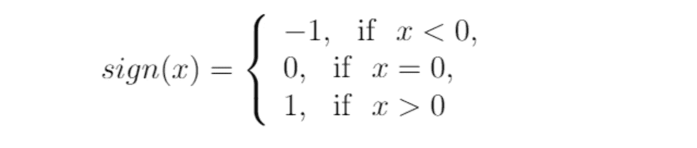

Figure 3\. The sign function

并且 ***δ*** 是具有将观察值 ***y*** 拉回红色虚线的效果的公差参数，而与距离平均值有多远无关。

# 2.矢量数据的异常正则化与 L21 范数稳健性

由同一作者在第一篇文章的一个月后写的这篇文章是上述技术的矢量化方法。在这种情况下，我们将真正的观察点**移动一些单位远离观察点***【f】，*** 如图 4 所示。**

**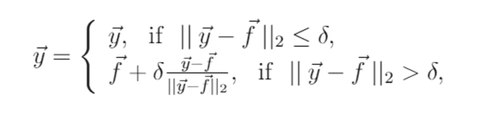**

**Figure 4**

**等同于之前，我们现在在边界处有 ***y*** (由图 1 中的虚线表示)。我们在图 4 中看到，通过归一化向量，拉回是有保证的。**

**总的来说，这些技术结合了期望极限值 ***、δ*** 、前沿的信息。现在我们将看到一种不同的方法来整合某个阈值之间的实值***【y】***，但是如果您想深入了解该函数的等效连续表示，请查阅[论文](https://arxiv.org/abs/1706.06409)。**

# **3.惩罚平均值**

**如果我们假设我们的数据是正态分布的(至少 30 个观察值)，传统的规则是丢弃一个观察值 ***x*** ，如果它离平均值有两个标准偏差。惩罚均值不仅调整上述数据，而且当 ***x*** 偏离均值一个标准偏差时也调整。正如我们在图 5 中看到的。**

**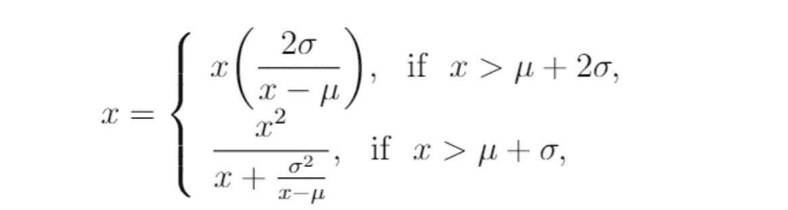**

**Figure 5**

**在第一种情况下，我们注意到 ***2σ/(x-μ)*** 小于 1，因此 ***x*** 被拉回一个标准差和两个标准差之间，稍后我们将看到理论上的证明。而在第二种情况下，将σ移到第二项的分母后，我们注意到**

****

**Figure 6**

**由于***1<(x-μ)/σ<2***的事实，这对于确保满足不等式***μ<x<μ+σ***具有巨大的效果。现在，让我们看看当观察值位于中值μ的左侧时会发生什么，正则化函数发生变化，因为现在我们正在搜索大于 1 的参数γ，使得 ***x*** 向右移动。**

**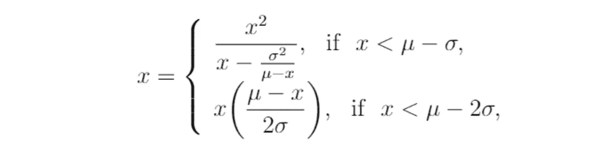**

**Figure 7**

**例如，当 ***x < μ - 2σ*** 时，我们有那个***(μ-x)/2σ>1***，因此新的值 ***x*** 将大于它本身。对于理论上的证明，我们将在下一节正式证明。**

# **4.区间对齐**

**现在我们要确定正则化后 ***x*** 的值。这一部分是技术性的，所以你可以跳过它，但它是有用的尝试肌肉大脑(只是代数！).**

## **案例一。x < μ-2σ**

**After some algebra, we arrive at**

**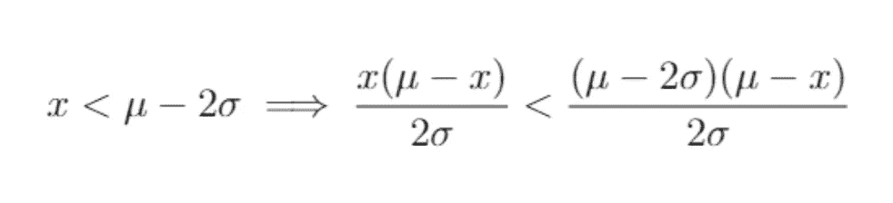**

**Figure 8**

**where, we notice that**

## *******案例二。μ-2σ<x<μ-σ*******

****基于这样一个事实****

****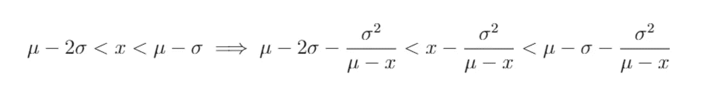****

****Figure 9****

****我们采用的方法是在最后一个不等式中限制横向极限。关于上限，我们执行以下操作。****

****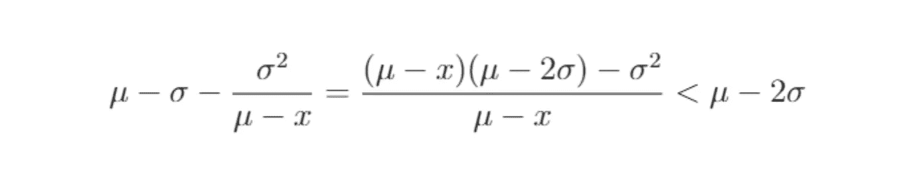****

****Figure 10****

****对于下限，我们再次注意到 ***1 > σ / (μ-x)*** ，有了这个我们就有了那个****

****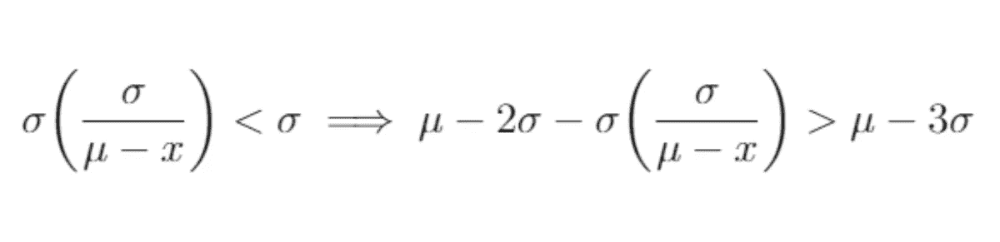****

****Figure 11****

****然后将所有术语组合在一起，间隔为****

****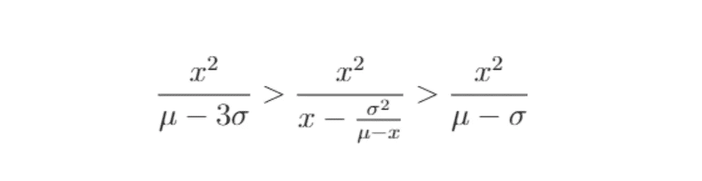****

****Figure 12****

## ****案例三。x+σ < x < x + 2σ****

****The initial inequality is****

****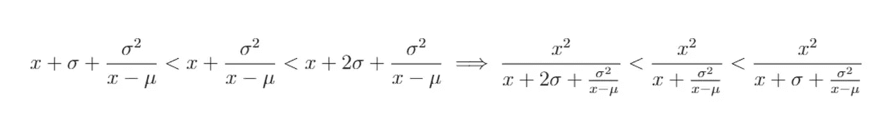****

****Figure 13****

****whereas before we’re trying to find upper and lower bounds. First, we notice that****

****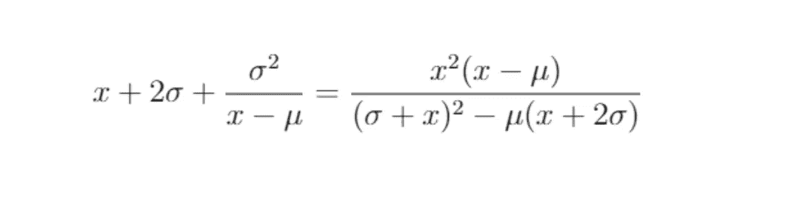****

****Figure 14****

****To find an upper bound for this value, we’re going to do some algebra with the denominator. We should arrive at****

****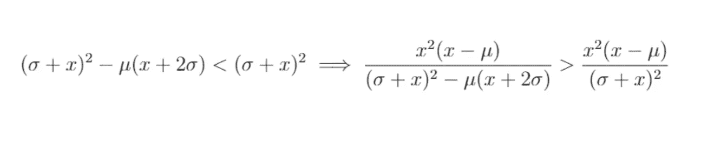****

****Figure 15****

****Concerning the other bound in Figure 13, the algebra is analogous, but we would use a different trick as follows (where we have factorized some terms in the denominator x + σ + σ²/(x-μ))****

****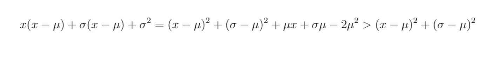****

****Figure 16****

****where the last inequality is satisfied only if ***x > σ((2σ/μ)-1)。*** 考虑到最后一个操作，我们得出的区间是****

********

****Figure 17****

## ****案例 4。x > x + 2σ****

****现在，我们将正式证明我们之前说过的，即 ***x*** 取比 ***x + 2σ*** 小的值。证据如下****

****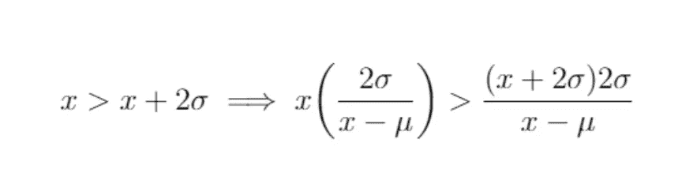****

****Figure 18.****

****注意到***(2σ)/(x-μ)<1***，我们得出结论x 满足这样一个事实，即将取值到 ***x + 2σ*** 的左边。****

# ****5.结论****

****我发现这两篇论文的一个不方便之处是阈值δ决定正则化值的位置。如果理论上找不到δ的最佳值，这可能会导致主观操纵数据。此外，如果假设数据中的噪声是高斯噪声，那么其中的 5%将采用固定值μ + δ或μ-δ。****

****在罚平均中，我们发现 x-(σ /(μ-x))并不总是正的，所以取绝对值来代替是方便的，但是预期的效果或使观察规律化并不令人满意。一般来说，这种方法对于位于μ右边的值更有效，因为对于 x < μ，如果值足够小，正则化根本无效，正如我们在第四节中所展示的。****

****最后，我们还没有涵盖可以应用这种正则化的实际案例，这可能是第二部分。****

# ****参考****

****【丁与江，2017】c .丁与 b .江。L-1 范数误差函数稳健性和异常值正则化。arXiv:1705.09954v1，2017。****

****【丁与江，2017】c .丁与 b .江。向量数据的异常正则化和 L21 范数稳健性。arXiv:1706.06409，2017。****