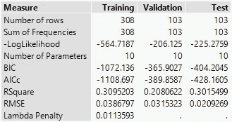
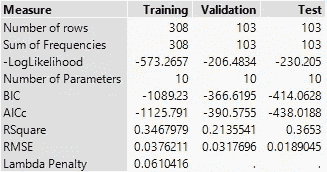
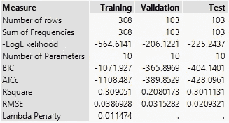
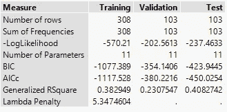
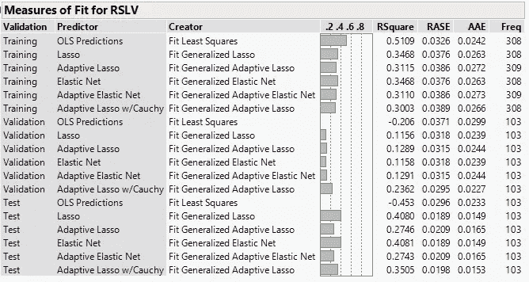
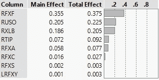

# JMP 的惩罚回归

> 原文：<https://towardsdatascience.com/penalized-regressions-with-jmp-e10628799aef?source=collection_archive---------33----------------------->

Image by [Kevin Schneider](https://pixabay.com/users/kschneider2991-4936815/?utm_source=link-attribution&amp;utm_medium=referral&amp;utm_campaign=image&amp;utm_content=2180330) from [Pixabay](https://pixabay.com/?utm_source=link-attribution&amp;utm_medium=referral&amp;utm_campaign=image&amp;utm_content=2180330)

这个简短的研究使用惩罚回归来预测银价，基于一些金融指标。惩罚逻辑回归或正则化是一种逻辑模型，它惩罚或减少某些变量的影响。当数据集有大量变量，但对哪些变量在回归模型中特别有用几乎没有指导时，使用正则化技术。为了避免模型过度拟合数据，正则化技术会施加一个惩罚来减少一些变量的影响，而不会直接将它们从方程中删除。这理想地给了我们一个模型，表明哪些变量对预测值的影响比其他变量更大。建立惩罚回归模型有许多方法，但这项研究将着眼于套索和弹性网方法。对于软件，我们将使用 JMP，它有一些有用的内置工具在需要时调整我们的模型。

该数据集包括描述汇率、利率和股票市场的 90 个不同变量的信息。我们只对描述基本变量的回报和滞后回报值的 60 个子集感兴趣。我们使用不同的方法建立了多个模型，以确定哪一个模型可以根据全球指标提供最准确的白银价格预测。套索和弹性网方法是我们的主要焦点，既是一种基本形式，也是一种适应性技术。我们还使用柯西分布建立了一个模型，以理想地忽略异常值的影响，并在标准化数据集上提供更准确的预测。

我们首先使用所有潜在变量建立一个标准的最小二乘模型。数据集被分割成 60/20/20 的部分，以创建训练、验证和测试数据集(这种分组也用于剩余的模型构建)。基本的标准最小二乘模型使用所有 60 个感兴趣的变量。这有助于在假设所有变量对银的预测值有显著影响的情况下提供基线。它还通过研究每个变量在这个天真模型中的影响，让我们预览了哪些变量更有可能出现在我们的最终模型中。

# “套索”技术

套索技术能够将变量的大小减少到绝对 0，有效地消除它们对预测模型的影响。在寻找最佳拟合模型的过程中，我们同时使用了基础和自适应套索方法。我们的第一个模型，使用基础套索方法，在测试集上产生了大约 0.365 的 R 平方值。虽然不是一个过高的值，36.5%是一个相对有用的模型。0.0189 的 RMSE 也表明这是一个好模型。我们还可以看到，该模型的 lambda 值为 0.06。当λ较小时，该模型类似于最小二乘估计。然而，随着它的增加，变量值接近或达到 0。在这个模型中，λ相对较小，表明变量不需要太多的正则化。

Basic Lasso Model Results

套索和弹性网的自适应版本试图在变量对响应变量有实际影响时减少对变量的惩罚。自适应模型应该提供类似于那些你在模型中发现的对响应变量有实际影响的变量的估计。不同之处在于，适应性模型仍然使用所有变量，只是惩罚无用的变量，使其影响可以忽略不计。

使用自适应套索方法构建一个新模型提供了一个稍微不同的结果。我们的 R 平方值下降到 0.302，而 RMSE 上升到 0.02。套索和弹性网的自适应版本试图在变量对响应有实际影响时减少对变量的惩罚。我们可以在仅为 0.011 的新λ值中看到这一点的证据。该模型在识别应该具有零系数的预测因子时变得更加可靠，同时减少了对某些变量施加的惩罚。

Adaptive Lasso Method Results

# 弹性网格法

弹性网格法的最大优点之一是它结合了套索法和岭法的技术，套索法基于系数值的总和进行惩罚，岭法基于系数值的平方和进行惩罚。简而言之，弹性网方法基于相关性形成变量组。然后，当它找到一个强预测值时，它会将整个相关组包含在模型中。这在理想情况下避免了仅仅因为变量相关就忽略变量而丢失信息，但是仍然会施加惩罚以减少某些变量可能产生的影响。我们创建了两个模型，一个使用基本方法，另一个使用自适应方法，来研究与套索方法的区别。

Standard Elastic Net Method

标准弹性网模型在测试集上给出了 0.365 的 R 平方值，这非常接近套索模型。RMSE 几乎是相同的，以及我们的 lambda 惩罚这个模型。这表明，当使用弹性网格方法时，由套索模型选择和惩罚的变量被给予相同的处理。使用这种技术的自适应方法给出了与自适应套索模型相似的结果。我们在测试集上收到了一个 R 平方为 0.301、RMSE 为 0.021 的模型，它模拟了自适应套索模型的结果。λ值再次变小，仅为 0.011，表明在某些变量上更加宽松。

Adaptive Elastic Net

# 使用柯西分布

Adaptive Lasso Method Using Cauchy Distribution

我们还想尝试使用柯西分布建立一个模型。简而言之，柯西分布有助于消除主要异常值的偏差。理论上，这有助于创建更可靠的模型，因为极值对总体分布的影响较小。我们使用自适应套索技术和柯西分布建立了一个模型。这计算出 0.408 的广义 R 平方值和 5.347 的显著λ损失。这表明使用柯西的模型对不太重要的变量有更多的限制。

# 模型比较

建立了 6 个模型后，我们最终可以比较结果，以确定最适合我们的数据。将预测值放入一个比较模型中会稍微改变值，但是我们仍然能够从发现中做出一些决定。我们可以看到，基本的套索和弹性网方法似乎对测试数据具有最高的准确性，R 平方值约为 0.408。最差的模型是我们的标准最小二乘模型，它在测试数据集上几乎没有可靠性。我们的套索和弹性网模型的 RASE 约为 0.0189，AAE 是另一个理想的低值，仅为 0.0149。因此，我们可以假设弹性网或套索方法将给出我们的最佳拟合模型。因为弹性网稍微好一点，我们将使用这种方法进行最终分析。

Comparison of Models

# 调查的结果

回到我们的基本弹性网络模型，我们可以看到 7 个变量对 RSLV 的预测值有可测量的影响。一些变量涉及国际汇率；RFXF、RFXA、RFXC、RFXS 和 LRFXY 都表明相关国家的货币价值对白银价格有影响。虽然不是特定于一个国家，RTIP 是计算通货膨胀的措施。作为双金属标准之一，难怪如此多的货币因素对预测白银的价值有影响。

Variable Selection via Elastic Net Method

在下图中，我们可以看到按对模型的重要性列出的变量。RFXF，瑞士法郎的价值，解释了超过 35%的预测模型。指示石油价格的 RUSO 通常不会与白银的价值联系在一起。然而，令人惊讶的是，它在这个模型中占了 20.5%。材料行业指数 RXLB 仅排在第三位，约为 18.6%。由于白银在电子产品和其他制成品中的重要性，有理由预计材料指数将是这种金属价值的高度预测指标。

Variable Importance in Elastic Net Model

这项研究中使用的数据集可以在[GitHub](https://github.com/drayroberts/Data-Resources/blob/master/SilverWeeklyStudy.jmp)(silverweekly study . jmp)上找到。