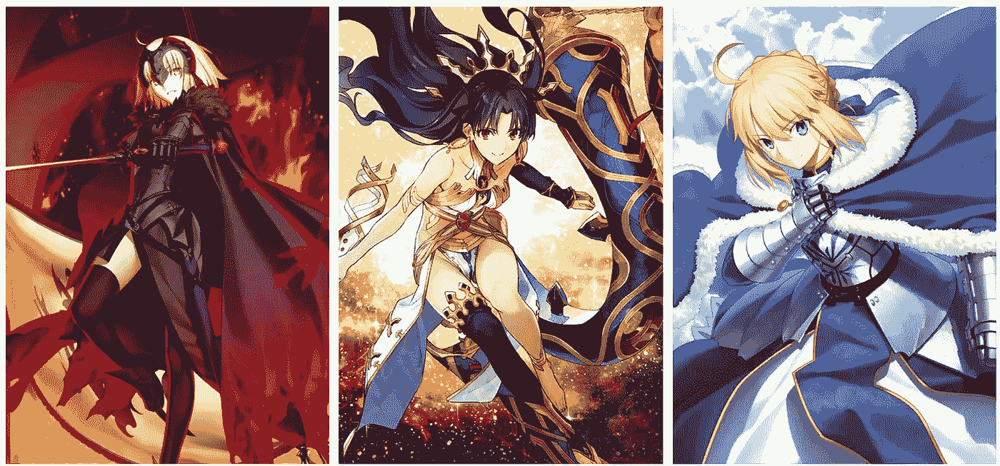
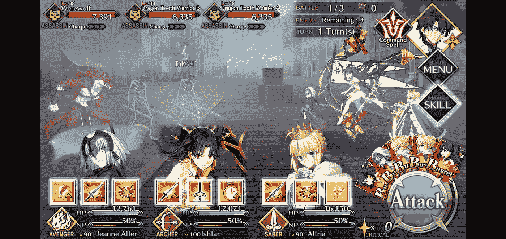
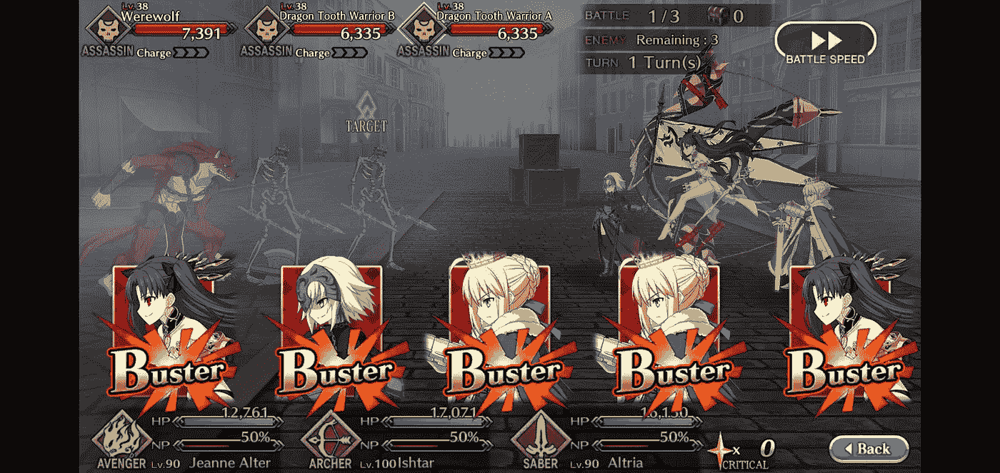
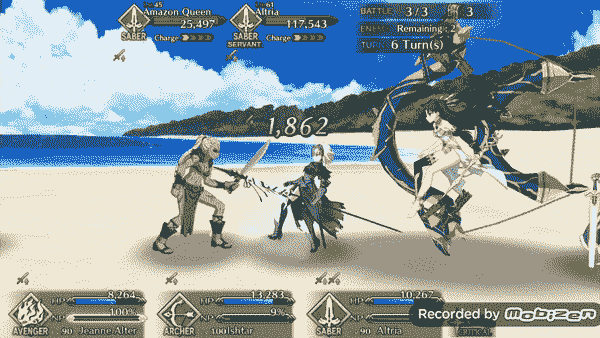
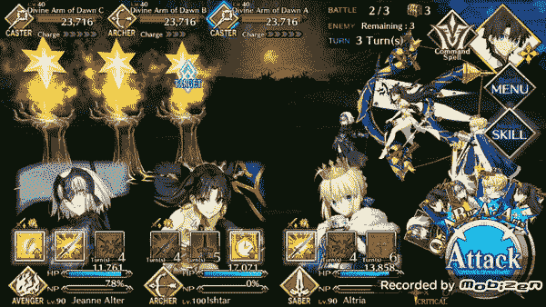
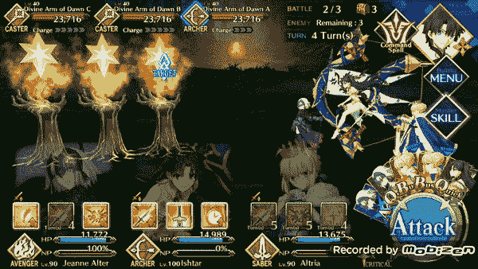
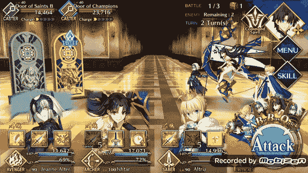
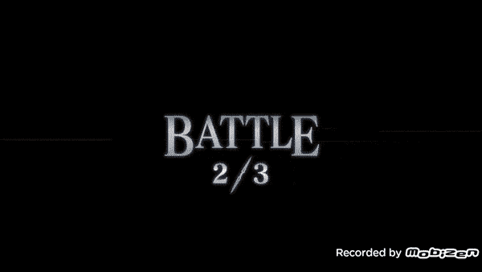
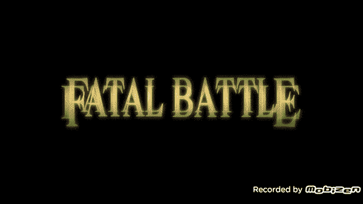

# 潘德雷肯四:多智能体强化学习与命运大秩序

> 原文：<https://towardsdatascience.com/pendragon-four-multi-agent-reinforcement-learning-with-fate-grand-order-80f6254754dd?source=collection_archive---------39----------------------->



Three initial characters left to right Jeanne d’arc alter (Jalter), Ishtar, Artoria Pendragon

## 多代理强化学习在一个定制的游戏环境中训练 4 个代理，并让他们玩手机游戏命运大令


> Github 回购[此处](https://github.com/sugi-chan/multiagent_pendragon)

一年多前，我在《走向数据科学》上发表了我的第一个系列博客帖子，我亲切地称之为[项目潘德雷肯](/project-pendragon-an-ai-bot-for-fate-grand-order-23f51b6e3268)，讲述了我如何建立一个强化学习(RL)环境，成功培训 [RL 代理](/project-pendragon-part-2-a-reinforcement-learning-bot-for-fate-grand-order-7bc75c87c4f3)，并为制作了一个 API，允许他们提取信息并向手机游戏《命运大令》(FGO)发送命令。这篇文章将讲述我是如何重新选择这个项目并训练 4 个 RL 代理一起玩这个游戏的。

我为 FGO 建造机器人的一个主要动机是，游戏要求玩家多次通关，以便为事件、关卡角色、技能等收集所需的材料。我说的多次是指 5 分钟 40-50 次，这种情况并不少见。所以能够让一个机器人为我执行这些重复的任务是非常好的。

# 命运大订单快速汇总

FGO 是一个游戏，你选择 1 到 6 个角色，并使用该团队通过各级战斗，直到所有的敌人或团队被击败。在任何给定的时间点，你可以有 3 个角色在场上，他们每个人都有 3 种能力。这些能力可以是攻击增益，治疗法术等。



Initial combat screen showing three characters with their 3 abilities below their portraits

在 FGO 战斗的主要机制是，战斗是通过从你的牌组中抽取 5 张牌中的 3 张牌来完成的。我之前的 FGO 机器人 pendragon alter 专注于以有效的方式挑选这些卡片。



example of 5 cards being dealt for a round of combat

每种类型的卡都有自己的属性，以不同的组合使用它们有不同的好处。例如，玩三张相同颜色的牌会在基础牌的基础上增加额外的奖励。奖金的性质取决于卡的类型。艺术卡(蓝色)充能强大的终极能力，巴斯特卡(红色)造成额外伤害，快速卡(绿色)创造致命一击的可能性，双倍伤害。我试着解释对这篇文章很重要的游戏机制，但是你也可以看看上一篇文章，更详细地了解组成 FGO 的其他卡片机制。

自从训练了那些最初的捡卡 RL 代理，我没有做太多的工作来增加额外的功能来改善我的机器人或提高他们的游戏水平。然而最近我很受鼓舞去改进它们，因为在过去的一年里 RL 发生了很多有趣的事情。



example round of combat from Pendragon Four where bot 2 plays a skill while bots 1 and 3 choose to pass. The card bot picks cards from the dealt hand. All actions are sent through a custom API to do the combat actions.

# 启发训练另一轮命运大令机器人

对我来说，看到 OpenAI 和 Deepmind 等研究小组的进展以及他们在将强化学习应用于游戏方面的成功真的很令人兴奋，这些游戏包括 [Dota 2](https://openai.com/projects/five/) (OpenAI Five)和 [Starcraft 2](https://deepmind.com/blog/article/alphastar-mastering-real-time-strategy-game-starcraft-ii) (Alphastar)，它们都达到了极高的游戏水平。虽然他们确实有缺点，但我仍然觉得令人印象深刻。最初，我发现最令人兴奋的是 Alphastar，因为我是星际争霸 2 的长期玩家。然而，通读 OpenAI Five 文献激励我致力于更多的强化学习，目标是对我的 FGO 机器人采取额外的步骤。

当我为 FGO 制作我最初的 RL 代理时，我专注于有效地挑选卡片。这使得我的机器人可以清除大量的游戏内容，但这意味着我没有使用我上面提到的个人角色能力。这些能力非常强大，可以帮助人类玩家更快地成功通关，并清除更难的内容。所以我的想法是，如果我能把能力的使用结合到我的机器人中，这将是有益的。我不确定最好的方法是什么…我陷入了困境，直到我通读了 OpenAI 发布的帖子，这些帖子说明了他们如何训练 5 个独立的机器人，并让它们一起工作来玩。

# 进入正题

试图让一个代理人处理所有三个角色会造成混乱的行动空间，所以为每个角色训练一个代理人的想法帮助我在心理上简化了它，至少让我考虑开始解决这个问题。虽然我说这帮助我澄清了我头脑中的问题，但它也让我非常认真地考虑在一个我从未做过的环境中同时训练 3 个或者 4 个 RL 代理。

我的想法是有 3 个代理人(三个角色各一个)，他们的行动空间是他们可以使用的法术加上一个允许他们通过的节点(行动空间大小为 4)。然后增加一名代理人来挑选卡片。如果我能训练这 4 个代理人合作，那么我很可能能够制造一个 FGO 机器人，它可以清除更难的内容，或者至少比我以前版本的机器人更快地清除内容。

考虑到这个最终目标……完成这个目标需要什么？对我以前的游戏环境做了很多升级，以前的游戏环境只是为了选卡而设计的。

1.  初始约束
2.  代表字符:
3.  环境升级
4.  建筑代理



All three bots opt to pass on round 2 turn 3\. One of the main things the bots had to learn was when to pass vs when to play skills since they are only allowed to use a skill once per game.

# 初始约束

虽然我希望能够训练我的机器人在一个完美的 FGO 再造中，拥有所有的角色，技能，敌人等等，但对我来说，建造所有这些是不可行的。即使对于 OpenAI 和 Deepmind 这样的团队来说，看到他们限制游戏的哪些方面以及随着他们构建更复杂的代理，这一列表如何随着时间的推移而变化也总是很有趣。

对于这个版本的多代理 FGO 机器人，我有一些值得注意的限制。

1.  我目前只有 3 个角色可用，我用它来进行初始训练和测试。
2.  技能可以用，但是每局只能用一次。我没有增加冷却机制来允许机器人多次使用它们。
3.  机器人被训练成按照一定的顺序战斗。在培训中，我将代理放在位置 1、2 或 3(视觉上是从左到右)，这构成了团队组成的顺序。在未来，我的想法是在地点 1 和 2 放置支援型角色，地点 3 保留给伤害处理角色，这样地点 1 和 2 可以学习支援角色 3。我将在团队合作部分详细讨论这一点。
4.  崇高幻象(NPs):是 FGO 中人物拥有的强大终极能力，通常会造成大量伤害。NP 在使用前必须充电到 100%,这在“NP 量表”中进行跟踪。我没有选择何时使用它的机器人。相反，在训练中，我让他们一充电就使用他们的 NPs。
5.  机器人必须前后作战:它们不能选择目标，所以它们按照从前到后的顺序与敌人作战。这将使机器人玩某些关卡更加困难，因为更强的敌人通常被放在后面，人类玩家会选择他们并首先集中火力打倒他们，而不是首先杀死他们前面的敌人。

*好了，现在让我们开始吧！*



Sample turn where 2 bots (Jalter and Ishtar) decide to play skills, one (Artoria) passes and and card bot selects combat cards

# 代表字符

因为这个项目的主要目标之一是为每个角色添加单独的代理人，让他们作为一个团队一起通关…我首先需要解决的事情之一是如何表现每个角色。这是我去年制作最初的机器人时想做的事情，但当时我是一名非常弱的软件工程师，所以我把它推迟到了以后的日期，我想现在是时候了。

我所做的是设置了一个名为`[HeroicSpirit](https://github.com/sugi-chan/multiagent_pendragon/blob/hal_way_to_policy_gradient/fgo_environment/heroic_spirt.py#L72)`的通用类，它包含了代理的神经网络以及获取动作、训练/更新网络、跟踪技能和三个角色技能本身的方法。这个通用类为管理和维护我在游戏中的角色设置了框架，然后我为我想要训练的每个特定角色创建了`HeroicSpirit`子类。

在大多数情况下，每个子类只需要调整新角色的特性。这将是像角色特定的技能和能力，而簿记功能在主`HeroicSpirit`类中保持。如果我只是添加通用特性，这有助于最小化我需要更改/更新的代码量。

例如，当我开始编写原型代码时，我没有意识到要跟踪主动能力、每个角色当前的伤害调整值，并将这些能力的效果映射到他们应该针对的角色上需要付出多少努力，所以我不得不在`HeroicSpirit`上添加许多功能，这在三个地方进行更新会很烦人。

目前我有三个`HeroicSpirit`的子类，分别代表三个角色，他们的能力我已经编程出来了`JAlter`、`Ishtar`、`ArtoriaSaber`。对于我之前提到的每个角色来说，他们的技能在游戏效果中的表现是不同的，这是我必须要考虑的。目前，我用一个字典来表示技能，这个字典跟踪各种各样的值，这些值依赖于技能。例如`Ishtar`的第一个技能是战斗导向的全队伤害提升，用下面的字典来表示:

```
{‘name’: ‘sk1_’+self.spot+’_’+self.name+’_manifestation_of_beauty’, ‘target’: [‘hero1’,’hero2',’hero3'], 
‘hp_boost’: 0,
‘np_boost’: .00, 
‘critical_boost’: .00, 
‘critical_star_boost’: .0,
‘dmg_boost’: (‘all’, .2), 
‘duration’: 3}
```

所以对于每一个技能，我都会追踪它的名字，目标，以及各种效果，比如生命值提升，终极充能(np_boost)，暴伤提升，暴星提升，伤害提升，持续时间。大多数技能只会对其中的几个领域产生影响，因此对于这个技能来说`'dmg_boost': ('all', .2)`意味着 20%的伤害提升会应用到团队中由`target`领域`['hero1','hero2','hero3']`上的点所代表的每个人身上。`'duration': 3`表示技能持续 3 回合。

另一方面，`Ishtar`的第二个技能侧重于充能她的终极能力，而不是直接战斗。

```
{'name': 'sk2_'+self.spot+'_'+self.name+'_gleaming_brilliant_crown',                       'target': [self.spot],
'hp_boost': 0,
'np_boost': 50,
'critical_boost': .00,
'critical_star_boost': .0,
'dmg_boost': ('all', .0),
'duration': 1}
```

因此，虽然所有相同的类别都在技能词典中被追踪，但这个法术只针对`Ishtar`她自己，所以目标指向团队中 Ishtar 所在的任何位置，并且没有伤害提升。相反，伊师塔获得她终极能力的 50%充电。这个能力也只能持续一个回合。

我以三个字符开始，因为这是我想尝试并立即开始的最低限度。我之所以从这些角色开始，是因为他们都是以伤害为导向的角色，他们的能力是以战斗为导向的。在这个初始阶段，这有助于我简化我必须建立的东西的数量。未来的工作将是添加支持角色，这些角色的能力通常针对其他团队成员，对于清除游戏中较难的内容至关重要。

这些角色类建立了角色能做什么的框架，一般来说，我们将如何跟踪他们在做什么，所以现在我们必须为他们建立一个游戏环境。

# 环境升级

为了升级游戏环境，我不得不做很多事情来处理额外的复杂性，比如让每个角色同时激活，追踪 buff 和他们的效果，应用 buff 来修改他们的伤害输出。[旧环境](https://github.com/sugi-chan/Pendragon_Alter/blob/master/colosseum.py)大约 400 行代码，[新环境](https://github.com/sugi-chan/multiagent_pendragon/blob/hal_way_to_policy_gradient/fgo_environment/colosseum.py)大约 1200 行代码。很多只是增加了新的功能来跟踪游戏的各个方面。

这种环境的基本结构是每场游戏由 3 轮战斗组成(反映 FGO 游戏水平),每一轮都变得更加困难，因此第三轮比第一轮要困难得多。在这种环境下，我通过增加机器人必须面对的对手的生命值和伤害来做到这一点。目前我还没有花时间去打造复杂的对手，但这是我将来可能会做的事情。

在我的`HeroicSpirit`类中，我有根据环境计算的奖励来采取行动和训练代理的功能。因此，在这个环境中，我需要能够处理这些输出，并将它们应用到游戏本身，并准备好将累积的奖励反馈给机器人。这归结为每个角色的几个步骤。

对于三个字符中的每一个:

1.  生成他们的游戏状态和动作。我现在使用的游戏状态是回合数，回合数，一个活跃 buffs 的二进制列表(长度 9)和一个已经使用技能的二进制列表(长度 9)
2.  如果他们在那回合没有选择`pass`,那么我就获取那个技能，解析它，将那个技能的效果添加到角色的活动效果列表中。我通过将每个角色拥有的技能存储在一个“爱好者字典”中来追踪它们。因此，如果一个角色施放了一个影响团队中每个人的技能，那么每个角色都会将该技能添加到他们的“buff dictionary”中，以便在计算伤害时可以应用这些修正值。
3.  做簿记来记录技能已经被使用，这样机器人就不会试图在冷却时间重复使用技能。

一旦所有的角色都走了，我会检查每个“buff 字典”中的所有 buff，并将每个角色 buff 中的相关修改应用到他们的伤害或其他战斗统计中。一旦这样做了，我就移除不再激活的 buffs，即`duration = 0`。在该回合的 buffs 被应用后，我会在游戏中选择战斗部分，如果相关的话，会应用机器人的效果。例如，如果一个角色有一个 20%的伤害缓冲，并且他的卡被选中，那么该卡的伤害将会增加 20%，以此类推。


Bot 1 and bot 3 (Jalter and Artoria) cast skills while bot 2 (Ishtar) passes

# 构建代理:奖励和无效移动

在我以前做过的 RL 项目中，我使用了深度 Q 学习器，并试图让它在任何给定的游戏状态下所有的动作都有效。然而，在这个项目中，我改用了策略梯度法，并允许无效的移动。这两件事都增加了我代码的复杂性，因为我以前从未实现过这些东西，但我认为它们值得升级。

## 政策梯度

深度 Q 学习者是代理人，他们的行为每一轮都会得到奖励，他们在任何给定的状态下都在有效地寻找最高的奖励。这是一个很好的方法，但对我来说，它经常需要游戏不同部分的工程奖励，我觉得我必须把我的意志/游戏风格强加给机器人。我仍然用我的拣卡机器人做这件事，它是我和三个角色代理一起训练的。解决这个问题的另一种方法是收集代理的所有动作和游戏状态，一旦游戏结束，就根据输赢之类的东西给小组分配奖励。这就是政策梯度方法的本质(正如我现在所理解的，我可能很容易就错了)。

起初，这似乎是一个有趣的想法，因为即使在亏损的情况下，也可能有好的和合理的举动，但它们将受到负面的惩罚。这是真的！但希望是，如果这确实是一个好的举措，那么随着时间的推移，它将有一个净积极的回报，代理人将学会在某些情况下做得更多。安德烈·卡帕西的 [Pong to Pixel 博客](http://karpathy.github.io/2016/05/31/rl/)在这个话题上非常出色！

目前，我没有对政策梯度使用纯+1 或-1 风格的奖励。如果他们使用了技能，我会在某些回合中使用修正值来尝试和激励技能的使用。对于游戏的大部分来说，机器人只是`pass`，这是有道理的，因为它们只有 3 个技能，我只允许使用一次，但游戏可能会持续 10-15 轮。所以他们倾向于习惯于在没有区别奖励的情况下度过大部分时间。

## 无效移动

接下来要考虑的重要事情是如何处理无效的移动。在这个游戏例子中，无效的移动是已经使用过的技能，现在处于冷却期，如果机器人试图在游戏中选择它，它实际上不会做任何事情。在过去，我通过设定游戏状态来避免这个问题，在游戏状态中，所有的移动在任何给定的时间都是有效的。这里的权衡是行动空间变得比考虑有效移动时要大得多。

例如，在我的拣卡机器人中，动作空间是 60，这代表了你可以从 5 张卡片中挑出 3 张卡片的每一种方式，其中顺序很重要。我这样做是因为虽然 60 的动作空间很大，但所有 60 个动作都是有效的。另一方面，如果我考虑到无效的选择，那么我可以有少至 3 个动作(每种牌类型一个)，并让它通过查看它尚未挑选的牌来选择玩哪手牌。

我之所以一直避免这样做，是因为我真的不确定最好的方法是什么/怎么做。当深入研究如何解释无效移动时，我遇到了一个非常有用的[堆栈溢出帖子](https://ai.stackexchange.com/questions/2980/how-to-handle-invalid-moves-in-reinforcement-learning)。

> “忽略无效动作就好了。”-堆栈溢出

好酷！听起来很简单…

我最后做的是，在训练期间，一旦技能冷却，我会将技能节点的输出抑制到一个较低的数值(数组-1 中最低的数值)。该输出阵列的抑制版本被反馈到网络中作为网络的目标。机器人的游戏状态中也会跟踪哪些技能已经被使用。这里的希望是，机器人将了解它不能选择一个以前使用过的技能。

我认为奖励和无效移动是建造这些机器人的机械部分，所以现在我只需要弄清楚一些更哲学的东西。我要怎么做才能让机器人作为一个团队一起玩？团队合作对一堆神经网络来说意味着什么？

# 如何教会一个机器人团队合作？

我之前提到过，在阅读了 OpenAI 在过去一年左右的时间里所做的工作后，我受到了启发，试图制作我的下一个 FGO 机器人系列。对我来说，最有趣的部分之一是这个想法，他们可以训练单个的机器人，并让它们作为合作团队一起玩。OpenAI 有一个团队合作参数，可以在 0 到 1 之间调整，较高的值表明机器人应该重视团队奖励而不是最大化自己的奖励。

这让我开始思考如何融入团队合作，或者至少是某种形式的沟通。虽然我考虑过使用另一个总体网络来管理团队合作，但我实际上最终采用了一个非常简单的想法，即让机器人在每个回合都按设定的顺序运行，并且在每个机器人运行后，我修改游戏状态以显示它们采取了什么行动。这里的希望是，机器人将能够根据早期机器人的行动做出更明智的决定。

对于我当前的机器人/环境，游戏状态由两个长度为 9 的数组(每个角色 3 个点)以及回合数和回合数表示。两个长度为 9 的数组是跟踪 3 个机器人动作的数组。第一个数组表示该回合中哪些技能有效，第二个数组表示哪些技能已经施放。在新游戏第一轮的第一回合，这两个数字都是 0。下面是游戏第 1 轮第 1 回合的游戏状态示例。

```
game_state_og = [Round 1] + [Turn 1] + [0,0,0,0,0,0,0,0,0] + [0,0,0,0,0,0,0,0,0] 
```

这个原始的游戏状态是第一个角色在游戏的第一回合看到的。看到这个阵法后，他们选择使用他们的第一个技能。游戏状态被修改，使得每个数组的第一个元素被设置为 1，因为角色 1 使用了他们的第一个技能，并且该第一个技能当前是活动的。

```
Character_1_action = skill_1
game_state_1 = [Round 1] + [Turn 1] + [1,0,0,0,0,0,0,0,0] + [1,0,0,0,0,0,0,0,0]
```

然后我们将这个`new_gamestate1`作为输入提供给第二个字符。所以第二个角色可以看到角色 1 使用了一个技能，而且是主动的。基于这些知识，它可以决定是否也要使用一个技能。假设角色 1 使用了技能，角色 2 也跟着使用了技能 3。新的游戏状态如下。

```
Character_2_action = skill_3
game_state_2 = [Round 1] + [Turn 1] +[1,0,0,0,0,1,0,0,0] + [1,0,0,0,0,1,0,0,0]
```

角色 1 状态的游戏状态被修改，然后传递给角色 3。

```
Character_3_action = skill_2
gamestate_3 = [Round 1] + [Turn 1] +[1,0,0,0,0,1,0,1,0] + [1,0,0,0,0,1,0,1,0]
```

所以角色 3 处于做决定的最佳位置，因为它可以在花费任何技能之前看到角色 1 和 2 做什么，并且它可以与其他两个机器人一起行动。

我希望这种团队合作的框架将允许机器人一起工作，这将出现在游戏中的一种方式是机器人联合使用多种技能。现在我打算把这个特性叫做“ ***技能弹幕*** ”。

## “技能屏障”

在 FGO，很多技能的强大之处在于你可以将它们与其他角色的技能结合使用。将不同的效果叠加在一起，玩家可以放大不同角色的效果，从而大幅增加团队的伤害输出。

目前，我已经训练了代理人来处理这些角色，这意味着他们在放大伤害，但是游戏中最强的伤害增益通常来自于“支持”角色。辅助角色造成的伤害更少，所以他们带来的直接火力比伤害交易者类型的角色要少。他们通过带来强大的技能来弥补这一点，这些技能可以决定一场艰难比赛的成败。

我的想法是在地点 1 和地点 2 放置辅助角色，在地点 3 放置主要伤害处理者。所以当伤害处理者看到两个支持角色已经施放了他们的 buffs，那么角色 3 也会使用一个技能来进一步增加他们的伤害。

> 下面是三个代理技能弹幕的例子。



skill *barrage* example. Round 1 Turn 2, all three bots use skills one after another.

# 培养

我将在这里写一些关于训练模型的一般笔记，但很快会添加一个关于这个主题的更详细的帖子(这篇文章太长了，大多数人都不想看)。

我用 Tensorflow 后端在 Keras 中构建了所有 4 个代理，并在单个 2080 TI GPU 上训练它们。对于那些在 GPU 上使用 Tensorflow 的人来说，Tensorflow 会将所有可用的 GPU 内存分配给任何加载用于训练的模型。在这个管道的以前版本中，我不能同时运行多个 Tensorflow 机器人，这使得内存分配很困难。

最后，我用在网上找到的一段代码绕过了这个管道。基本上，它的作用是将模型可以分配给自己的 GPU 空间限制在某个百分比。我在这里训练的模型实际上非常小，所以我将其限制在我的 GPU 内存的 20%。

```
# extra imports to set GPU options
import tensorflow as tf
from keras import backend as k

###################################
# TensorFlow wizardry
config = tf.ConfigProto()

# Don't pre-allocate memory; allocate as-needed
config.gpu_options.allow_growth = True

# Only allow a total of 20% the GPU memory to be allocated
config.gpu_options.per_process_gpu_memory_fraction = 0.2

# Create a session with the above options specified.
k.tensorflow_backend.set_session(tf.Session(config=config))
```

因为我在训练的 4 款车型中的每一款，实际上在我的 2080 TI 上我都进行了多次训练。

经过一些修补，我制作了一个足够硬的游戏环境，可以进行像样的训练，我的第一个版本太硬了，机器人总是输，没有得到多少积极的回报。一旦我把它调到一个合适的水平，我看到 4 个机器人的随机猜测胜率约为 38%，在大约 20-30K 的游戏后会达到 72%左右的峰值。在做了一些额外的工作和大量的实验后，我的成功率达到了 84%左右。

我将在另一篇文章中介绍有趣的细节，因为我已经在这篇文章中写了很长时间了。



Two turns of bots passing while skills are available to play. As I mentioned before, one of the things the bots had to learn to do is pass rather than just use all their skills immediately

# 结果

一旦完成，我必须更新我以前构建的 API，以允许新的 4 bot 版本点击能力，并从游戏中获得所需的信息。我在我的第一篇 [pendragon 帖子](/project-pendragon-an-ai-bot-for-fate-grand-order-23f51b6e3268)中展示了很多最初的框架。

主要思想是，当一个机器人选择使用一个技能时，我记录下技能按钮的位置，并可以使用 python 将鼠标发送到该位置并单击。一旦就位，我就可以开始运行机器人来对抗实际的 FGO 任务，我对结果感到惊喜。

他们相对快速地完成任务，对于一个与他们的环境结构相似的普通任务，他们需要 7-8 次才能完成。相比之下，我认为一个人可以在 5-8 回合内通过这个特定的团队。

关于 bot 行为的一些初步想法:

```
1\. The bots tend to use most skills early in round 1 and 2
```

这是我个人认为次优的行为，因为第一轮和第二轮通常比第三轮容易得多。然而，对于机器人来说，未来是不确定的，他们希望确保自己能活到第三轮。

这些机器人以政策梯度的方式接受训练，根据输赢给予奖励。因此，虽然他们可能有很好的机会很快清除第三轮，如果他们保存更多的技能。机器人需要确保它们能活到那个时候。如果他们保存了所有技能，他们甚至可能撑不到第三轮，或者可能在途中受到太多伤害。因此，尽早使用技能并为第三轮保留一些技能似乎是他们使用的更稳定的策略。这让他们可以进入游戏的后期，至少有机会获胜。

```
2\.  The bots do perform skill barrages where 2–3 bots are firing skills together
```

目前，机器人确实像我希望的那样成功地使用了技能屏障，其中 2-3 个经常一起使用技能。然而，这些技能可能不会一起超级好。例如，一个机器人可能会使用一个技能来增加他们的致命一击伤害，而其他机器人可以搭配其他技能来增加致命一击伤害，他们会做一些事情，如充电自己的 NP 能力或类似的事情。这些技能没有任何真正的协同作用，但机器人一起使用它们。

这可能意味着机器人需要更多的时间来探索游戏环境，或者我所建立的环境对它们来说还不够艰难，不需要那种程度的通信。他们从来没有看到他们的能力做了什么，他们只是看到了来自环境的奖励，基于他们使用后是赢是输。

```
3\. Bots do still save some skills for the round 3 late game
```

因此，虽然我抱怨机器人玩 sub 优化，并在早期使用技能，但他们也倾向于在游戏后期保留一些能力。我认为这是机器人意识到清除任务的第一部分是重要的，清除高生命值使他们更有可能获胜。如果他们想赢得一个好的机会，他们仍然需要为最后的战斗保存一些能力。这是一个很好的长期规划，我希望机器人能够学习。



Bot 1 (Jalter) saved a skill for late game which helps to boost the team’s damage in the final round which can often have stronger/harder to kill enemies

# 结束语

为了达到这一点，训练和部署这些机器人来玩游戏命运大令花了我大约一个月的工作和大量的失败/实验。我的大多数帖子都是基于其他人已经完成的项目，通常可以找到一些松散的文档或建议来遵循。这一次我大部分时间都在忙着解决问题，并经常因为我的不同想法而惹恼我的朋友。

从技术上来说，我以前的机器人可以播放很多 FGO 的内容，我想用机器人来玩。但是，一旦我找到了一种看似合理的方法，我就很难抗拒试图构建远远超过它的机器人的诱惑。我对数据科学有点上瘾，但这并不是一件坏事。

展望未来，我对这个项目有很多目标:

1.  为游戏添加支持
2.  使用某种多代理框架清除最终游戏内容
3.  让潘德雷肯四号被接受为会议演讲/论文，这样我就可以做一个关于视频游戏的技术演讲了。(一个会做梦的男孩)