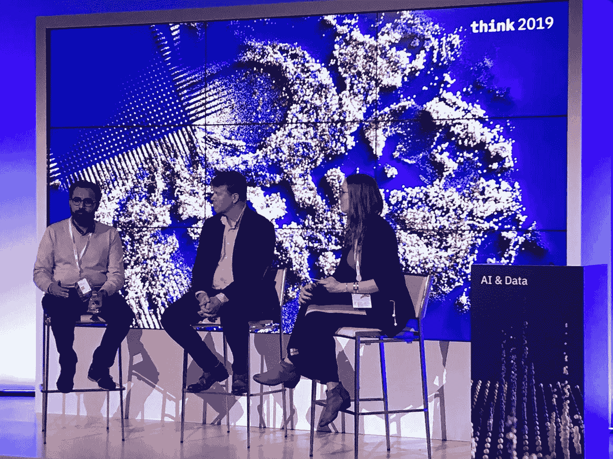
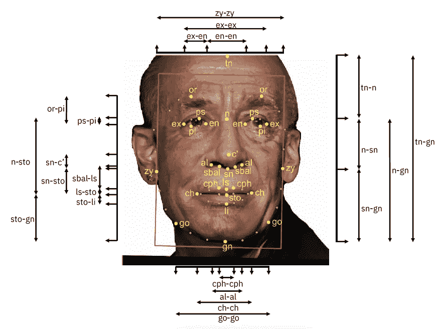

# 人们不信任人工智能。我们需要改变这种情况。

> 原文：<https://towardsdatascience.com/people-dont-trust-ai-we-need-to-change-that-d1de5a4a0021?source=collection_archive---------17----------------------->

The issue of mistrust in AI systems was a major theme at IBM’s annual customer and developer conference, THINK, this year. Image via Ron Poznansky.

在过去的一周里，我有幸参加了 IBM 的年度客户和开发者大会 THINK 并在会上发言，此次大会吸引了 25，000 多名与会者来到旧金山。当然，在一篇简单的博客文章中总结如此规模的事件几乎是不可能的——但我想分享一些在我参加的对话和会议中让我印象深刻的关键观点。尤其是其中一个主题，是我在 THINK 时关注的焦点，那就是我们对人工智能系统的信任问题。

说白了，大部分人都不信任 AI——至少，还没到把它投入生产的程度。[经济学人](https://perspectives.eiu.com/sites/default/files/EIU_Microsoft%20-%20Intelligent%20Economies_AI%27s%20transformation%20of%20industries%20and%20society.pdf)2018 年进行的一项研究发现，94%的企业高管认为采用人工智能对解决战略挑战很重要；然而，[麻省理工学院斯隆管理评论](https://sloanreview.mit.edu/offers-ai2018)在 2018 年发现，只有 18%的组织是真正的人工智能“先驱”，已经在他们的产品和流程中广泛采用了人工智能。这种差距说明了我们在人工智能社区中面临的一个非常现实的可用性问题:人们想要我们的技术，但它在目前的状态下并没有为他们工作。我认为缺乏对谎言的信任是这个问题的主要原因之一。

人们现在还不信任人工智能工具有一些很好的理由。首先，偏见是一个热点问题。[最近的](https://www.reuters.com/article/us-amazon-com-jobs-automation-insight/amazon-scraps-secret-airecruiting-tool-that-showed-bias-against-women-idUSKCN1MK08G) [高调的](https://www.wired.com/story/when-it-comes-to-gorillas-google-photos-remains-blind/) [事件](https://www.propublica.org/article/machine-bias-risk-assessments-in-criminal-sentencing)理所当然地获得了媒体的大量关注，帮助让机器学习偏见的概念家喻户晓。组织有理由对实施最终可能产生种族主义、性别歧视或其他偏见的系统犹豫不决。

事情是这样的:人工智能在设计上是有偏见的。正如 Forrester 首席分析师 Brandon Purcell 在我们关于人工智能公平性和可解释性的思考小组讨论中雄辩地指出的那样，机器学习模型被称为“鉴别器”是有原因的。有故意的、必要的偏见——例如，在问答系统中，同行评议的论文比维基百科的文章权重更大——还有无意的、有害的偏见——建立一个无法识别有色人种的面部识别模型。但“不良偏差”是算法决策系统中难以解决的问题，部分原因是我们尚未能从人类决策系统中消除它。我们生活在一个有偏见的世界，充满了有偏见的数据，这些数据会训练出有偏见的模型。

The author (right), Brandon Purcell of Forrester Research (middle), and Rohan Vaidyanathan of IBM (left) discuss AI fairness and explainability at THINK 2019.

除了偏见问题，另一个阻碍信任的关键话题是可解释性——或者说缺乏可解释性。有很多讨论，特别是在 GDPR 生效之后，在理解一个给定的模型如何得出一个个体决策的背景下，关于可解释性的讨论。这种类型的可解释性在更复杂的机器学习系统中很难实现，这些系统采用了“黑盒”技术，如神经网络或 XGBoost 模型。

从监管和伦理的角度来看，这种可解释性是非常重要的。然而，我认为，还有另一个可解释的元素对于建立人工智能模型的信任同样重要，那就是理解人工智能系统影响的能力——能够将模型输出与有形结果联系起来。对机器学习模型进行审计跟踪，对于了解这些模型在一段时间内的表现至关重要。如果没有能力审计他们的模型的功能(并确保一致的利益，或知道在性能下降的情况下何时进行纠正)，许多组织将会犹豫是否真正信任任何人工智能系统。

Image via giphy.

在 THINK 上反复出现的人工智能采用的最后一个挑战是许多组织面临的技能差距。在 IBM 的一项 [2018 年研究中，63%的受访者认为缺乏技术技能是人工智能实施的障碍。通过我自己与客户的交谈，我了解到大多数组织要么没有专门的数据科学团队，要么他们有一个过度扩展的非常小的团队。](https://www.ibm.com/downloads/cas/QQ5KZLEL)[据德勤](https://www2.deloitte.com/insights/us/en/focus/signals-for-strategists/democratization-of-data-science-talent-gap.html)称，根据目前的供需情况，到 2024 年，美国预计将面临 25 万名数据科学家的短缺。

对于没有专用资源的公司，业务负责人最终负责人工智能项目。没有工具来帮助他们理解这些系统实际上是如何工作的，他们很难将实验从实验室带入生产。难怪[麻省理工斯隆管理评论的 2018 年研究报告](https://s3.amazonaws.com/marketing.mitsmr.com/offers/AI2018/60280-MITSMR-BCG-Report-2018.pdf)发现，大多数组织——82%的受访者——未能在试点或概念验证项目之外采用人工智能。

所以，人们不信任人工智能——我认为我们作为技术专家的首要任务应该是尽快改变这种情况。有几个原因可以解释为什么对人工智能系统缺乏信任让我如此困扰。首先，我不断回到麻省理工学院斯隆管理学院的研究。在*有*家公司在大规模采用人工智能方面取得了飞跃——18%的组织被归类为“先驱”这些公司拥有强大的数据科学团队，他们有资源来构建自己的解决方案，以克服我上面提到的三个障碍。在人工智能的帮助下，这些公司将主宰市场。我坚信健康竞争作为客户和员工利益保障的重要性。因此，我想帮助尽可能多的公司跟上变化的潮流。我想确保各种各样的企业能够使用少数大公司已经在利用的相同工具。如果我们不帮助小家伙们信任 AI，他们将被市场整个吞噬。

其次，我担心如果我们不能成功地建立*值得广泛信任的模型和系统，我们将永远无法实现 AI 的全部积极潜力(当然；你可以称我为技术理想主义者。我相信人工智能的真正承诺是创造公平的竞争环境——打破数百年来主导市场的规模经济。但是，如果大多数人和组织都不想参与，竞争环境就不可能是公平的。*

后面的怀疑论者会很快指出，技术的民主化也产生了许多不好的结果——我意识到，当涉及到广泛采用时，并不全是美好的事情。但我认为，如果我们保持技术的封闭和不透明，坏人造成巨大伤害的风险会更高。如果我们不为每个人提供他们需要的工具来理解人工智能系统，就何时何地使用这些系统做出明智的决定，我们将为那些怀有恶意的人留下更多的空间来利用人们的缺乏理解。

那么我们如何解决 AI 缺乏信任这个迫切的问题呢？它从解决不信任的根源开始。我在 THINK 采访过的人有一些想法。为了解决偏见问题，旨在扩展训练数据以消除盲点的数据集，如人脸数据集中的[多样性，是一个良好的开端。像](https://www.research.ibm.com/artificial-intelligence/trusted-ai/diversity-in-faces/) [AI Fairness 360](https://aif360.mybluemix.net/) 这样的工具有助于数据科学家识别他们模型中的偏差。检查和缓解来自像[算法正义联盟](https://www.ajlunited.org/)这样的团体的专业知识对于让这些工具有效工作是必不可少的。

The Diversity in Faces dataset includes 10 facial coding methods, offering a jumping off point for researchers working on facial recognition models. Image via IBM Research.

提高人工智能系统易读性的技术也是必须的——我工作的产品 [Watson OpenScale](https://www.ibm.com/cloud/watson-openscale) 就专注于这个问题。我们特别需要为非技术或半技术受众设计的工具，这些工具以企业主可以理解的语言为人工智能模型带来透明度。智能监管将是推动这些领域工作的关键。欧盟的 GDPR 和即将到来的加州 CCPA 已经要求“算法决策”系统具有更高水平的可解释性。围绕系统中允许的偏差水平的法规可能会推动技术专家开发新的方法来确保人工智能系统的公平性。

对人工智能系统缺乏信任是我们迫切需要解决的更大问题的症状。我们今天拥有的狭义人工智能的技术能力正在迅速发展，比我们管理它们所带来的风险的能力快得多。研究人员已经在开发一些模型，他们担心被恶意使用而不愿分享这些模型。如果人工智能社区今天不把我们的努力集中在解决这项技术的问题上，明天就会有人为我们解决这些问题——以极端的、限制创新的法规的形式，或者，在我看来更糟糕的是，公众对人工智能完全失去信心和否认。

好消息是，我们正在像 THINK 这样的行业活动中讨论人工智能中的不信任问题。在过去的一年中，我看到技术社区围绕偏见、可解释性和易读性等挑战团结起来，这让我充满希望。我希望鼓励技术和非技术利益相关者更广泛地参与这些讨论。这将需要一个村庄来建立每个人都可以信任的人工智能系统。