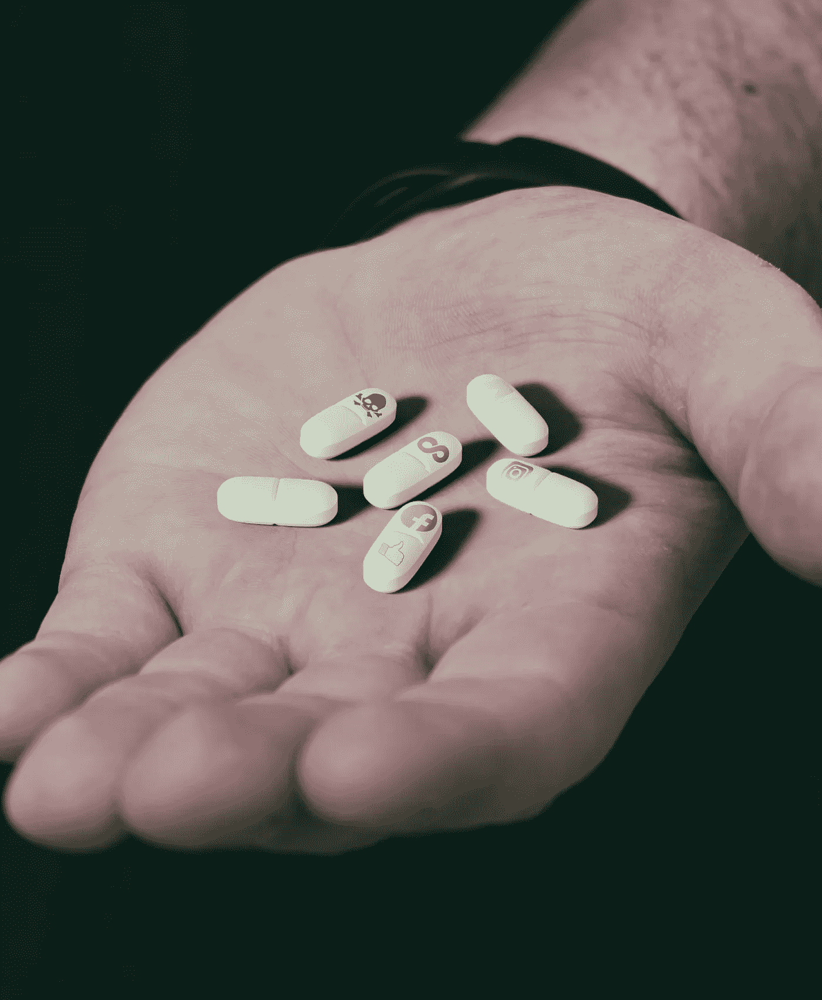

# 像你这样的人喜欢这样的东西

> 原文：<https://towardsdatascience.com/people-like-you-like-things-like-this-9313deed666c?source=collection_archive---------42----------------------->

## 推荐引擎的问题是

奥纳坦·海特害怕说出任何道德上模棱两可或伦理上微妙的话。对于商业伦理和道德心理学教授来说，这是一个荒谬的职位。然而，在海德特任教的纽约大学商学院，学生和管理人员已经联合起来，为那些在课堂上遇到政治挑战、道德复杂或其他冒犯性材料的学生开设了一条帮助热线。保证匿名。虽然帮助热线旨在成为一股向善的力量——一个随时为那些在高等学术机构的橡胶路面环境中道德和政治观点受到挑战的学生提供压力的阀门——但这不是撒玛利亚人。电话接线员不是在鼓励听众或志愿者成为朋友，他们是强大的管理者，在 NYU 学术人员的集体头上悬着达摩克利斯。

这条求助热线是海特过去几年一直在研究的一长串社会公正现象中最近的一个。利用他的社会科学工具包和他的道德万花筒，海特试图理解:为什么十几岁的女孩自杀人数创纪录，为什么学生团体如此强烈地反对一些客座演讲人的观点，以至于他们拒绝让*其他*学生听到他们的观点，为什么他的同事因无意冒犯而被解雇，等等。

正如任何称职的社会科学家一样，海特对这些现象有一套理论。他认为，自 90 年代初以来，西方父母一直处于一种歇斯底里的状态。海特认为，对新思想的过度敏感，对官方认可的保护国的需要，以及自残的可怕北行轨迹，都是反脆弱父母教育的结果。根据 Haidt 的说法，90 年代儿童诱拐率的缓慢攀升跨越了父母与子女比率的下降斜率，这些指标在一个临界点相遇，这是翻转父母养育方式的完美支点。孩子们突然每时每刻都受到监督，生怕装着鸡蛋的篮子会发生什么可怕的事情。

这种长期的泡沫包裹无疑解释了其中一些现象的情感力量。但是根除无人监管的游戏是党派和思想过敏的学院的唯一先决条件吗？难道不应该有其他非父母的力量来塑造孩子的原则和观点吗？

过去，父母们不得不编造出斗鸡眼的诡计来劝阻孩子们不要看电视(这种情况在晚间新闻开始时出现，让孩子们眯着眼，同时带着关切的目光)。现在，对于一个核心家庭来说，如果没有在无聊、紧张、沉默、非喜剧性的蒙太奇、对话等时刻出现的间隙屏幕，共同观看一部电影似乎是不可能的。这种变化的原因是什么？

不可否认，早期的电视是一个吸引注意力的怪物，但它必须变戏法。广播网络按照精心安排的收视率/广告优化轮流运行——从卡通片到肥皂剧，再到新闻和商业节目，带着一个运转良好的美国中产阶级家庭的圆滑。

从 90 年代中期开始，各种各样的设备要么被发明出来，要么价格降低到足以普及互联网接入。台式电脑、笔记本电脑、上网本、智能手机、平板电脑。随着每一代设备的相继出现，家庭关注被打破。挑战现有者的新媒体公司不再需要担心平衡代际娱乐的旋转盘子，而是可以为用户优化——特定屏幕的单一、不可减少的所有者。而且，通过正确的技术组合，他们可以建立一个电视网络的内容供一个人欣赏，他们可以大规模地这样做*。*

*但是，一个新生的互联网创业公司如何找到足够多的关于你的信息来代表你建立一个电视网络呢？外推。*

*对于经常使用现代网络的人来说，你在网站上的几乎每一个动作都会被记录下来，这并不奇怪。浏览量、点击量、点赞数和评论数被制成表格，储存在巨大的数据中心。然而，可能让你震惊的是，利用这些表面事件来获得进一步的细节。你的收入等级、社会地位、婚姻状况、年龄、种族和性别都在统计上相差很远。从这里开始，从数学上很容易找到那些最像你的用户。每一个数据都是高维空间中的一个坐标，每个人都是一个点。你的观看偏好和购买偏好是它们之间距离的假象。*

*你想看什么，什么会让你*参与*的问题，可以简化为你和你邻居的内容历史的集合运算。*

*海特遇到的学生很可能被溺爱，但这不仅仅是父母的错。社会已经将其社会化的责任让给了互联网，却没有意识到每个人的网络都是他们自己的，远非详尽的、隔离的、令人麻醉的熟悉。*

*普遍的个性化但持续强化已有原则的预期结果会是什么，尤其是当这种个性化在我们的成长阶段开始的时候？*

*互联网的支持者声称，它的主要好处之一是任何人都有能力为个人表达和创造力构建一个载体，但相反的能力呢？有能力为自己构建一个无底的消费渠道，在这个渠道中，我们的价值观不会受到审视？*

*这种经验框架不需要那些有抑郁倾向的人在他们的个人互联网上遇到不断增加的负面情绪吗？互联网听起来不像是抑郁发作所表明的认知治疗的完美对立面吗？*

*部落主义难道不是支配我们醒着的大部分时间里看什么和读什么的数学运算的自然结果吗？未来的几代人将会停留在不妥协的青少年意识形态中，还是我们会找到另一种交流方式？一个统一与和谐的世界，一个超越病毒传播的世界，一个让我们面对自古以来智人就在思考的难题的世界？*

*垃圾进，垃圾出。*

**原载于 2019 年 8 月 9 日*[*【https://carldawson.co.uk】*](https://carldawson.co.uk/people-like-you-like-things-like-this/)*。**