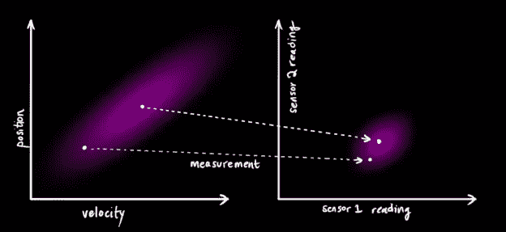
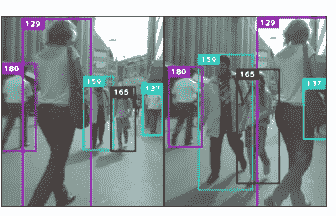

# 使用深度学习进行人物跟踪

> 原文：<https://towardsdatascience.com/people-tracking-using-deep-learning-5c90d43774be?source=collection_archive---------2----------------------->

## 用数据做很酷的事情！

# **简介**

目标跟踪是计算机视觉的一个重要领域。它包括跟踪一个物体的过程，这个物体可以是一个人，一个球或者一辆汽车。对于人物跟踪，我们将从一帧中所有可能的检测开始，并给他们一个 ID。在随后的画面中，我们试图延续一个人的身份。如果这个人离开了相框，那么这个 ID 就会被删除。如果一个新的人出现，他们就用一个新的 ID 开始。

这是一项困难的任务，因为人们可能看起来很相似，导致模型切换 id，人们可能被遮挡，例如当行人或玩家隐藏在其他人后面时，或者物体可能消失并在后面的帧中重新出现。

深度学习让我们在跟踪方面有了惊人的表现。请看下面来自多目标跟踪( [MOT 数据集)](https://motchallenge.net/)测试集的视频的[深度排序算法](https://arxiv.org/abs/1703.07402)的结果。

Pedestrain Tracking through Deep Sort

# 跟踪的基础

让我们首先回顾跟踪的基础知识。假设我们有帧中所有对象的边界框信息。在现实世界的应用中，我们需要提前进行包围盒检测，因此跟踪器需要与检测器相结合。但是现在让我们假设我们只在跟踪上工作。给定第 1 帧中 ID 的 bbox 信息，我们如何在后续帧中分配 ID？

1.  基于质心的 id 分配——最简单的形式是，我们可以通过查看边界框的质心来分配 ID。我们通过计算第 1 帧中每个边界框的质心来做到这一点。在第 2 帧中，我们查看新的质心，根据与先前质心的距离，我们可以通过查看相对距离来指定 id。基本的假设是帧到帧的质心只会移动一点点。只要形心彼此隔开，这种简单的方法就能很好地工作。可以想象，当人们彼此靠近时，这种方法会失败，因为它可能会切换 id
2.  [卡尔曼滤波器](https://www.bzarg.com/p/how-a-kalman-filter-works-in-pictures/) —卡尔曼滤波器是对简单的基于质心的跟踪的改进。[这个博客](https://www.bzarg.com/p/how-a-kalman-filter-works-in-pictures/)很好地解释了卡尔曼滤波器。卡尔曼滤波器允许我们根据物体的位置和速度来模拟跟踪，并预测它可能在哪里。它用高斯模型模拟未来的位置和速度。当它接收到一个新的读数时，它可以使用概率将测量值分配给它的预测值，并自我更新。它内存小，运行速度快。由于它同时使用了运动的位置和速度，因此比基于质心的跟踪具有更好的结果。

Kalman Filter — Prediction and Measurement Update

# 深度排序算法

我喜欢深度排序算法。太直观了。在所有上述数学中，我们人类在跟踪中一直使用的一个基本要素是对边界框的视觉理解。我们不仅根据距离、速度，还根据那个人的长相来追踪。深度排序允许我们通过计算每个边界框的深度特征并使用深度特征之间的相似性来添加该特征，从而也将该特征纳入跟踪逻辑。

我们如何计算深层特征？

本文使用在数百万幅人类图像上训练的模型，并为每个包围盒提取 128 维向量，该向量应该捕获该包围盒的关键特征。使用深度特征可以使该模型在人们遮挡或非常靠近的情况下更好地跟踪，如下图所示。

Tracking with Deep Sort

总的来说，我们的实验表明深度排序算法工作得非常好，但它也有一些限制:

1.  如果边界框太大，过多的背景被“捕获”在特征中，降低了算法的有效性
2.  如果人们穿着相似就像体育运动中发生的那样，会导致相似的特征和身份转换

# 结论

跟踪是计算机视觉中的一个重要问题，有着广泛的应用。深度排序算法非常强大，运行速度很快，对于许多情况来说是一个很好的起点。他们的回购写得非常好，很容易尝试。我鼓励你[拿出他们的代码](https://github.com/nwojke/deep_sort)来试一试。

我有自己的深度学习咨询公司，喜欢研究有趣的问题。我已经帮助许多初创公司部署了基于人工智能的创新解决方案。请到 http://deeplearninganalytics.org/的[来看看我们吧。](http://deeplearninganalytics.org/)

你也可以在[https://medium.com/@priya.dwivedi](https://medium.com/@priya.dwivedi)看到我的其他作品

如果你有一个我们可以合作的项目，请通过我的网站或 info@deeplearninganalytics.org 联系我

参考

1.  [MOT 挑战](https://motchallenge.net/)
2.  [Tensorflow 物体检测](https://github.com/tensorflow/models/tree/master/research/object_detection)
3.  [深度排序算法](https://arxiv.org/abs/1703.07402)