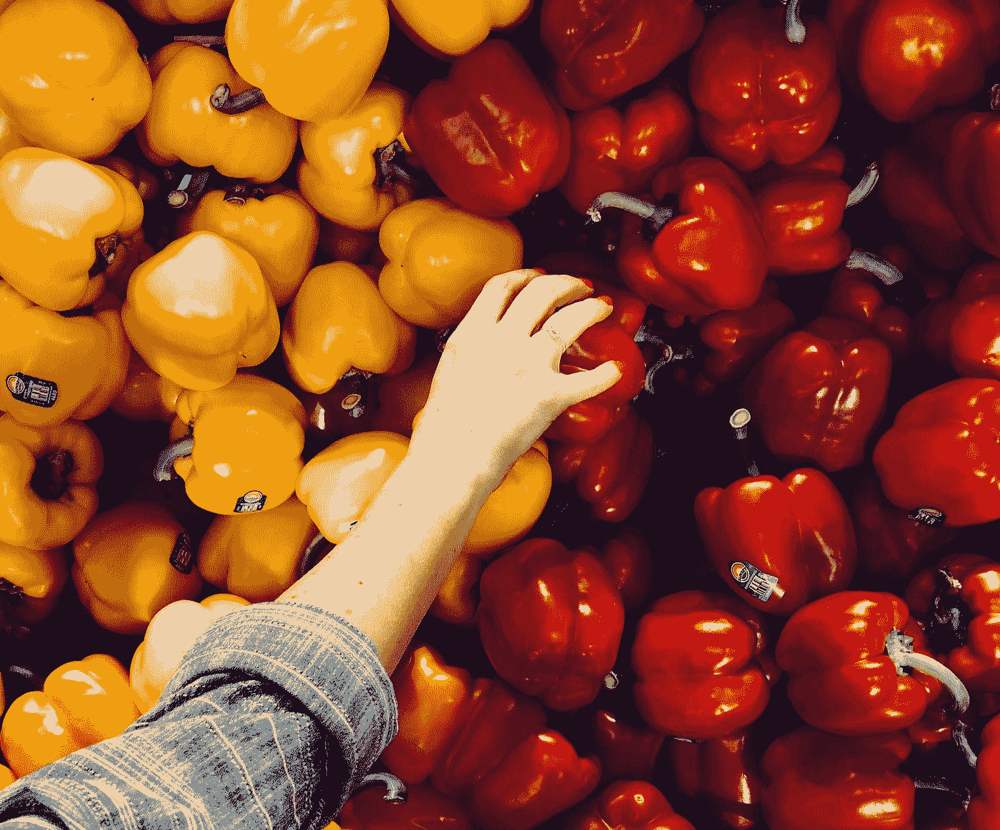
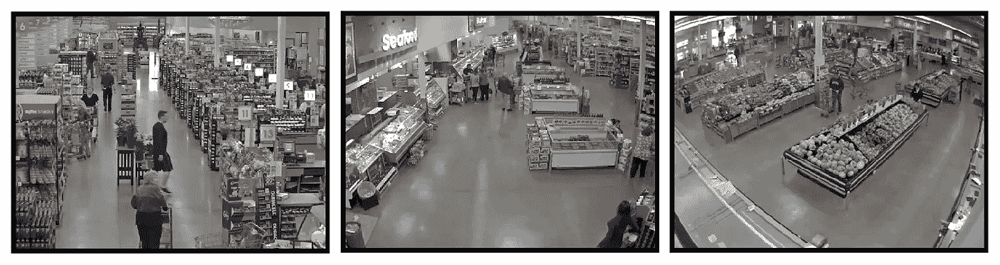
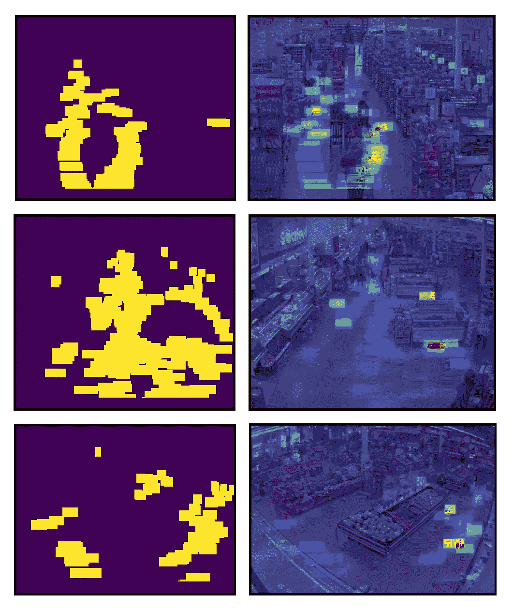

# 用机器学习跟踪人

> 原文：<https://towardsdatascience.com/people-tracking-with-machine-learning-d6c54ce5bb8c?source=collection_archive---------9----------------------->

## 检测客户习惯，跟踪他们的活动



Photo by [sydney Rae](https://unsplash.com/@srz?utm_source=medium&utm_medium=referral) on [Unsplash](https://unsplash.com?utm_source=medium&utm_medium=referral)

你的窗户有效地吸引人吗？对于购物者来说，你的商品有多少是容易买到的？如果你是一个心胸开阔的小杂货店老板，或者如果你是一家服装店的视觉采购员，你需要知道这些是人工智能可以帮助回答的典型问题。零售商不仅采用人工智能解决方案来改善客户体验，还直接增加了他们的业务。这样，一个恰当的问题可以是:一家特定的商店将户外人流转化了多少？

需要同时评估营销效果和总服务成本之间的完美权衡，以影响消费者行为并实现成本优化。在这种情况下，人工智能解决方案似乎代表了一种高价值的可能性。

在这篇文章中，我制作了一个有趣的应用程序，旨在跟踪商店里的人，并关注他们的历史活动，以检测他们的行为。随着机器学习和计算机视觉技术的实际发展，我们手中有大量强大的工具来完成像这样的任务，并且表现出色……*你不需要重新发明轮子，你需要知道如何使用轮子来让你的汽车变得更好。*

# 数据集

对于这个特殊的挑战，我们不需要带有标记数据的数据集，也就是说，我们使用已经在类似领域中专门化的预训练模型。我们的能力是正确地使它们适应我们感兴趣的情况。人物检测是计算机视觉中的一个经典应用领域，许多模型被训练来区分这个标准类别，取得了很高的性能。

我们只需要找到有意义的数据来测试我们的方法。我想找到显示固定商店布局内购物者活动的视频格式的数据。安全摄像头视频非常适合这个目的！它们是网络上容易获得的资源，反映了我们需要一个“老大哥”来监视店内的一切。**我在 YouTube 上找到了我们实验的合适人选**，并把它们下载到了我的电脑上。

这些视频是一个离散的质量，并没有那么沉重(平均 3 分钟)，所以他们对我们来说是完美的！



Shop Layouts extracted from videos. These videos are available on YouTube. From left: [Video1](https://www.youtube.com/watch?v=osN_4ril08Q) (1 minute), [Video2](https://www.youtube.com/watch?v=LsGb4gbuIpc) (6 minutes), [Video3](https://www.youtube.com/watch?v=0yNiX9nt43U) (3 minutes)

# 模型

为了完成我们的任务，我选择了 [**ImageAI 库**](http://imageai.org/) 。这个开源项目使每个人都能够轻松地将最先进的人工智能功能集成到我们新的和现有的应用程序和系统中。通过几行代码，您可以访问一系列用于图像预测和对象检测的最先进的机器学习算法。所有的脏活(预处理、模型查询、输出结果……)都已经为我们做好了，并且活在幕后。

那么，我们的工作已经完成了吗？幸运的是，还没有…附加值是由我们构建的智能工作流直接提供的，它能够回答我们臭名昭著的问题。

# 工作流程

我们有 mp4 格式的原始视频；作为我们行动计划的第一步，我们必须将视频转换成图像。这很容易，只需从原始视频中以固定的给定频率采样帧即可实现。在 python 中:

```
def extract_frames(video_path, fr=12):
    frames = []
    cap = cv2.VideoCapture(video_path)
    total_frames = cap.get(cv2.CAP_PROP_FRAME_COUNT)
    id_frame = 0
    while id_frame<=total_frames:
        cap.set(1, id_frame)
        success, frame = cap.read()
        if type(frame) != type(None):
            frames.append(frame)
        id_frame+=fr
    return frames
```

我将频率速率(fr)固定为 12:即，如果给定视频的频率为每秒 30 帧，我们每秒收集一帧，这是跟踪人的一个很好的近似值。

第二阶段，我们初始化所有的 ImageAI 工具。只有几行，我们可以访问非常强大的预训练对象检测模型。

```
detector = ObjectDetection()
detector.setModelTypeAsTinyYOLOv3()
detector.setModelPath("yolo-tiny.h5")
detector.loadModel()
custom_objects = detector.CustomObjects(person=True)
```

我选择了微小的 YOLO 来进行对象检测(很容易从 h5 格式的 ImageAI 文档页面下载),因为它允许在性能和速度之间进行很好的权衡。这个网络运行良好，所有的工作流程能够在不到一秒的时间内处理一帧图像！

有趣的部分来了。我们必须将我们收集的数据(来自视频的图像)转化为对我们有用的东西:它同时易于理解，并且包含有价值的信息。完美的选择是热图表示，它允许我们赋予我们从人员检测任务中存储的信息以价值。如果还不清楚，让我来画…



由于 ImageAI 的强大功能，这可以通过一种非常优雅的方式实现:它们的检测器返回检测到的对象以及相关的边界框坐标作为输出。对于人来说，我们只提取盒子的底部，以提供一个可解释的重叠信息和商店的平面图。有了这些容易获得的结果，我们可以构建一个以热图表示形式的频率图(在右侧与商店地图重叠)和一个路径掩码(在左侧)。为了给予进一步的可解释性，我们排除了帧的底部部分:这些区域受到“错误检测”的影响，即我们的模型太聪明了，并且识别出人也具有破坏热图计算的半个身体。

这些结果告诉我们购买者遵循的路线以及他们会在哪里停留更长时间。

“最热区域”是人们更加关注的地方。在最长的视频中(我最近处理的两个)，这些区域立刻就清晰了！现在想象一下，如果有更多的视频资料供我们使用，我们能够检测到多少客户行为？

# 摘要

在这篇文章中，我制作了一个计算机视觉解决方案来跟踪商店里的人。人物检测是机器学习中的一项综合性任务，因此我们试图将这一知识(具有相对较高的性能)应用于不同的领域。给定一个显示正常购物程序的视频，我们能够检测购物者的行为和路径。这些是每个零售商的黄金信息，以便以不同的方式改善他们的业务:商品展览，商店布局，员工效率，库存水平等等。

[**查看我的 GITHUB 回购**](https://github.com/cerlymarco/MEDIUM_NoteBook)

保持联系: [Linkedin](https://www.linkedin.com/in/marco-cerliani-b0bba714b/)