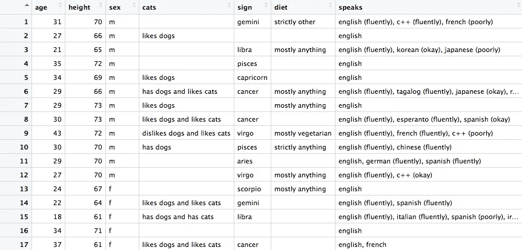
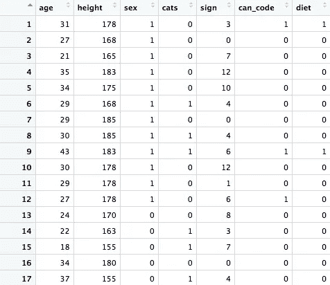
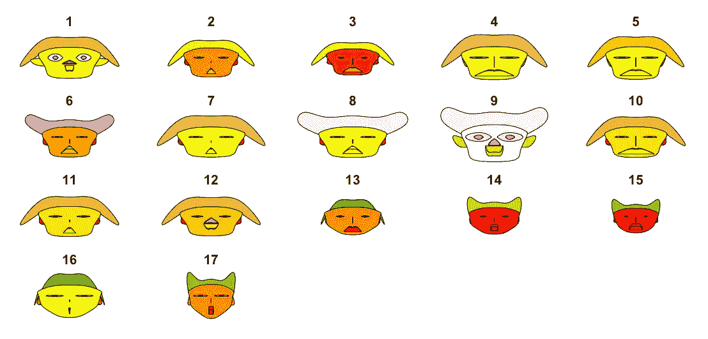
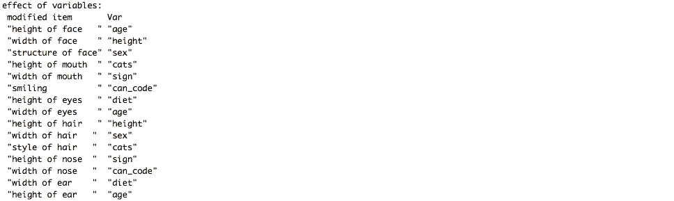
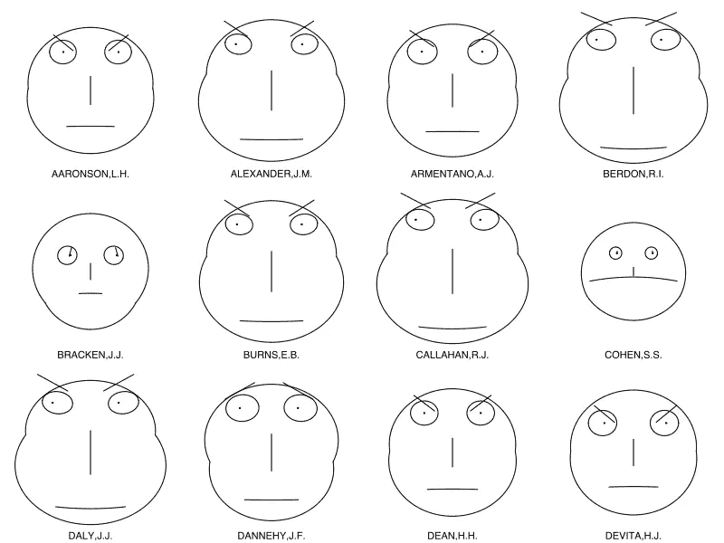

# 愚人节 2019:感知驱动的数据可视化

> 原文：<https://towardsdatascience.com/perception-driven-data-visualization-e1d0f13908d5?source=collection_archive---------9----------------------->

## 利用最强大的心理学技术探索 OKCupid 数据以加速分析

***本文为 2019 年愚人节恶作剧。既然庆祝活动已经结束，请滚动到文章末尾的真实课程部分，进行一分钟真正的学习。***

进化赋予了人类一些非凡的能力，从直立行走到操作重型机械，再到高效的在线择偶。

> 人类已经进化出快速处理人脸的能力，你可以使用感知驱动技术来加速你的分析。

其中最令人印象深刻的是我们感知面部结构和表情微小变化的能力，因此数据科学家已经开始利用我们与生俱来的超能力来获得更快、更强大的数据[分析](http://bit.ly/quaesita_analysts)。

# 进化驱动的数据分析

准备好被令人难以置信的新分析技术震撼吧！

切尔诺夫的脸以优雅和清晰而著称，通过利用人类最擅长的面部识别来传达信息。

Chernoff faces 背后的核心思想是，每个面部特征都将映射到数据的一个属性。更大的耳朵意味着什么，微笑、眼睛大小、鼻子形状等等也是如此。我希望你看到它的运行会很兴奋！

让我们用 OKCupid 数据来看一个现实生活中的择偶例子。

# 数据处理

我首先下载了一个数据集，里面有近 60K 个泄露的 OKCupid 个人资料，你可以在这里[找到](http://bit.ly/okcdataset)来跟进。真实世界的数据通常是杂乱的，在对您的数据科学目标有用之前，需要进行大量的预处理，这也是事实。例如，他们有大量认真的和 100%可靠的自我介绍文章，所以我做了一点快速过滤，把我的数据集浓缩成与我相关的东西。我用了 [R](http://bit.ly/vanillar) 我发现最有用的函数是 [*grepl()*](http://bit.ly/rgrepl) *。*

首先，因为我住在纽约，所以我过滤掉了 17 个我附近的资料。接下来，我清理了数据，以显示我最在意的特征。例如，我是水瓶座，占星学上的相处显然很重要，同样重要的还有对猫的热爱和在*进行灵魂对话的意愿。*

*在第一个预处理步骤之后，我的数据集看起来是这样的:*

**

*下一步是将字符串转换成数字，这样 [Chernoff face](http://bit.ly/facingchernoff) 代码就能正常运行。这是我将从 [R](http://bit.ly/vanillar) 的 *aplpack* 包中提交到 *faces()* 函数中的内容:*

**

*下一步，魔术！*

# *露出的面孔*

*现在我们的数据集已经准备好了，让我们运行我们的 [Chernoff faces](http://bit.ly/facingchernoff) 可视化！哒哒。*

**

*下面是如何阅读的简便指南。这难道不令人惊讶的优雅和如此迅速地看到到底发生了什么吗？比如最大的脸是最高最老的人，而微笑者会给我唱甜甜的 [*C++*](http://bit.ly/cplusplusplus) 十四行诗。很容易在一瞬间看到这一切。人脑真是不可思议！*

**

# *数据隐私问题*

*不幸的是，通过[认知机器深度学习](http://bit.ly/quaesita_ai)所有这些面孔，我们正在侵犯 OKCupid 用户的隐私。如果你仔细观察并记住这些图像，你也许能从人群中挑选出他们。小心那个！在向你的老板展示这些强有力的图像之前，确保你通过在一个不相关的数据集上重新运行代码来重新匿名化你的结果。*

**

# *日期和约会*

*切尔诺夫脸？！你真的应该检查出版日期，尤其是在四月初的时候。当这位顽固的统计学家提到占星术时，我希望你已经开始怀疑了，并且在我说到去匿名化的废话时，你已经确定了。*

*我爱你，无论是哪个恶作剧者转发给你的。❤*

# *真正的教训*

*我总是被切尔诺夫的面孔逗乐(并渴望找个借口与你分享一些我最喜欢的分析琐事)，尽管我从未真正见过他们在野外发挥作用。尽管这篇文章是为了搞笑，但也有一些真正的教训要吸取:*

*   ****期望花时间清理数据。*** *虽然最终的可视化只需要击几个键就可以实现，但我的大部分工作是准备要使用的数据集，你应该会在自己的* [*数据科学*](http://bit.ly/quaesita_datasci) *冒险中看到这一点。**
*   ****数据可视化不仅仅是*** [***直方图***](http://bit.ly/quaesita_hist) ***。当谈到如何呈现数据时，有很大的创造性空间，尽管并不是所有的东西都会在一个易于初学者使用的包中实现。虽然你可以通过* [*R*](http://bit.ly/vanillar) *只使用单一的函数 faces(数据)来获得 Chernoff faces，但是如果你觉得有创意并且愿意在图形方面付出努力，那么天空就是极限。如果你追求最深刻的自我表达，你可能需要像 C++这样的东西。****
*   *与我相关的东西可能与你无关。我可能关心爱猫，你可能关心别的。分析只对其预期的目的有用，所以如果你继承了别人的数据集或报告，要小心。可能对你没用，或者更糟，误导。*
*   ****没有正确的方法来呈现数据*** *，但是考虑 viz 质量的一种方法是理解速度。这些面孔不能有效地将信息传递到你的大脑中——你可能不得不去查阅桌子来弄清楚你在看什么。当你为现实做分析时，这是你想要避免的。**
*   ****切尔诺夫的面孔在被发明*** *的时候听起来才华横溢，同样的道理，“认知”这个和那个在今天听起来才华横溢。不是所有让你内心深处的诗人发痒的东西都是好主意……当论点诉诸进化论和人类大脑时，要格外警惕逻辑的跳跃。不要忘了在你把神奇的东西运用到你的业务中之前，先测试一下* *数学。**

*如果你想试着自己创造这些面孔，这里有一个教程。如果你更喜欢读我的一篇关于数据可视化的直白的文章，试试这篇文章。*

**

*[Chernoff face](http://bit.ly/facingchernoff) visualization explained on [Wikipedia.](http://bit.ly/facingchernoff)*

# *感谢阅读！人工智能课程怎么样？*

*如果你在这里玩得开心，并且你正在寻找一个为初学者和专家设计的有趣的应用人工智能课程，这里有一个我为你制作的娱乐课程:*

*Enjoy the entire course playlist here: [bit.ly/machinefriend](http://bit.ly/machinefriend)*

# *喜欢作者？与凯西·科兹尔科夫联系*

*让我们做朋友吧！你可以在 [Twitter](https://twitter.com/quaesita) 、 [YouTube](https://www.youtube.com/channel/UCbOX--VOebPe-MMRkatFRxw) 、 [Substack](http://decision.substack.com) 和 [LinkedIn](https://www.linkedin.com/in/kozyrkov/) 上找到我。有兴趣让我在你的活动上发言吗？使用[表格](http://bit.ly/makecassietalk)联系。*