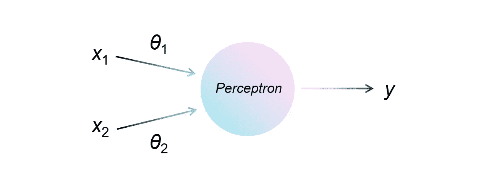
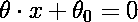
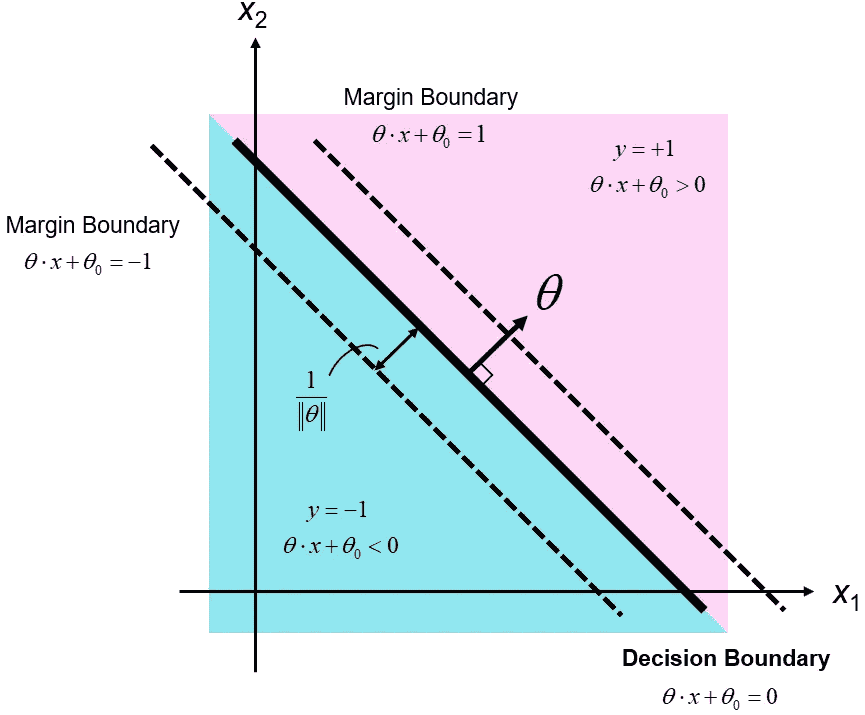
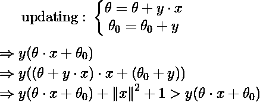
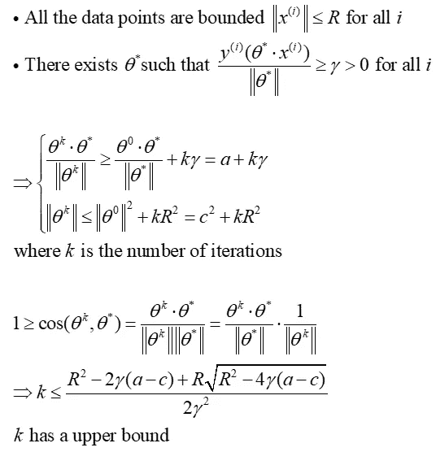
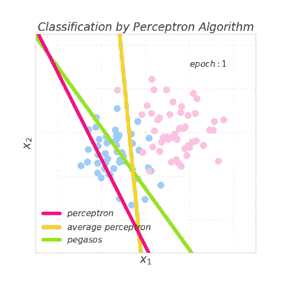

# 线性分类的感知器算法

> 原文：<https://towardsdatascience.com/perceptron-algorithms-for-linear-classification-e1bb3dcc7602?source=collection_archive---------7----------------------->

## 了解感知器算法是如何工作的，以及它们背后的直觉。



基本感知器算法是由[参考文献 1](#6b44) 在 20 世纪 50 年代末首次提出的。这是一个用于监督学习的二元线性分类器。二元线性分类器背后的思想可以描述如下。


其中 *x* 为特征向量， *θ* 为权重向量， *θ* 为偏差。符号函数用于区分*x* 是正(+1)还是负(-1)标签。存在用不同标签分离数据的决策边界，这发生在



决策边界将超平面分成两个区域。在***θ⋅x*+*θ*₀>，的区域，数据将被标记为正，在 *θ⋅ x* + *θ* ₀ <的区域，数据将被标记为负。如果一个给定数据中的所有实例都是**线性可分的**，则对于每第 *i* 个数据点，存在一个 *θ* 和一个 *θ* ₀，使得 y⁽*ⁱ*⁾(*θ⋅x*⁽*ⁱ*⁾+*θ**)【t100，其中 y⊙***

***图 1 用二维情况说明了上述概念，其中*x*=[*x*₁*x*₂]ᵀ、*θ*=[*θ*₁*θ*₂】和 *θ* ₀是偏移标量。请注意，边距边界与正则化相关，以防止数据过度拟合，这超出了这里讨论的范围。***

******

***Figure 1\. The concepts of binary linear classifier with the 2-D case.***

# ***感知器***

***找到决策边界的一种方法是使用感知器算法。只有当决策边界错误分类数据点时，感知器算法才会更新 *θ* 和 *θ* ₀。算法的伪代码描述如下。***

```
**# Perceptron Algorithm**# initialize θ and θ₀ with 0*
θ = 0  (vector)
θ₀ = 0 (scalar)*# totally T epoches to iterate*
for t = 1 .. T do                     
   * # totally m data points*    
    for i = 1 .. m do
        *# misclassify data points*                 
        if y⁽ⁱ⁾(θ ⋅ x⁽ⁱ⁾ + θ₀) ≦ 0     
        then
            θ  = θ + y⁽ⁱ⁾ ⋅ x⁽ⁱ⁾
            θ₀ = θ₀ + y⁽ⁱ⁾return θ, θ₀*
```

***感知器算法遍历所有带标签的数据点，并相应地更新 *θ* 和 *θ* ₀。更新规则背后的直觉是将 y⁽*ⁱ*⁾(*θ⋅x*⁽*ⁱ*⁾+*θ*₀)推得更接近一个正值，如果 y⁳*θ≡x*θ≦***

********

# ****感知器收敛****

****构成感知器算法所犯错误数量界限的因素是数据点的最大范数和正负数据点之间的最大差值。感知器收敛定理已在[参考文献 2 中得到证明。](#cbb7)给定一组通过原点可线性分离的数据点， *θ* 的初始化不会影响感知器算法最终收敛的能力。****

********

****迭代次数 *k* 具有有限值意味着一旦数据点通过原点是线性可分的，无论 *θ* 的初始值是什么，感知器算法最终都会收敛。这些概念也代表了 *θ* ₀.的存在****

****然而，一旦数据点是线性不可分的，这种感知器算法可能会遇到收敛问题。有两种感知器算法变体被引入来处理这些问题。一个是平均感知器算法，一个是 pegasos 算法。****

# ****平均感知器****

****与感知器算法类似，平均感知器算法使用相同的规则来更新参数。然而， *θ* 和 *θ* ₀的最终返回值取每次迭代中 *θ* 和 *θ* ₀的所有值的平均值。算法的伪代码描述如下。****

```
***# Average Perceptron Algorithm**# initialize θ, θ₀, sum_θ, sum_θ₀, and counter with 0*
θ = 0  (vector)
θ₀ = 0 (scalar)
sum_θ = 0  (vector)
sum_θ₀ = 0 (scalar)
counter = 0*# totally T epoches to iterate*
for t = 1 .. T do                     
    *# totally m data points *   
    for i = 1 .. m do  
        *# misclassify data points   *            
        if y⁽ⁱ⁾(θ ⋅ x⁽ⁱ⁾ + θ₀) ≦ 0     
        then
            θ  = θ + y⁽ⁱ⁾ ⋅ x⁽ⁱ⁾
            θ₀ = θ₀ + y⁽ⁱ⁾ sum_θ = sum_θ + θ
        sum_θ₀ = sum_θ₀ + θ₀
        counter = counter + 1return (sum_θ/counter), (sum_θ₀/counter)**
```

# ****佩加索斯****

****pegasos 算法具有超参数 *λ* ，为要调整的模型提供了更大的灵活性。无论数据点是否分类错误，都会更新 *θ* 。详情见[参考文件 3。](#c12e)算法的伪代码描述如下。****

```
***# Pegasos Algorithm**# initialize θ, θ₀, and counter with 0*
θ = 0  (vector)
θ₀ = 0 (scalar)
counter = 0*# totally T epoches to iterate*
for t = 1 .. T do 
   * # totally m data points *                   
    for i = 1 .. m do                 
        counter = counter + 1
        η = 1/√counter 

        if y⁽ⁱ⁾(θ⋅x⁽ⁱ⁾ + θ₀) ≦ 1    
        then
            θ  = (1 - ηλ)θ + ηy⁽ⁱ⁾⋅x⁽ⁱ⁾
            θ₀ = θ₀ + ηy⁽ⁱ⁾
        else
        then
            θ  = (1 - ηλ)θ
            θ₀ = θ₀return θ,  θ₀**
```

# ****可视化感知器算法****

****图二。通过不同的感知器算法可视化决策边界的更新。请注意，给定的数据是线性不可分的，因此感知器算法绘制的决策边界会发散。平均感知器算法和 pegasos 算法都很快达到收敛。pegasos 算法的 *λ* 在这里使用 0.2。****

********

****Figure 2\. Updating the decision boundaries by the different perceptron algorithms. May take time to load.****

# ****示例代码****

****在 Jupyter 笔记本上写的感知器算法的样本代码可以在[这里](https://github.com/AnHungTai/Medium-SampleCode/blob/master/Perceptron%20Algorithms%20for%20Linear%20Classification/Visualizing%20Perceptron%20Algorithm.ipynb)找到。你可以自己处理数据和超参数，看看不同的感知器算法表现如何。****

# ****参考****

****[1]****

****F.罗森布拉特，“感知机:大脑中信息存储和组织的概率模型”，*《心理评论》，1958 年*。土井: [10.1037/h0042519](http://doi.org/10.1037/h0042519)****

****[2]****

****米（meter 的缩写））Mohri 和 A. Rostamizadeh，“感知机错误界限”， *arxiv* ，2013 年。[https://arxiv.org/pdf/1305.0208.pdf](https://arxiv.org/pdf/1305.0208.pdf)****

****[3]****

****南 S.-Shwartz、Y. Singer、N. Srebro 和 A. Cotter，“Pegasos:SVM 初始估计次梯度求解器”，*数学规划*，2010 年。doi:[10.1007/s 10107–010–0420–4](https://doi.org/10.1007/s10107-010-0420-4)****