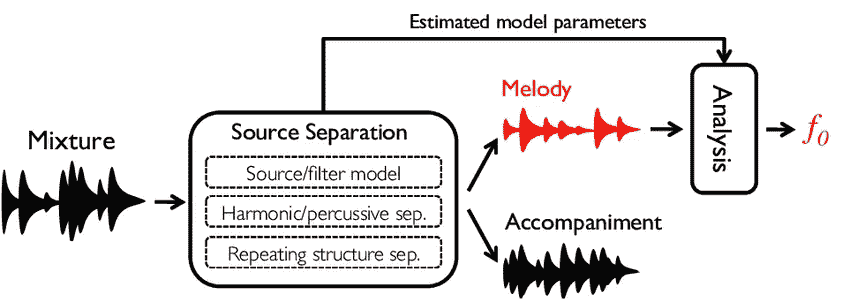
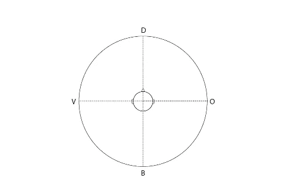
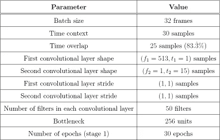
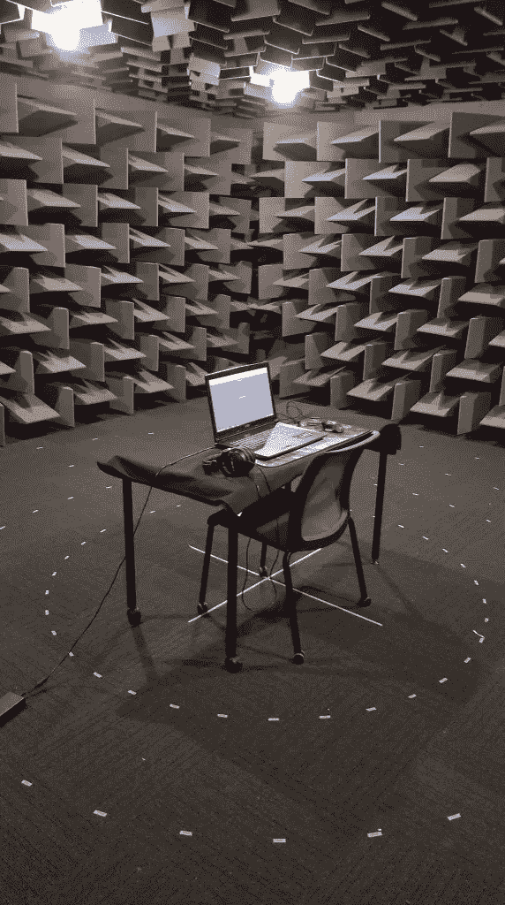
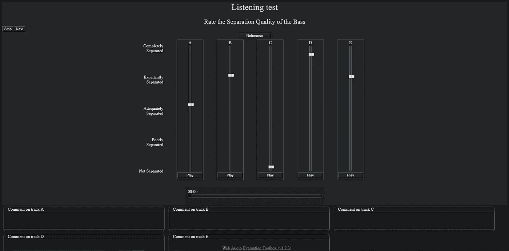
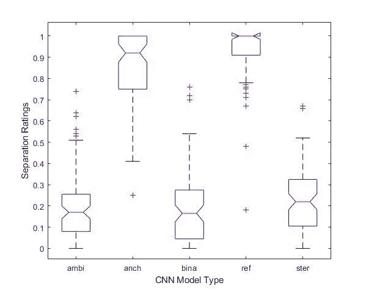
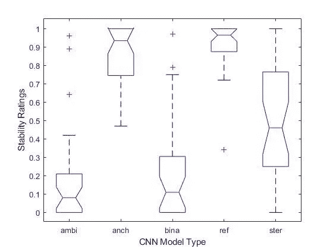

# 用双耳和双声道音频训练的音乐源分离 CNN 的感知评估

> 原文：<https://towardsdatascience.com/perceptual-evaluation-of-a-music-source-separation-cnn-trained-with-binaural-and-ambisonic-audio-275f147ba555?source=collection_archive---------18----------------------->

# 研究概述

本研究探索了使用不同空间音频格式来训练音乐源分离神经网络的想法。DeepConvSep 是由 Marius Miron、Pritish Chandna、Gerard Erruz 和 Hector Martel 设计的库，用作测试不同卷积神经网络进行源分离的框架。然后详细说明听力测试，并分析测试结果，以便对模型进行感知评估。得出关于使用空间音频格式来训练源分离神经网络的有效性的结论。

# 介绍

音频神经网络寻求使人工智能能够像人类一样说话和听觉。在该领域的发展中存在许多障碍，因为音频包含大量的信息，从数万个不同的频率和相位分量，以及外部的、不需要的噪声和多种来源的可能性。为了解决这个问题，目前存在几种方法来将音频压缩和重新格式化成与神经网络的输入更兼容的数据向量。

空间音频格式(如双耳和双声道音频)的出现为比立体声更“自然”的音频创造了潜力。然而，对于这些更“自然声音”的音频格式是否有利于神经网络学习和理解声音的尝试，之前几乎没有研究。这项研究试图通过训练和感知评估用不同音频格式训练的几个源分离神经网络模型来试验这一想法。

# 源分离

# 概念基础

源分离是旨在将音频混合分离成它们各自的源元素的过程，无论它是音乐还是语音等。自动语音识别(ASR)、音乐后期制作和音乐信息检索(MIR)等领域都受益于源分离技术的改进研究[1]。源分离可以进一步细分为两个不同的类别。面向音频质量(AQO)的源分离寻求从混合中分离源信号，同时最好地保持它们的感知音频保真度。相反，面向重要性(SO)的方法从分离的源信号中提取高级语义信息[1]。这项研究的重点是 AQO 方法在评估源分离的有效性。

# 研究灵感

源分离是神经网络的理想任务，因为它本质上是一个分类任务。DeepConvSep 由 Marius Miron、Pritish Chandna、Gerard Erruz 和 Hector Martel 设计，是一个卷积神经网络(CNN)库，专为信号分离评估活动(SiSEC)而构建[2，3]。为了分离当代/流行音乐，用 Demixing Secrets DSD100 数据库训练原始神经网络模型。DSD100 由一组 100 首歌曲组成，每首歌曲都有相应的混音和词干，分为四个类别(人声、贝斯、鼓和其他)，最初是为 SiSEC 2017 开发的。

虽然 DSD100 模型最初是使用单声道音频输入训练的，但研究人员 Gerard Erruz 探索了使用多声道甚至空间音频输入训练模型的想法[1]。Erruz 最初假设双耳频谱线索，如双耳电平和时间差(ILD 和 ITD)可以对帮助 CNN 更准确地执行源分离产生积极影响。为了测试这一点，DSD100 以几种配置(“cross”、“xeix”和“random”)进行双耳处理，以输入 CNN。

> 为了对这些空间训练的源分离神经网络进行感知评估，进行了听音测试。

为了量化这种性能改善，使用了五种客观测量方法:源失真比(SDR)、源干扰比(SIR)、源噪声比(SNR)、源伪像比(SAR)，以及图像与空间失真比(ISR)的合并，以说明立体声输出中的空间失真[1]。Erruz 的结论是，某些指标(SDR，SIR)表明，用双耳音频输入训练的模型(除了将所有训练信号放置在随机位置的配置)优于用立体声或单耳输入训练的模型[1]。

虽然这些客观测量看起来是展示模型性能差异的合理方式，但是这种源分离任务仍然必须诉诸 AQO 方法，并且呈现感知上高保真的音频输出。为了感知地评估这些空间训练的源分离神经网络，进行了听音测试。此外，使用相同 CNN 架构的模型通过双声道编码的 DSD100 进行训练，以探索使用空间处理音频的替代形式来进一步提高源分离性能的可能性。

# 测试方法

# 刺激物的选择

必须训练几个 CNN 模型来代表不同的方法。原始的 DeepConvSep 架构被保留下来，因此数据库输入的差异将成为主要变量。一个模型使用标准 DSD100 作为立体声训练模型进行训练。双耳和双声道训练模型都以“交叉”形式配置，因为已经注意到特定通道中的信号优势提高了分离性能[1]。图 1 展示了数据集的空间定位。

*图一。双耳解码的“交叉”布局。“D”、“V”、“B”和“O”分别对应于鼓、人声、低音和其他。[1]*

DSD100 使用两个！Ears 的双耳场景模拟器和 SADIE 头部相关传递函数(HRTF)数据库，以创建 BDSD100(双耳 DSD100) [4]。ADSD100 (ambisonic DSD100)是通过使用 SN3D 归一化球面谐波对数据库进行 ambisonic 编码而创建的。该实验使用一阶环绕声，产生一个双耳解码的 4 声道信号。双耳解码是通过将使用谷歌的共振音频工具包进行双声道编码的双声道音频与赛迪 that 的双声道音频进行卷积，并将结果信号求和为左右声道[5]。

使用 DSD100 的各种版本训练模型，然后使用每个模型分离数据库的 50 首测试歌曲。测试刺激是从这 50 首歌曲中选择的，所有这些歌曲都不是原始模型训练的一部分。使用单个均方误差训练阶段和表 1 所示的 DeepConvSep CNN 的默认参数来训练所有模型。

*表 1。CNN 训练参数[1]。*

一台配备特斯拉 K80 显卡和英特尔至强 E5–2690 V3 CPU 的微软 Azure 云计算机用于模型训练。

# 测试配置

对总共 14 名参与者进行了听力测试，他们都自认为听力正常。大多数参与者都是经验丰富的音频工程师，尽管小组中的音频经验水平各不相同。测试在德比大学的半电波暗室中进行，参与者使用一对 Beyerdynamic DT770 PRO (80 欧姆)闭背耳机进行测试。采取这些措施是为了减少未经声学处理的空间中任何房间反射的影响，这种影响会扭曲定位线索。然而，考虑其他类型的耳机可能是有意义的。例如，已经注意到自由空气等效耦合(FEC)耳机具有更准确的双耳刺激再现，因为它们在覆盖耳朵时不会改变耳道的声阻抗[6]。

*图二。德比大学半消声室中的听力测试装置。*

使用 DragonFly Red DAC 在计算机上进行测试。使用网络音频评估工具[7]设计了隐藏参考和锚的多重刺激(MUSHRA)测试。网络音频评估工具被设置为将测试信号校准到-23 LUFS，参与者不能改变信号电平。选择 MUSHRA 测试格式是为了符合 ITU 的编码系统中间质量水平主观评估方法(ITU-R bs . 1534–1)[8]。MUSHRA 格式在几个源分离听音测试中一直是一个主要范例，并以其评估测试信号与已知参考信号相比的退化的能力而闻名[9]。

该测试总共包括 8 首歌曲，参与者被要求评价所选元素的分离程度(如贝斯、鼓等)。)或不同音频样本的“稳定性”如何。参与者被告知，如果没有不切实际的振幅和声相调制，音频就更稳定，如果相反，音频就不稳定。评级是在 0 到 100 的范围内进行的。通过从 DSD100 数据库中提取测试歌曲各自的词干，创建了一个隐藏引用。通过对 3.5 kHz 的隐藏参考应用低通滤波器来创建低范围隐藏锚点。剩下的选项包括由双声道、双耳和立体声训练模型执行的分离。实验的零假设是双声道和双耳训练的模型在感知上与原始立体声训练的模型没有区别。测试的样本页面如图 3 所示。

*图 3。MUSHRA 听力测试的样本页面。*

# 结果分析

在 MATLAB 中对分离和稳定性响应数据进行单向方差分析(ANOVA)测试，以捕捉总体趋势并确认统计显著性。分离和稳定性反应的 p 值分别为 0.3863 和 0.001。这表明，由于 p 值高于证明显著性的 0.05 (5%)阈值，分离均值未被证明具有统计学显著性差异。就分离质量而言，不同的格式可能太难区分，并且它们中没有一个可能完成了预期的任务。可能还很难确定分离质量对参与者意味着什么，这可能是相关听力考试中未来改进的领域。然而，稳定性评级低于 p 分数阈值，因此拒绝了零假设。因此，当使用双耳和双声道音频来训练立体声分离模型时，观察到的稳定性损失得到了证实，这表明当训练源分离模型时，这可能不是使用的理想方法，因为稳定性可能对感知评估有很大影响。这种分析还产生了缺口盒图(见图 4 和图 5)。

*图 4。比较不同训练的 CNN 模型之间的分离等级的凹口盒图。“Ambi”、“anch”、“bina”、“ref”和“ster”指的是 ambisonic、anchor、双耳、参考和立体声。*

*图五。缺口盒图比较不同训练 CNN 模型之间的稳定性评级。*

所有源分离模型的总体得分都很低，立体声模型的中值稍高，意见方差较低。然而，由于模型箱线图的所有凹口几乎对齐，这一观察结果落在置信区间之外，表明没有强有力的证据表明中位数实际上是不同的。双声道和双耳模型都有更大的方差和更多的异常值，这可能意味着这些格式产生了感知混乱的结果，产生了各种各样的意见。参考中有许多异常值，这些异常值很可能代表对听力任务不完全清楚的参与者；这些异常值也可能始终一致。

稳定性得分有较大的方差，但也再次得出了更明确的结论。立体声模型自信地胜过双耳和双声道模型，因为它的中值得分更高，并且在其他模型的置信区间之外。奇怪的是，立体声模型的评分差异很大。识别音频稳定性可能太不明确，并且可能在将来使用一些改进作为目标度量。在很大程度上，当分离立体声音乐时，用双声道和双耳音频训练的模型表现出较低的稳定性；这可能归因于这些格式之间的空间定位技术的差异。

由于模型对各种类型的音乐和乐器的反应非常不同，所以从测试选择的任何特定流派或乐器中没有得出重要的结论。然而，据观察，立体声模型在人声分离方面的得分始终比其他两个模型好。也许与其他工具相比，声音分离更容易区分，因此参与者能够做出更果断的选择。

# 结论

用双声道和双耳音频训练的模型并没有胜过立体声训练的模型。使用立体声素材训练的模型可能在分离立体声音频时表现最佳。感兴趣的是进一步研究由它们各自训练的模型分离的各种不同的音频格式，以观察当将模型训练与预期的目标素材配对时的任何性能改进。当使用更高分辨率的环绕立体声输入时，为了观察任何差异，也可以使用更高阶的环绕立体声。

这个实验也对最初研究中使用的客观测量方法投下了怀疑的阴影[1]。当量化源分离系统性能时，可能必须有更好的测量方法，以确保不同源分离模型的质量能够被准确和彻底地理解。

总的来说，很明显这种源分离算法在感知上是无效的。虽然模型和输入材料的特定组合产生了极好的分离结果，但是性能是不一致的，并且必须采取进一步的措施来改进源分离神经网络结构。这项研究的结果表明，在这一点上，改变音频训练材料的空间格式可能不是源分离的进步之路。

# 参考

[1] G. Erruz，“卷积神经网络的双耳源分离”，2017。硕士论文。庞贝法布拉大学。[https://zenodo.org/record/1095835#.XNLm2-](https://zenodo.org/record/1095835#.XNLm2-)hKiUk(访问日期:2019 年 3 月 28 日)

[2] P. Chandna，M. Miron，J. Janer，E. Gomez，“使用深度卷积神经网络的单声道音频源分离”，2017 年潜变量分析和信号分离国际会议。

[3] A. Liutkus，F. R. Stö ter，Z. Rafii，D. Kitamura，B. Rivet 等人，“2016 年信号分离评估活动”，第 13 届潜变量分析和信号分离国际会议(LVA/ICA 2017)，法国格勒诺布尔，2017 年，第 323–332 页，10.1007/978–3–319–53547–0 _ 31 页。hal-01472932

[4]“二！耳朵”，【http://twoears.eu/ (访问时间:2019 年 4 月 8 日)。

[5]谷歌，“共鸣音频”，https://resonance-audio.github.io/resonance-audio/[(访问时间:2019 年 4 月 8 日)。](https://resonance-audio.github.io/resonance-audio/)

[6] T. McKenzie，D. Murphy 和 G. Kearney，“一阶环绕声的扩散场均衡”，第 20 届国际数字音频效果会议(DAFx-17)，英国爱丁堡，2017 年 9 月 5 日至 9 日，第 8 页。

[7] N. Jillings、D. Moffat、B. De Man 和 J. D. Reiss，“网络音频评估工具:基于浏览器的听力测试环境”，2015 年第 12 届声音和音乐计算大会。

[8] E. Cano，D. FitzGerald，K. Brandenburg，“声源分离算法质量评估:人类感知 vs 量化度量”，2016 年第 24 届欧洲信号处理会议(EUSIPCO)，2016 年，第 1758–1762 页。

[9] H. Wierstorf，D. Ward，R. Mason，E. M. Grais，C. Hummersone，M. D. Plumbley，“混音音乐的源分离感知评估”，音频工程学会大会 143，2017。

*原载于 2019 年 5 月 9 日*[*https://danrothdatascience . github . io*](https://danrothdatascience.github.io/research/source-sep-cnn.html)*。*