# 表演草坪设备

> 原文：<https://towardsdatascience.com/performance-lawn-equipment-an-exercise-in-addressing-business-effeciency-1bc330a269ae?source=collection_archive---------7----------------------->

## 解决业务效率问题的练习

Photo by [Helloquence](https://unsplash.com/photos/OQMZwNd3ThU?utm_source=unsplash&utm_medium=referral&utm_content=creditCopyText) on [Unsplash](https://unsplash.com/search/photos/business?utm_source=unsplash&utm_medium=referral&utm_content=creditCopyText)

以下迷你项目试图回答虚构性能草坪设备委员会提出的几个问题，这是一家专门从事拖拉机和割草机生产的公司。相关数据包括客户满意度、市场销售报告、生产效率和成本效益分析。这些练习的目的是探索用 Excel 报告基本统计数据的各种方法。下面展示的所有作品和图片都是用 Excel 创建的。

# 经销商和最终用户满意度

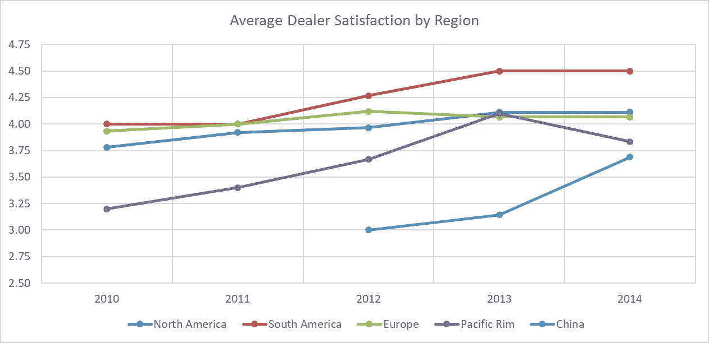

Figure 1: Average Dealer Satisfaction with PLE by Region

图 1(上图)显示了 PLE 运营的每个地区 5 年间的平均经销商满意度。这些评级是通过一项调查收集的，该调查允许受访者对他们对 PLE 的满意度进行 1-5 级评分，其中 5 级为最高满意度。对收集的数据进行加权平均，得出上图。我们可以看到，南美经销商对 PLE 的评价一直是最高的，而中国经销商的评价往往是最低的。南美和欧洲市场对该公司的历史评级约为 3.75-4.00，变化不大。环太平洋地区在过去 5 年中取得了最大的进步，平均评分从 2010 年的不到 3.25 上升到 2013 年的超过 4.00。虽然 2014 年的平均评级略有下降，但所有其他市场的评级都保持或高于 2013 年。

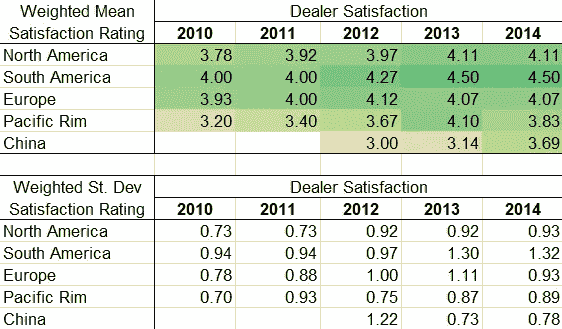

Table 1: Average Satisfaction from Dealers by Region and Year

表 1 显示了从经销商处收集的满意度评分的平均值和标准偏差，评分等级为 1-5。我们可以看到，除了欧洲，所有地区的收视率每年都有所提高。例如，北美在 2010 年的平均评分为 3.78，到 2014 年增加到 4.11。尽管中国最初的平均评级较低，但评级仍从 2012 年的 3.00 提高到 2014 年的 3.69。欧洲将其平均评级从 3.93 提高到 4.12，但随后在 2013 年略微下降到 4.07。大多数区域的标准偏差也逐年增加，表明对调查的回应值范围更广。这表明回答中有更多的可变性，但平均值的增加表明数值趋向于更高的等级。

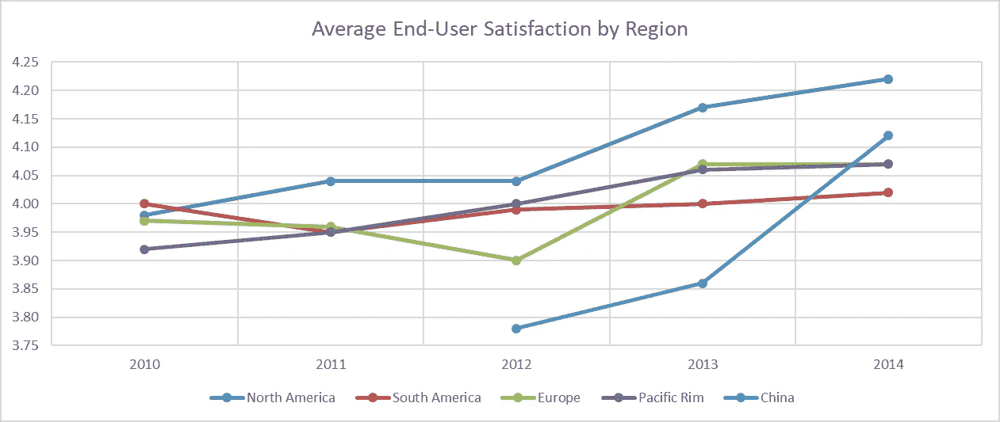

Figure 2: Average End-User Satisfaction with PLE by Region

图 2(上图)显示了从发送给 PLE 产品最终用户的类似调查中收集的数据。本次调查的数据也被收集和加权，以创建按年份和地区的平均值，其中 5 被认为是最高满意度。总体而言，最终用户的满意度比经销商调查显示的要高。在这个数据集中，北美市场的排名几乎每年都在上升。南美通常在最终用户满意度方面排名第三或第四，2014 年，它在所有市场中排名最低，平均得分为 4.11。与平均经销商满意度相似，中国终端用户市场的满意度往往最低。南美和环太平洋地区每年的趋势都很接近，从 2011 年到 2013 年，差异不到 0.05。欧洲的变化可能是多年来最大的，从 2012 年的低点 3.90 增加到 2013 年的高点 4.07。

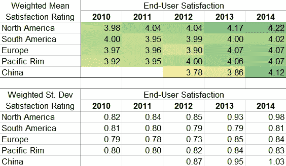

Table 2: Average Satisfaction from End-users by Region and Year

表 2 提供了类似的信息，尽管是从最终用户调查中收集的。尽管南美市场在 2010 年至 2011 年期间略有下降，但每个地区在 5 年期间的总体增长都有所增加。从 4.0 的平均评分开始，南美的评分在 2011 年下降到 3.95，然后在 2012 年回升到 3.99，随后几年稳步上升。2010 年后，北美地区在 PLE 服务区域中得分最高，2014 年的平均得分为 4.22。

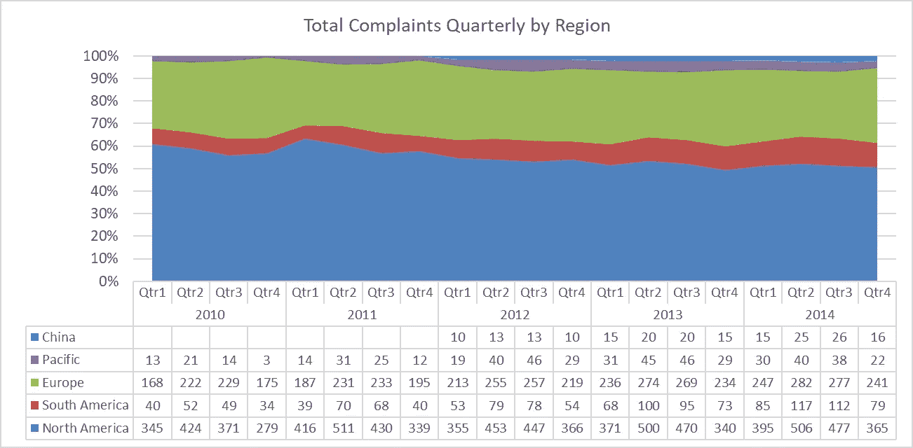

Figure 3: Total Complaints Filed Quarterly by Region

上图 3 详细显示了每个地区每个季度受理的投诉数量。北美市场始终占向 PLE 提交的所有投诉的至少 50%,有时占 60%。北美市场也是最大的市场，这可能解释了为什么来自该市场的投诉量最大。从 2011 年开始，来自南美市场的投诉比例逐渐增加，而来自欧洲市场的投诉量相对稳定。我们还可以确定中国在 2012 年进入该市场的时间，因为在第一季度，新市场开始出现投诉。

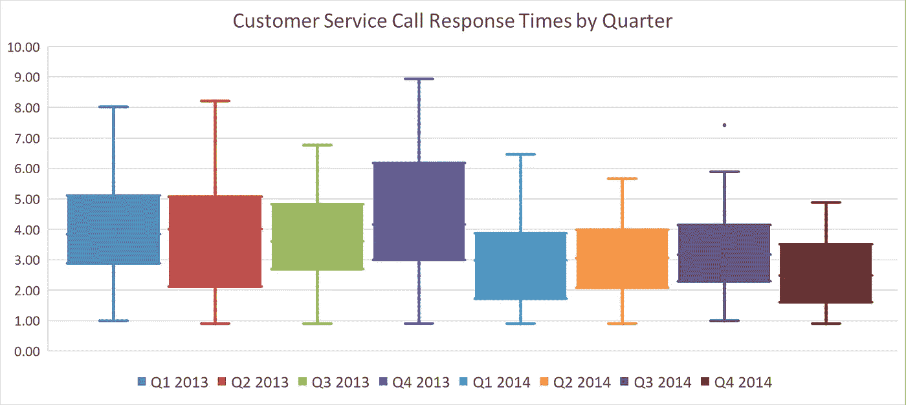

Figure 4: Customer Service Call Response Times by Quarter

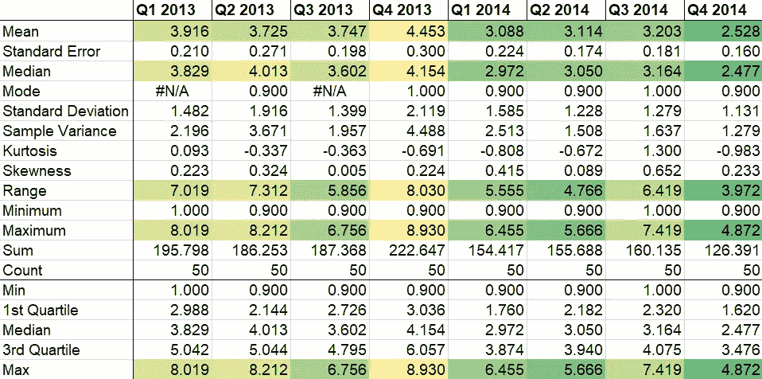

Table 3: Response Times to Customer Service Calls by Quarter

最后，图 4 和表 3 强调了客户服务部门的平均呼叫响应时间。此指标有 2 年的数据，按季度细分。乍一看，我们可以看到，从 2013 年 Q1 奥运会(3.829)到 2014 年第四季度(2.477)，平均响应时间有所缩短。两年来，四分位距也有所改善；2013 年，75%的响应时间在 2.988 到 5.042 之间。到 2014 年第 4 季度，75%的响应时间在 1.62 到 3.476 之间。2014 年第四季度记录的最长时间为 4.872，而 2013 年 Q1 的最长时间几乎是 8.019 的两倍。虽然时间全面下降，但 2014 年第三季度有一个异常值为 7.419，远远超出第三个四分位数范围 4.075。

# 米 **市场表现**

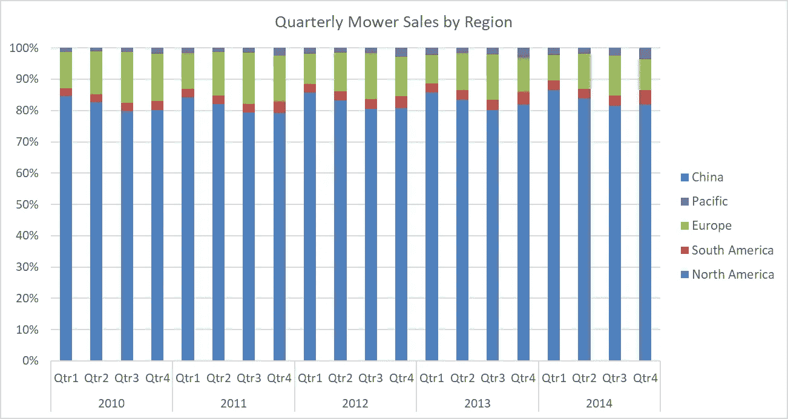

Figure 5: Total PLE Mower Sales each Quarter by Region

图 5 和图 6 分别显示了各地区割草机的季度销售情况。图 5 显示大多数 PLE 割草机在北美市场销售。通常，在任何给定的季度中，超过 80%的割草机销量来自北美市场。欧洲是第二大消费市场，平均每个季度约占 10-15%。南美占比不到 5%，环太平洋地区和中国占比更低。我们还可以看到每年北美和欧洲市场之间的购买模式。北美市场的销售额在第一和第二季度有所增长，而欧洲市场在第三和第四季度有所增长。

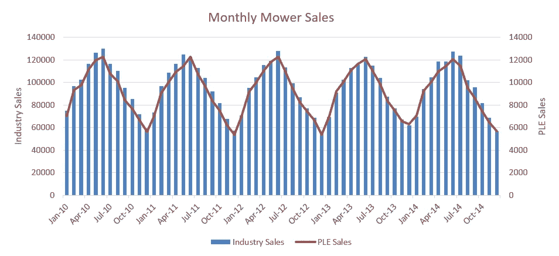

Figure 6: Monthly Mower Sales by PLE and Industry

图 6 显示了 PLE 和整个行业割草机销量的比较。割草机的销售几年来一直很稳定，没有太大变化。然而，每年的这个时候都会有一个明显的周期:销售额通常会在夏季达到最高，然后随着时间的推移而下降。PLE 和整个行业的销售都受到这一趋势的影响，如下图所示。通过分析 5 年间的销售数据，我们可以计算出 PLE 和行业割草机销售之间的相关性约为 0.9904。这表明在每次销售上升和下降之间有很强的关系。

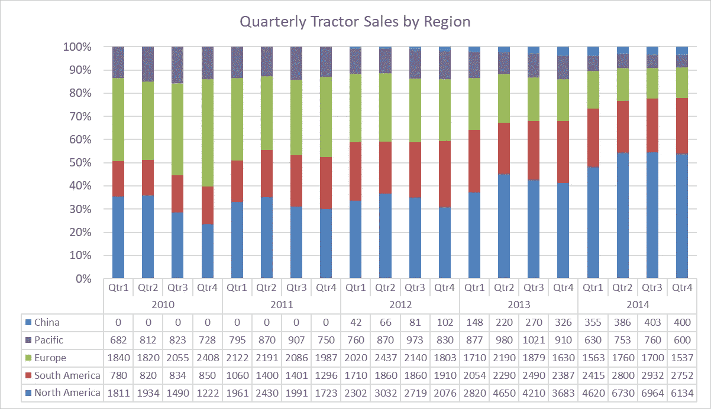

Figure 7: Total PLE Tractor Sales each Quarter by Region

图 7 显示了类似的拖拉机销售数据，尽管结果大相径庭。北美市场通常只占 PLE 拖拉机销售的 30-40 %,而不是像割草机销售那样主导市场。欧洲在这些销售中占有较大份额，每个季度占 30-35%。南美和太平洋地区平均各占季度销售额的 10-15%。在过去几年中，欧洲的拖拉机销量下降，而北美的销量上升。南美市场的销量也有所增加，在 PLE 拖拉机销量中占据了更大的份额。

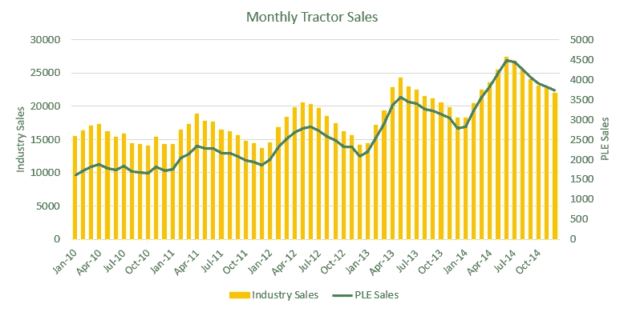

Figure 8: Monthly Mower Sales by PLE and Industry

同样，我们可以观察 PLE 和拖拉机销售行业之间的关系。图 8 追踪了拖拉机在同一 5 年间的销售情况。像割草机一样，拖拉机的销售往往会随着每年月份的变化而起伏。然而，与割草机的趋势不同，拖拉机的销量每年都在稳步增长。2010 年 7 月，行业销量达到 15，905 辆，2011 年 4 月增加到近 19，000 辆，最终在 2014 年 6 月达到 27，374 辆的峰值。尽管 PLE 的销售数据只是一小部分，但它们从 2011 年开始就遵循了大致相同的趋势。销量从 4 月份的 2340 辆逐步增长到 2014 年 6 月创纪录的 4476 辆。PLE 和行业拖拉机销售之间的相关性略低于割草机销售，为 0.9603，但它仍然表明两者之间的密切关系。

# 扩张成本

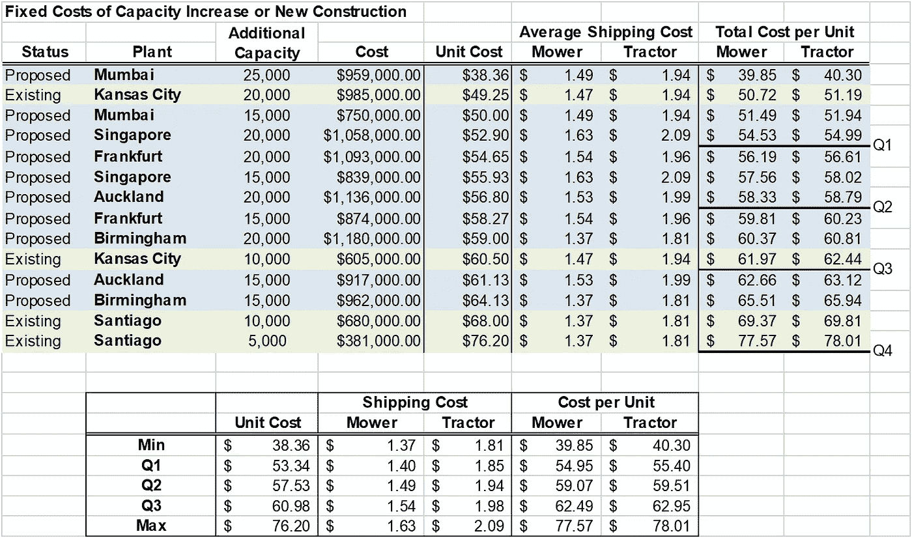

Table 4: Fixed Costs of Capacity Increase versus New Facility Construction

上表探究了在堪萨斯城和圣地亚哥新建工厂和扩建现有工厂的成本。通过将总施工成本分解为施工后的新单位成本，我们可以更容易地比较每个方案的价值。这考虑了每项提案需要收回多少成本。考虑到每个地点的新成本和平均运输成本，我们可以看到割草机的单位成本从 39.85 美元到 77.57 美元不等，拖拉机的单位成本从 40.30 美元到 78.01 美元不等。第一个四分位数分别为 54.95 美元和 55.40 美元，第三个四分位数分别为 62.49 美元和 62.95 美元。

根据第一张表中的数据，最有价值的项目(或新项目单位成本最低的项目)最有可能是孟买和新加坡的新工厂。孟买的两项提议都属于第一个四分位数，这意味着它们属于 25%最便宜的提议。将堪萨斯城的容量扩大到 20，000 也属于第一个四分位数，使其成为最便宜的升级选项。圣地亚哥的其余升级选项超过了第三个四分位数，成为成本最高的 75%的项目之一。第四个四分位数，也称为第 100 个百分位数，等于数据集中的最大值。在这种情况下，将 Santiago 的容量升级到 5，000 将导致最高的单位成本以收回成本。

# 业务运营效率

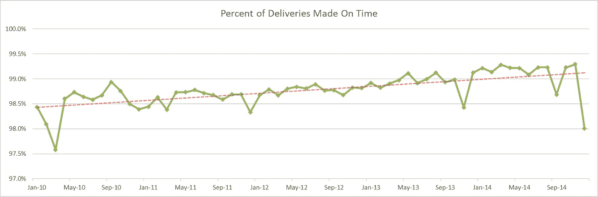

Figure 9: Ratio of Deliveries Made On Time by Month

我们可以在图 9(上图)中看到 4 年间的准时交付率。2010 年 3 月达到最低点，1 116 次交付中有 27 次没有按时交付，导致从 98.1%降至 97.6%。2010 年 9 月是一个明显的高峰，当时 1223 次交付中只有 13 次延误。该月 98.9%的交付是准时的，这将保持到 2012 年 7 月的最高点。上面的红色虚线描绘了成功交付率每月逐渐增加的趋势线。虽然有一些明显的高点和低点，但大多数交付率遵循稳定的模式。

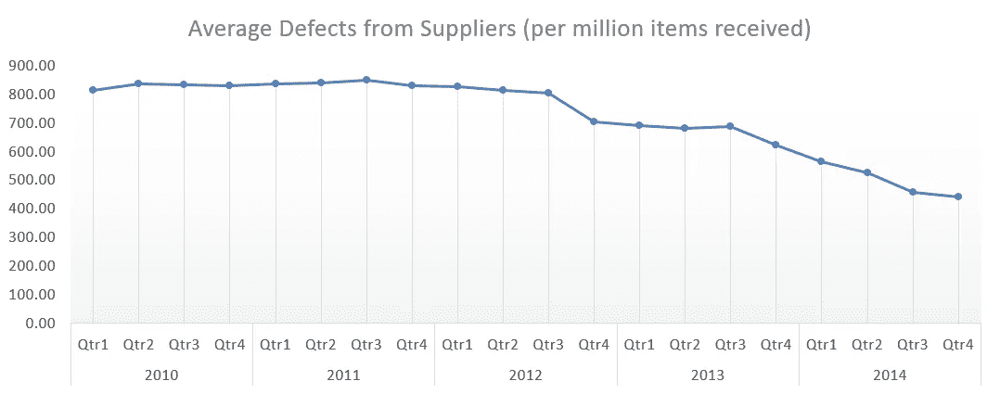

Figure 10: Average Defects from Suppliers Each Quarter (per million items received)

上图显示了每个季度从供应商处收到的缺陷数据。这些数字表明从供应商处收到的每百万件产品中平均有多少件是次品。最高时，PLE 平均每百万接收 848.33 个缺陷产品。从 2010 年 Q1 奥运会到 2012 年第三季度，缺陷产品的数量开始减少，类似的比率一直保持不变。到 2012 年第四季度，平均值为 701.33。2013 年略有下降，全年平均为 669 件。从 2013 年第四季度开始，次品率开始快速下降。2014 年每个季度平均下降 40–80 个，2014 年第四季度的平均缺陷率为 439.67 个。

# 割草机刀片生产

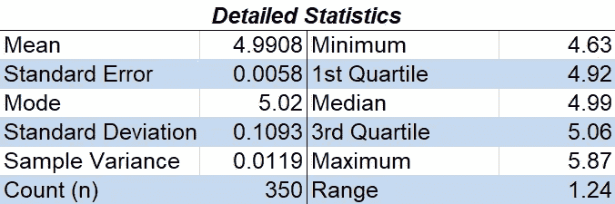

Table 5: Detailed statistics from mower blade tests

上表描述了收集的割草机刀片重量数据集。测试的 350 个叶片的平均重量约为 4.99，标准偏差为 0.1093。叶片重量几乎没有变化。50%的观察值落在 4.92-5.06 之间，范围只有 0.14；95%的观察值落在 4.77 到 5.21 之间。假设数据是正常的，有 2.78%的概率测得的体重超过 5.2。类似地，4.04%的测量值预计低于 4.8。在收集的数据集中，2%的权重在 5.2 以上，2.29%的权重在 4.8 以下，分别相差 0.78%和 1.76%。

查看下图，我们可以进一步确认重量通常在严格的规格范围内。几乎所有的测量值都在 4.7 和 5.3 之间，有两处异常。画一条平均体重线，我们得到的斜率为-7e-5，以-0.00007 的微小速度下降。虽然有一个负斜率，但它小到可以忽略不计。我们可以有把握地假设刀片将继续以 5.00 的稳定平均重量生产。

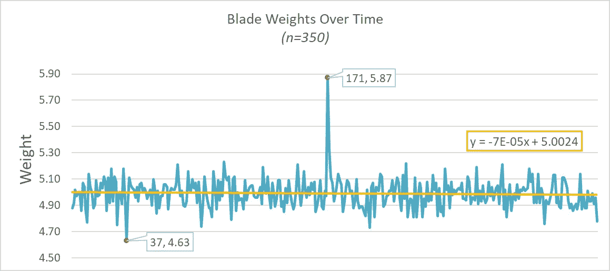

Figure 11: Mower blade weights over time

总的来说，我们可以假设刀片制造过程是稳定和可预测的。然而，数据集中有两个异常值。发现 37 号叶片为 4.63，略高于平均值的 3 个标准偏差。样品 171 被记录为 5.87，这大大超出了任何值的预期范围。这可能是由许多问题造成的，如个别缺陷、材料问题或测量或记录值的错误。因为平均值、中值和众数都是相似的值，并且这些值均匀地分布在平均值的两侧，所以正态分布是该数据的最佳拟合模型，如下直方图所示。

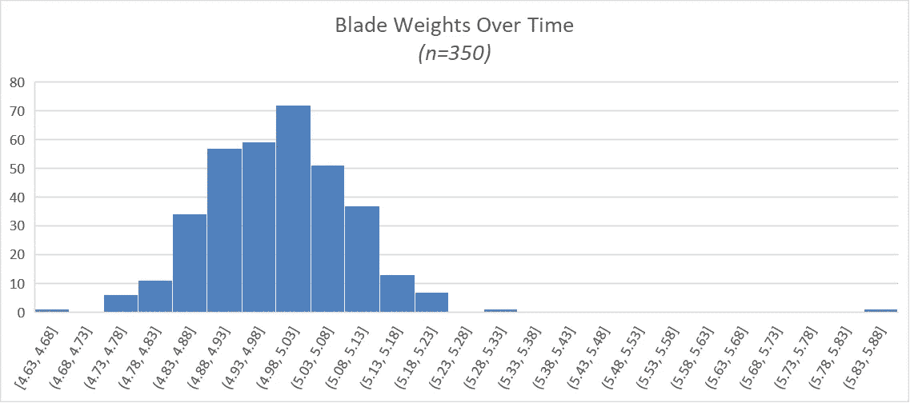

Figure 12: Histogram of blade weights over time

在最后一个实验中，下图 13 中的指数分布显示了割草机测试的结果。这种方法最好地显示了 30 次测试中每一次有多少次失败的频率，每一次测试随机抽样 100 台割草机。总的来说，被观察的 3000 台割草机中有 54 台没有通过测试，约占 0.18%。我们可以看到不到 15%的测试报告没有失败，而大多数测试报告了一两次失败。大约 35%的样本报告 1 次故障，大约 38%的样本报告每 100 台割草机 2 次故障。2 次之后，这一比例急剧下降，只有 15%的测试报告 3 次失败。100 个割草机样本中，没有一个测试报告超过 5 次故障。根据收集的数据，我们可以估计接下来测试的 100 台割草机中大约有 2.07 台会出现故障。

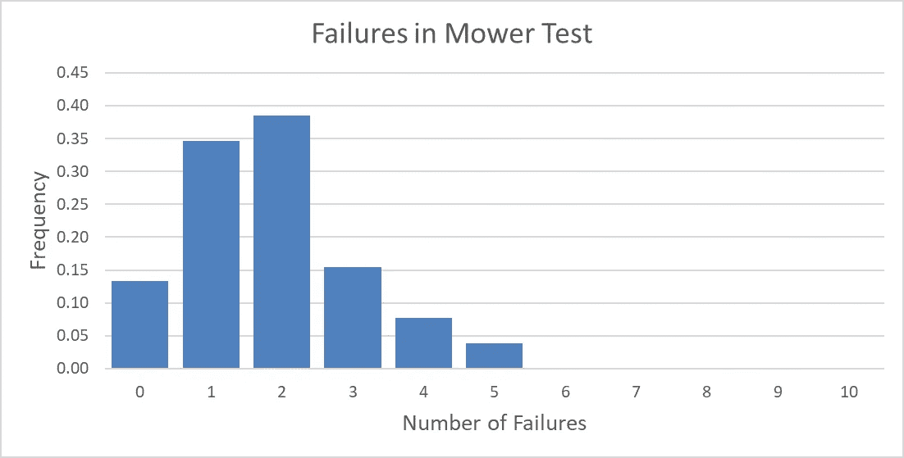

Figure 13: Failures in mower blade tests