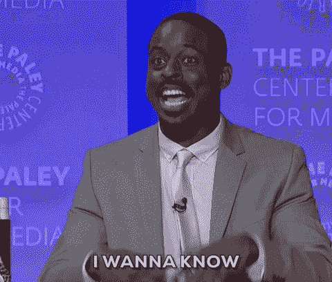
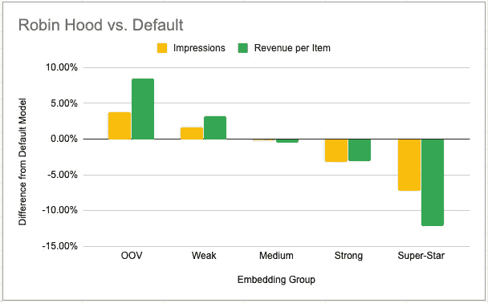
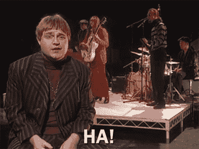

# 表演探索，罗宾汉风格

> 原文：<https://towardsdatascience.com/performing-exploration-robin-hood-style-da1369114300?source=collection_archive---------35----------------------->

## 如何对全新的产品进行有价值的探索，只需要简单的嵌入技巧

***本帖原载于*** [***Taboola 的工程博客***](https://engineering.taboola.com/) ***。***

我们在 Taboola 的核心业务是为网上冲浪者提供个性化的内容推荐，无论他们可能在哪里冲浪。我们使用最先进的深度学习方法来做到这一点，从我们不断增长的文章和广告池中学习向每个用户显示什么。但是，当我们挑战自己展现更好的模型和更好的预测时，我们也发现自己经常面临另一个问题——我们如何不听从我们的模型。或者换句话说:我们如何更好地探索？

正如我刚才提到的，我们的文章池正在*增长*，这意味着每分钟都会添加越来越多的项目——从人工智能的角度来看，这是我们必须解决的一个主要问题，因为当我们完成新模型的训练并将其推向生产时，它已经必须处理其训练数据中从未存在的项目。[在之前的一篇文章](https://medium.com/@shakedzy/going-old-school-designing-algorithms-for-fast-weighted-sampling-in-production-c48fc1f40051)中，我已经讨论过我们如何使用加权抽样来允许对低点击率(点击率)的项目进行更多的探索，同时尽量不损害高点击率项目的流量。在这篇文章中，我将进一步扩展这个困境，并讨论我们如何允许对我们的模型从未见过的项目进行有意义的探索。

## 理解嵌入和 OOV

理解嵌入的使用——以及它们代表什么——是理解所讨论的探索方法的关键，所以让我们简单回顾一下它们是如何工作的。嵌入是模型学习的一组权重(或更简单地说，一个向量)来表示输入要素的特征。假设我们有两个项目，其中项目 A 在生活在美国和加拿大的 20 到 30 岁的游戏玩家中非常成功，项目 B 在生活在欧洲德语国家的 30 到 40 岁的烹饪爱好者中非常受欢迎。模型应该在哪里存储这些学习到的信息？当然是在每件物品的嵌入物中！因此，嵌入是模型已经学习的特定于值的向量，它允许模型区分彼此，并更准确地估计它们的性能。对于我们的每个项目，模型学习一个新的向量。如果我们的模型训练正确，另一个项目是成功的项目 A 的人群将有一个嵌入向量，这将是接近他在我们的向量空间。

但是，假设我们的训练数据有另一个项目，项目 C，这是如此之新，它只出现在训练数据一次。这种单一的外观是否足以让模特了解这件物品的任何信息？当然不是。所以为它创建嵌入是没有意义的——因为它显然只是噪声。然而，我们仍然需要一个嵌入，所以我们应该怎么做呢？

每当我们构建一个特性的嵌入时，我们决定每个值必须具有的最小外观的阈值，以便有它自己的嵌入。出现次数少于所需阈值的所有值随后被聚集，并用于构建将用于所有这些值的单个嵌入。这种嵌入被称为词汇外嵌入(OOV)，因为它用于所有没有进入具有自己嵌入的值列表(或词汇)的值。此外，OOV 嵌入还用于所有全新的项目，这些项目是该模型从未见过的。

很容易理解为什么 OOV 嵌入对任何值都是有害的。它是由许多许多完全不同的价值观构成的，这些价值观很少相互关联。这意味着 oov 通常是嘈杂的，并且具有非常低的 CTR 估计值——即使这些项目没有任何问题，但它们只是在模型训练时显示得不够。

但这里有一个恶性循环——如果一个新项目由于缺乏外观而接受了 OOV 嵌入，它将得到模型非常低的 CTR 估计——这又不会允许它接受许多外观。这可能会使模型坚持它总是显示的相同项目，这对我们不好。所以… *我们该去舍伍德森林了！*

## 罗宾汉探险

我们在 Taboola 最重要的目标之一是预测用户是否会点击我们展示给他们的项目。因此，我们的训练数据由我们展示的所有项目(也称为*印象*)和用户的反应(点击与否)构成。由于我们展示某个项目的次数与其收到的点击次数之间存在明显的正相关关系，因此很容易看出我们最畅销的项目也是在我们的训练数据中出现次数最多的项目。这意味着这些也是具有最强大和训练有素的嵌入的项目。

因此，我们在这里做的技巧非常简单——就像嵌入有一个最小的外观阈值，低于它的值会变成 OOV，我们给外观添加了一个*最大阈值*，高于它的值*也会变成 OOV。我们对其进行了调整，因此只有最顶端的项目会超出此阈值，并将被添加到 OOV 存储桶中。这为我们提供了一个由我们拥有的最赚钱的项目组合而成的 OOV——所以现在所有的新项目都接受了一个超级强大的嵌入，这使得该模型给它们更高的 CTR 估计值。我们将这种方法命名为*罗宾汉探索*，因为我们从我们最好的项目中“窃取”数据，并将其移动到我们的 oov 中。*

是的，它确实有效:

*与我们的默认模型相比，罗宾汉方法的不同嵌入组的印象(黄色)和收入(绿色)。*

罗宾汉方法的表现符合预期——我们的 oov 和弱势嵌入群体获得了更多的流量，也产生了更多的收入，但这是以牺牲我们的畅销书为代价的。中等强度的嵌入几乎没有变化。减少畅销书的流量是我们在影响有限流量时可以处理的事情——我们在这里的目的是进行*探索*，也就是给*新品*增加流量，没有必要对我们的畅销书进行探索——我们已经知道它们是我们的畅销书。还有更好的消息:当谈到我们的总收入时，这种方法绝对没有显示出任何负面影响。

总之，我们的 Robin-Hood 方法(将数据从顶层项目转移到 oov)已被证明是以最少的技术努力进行有意义的探索的一种有价值的方法。我们希望它也能证明它对我们的读者是有价值的。一路平安！