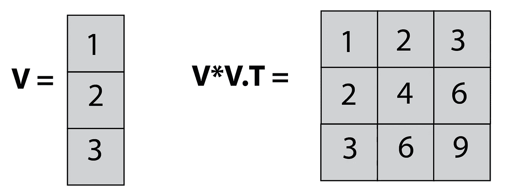
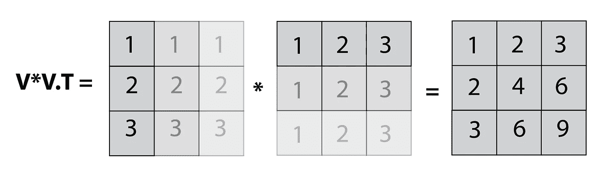
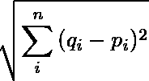
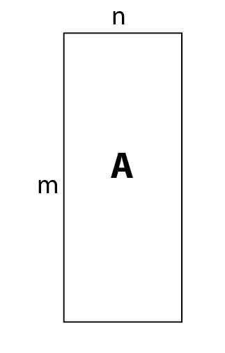
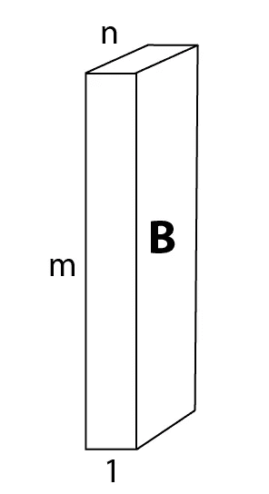
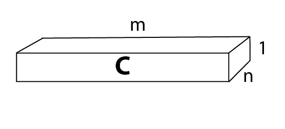
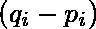
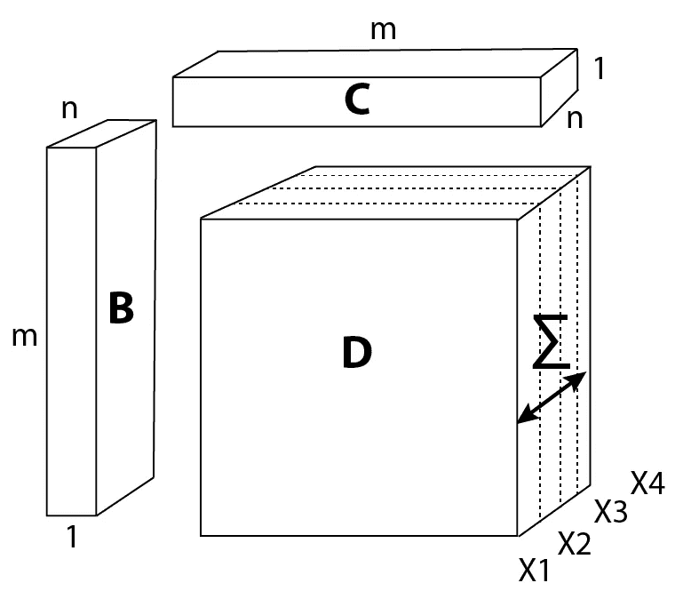
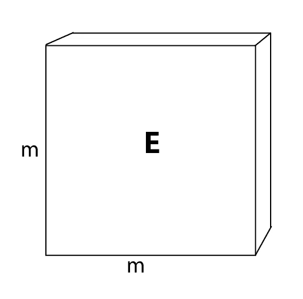

# 使用 Numpy 广播执行多维矩阵运算

> 原文：<https://towardsdatascience.com/performing-multidimensional-matrix-operations-using-numpys-broadcasting-cf33e3029170?source=collection_archive---------13----------------------->

Tensor manipulation…

Numpy 的 [broadcasting](https://docs.scipy.org/doc/numpy-1.13.0/user/basics.broadcasting.html) 特性可能会让这个库的新用户有些困惑，但它允许非常干净、优雅和有趣的编码。绝对值得努力去习惯。在这篇短文中，我想展示一个很好的广播实现来节省一些循环甚至计算时间。

先说一个简单的案例。

基本概念是，当两个大小为 *(m，1)* 和 *(1，m)* 的向量相加或相乘时，numpy 会广播(复制向量)以便允许计算。例如，将一个向量*【1，2，3，4，…10】*乘以其自身的转置版本，将得到乘法表。例如:

Broadcasting a vector into a matrix. A miniature multiplication table.

在这个例子中，我们将一个大小为 *(3，1)* 的一维向量(`V`)与其大小为 *(1，3)* 的转置版本相乘，得到一个 *(3，3)* 矩阵，它是`V`的[外积](https://en.wikipedia.org/wiki/Outer_product)。

如果您仍然感到困惑，下图将该过程分为两个步骤，使其更加清晰:

Broadcasting in slow motion.

你可以把广播想象成简单地把我们的两个向量复制成一个 *(3，3)* 矩阵，然后执行元素式乘法。

我们刚刚将一个一维数组广播到一个二维矩阵中，然而，我们可以用它将一个二维数组(或矩阵)广播到一个三维数组(张量)中。想象一下，您需要对相同长度的多个向量执行`V*V.T`。你可以简单地把它们堆在一起，然后一次性得到所有的结果。

# 个案研究

在这种情况下，我希望为[虹膜数据集](https://en.wikipedia.org/wiki/Iris_flower_data_set)生成一个欧几里德距离矩阵。欧几里得方程是:

显然，可以使用两个嵌套的 for 循环来获取表:

然而，它也可以使用矩阵运算来执行(这两种运算都要快 100 倍，而且要酷得多)。

我们取数据集(图中表示为`'A'`)，

A rectangle representing the iris data set, in which case m=150 and n=4.

创建它的 3D 副本，并将其旋转到图中所示的方向`'B'`。

We can use numpy’s rot90 function to rotate a matrix. See code below.

然后我们创建另一个副本并旋转它，如`'C'`所示。

Copy and rotate again.

`B-C`将生成(通过广播！)一个 3D 立方体(`'D'`)，大小为 *(m，m，n)* ，代表计算

对于原始数据集向量( *n* =4)的每个实例( *m* )和特征( *n* )。

Notice that we are summing up the features for all instances at once!

然后，我们简单地将整个立方体提升到 2 的幂，将代表特征的轴上的结果相加(见上图)，然后平方。

结果就是距离矩阵(`'E'`)！

This is the Euclidean distance matrix. It might seems like it only contains the letter ‘E’, but in fact it holds the distance between all instance pairs. Twice. The diagonal is the distance between every instance with itself, and if it’s not equal to zero, then you should double check your code…

如果你在所有这些矩阵的翻腾中迷失了，回头看看计算欧几里得矩阵的方程。我们所做的就是同时求解几个向量的方程。

# 代码:

# 摘要

每当在几个实例上执行相同的计算时，广播是一种非常干净有效的方法。作为一个练习，我鼓励你尝试在 2 个 3D 阵列上使用广播(假设你有 *n* 个向量，属于 *k* 个类)。这意味着你将需要广播到第四维度。当然不可能[想象](https://www.youtube.com/watch?v=N7K5KjOdLD8)，但是实现它遵循同样的逻辑。