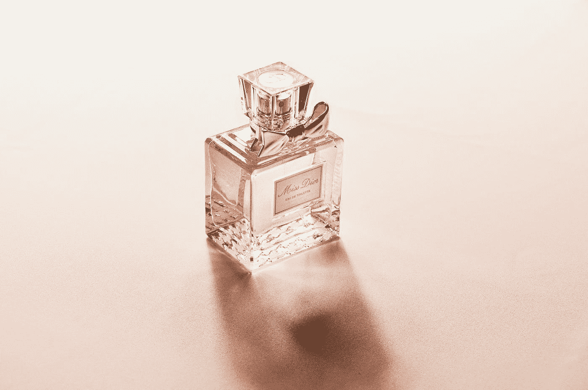
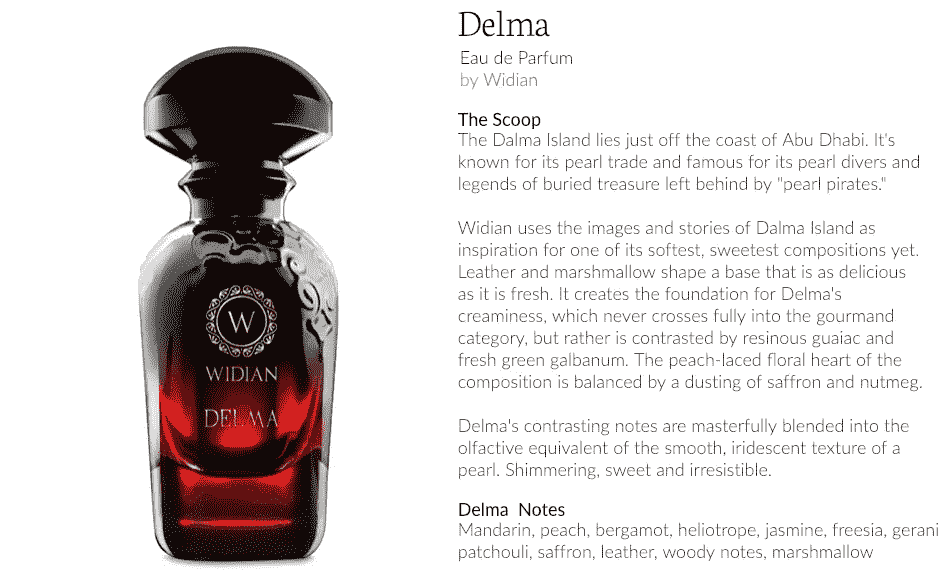
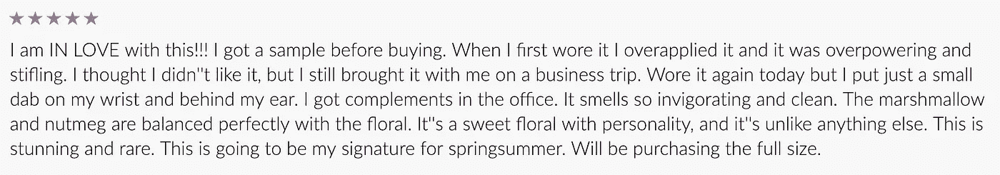
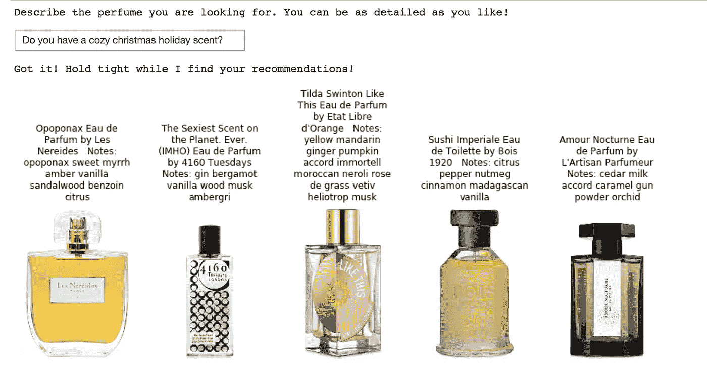
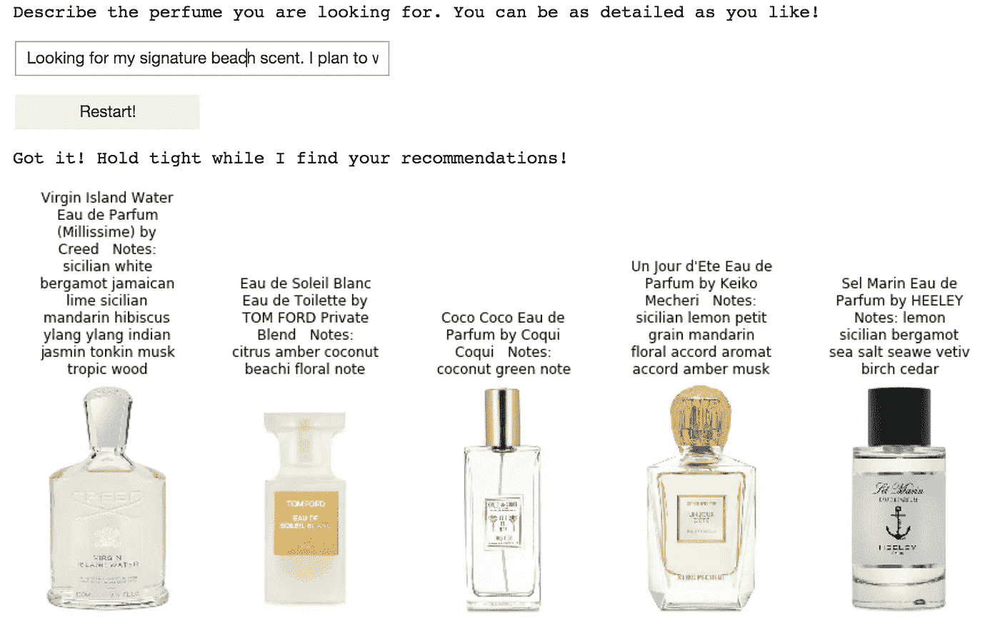
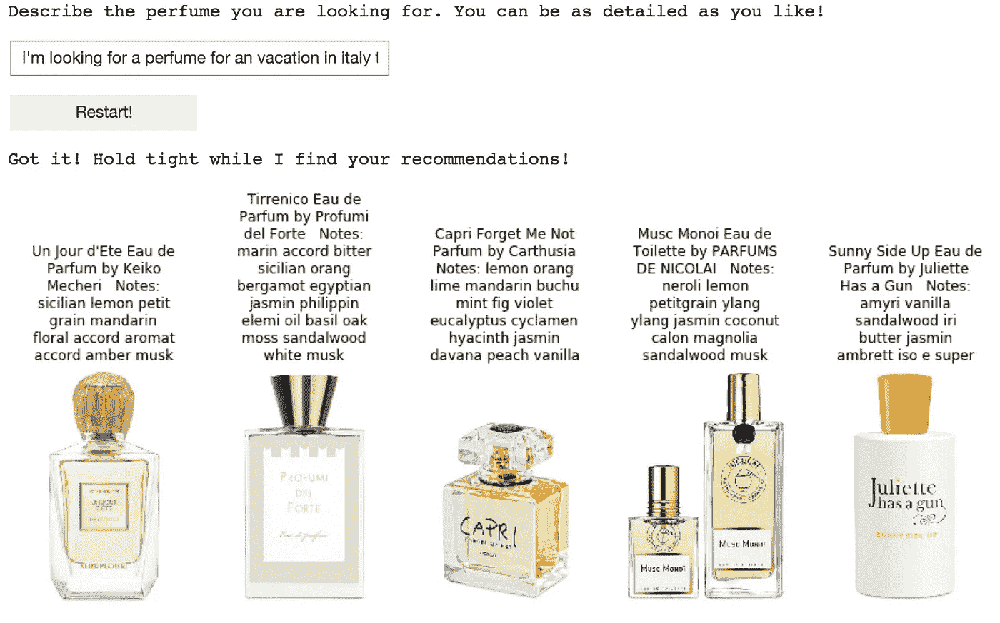
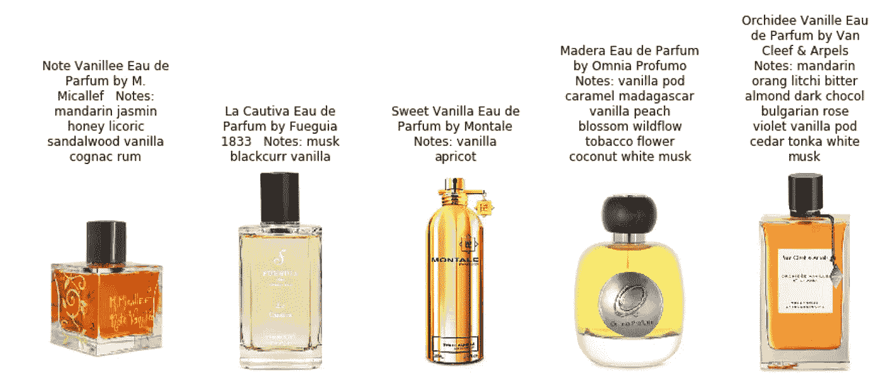
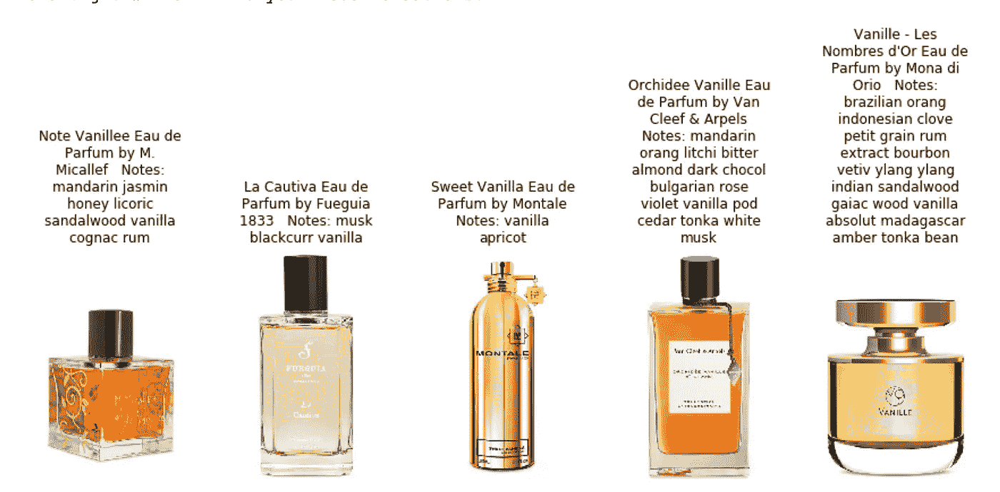

# 使用自然语言处理的香水推荐

> 原文：<https://towardsdatascience.com/perfume-recommendations-using-natural-language-processing-ad3e6736074c?source=collection_archive---------13----------------------->

## Doc2Vec、潜在语义分析和情感分析一起在聊天机器人界面中提出相关建议。

Photo by [Jessica Weiller](https://unsplash.com/@jweiller?utm_source=medium&utm_medium=referral) on [Unsplash](https://unsplash.com?utm_source=medium&utm_medium=referral)

# 介绍

(如果你想尝试这种模式，你可以通过发短信“嗨”到(424)343–3755 来开始。你自己的个人 AI 聊天机器人会回复，会帮你发现个性化的香水推荐。)

自然语言处理在推荐系统和信息检索中有许多有趣的应用。作为一名香水爱好者和数据科学家，小众香水社区中使用的不寻常且高度描述性的语言启发我使用 NLP 来创建一个模型，以帮助我发现我可能想要购买的香水。“小众”香水是由小型精品香水公司制造的稀有香水。类似于葡萄酒，有一个围绕着小众香水的整个亚文化，它有自己的诗歌词汇，非常适合 NLP！

我希望这个模型做两件事:

1.  我希望能够描述一款香水，并根据我的描述获得相关推荐。由于所使用的建模方法，也由于香水的语言如此丰富，该模型可以推荐与情绪、感觉、个性或度假等事件的描述相匹配的香水
2.  把情绪考虑进去。我希望能够描述我不喜欢的东西以及我喜欢的东西，并且仍然能够收到相关的推荐。

# 数据

我写了一个 python 脚本，从一个流行的小众香水网站上收集数据。他们似乎并不介意。；-)

我收集了三个文本数据源，并把它们连接到每种香水的一个文档中:

*   描述
*   复习
*   香水中的香调列表

下面是我个人最喜欢的香水 Delma 的三个文本数据源的例子。

# 一些有趣的结果！

我用一个集成了 Doc2Vec 和潜在语义分析(LSA)的模型在 python 笔记本中创建了一个聊天机器人界面。Doc2Vec 和 LSA 表示潜在空间中的香水和文本查询，然后使用余弦相似度来匹配香水和文本查询。最相关的前五种香水作为推荐返回。

这是一个与聊天机器人互动的例子。对圣诞节香水的简单查询会返回五种适合季节的香水。这一请求的第一款香水有非常切题的没药味！

Christmas perfume recommendations

这里有几个更有趣的例子:

The query *“Looking for my signature beach scent. I plan to wear it to the beach or pool”* returns perfumes with notes of seasalt, coconut, and seaweed. My own beach scent, Eau de Soleil Blanc by Tom Ford, appears second on the list! I can attest that this perfume does smell like a day at the beach on a tropical vacation!

The query *“I’m looking for a perfume for a vacation in Italy to a small Italian island.”* returns perfumes with Sicilian orange and lemon, and a perfume from a perfume house Carthusia called capri.

# 为什么感情如此重要？

考虑这条聊天机器人消息。“我喜欢桃子和梨。酒鬼香草甜味美食家。”

注意第四种推荐的香水有椰子和烟草的味道。如果我讨厌那些笔记怎么办？我更新了我的查询以包含这个信息，并得到了一个更新的推荐列表。*“我喜欢桃子和梨。醉人的香草甜味美食家。我不喜欢烟草，或者椰子。”*

第四款香水从推荐中消失！

# 模型

该模型的第一步是从聊天机器人消息中识别每个句子的情感。我用 VADER 来做这件事。(超级好用，给了我很大的效果。如果你有一个想使用情感分析的项目，我强烈推荐你尝试一下。)我把所有正面和中性的句子串联成一串，所有负面情绪的句子串联成另一串。我现在有两个文件可以用来寻找类似的香水。

这些香水有文字描述、评论和注释列表。该模型由两个文档嵌入组成，一个来自 LSA，另一个来自 Doc2Vev。为了训练 LSA 和 Doc2Vec 模型，我将每种香水的香水描述、评论和注释连接到一个文档中。然后，我使用余弦相似度来查找与聊天机器人消息查询中的肯定句和中性句相似的香水。我删除了与否定句相似的香水推荐。

为了计算聊天机器人消息和香水文档之间的余弦相似性，我分别从 LSA [嵌入](https://arize.com/blog-course/embeddings-meaning-examples-and-how-to-compute/)和 Doc2Vec 嵌入中计算余弦相似性，然后对这两个分数进行平均以得出最终分数。

LSA 简单地用 TF-IDF 对文档中的单词进行了符号化，然后用 SVD 将这些特征压缩成嵌入内容。LSA 是一种单词袋(BoW)方法，意思是不考虑所用单词的顺序(上下文)。这就是弓形方法的缺点。然而，我已经看到许多 BoW 方法在实践中优于更复杂的深度学习方法，因此 LSA 仍然应该被测试并被认为是一种可行的方法。

Doc2Vec 是一种从文本文档中学习嵌入的神经网络方法。由于其体系结构，该模型考虑了文档中的上下文和语义。文档的上下文和单词之间的关系被保存在所学习的嵌入中。

通过将 Doc2Vec 与 LSA 捆绑在一起，我能够获得很好的一对一匹配，例如当我请求时返回玫瑰香水，我还能够利用语言的复杂性，并在我描述更抽象的东西(例如情绪或事件)时返回相关结果。

# 结论

如果你想尝试这种模式，并获得一些个性化的建议，你可以发短信给直播机器人(424)343-3755。聊天机器人是使用 Flask、Twilio 可编程 SMS、Airtable 和 AWS EC2 实例部署的。我的公共 github [repo](https://github.com/statisticianinstilettos/niche_perfume_chatbot) 上也有代码。

Using Twilio, I deployed this model as a chatbot sms service.