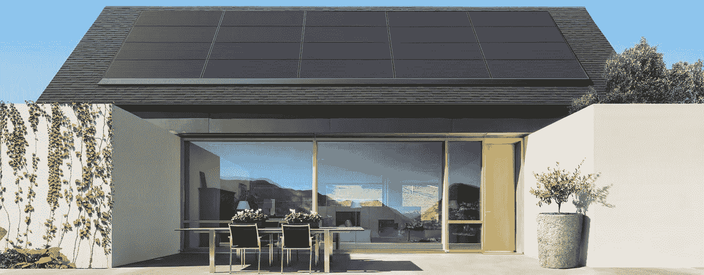
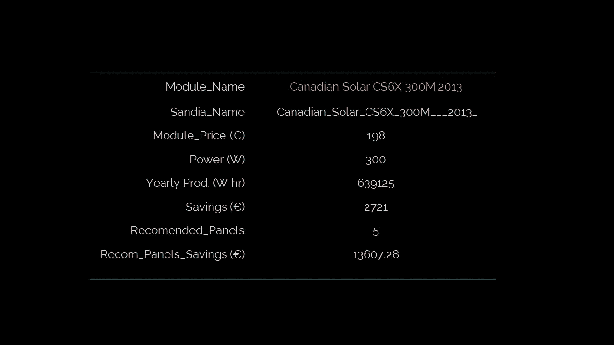

# 使用 Python 促进能源和经济发展

> 原文：<https://towardsdatascience.com/perkiertech1-2bf7f8d50e43?source=collection_archive---------11----------------------->

## 可再生能源在增强人民权能方面可以发挥关键作用。

我开发了一个工具来模拟 20 年的太阳能，并在我的城市波尔图用几个月平均电费进行了测试。目标是针对每个月的平均账单，给出最佳的太阳能解决方案(哪个和多少太阳能电池板，如果是电池，哪个电池是个好主意)，以最大化投资回报。这份报告对消费者或公司都很有用。

代码中最重要的部分可以在 [Github](https://github.com/perkier/Perkier.Energy) 查看。
查看下面这个项目的报告！



ELECTRIC AESTHETIC by Tesla

# 项目的相关性

这个项目的想法是在我试图思考如果我经营一家可再生能源公司我会做什么的时候产生的。当然，也有其他软件可以计算可再生能源的潜力，但都不是免费的、准确的，也不可能同时比较多个太阳能电池板。由于对可再生能源充满热情，我认为这将是 python 数据科学库的第一个完美项目。

# 工具

## Python、Numpy、Pandas 和 scikit-学习

说到科学计算和数据科学，两个关键的 python 库是 NumPy 和 pandas。

Numpy 在使用上有令人难以置信的优势:NumPy 是用 Python 和 C 编写的，因此 NumPy 数组比 Python 列表更快。然而，与 Python 列表不同，NumPy 数组不灵活，所有元素都应该是同一类型。

当谈到用 Python 分析数据时，Pandas 是一个相当大的游戏改变者。Pandas 接收数据(CSV 文件、SQL 数据库等。)并创建一个具有行和列的 Python 对象，称为数据框，它看起来非常类似于统计软件中的表(允许对数据结构进行数学运算，忽略数据结构的元数据，使用关系运算，并且很容易处理丢失的数据)。这通过提供数字表格和时间序列数据结构，实现了简单快速的数据分析和操作工具。

Scikit-learn 是一个强大而高效的数据挖掘和数据分析工具。该库专注于建模数据，是进行机器学习项目时使用的主要库之一。

## PVlib 和 Sandia 模块

PVlib python 是一个社区支持的工具，它提供了一组用于模拟光伏能源系统性能的函数和类。PVlib 是由桑迪亚国家实验室开发的，它实现了实验室开发的许多模型和方法。

桑迪亚国家实验室正在推动一个光伏(PV)专业人员协作小组(PV 性能建模协作或 PVPMC)。该小组对提高光伏性能模型和分析的准确性和技术严谨性感兴趣。此类模型用于评估当前绩效(绩效指数)并确定光伏发电项目的未来价值(以预测的发电量表示)，进而影响金融界如何看待光伏项目和技术的投资风险。

PVlib python 的源代码托管在 [GitHub](https://github.com/pvlib/pvlib-python) 上。

# 创建太阳能电池板价格数据库

> 本节用到的重要代码可以在 [Github](https://github.com/perkier/Perkier.Energy/tree/master/Code/Solar%20Panel%20DB) 上查看: [Function_Find_Panels](https://github.com/perkier/Perkier.Energy/blob/master/Code/Solar%20Panel%20DB/Functions_Find_Panels.py) ， [Find_Panels_DB](https://github.com/perkier/Perkier.Energy/blob/master/Code/Solar%20Panel%20DB/Find_Panels_DB.py) ， [Prices_aux](https://github.com/perkier/Perkier.Energy/blob/master/Code/Solar%20Panel%20DB/prices_aux.py)

由于缺乏关于桑迪亚数据库中太阳能电池板价格的信息，人们找到了新的方法来了解这些公司如何评估他们的产品。基于废弃的两个不同的太阳能电池板价格信息网站，创建了两个数据库。这两个网站有不同的相关信息:

DB1:品牌；太阳能电池板模型；最大功率；日常用电；效率；最小功率；每个面板的成本；生产国；保修；

DB2:品牌；太阳能电池板模型；权力；每个面板的成本；尺寸；重量；生产国

因为没有关于要测试的太阳能组件价格的明确或可用的数据。我必须创建一个插值方法，根据可供购买的电池板的价格、功率和年份来预测每个太阳能公司收取的每瓦特价格。

创建了一个新的数据库，将太阳能电池板品牌与其预测价格与 scikit-learn 库中的两种方法相关联:(1)线性回归方法——使用单个自变量来预测因变量的值；(2) Ransac 方法——一种迭代算法，用于从完整数据集的内联子集中稳健估计参数。


Example of Two Different Solar Panels Price Interpolation

从上面的图中可以看出，对于太阳能价格，两种回归方法并无不同。另一方面，LG 展示了一个非常有趣的案例，说明为什么应该选择 RANSAC 回归器来插值模块的价格。如果选择线性回归，则假设 LG 面板的价格随着功率的增加而下降，这没有多大意义。出于这个原因，RANSAC 回归器被选为插入太阳能组件价格。


根据我所能收集到的关于太阳能电池组件价格的最多信息，对两个数据库进行了比较(Sandia 模块和太阳能电池板价格),并根据比较结果对 35 块电池板进行了测试(见左侧表格)。
面板名称和 Sandia_Name 在左侧图像中带有“(…)”，以避免创建过大的表格。

# 能耗

> 本节用到的重要代码可以在 [Github](https://github.com/perkier/Perkier.Energy/tree/master/Code/Energy%20Consumption) : [消费 _FUNC](https://github.com/perkier/Perkier.Energy/blob/master/Code/Energy%20Consumption/CONSUMPTION_FUNC.py) ，[萨区 _ 消费](https://github.com/perkier/Perkier.Energy/blob/master/Code/Energy%20Consumption/sazonal_consumption.py)，[AC _ 助手](https://github.com/perkier/Perkier.Energy/blob/master/Code/Energy%20Consumption/AC_helper.py)上查看

消耗函数改编自[加州每小时电力负荷曲线](https://en.wikipedia.org/wiki/Duck_curve)。据推测，同样的曲线模式也适用于葡萄牙。来自图像的曲线通过绘图数字化仪包扫描，该数字化仪包将曲线转换成 x，y 坐标文本文件。

使用 numpy，我创建了一个函数来拟合我之前在 plot digitizer package 上标记的点。运行了几个具有不同回归度的 polifit 函数，发现误差较小的回归度为 n=15(见下图)


Duck Curve Polygonal Regressions

了解季节性消费模式也很重要。为此，葡萄牙能源月刊采用了同样的程序。

现在到了棘手的部分:
每天的变化必须符合每年的能源消耗变化。换句话说，每个月内的每日能量消耗必须与一年内每个月的变化进行核对。为此，我将每个值除以所有瓦特值的总和。这样，所有值的和就是一。

电力消耗的年度变化是不同的。与消费群中总和等于 1 不同，每 12 个值除以平均值是有意义的。这样就很容易将这些值乘以每月的平均账单。

通过 numpy 功能，创建了一个 24x12 的矩阵。在矩阵中，有每个月每个小时消耗的电力值(假设从同一个月开始的几天内没有消耗变化)。

最后，使用 pandas 库的日期范围(与 PVlib 中使用的相同)，为每小时的计算分配一个特定的电力消耗。

# 创建电池数据库

电池数据库是由三个提供电池信息和价格的网站组成的。


创建了一个包含 22 种电池型号的数据库。这些模型来自 AXITEC Energy、LG、SolaX Power、BYD、Tesla、PYLONTECH、VARTA 和 Enphase，存储在一个 csv 文件中，包含左侧示例中的信息。

# 能源和节能计算

> 本节用到的重要代码可以在 [Github](https://github.com/perkier/Perkier.Energy/tree/master/Code/Energy%20and%20Savings%20Calculation) 查看:[太阳能模块](https://github.com/perkier/Perkier.Energy/blob/master/Code/Energy%20and%20Savings%20Calculation/solar_modules.py)、[电池解释器](https://github.com/perkier/Perkier.Energy/blob/master/Code/Energy%20and%20Savings%20Calculation/Batt_interpreter.py)、[电池脚本](https://github.com/perkier/Perkier.Energy/blob/master/Code/Energy%20and%20Savings%20Calculation/Batt_Script.py)

为了确保尽可能准确的结果，计算是按小时进行的。太阳能电池板的能量是用一年中和几年内每小时的辐照度变化来计算的。以 20 年为时间线，单个面板的每一轮计算加上消费数据大约需要 40 秒。为所有电费计算所有电池板的产量将花费大量的时间。为了解决这个问题，我想用三个步骤来找到每月电费的最佳解决方案:

第一步——每块太阳能电池板都要进行测试，以对潜在的节约进行分类。计算出的节约量是第 2 步中计算出的实际节约量的近似值。
第 2 步——每个月平均账单的五个最佳潜在节约将成为第 2 步计算。在此阶段，将模拟精确节约。
步骤 3——对于每个月平均账单，将使用电池数据库中的每个电池测试步骤 2 中的两个最佳案例。

## 第 1 步—快速节约的结果

涉及太阳能电池板性能的第一次计算是使用 PVlib 库进行的。对于每个月的平均账单，计算需要多少太阳能电池板，以确保每个电池板装置的年产量至少足够接近年消耗量。

为每个太阳能组件安装创建了三个模型，以给消费者更多的选择并提高透明度。第一种，使用最接近的整数，即一个面板的年消耗量除以年能量所得的值(n=0)。第二种情况比第一种情况多一个面板(n=1)，第三种情况比第一种情况少一个面板(n=-1)。



每块太阳能板的节能量计算方法是，20 年内生产的能源乘以葡萄牙每千瓦时能源的价格，再减去太阳能板的价格。建议的太阳能电池板数量的总节约量，节约量乘以建议的太阳能电池板数量。对于每次安装，都会创建一个新的数据库。上表代表了月平均账单为 50€且 n=0 时的最佳情况。

## 步骤 2 —精确节约结果

第 1 步的结果是此阶段的基础。现在只计算前一阶段的五个最佳结果。

介绍了一种计算总节约量的新方法。在此阶段，为了提高精确度，每小时都会计算一次节省量。上面计算的消费函数参与其中。该方法包括计算节约额，即 20 年时间内不安装该装置所花费的资金、初始投资、仍需向电网购买的资金(主要是夜间)以及向电网出售电力所获得的资金之间的平衡(尽管在葡萄牙，该值仍比向电网购买电能低 4 倍)。

为了每小时计算太阳能电池板是否会产生满足消费者需求的能量，完全不产生或者甚至产生超过需求的能量，使用具有 175×316 个元素的 AC _ df(20 年中的小时数)的以下 for 循环:

```
for k in range(len(ac_df)):

    Grid_Power[k] = consumo[k] - ac_df.iloc[k].loc['Watt-hour']if Grid_Power[k] < 0:
        Grid_Buying_Power[k] = 0
        Grid_Selling_Power[k] = Grid_Power[k]if Grid_Power[k] > 0:
        Grid_Buying_Power[k] = Grid_Power[k]
        Grid_Selling_Power[k] = 0
```

同样，对于每个月的平均账单，计算了三种解决方案。


此步骤的最终结果显示了五个面板，并根据新的节约计算对它们进行了重新排序。在左图中，有月平均 75€(当 n=0 时)的最佳面板的最终信息。看完这些结果后，一个细心的人会说，这个面板上显示的结果根本不可能。不幸的是，在 20 年内购买 1129.6€的电力是不可能的。在葡萄牙，夏令时约为 40%。因此，如果没有电池，从电网购买的总电量将只有没有太阳能电池板时的一半。在其他几个面板上也发现了这一错误，这些面板已从计算中删除。

## 第 3 步—电池的节能效果

第 3 步计算考虑电池存储。节能计算与第 2 步类似，但这一次使用电池储存能量，以供夜间使用。预计在所有情况下，向电网购买的剩余电量将接近于零。

在这些计算中，使用了每个月平均账单的 2 个最佳面板(步骤 2)。

为了每小时计算能量产生和电池存储的平衡，使用以下 for 循环:

```
for k in range(len(ac_df)):if k == 0:
        batt_stock[k] = batt_aux + ac_df.iloc[k].loc['Watt-hour']
        -consumo[k]else:
        batt_stock[k] = batt_stock[k - 1] + 
        ac_df.iloc[k].loc['Watt-hour'] - consumo[k]
        Grid_Selling_Power[k],Grid_Selling_Power[k] = 0, 0if batt_stock[k] < 0:
            Grid_Buying_Power[k] = - copy.deepcopy(batt_stock[k])
            batt_stock[k] = 0if batt_stock[k] > Battery_Capacity_Wh[num]:
            Grid_Selling_Power[k] = batt_stock[k] -     
            battery_Capacity_Wh[num]
            batt_stock[k] = copy.deepcopy(Battery_Capacity_Wh[num])
            Grid_Buying_Power[k] = 0
```

最佳解决方案是根据最高的节约价值选择的。

# 结果

每个月平均电费的最终结果如下:


## 关于结果的注释

虽然结果非常精确，但还是做了一些近似:(1)每个太阳能电池板都被认为在 20 年的时间里有相同的 15%的效率损失([见这里的计算](https://github.com/perkier/Perkier.Energy/blob/master/Code/15percentlosses.py))；(2)计算中只使用了一个反演器。这可能会导致不同的结果，因为逆变器可以在特定类型的太阳能电池板上更好地工作；(3)没有考虑太阳能模块之间的能量损失。

# 最后的想法和结论

虽然一些从电网购买的太阳能电池板的价值出现了小的倒退，从计算中排除了一些太阳能电池板，减少了研究中太阳能电池板和品牌的数量，但这个项目的目标还是达到了。事实证明，太阳能电池板可以是一项伟大的长期投资，电池可以使这项投资更加有利可图。
我们可以在一段时间内消耗的瓦特小时数和你的房子需要的太阳能电池板数量之间画一条线。安装的电池板数量应该能够在同一时间段产生该功率。这样，太阳能装置将产生 200%的情感利润和 400%的真实的金钱利润。

可再生能源是赋予新一代人权力的一个很好的方式。平均每年节省 620€可以是人们生活中的一大飞跃，通过明智的投资，节省下来的电费可以成为企业家和公司的游戏规则改变者。

# 后续步骤

这篇文章标志着第一个 perkier.tech 项目。
perkier.tech 创建创新的工程项目，旨在帮助世界变得更美好，同时让我研究和学习新的东西。


perkier.tech logo

该能源项目的下一步将是利用微电网和区块链技术创建一个独立于电网的小型社区，同时实施新的发电方式(即小型风力涡轮机)。

在接下来的几个月里，我将学习更多关于智能电网和区块链电码的知识。

欢迎反馈和建议！我很想听听你关于如何实施创新工程的新想法。

你可以在 diogoncsa@gmail.com 找到我或者在 LinkedIn 找到我