# 持续同源:一个带有例子的非数学介绍

> 原文：<https://towardsdatascience.com/persistent-homology-with-examples-1974d4b9c3d0?source=collection_archive---------1----------------------->

## 在数据科学中使用拓扑数据分析(TDA)工具

Growing disks around points to calculate 0d persistent homology, discussed in detail below.

在一家全是拓扑学家的公司工作，我经常需要编写和解释拓扑数据分析工具(TDA)。TDA 生活在代数拓扑的世界里，它融合了数学中抽象的代数和拓扑概念。抽象代数从来不是我的强项，我也没有上过正式的拓扑课，所以我为我经常使用的工具之一创建了以下非数学的解释和例子，*持久同调*。

概括地说，持续同源性的焦点是:

> 当一个人增加一个阈值时，我们在多大尺度上观察到数据的某些表示的变化？

联系这里描述的持久同源性的许多用途的数学是深刻的，并且不在这篇文章中涉及。这里需要注意的是，我们在这里描述的不同用法有着截然不同的直观含义。我们将了解以下方面的不同含义/用途:

*   持续同源的维度(如 0d 持续同源、1d 持续同源、 *n* -d 持续同源)
*   数据类型(例如信号与离散欧几里得点)
*   两点“接近”意味着什么(例如高度过滤)

这绝不是下面将要讨论的内容的全面总结。这些区别将通过例子和如何使用/解释结果的详细描述变得清楚。

# 欧几里得数据

本节着眼于与欧几里得数据(例如， *n* 维分离点的集合)持续同源的几个维度。注意，整个讨论和其中的计算也适用于其他度量空间中的点集(例如，曼哈顿距离)。

## 0d 持续同源性

欧几里得空间中的持久同调可以最好地解释为在每个点周围同时生长球。这里 0d 持续同源的关键焦点是*连接组件* —随着点周围的球扩展，0d 持续同源在球接触时记录。

让我们把这个概念形象化。这里，我们使用两个噪声集群的示例，并随着我们增加每个点周围的球的半径来评估连通性:

Two noisy clusters of data (left), and the corresponding 0d persistence diagram (right).

让我们来看看，当我们把阈值从负无穷大扫到无穷大时，会发生什么。

负阈值不会发生任何事情(没有半径为负的球)。

第一个有趣的阈值是 0。值为 0 时，每个点的连通分量为*born*——每个点都由一个球表示，且没有球相交。

0d 持续同源是这些球相交时的追踪。更具体地说，它记录一个*连接组件*中的球何时第一次与一个*不同的*连接组件的球相交。当我们的第一组两个球接触时，我们称之为球 *A* 和球 *B* ，它们将成为同一个连接组件的一部分。因此，我们将有我们的第一个连接组件的*死亡*，以及我们在*持久性图*上的第一个点。持续同源的正常先例是当两个球接触时，先出生的球存活；然而，这里所有的点都是 0，我们将简单地通过索引值选择哪个点死亡。所以我们说球 *A* “死亡”并且它的(出生，死亡)对被添加到持久性图中。随着这两个球的半径继续增加，并且对应于 *A* 或 *B* 的球中的任何一个击中点 *C* 的球，则 *AB* 连接的组件将与 *C* 连接的组件合并，导致其中一个组件死亡，并在持久性图上增加第二个点。

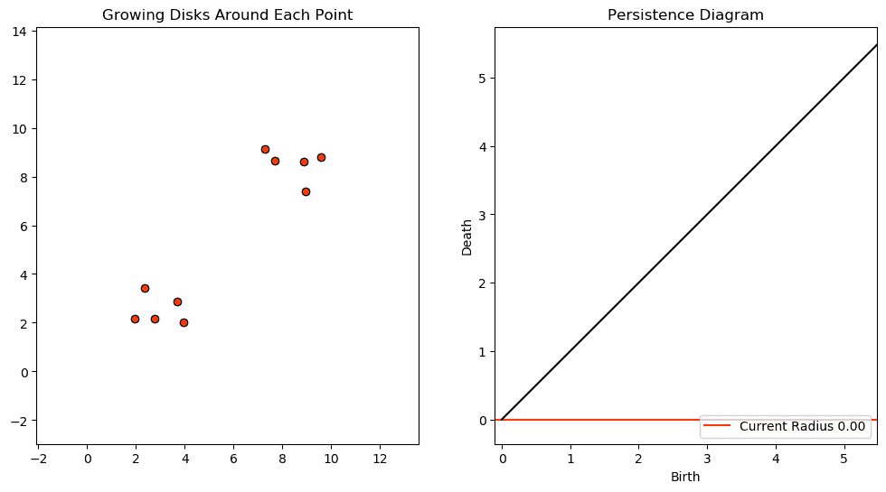

Connectivity of two noisy clusters, as measured by 0d persistent homology. Disk colors at any given time represent each unique connected component.

(下面的讨论将利用上面 gif 中的暂停来解释发生了什么，但作为参考，您也可以在这里[交互式地完成这个示例](https://gjkoplik.github.io/pers-hom-examples/0d_pers_2d_data_widget.html)。)

该图更清楚地显示了当单个连通分量中的任意点的球撞击来自另一个连通分量的另一个点的球时，分量合并，一种颜色持续，另一种颜色消失。每一种颜色的消失都对应着一个死亡，因此在持久性图上又增加了一个点。

我们来关注一下这个例子的一个具体方面。对眼睛来说，应该很清楚这些数据有两个嘈杂的集群的一些外观。这将对持久性图产生可预测的影响。随着磁盘从 0 增长到 0.66，我们看到多个(出生、死亡)对迅速出现在右侧的持久性图上。这并不奇怪，当每个圆盘的半径增加时，彼此靠近的点会快速接触。

然而，一旦我们达到 0.66，我们在左边看到每个集群中的磁盘被连接成两个不相交的集群(浅蓝色和橙色)。因此，这些组件有增长的空间，而不会触及不相交的组件，导致暂时没有额外的死亡，从而在持久性图上出现新的点时暂停。

然而，最终，当我们增加阈值使得这两个集群在半径 3.49 处接触时，其中一个集群死亡(在本例中，浅橙色)，这在持久性图上创建了最后的*(出生，死亡)对。

当阈值超过 3.49 时，所有的球已经接触。因此，这些球将永远不会击中任何其他尚未与其自身相连的球，这意味着不会有任何额外的死亡(例如，持久性图上不再有点)。

(有的选择有一个死亡值无穷大的额外(出生，死亡)对，但这是一个更主观的决定。)

如上所述，聚类的噪声导致持续图上的值更接近 0，并且两个聚类的分离导致 3.49 处的单独的、更高的持续值。因此，在持久性图上，更接近于 0 的(出生、死亡)对和上述任何点之间的*间隙*具有特殊的意义。特别是，这个间隙表示数据相对于其噪声的聚集程度。对于上面的图片，如果我们进一步分离这两个有噪声的集群，那么最高持久性值和较低持久性值之间的差距会更大。同样地，如果我们把嘈杂的星团推得更近，这个差距就会缩小。

持久性值的这种差距可能增加的另一种方式是如果每个聚类的噪声减少。为了强调这一点，下面是一个随机数据集中到两个集群的例子。更准确地说，在左边我们看到了一个*时间序列的点云*，我们从随机数据开始，然后我们向前移动到时间上，直到点云由两个点组成。右侧显示了相应的 0d 持久性图:*

**

*Collapsing data to 2 sinks, and the corresponding persistence diagram as we collapse the data.*

*当我们有随机数据时，在持久性图中，没有远离 0 附近的噪声值的高持久性值。

然而，随着数据开始分离，我们看到一个越来越持久的点从对应于噪声的持久性值中分离出来。

还要注意，当数据收敛到两个点时，噪声的持续值向 0 移动。当数据收敛到两个点时，聚类不仅变得更加明显，如持续图上最持续的点和其余点之间的间隙增加所表示的，而且当给定聚类内的点之间的距离收敛到 0 时，噪声本身变得不那么嘈杂。一旦数据汇聚到这两个点，所有的点都是 0，但是在每个集群内的*，这些点会立即合并，因为磁盘增长了很小的量。**

## ***为什么在 K-means 上使用 0d 持久同源性***

*K-means 聚类算法特别受欢迎，因此值得花点时间来强调由 0d 持续同源性收集的额外信息，这些信息在使用 K-means 时会丢失。
特别是，运行 K-means for *k* =2 不会告诉您任何关于 2 个集群相对于任何其他数量的集群的稳定性的信息，而 0d 持续同源性提供了在持续图上分离值时集群稳健性的度量。*

*K-means 确实对此提供了一些解决方案，例如通过搜索[拐点](https://en.wikipedia.org/wiki/Elbow_method_(clustering))，它探索了减少误差和聚类数量之间的权衡。当然，这涉及 K-means 的多次运行，并且为了探索通过 0d 持续同源性可以探索的尽可能多的选项，人们将不得不针对 *k* =1 到*K*=数据点的数量运行它。

此外，回想一下 K-means 的结果不一定是稳定的，或者换句话说，用相同的参数运行 K-means 两次并不能保证得到相同的答案，这对于无监督的机器学习来说是一个潜在的问题。另一方面，持久的同源性是一个稳定的结果。此外，0d 持久同调带来了对噪声鲁棒性的一些很好的
[数学证明](https://link.springer.com/article/10.1007/s00454-006-1276-5)。*

## ***1d 持续同源***

*对于 1d 持续同源，我们仍然在点周围炸球，就像我们对 0d 持续同源所做的一样。然而，在这里，我们跟踪点之间连通性的更微妙的概念。现在，我们不再仅仅跟踪连接的组件，而是在*循环*形成和消失的时候进行跟踪。说实话，一个*循环*的严格定义需要更多的数学知识，这对于本文来说是不合适的(参见[芒克雷斯的代数拓扑书籍](https://www.amazon.com/Elements-Algebraic-Topology-James-Munkres-ebook/dp/B07B87W7JL)了解更多)，但是直观的含义将有望从这个例子中变得清晰。

考虑下图中一圈嘈杂的数据:*

**

*A noisy circle of data (left), and the corresponding 1d persistent homology calculation (right).*

*(下面的讨论将利用上面 gif 中的暂停来解释发生了什么，但作为参考，您也可以在这里[交互式地完成此示例](https://gjkoplik.github.io/pers-hom-examples/1d_pers_2d_data_widget.html)。)*

*在这个持久性图上有一点特别重要。注意左边在 0.25 左右形成一个环(gif 中间的停顿)。此时，数学形式使我们能够说，一个单一的环已经形成，其中包括环内的白色空间。随着阈值的增加，环会变厚，从而缩小白色空间，直到最后不断增长的圆盘最终填充环的内部，大约为 0.6。因此，循环在 0.25 处*出生*，在 0.6 处*死亡*，给我们右侧的高异常值 1d 持续值。
这些环的半径很小，因此很快被膨胀的圆盘填满，导致死亡值接近它们的出生值，因此在持久性图上靠近对角线的地方产生点。

另一种看待 1d 持久同源性的方式是让数据“更具循环性”下面我们用一个网格点，把它分成三个循环:*

*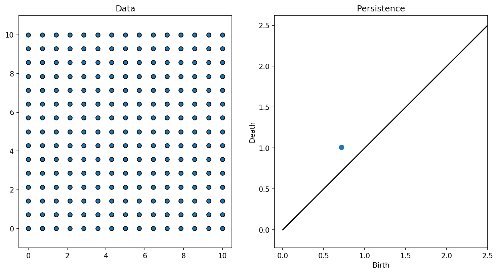*

*Observing 1d persistent homology as we force a grid of data into 3 loops.*

*首先，我们最终有三个高度持久的点对应于三个循环，这并不奇怪。一个重要的限定词来自于此。让我们把注意力集中在右上方最小的圆上。在暂留图上，其对应的 1d 暂留值大约为(0.3，0.9)。注意，随着圆圈内部变空，持久性图上的值从对角线向上移动。然后，即使圆外仍有点收敛到循环，它也会稳定下来。我们正在了解循环内部的行为/鲁棒性，但是 *1d 持续同源不能保证数据是一个圆*。

我们可以用一个静态的例子进一步强调这一点。下面使用的两个数据集由跨越一个圆的一组点组成，第二组点使用相同的圆数据，在圆外有一个额外的点网格。比较从下面两个数据集得到的两个持久性图:*

*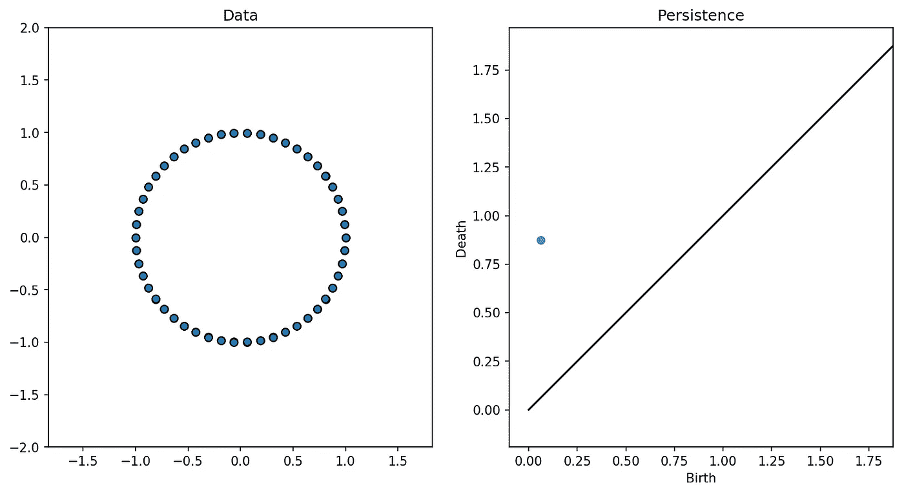*

*Perfect circle of data, and its corresponding single 1d persistence value.*

*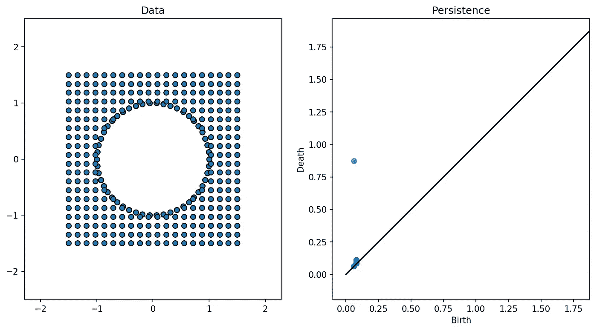*

*The same perfect circle of data, with a grid of points outside it. This gives us the same 1d persistence value, plus some noisy 1d persistence values resulting from loops quickly forming and closing among the grid points.*

*对于具有外部网格的圆，我们得到一些快速出生和死亡的循环，如沿着对角线的点所示，但是主循环对于两组点具有相同的持久性值。*

## ****n*-次元持久同调***

*值得注意的是，这种方法可以推广到 *n* 维欧几里德数据(随着维度的增加，我们吹大的球只是变成了球体/超球体，我们寻找这些球包围的多维空洞，而不是包含在循环中的圆)。然而，我们不会在这里进一步探讨。*

## ***使用欧几里德数据的持续同调测量的示例***

*机器学习的一个重要方面是[特征提取](https://en.wikipedia.org/wiki/Feature_extraction)。如果不使用代表他们试图预测的特征，最强大的模型也不能预测任何事情。这就提出了一个问题，我们如何为几何复杂的物体生成特征？如上所述，持续同源提供了一个解决方案。

举个例子，我们将使用[这篇应用统计学年报论文](https://www.ncbi.nlm.nih.gov/pmc/articles/PMC5026243/pdf/nihms777844.pdf)中的数据来检验大脑中的动脉与年龄之间的关系。首先，让我们先看看我们是否能从视觉上区分年轻的大脑和年老的大脑:*

*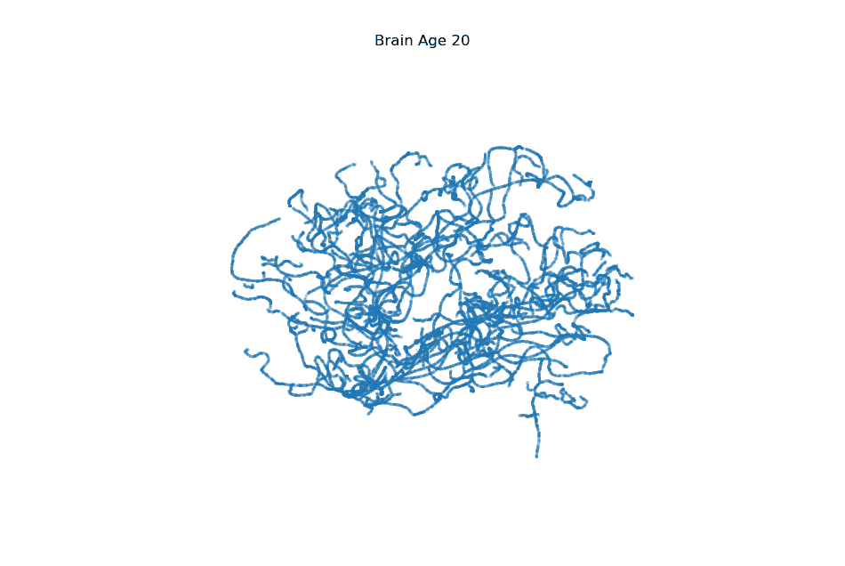***

*2 brain artery trees. On the left, a 20-year old. On the right, a 72-year old.*

*这两种脑动脉树之间似乎没有任何显著的差异。接下来让我们尝试使用 1d 持续同源性来量化这些差异:*

*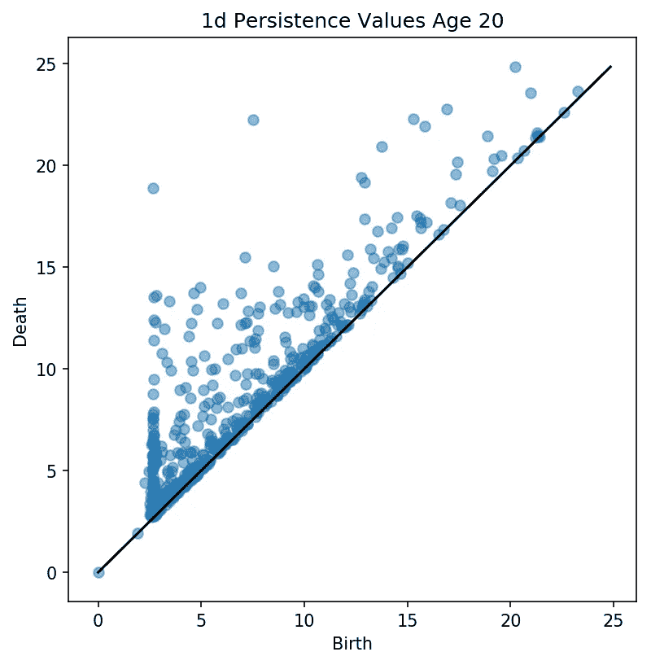**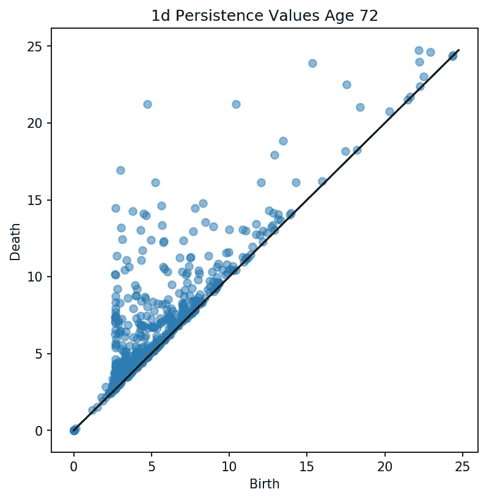*

*1d persistence diagrams for the 20-year old (left) and 72-year old (right).*

*同样，在这些图中可能有些小的不同，但是总体上，它们看起来有些相似。让我们寻找群体差异，区分 50 岁以下和 50 岁以上的年轻人和老年人的大脑。我们的示例数据集共有 98 个案例，分为年轻组中的 58 个案例和年长组中的 40 个案例。以下是按组汇总的所有 1d 持久性图:*

*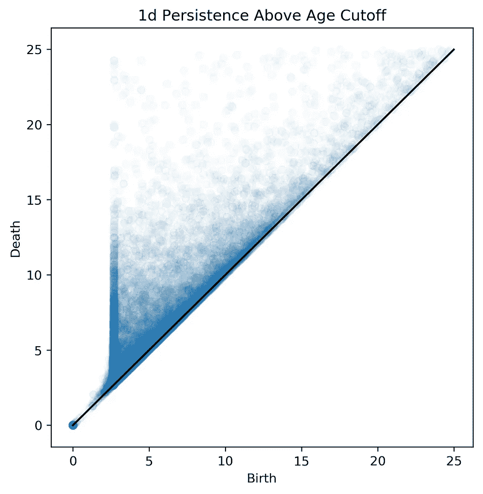***

*1d persistence diagrams for all 98 brain artery examples, separated into brains from individuals over age 50 (left) and brains from individuals below age 50 (right).*

*这些数字似乎有细微的差异，但这里的特征仍然不是很清楚。关于这些图表的更细致的特征，参见[应用统计学年报论文](https://www.ncbi.nlm.nih.gov/pmc/articles/PMC5026243/pdf/nihms777844.pdf)，其中它们持久的基于同源性的特征被证明在检测脑动脉树的年龄差异中是有用的。不过，为了简化起见，让我们只考虑 1d 持久性值的数量:*

*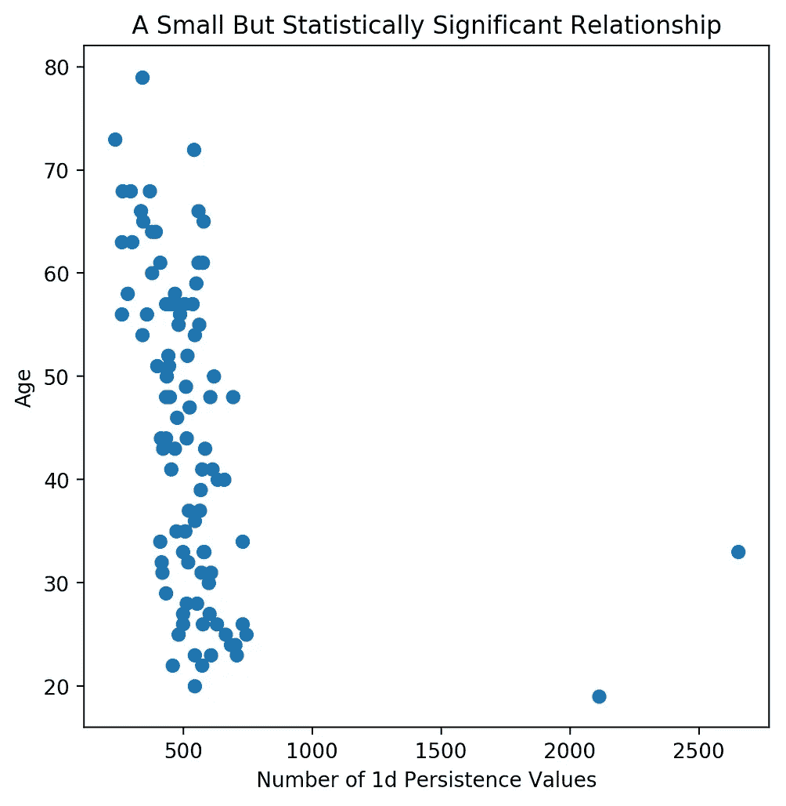**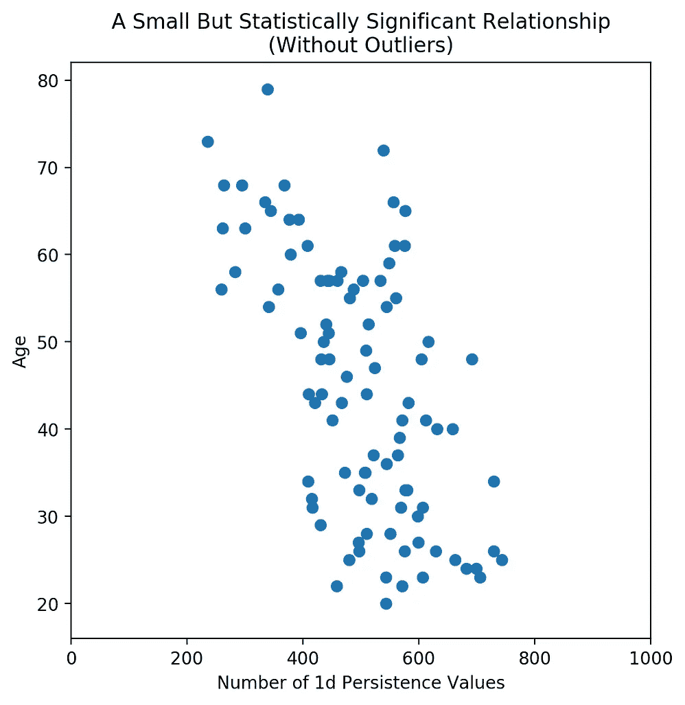*

*The relationship between the number of 1d persistence values in a brain artery tree and age in our dataset. On the left, we include the full figure. On the right, we consider the same relationship, but excluding the few outliers to better show the subtle, linear relationship.*

*正如这些图表所示，年龄和 1d 持久性值的数量之间存在微妙但具有统计意义的(*p*-值< 0.0005)关系。平均而言，在我们的数据集中，年轻人的脑动脉树中比老年人有更多的环路。虽然我们没有发现数量上的强关系，正如像[增强](https://en.wikipedia.org/wiki/Boosting_(machine_learning))这样的技术所证明的那样，一组微妙的关系可以在机器学习中一起工作，导致令人印象深刻的分类。*

# *信号*

*对于信号，我们关心的是我们认为连续的东西的离散近似。因此，与前面讨论的与欧几里得数据的持续同源性不同，我们在这里对点之间的“x”距离如何分布不感兴趣。相反，我们只关心基于每个点的值的点之间的连通性(例如“y”距离)。*

*像前面的 0d 持续同源讨论一样，当我们增加一个阈值时，我们仍然在跟踪连通分量；然而，炸球不再是我们正在做的事情的类比，因为我们不关心点之间的水平分布。相反，我们可以认为这是在信号上扫一条线，如下图所示:*

**

*A toy example of a signal (left), and the corresponding signal persistence diagram (right).*

*在这种情况下，我们可以用各自的颜色来表示信号的连通分量。因此，持久性图上的点将对应于颜色的消失，所以让我们用下图来讨论颜色和持久性图之间的联系:*

**

*The same toy example signal as above, but coloring the connected components with unique colors as we sweep up the threshold.*

*当我们向上扫描阈值时，我们看到我们短暂地拥有多达三个独立的组件(绿色、橙色和粉色)。当这些组件中的两个在阈值 4.5(gif 中间的停顿)相遇时，我们看到橙色组件“死亡”，在持久性图上为它出现一个点。信号持续同源性遵循通常的先例；较新的连接组件死亡并合并到较旧的组件中。因此，橙色成分变成绿色，因为它现在是绿色成分的一部分。当我们继续向上扫描时，我们看到没有出生或合并发生，直到我们到达信号的全局最大值。按照通常的持久性同源约定，我们将较年轻的组分合并到较老的组分中，并在持久性图上标记一个点，粉红色胜过绿色。然而，与欧几里德 0d 持久同源性不同，我们在持久图上为最后存活的组分创建了一个额外的点。回想与欧几里德 0d 的持久同调，当最后两个集群相遇时，我们在持久图上只放一个附加点。欧几里德 0d 持续同源的想法是，当我们继续增加每个点周围的球的大小时，不会再发生合并，因此集体集群永远不会死亡。这里，我们采取的立场是，一旦阈值超过信号的全局最大值，一切都死了。

我们为什么选择这种不同的做法来发出信号呢？答案与最后一个持久性值中包含的信息有关。信号的最后一个持久性值包含了信号的边界——它的出生值是信号的全局最小值，它的死亡值是信号的全局最大值。然而，用欧几里得 0d 持久同源性，我们在记录最后一点时没有获得额外的信息。该点总是在 0 处出现，或者在无穷远处消失，这不会显示任何信息(对于所有数据集都是如此)，或者我们选择在它与最后一个聚类合并时消失，也不会显示任何信息，因为这将使最后一个持久化点成为倒数第二个持久化点的重复。*

## ***信号持续同源性使用的例子***

*信号持续同源性可以帮助我们的一个例子是
[压缩](https://en.wikipedia.org/wiki/Data_compression)。作为一个具体的例子，我们将使用 1000 个时间点的随机行走的一些玩具数据:*

*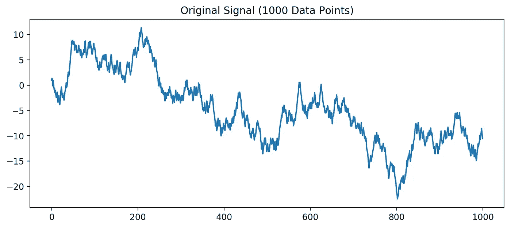*

*A random walk signal to compress.*

*开始时，我们当然储存 1000 点。然而，使用信号持续同源性，我们可以存储更少的点，同时仍然相当精确地重构信号:*

*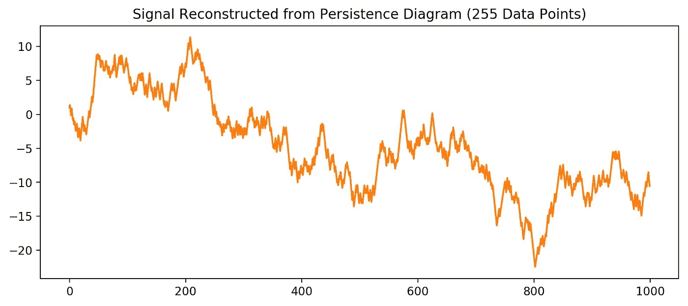*

*A reconstruction of the signal, using only the persistence values. Note we’ve already achieved nearly 75% compression.*

*我们已经实现了近 75%的压缩，显然，我们的压缩信号“保持”了原始信号的形状，我们可以通过将两个信号叠加来强调这一点:*

**

*An overlay of the original signal (blue) with the reconstructed signal (orange). Note they appear nearly identical.*

*然而，这个过程并不完美。我们丢失了一些信息；我们只是无法在信号的最大范围内看到它。让我们放大信号的一部分:*

*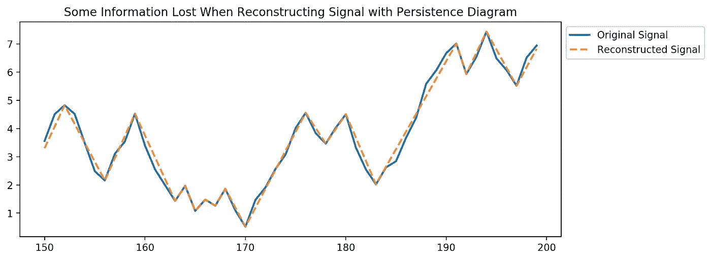*

*An subset of the overlay of the original signal (blue) with the reconstructed signal (orange). Note we have lost the non-critical points on the reconstructed signal.*

*这里需要注意的重要一点是，持续同源性只保留了斜率从正变为负的*临界点*。斜率在不同正值之间或不同负值之间变化的点没有被保留。这是有意义的，因为没有(出生，死亡)对记录这些值。此外，如果点之间的插值，甚至是两个临界点之间的插值，是非线性的，那么该曲率将会由于这种压缩技术而丢失(尽管可以存储额外的曲率信息用于更精确但不太紧凑的压缩)。

现在让我们考虑一下，如果 75%的压缩率对我们来说不够好，我们会怎么做。也许我们只能传输少量的数据，或者也许我们有更大数量级的信号。我们可以通过选择保留哪些持久性值来再次利用持久性同源性，即保留最高的持久性值，并因此优先考虑信号中最重要的结构。下面是一个演示，展示了当我们保留更少的持久性值时，我们返回的信号的简化:*

**

*A reconstruction of the signal (left) as we remove progressively more signal persistence values (right). Note the size of the resulting reconstruction in the title of the figure on the left, and recall the original size of the signal was 1000 values.*

*对于上面压缩的交互式可视化，请参见[这里的](https://gjkoplik.github.io/pers-hom-examples/signal_compression_widget.html)了解更多。*

*当我们移除更高的持续值时，我们对信号的最终重构进行越来越剧烈的改变，但是即使当我们存储少至大约 50 个点(95%的压缩)时，我们也保持了信号的体面骨架。*

*如果您想在自己的例子中尝试这种压缩技术，我已经将这一概念转化为一个名为`topological-signal-compression`的独立 Python 包。代码可以通过 [PyPI](https://pypi.org/project/topological-signal-compression/) (例如`pip install`)安装。其他代码示例(包括真实信号数据和一个音乐示例)可在[文档](https://geomdata.gitlab.io/topological-signal-compression/index.html)中找到。*

*在我的 arXiv 论文中可以找到关于涵盖理论、用例以及机器学习实验的技术的更详细的讨论:[用于推断和近似重建的信号的拓扑简化](https://arxiv.org/abs/2206.07486)。*

# ***图像的高度过滤***

*与图像的持续同源与信号的持续同源有很多相似之处。像信号持续同源一样，我们关心的是我们愿意认为是连续的东西的离散近似。此外，点与点之间的连接是基于每个点处的值，而不是点与点之间的欧氏距离。最后，就像信号持续同源一样，我们将能够根据图像中像素的“高度”(例如颜色)来跟踪连接组件的出生和死亡。

我们将看看下面的场景:*

*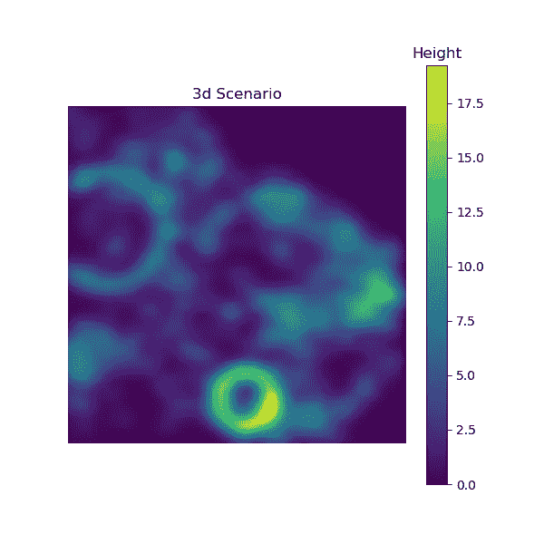*

*An toy example of an image with one dimension of color, which we will think of as height.*

*或者，从视觉上强调高度和颜色之间的三维关系:*

*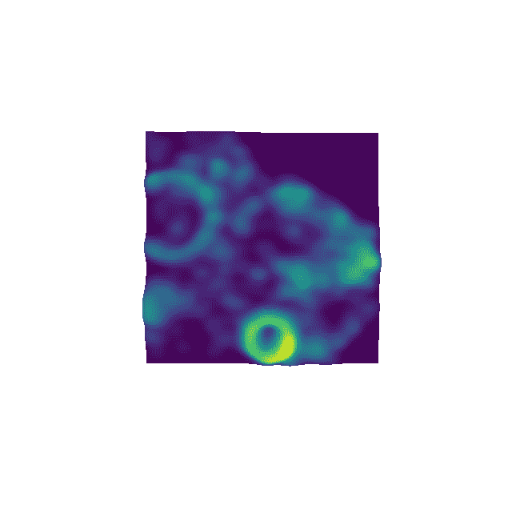*

*A 3d representation of the above image.*

*我们像这样扫起一个门槛:*

*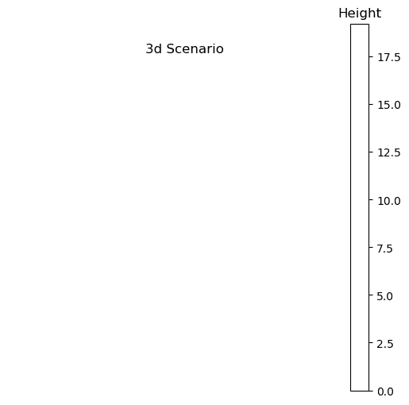*

*Sweeping up a threshold along the image from low to high height.*

*或者如在三维空间中看到的:*

*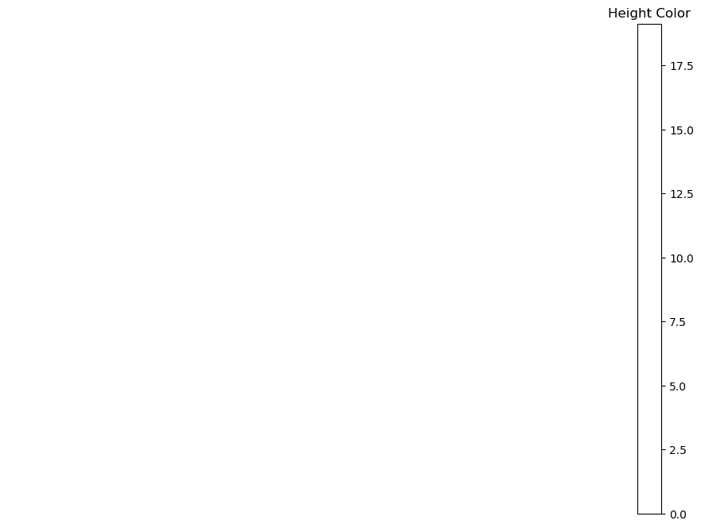*

*A 3d representation of sweeping up a threshold along the image.*

*使用高度过滤，当我们向上扫描阈值时，我们跟踪连接的成分，就像我们在信号持续同源性中所做的那样。因此，我们得到以下高度过滤图:*

**

*Visualizing connected components as unique colors as we sweep up the threshold on the toy example image.*

## ***高度过滤的使用示例***

*高度过滤的一个可能用途是[图像分割](https://en.wikipedia.org/wiki/Image_segmentation)。我们将展示一个木质细胞的例子:*

*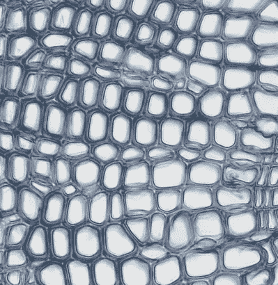*

*An actual image of wood cells.*

*运行高度过滤最简单的方法是对单一高度进行过滤，因此我们将从将图像从三个颜色通道(RGB)转换为一个颜色通道开始。我们还将对图像进行模糊处理，以促使该分割管道聚焦于更强健的特征(例如，最大限度地减少对细胞壁中某些点的亮度斑点的聚焦):*

**

*Taking the image of wood cells, putting in grayscale, and blurring.*

*在我们将高度过滤运行到用户指定的水平后，我们就能初步感受到我们可以如何区分不同的细胞:*

*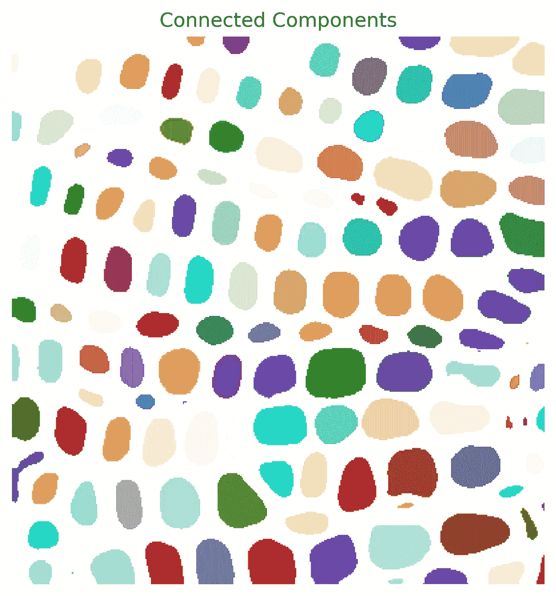*

*Visualizing the connected components generated from the blurred, grayscale image.*

*看起来很有希望！作为一项完整性检查，让我们看看原始图像上每个连接组件的中心:*

*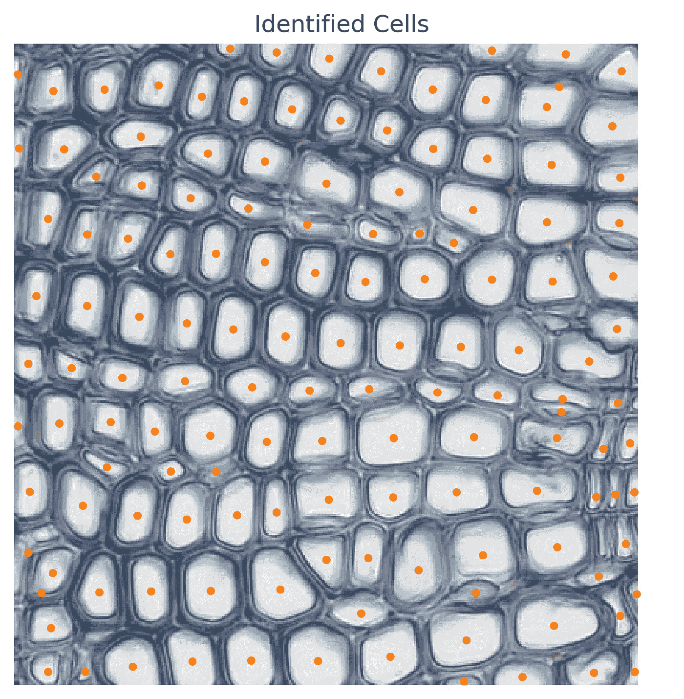*

*The wood cells figure, with a point at the center pixel of each connected component.*

*我们的表现很出色，但并不完美。有一些假阳性，可能有一两个特别窄的遗漏细胞。*

*至于我们分割图像的效果如何，下面是原始的木材细胞图像，识别的像素由顶部的连接部分着色:*

**

*The original wood cells image overlayed with our connected components as calculated using the height filtration.*

*我们在一些更窄形状的细胞的细胞壁内捕捉像素并不出色。不过，总的来说，我们捕获了每个单元格内的大部分像素。值得强调的是，要运行这个算法，我们只需要手动调整两个参数，模糊参数和高度阈值。此外，该算法运行迅速，不需要任何标记数据或训练程序来实现这些强有力的结果。*

*如果你对沿着不同的阈值跑步时的高度过滤感到好奇，请参见[这里的](https://gjkoplik.github.io/pers-hom-examples/segmentation_lowerstar_widget.html)获得一个交互式小工具。*

## *结论*

*我希望我已经激起了你对持久同源的兴趣，并扩展了你对 TDA 如何扩充数据科学家工具箱的好奇心。*

*为了响应一些对用于生成本文中图形的代码的请求，我发布了一个包含我的 Python 代码的[库](https://github.com/gjkoplik/topology-demos)。但是，请注意，我不会支持这个回购，所以我不保证这些脚本目前是有效的。对于所有持续的同源性计算，我使用了一个名为`gda-public`的开源 TDA 包，可以在 [PyPI](https://pypi.org/project/gda-public/) 和 [GitHub](https://github.com/geomdata/gda-public) 上获得。信号压缩功能得到支持(和维护！)在一个叫做`topological-signal-compression`的包里，这个包在 [PyPI](https://pypi.org/project/topological-signal-compression/) 上有。我所有的可视化都是在`matplotlib`或`holoviews`完成的。要在一个地方访问我在本文中链接的所有小部件，请参见这里的[了解更多信息。感谢阅读！](https://gjkoplik.github.io/pers-hom-examples/)*