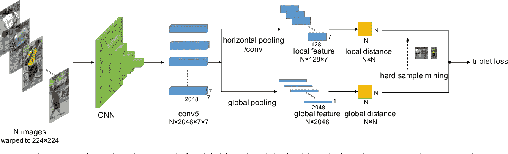
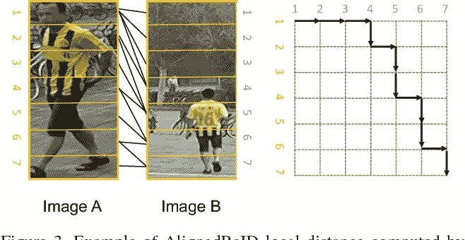
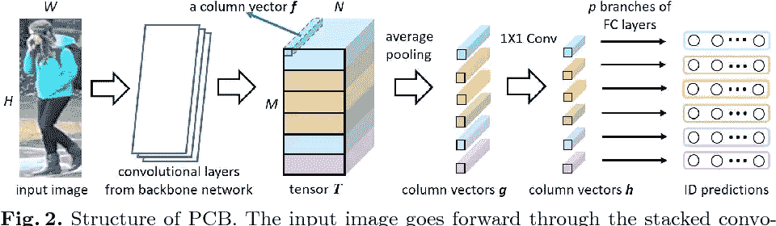
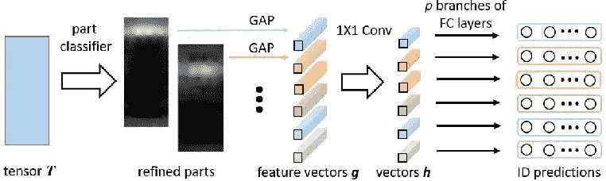
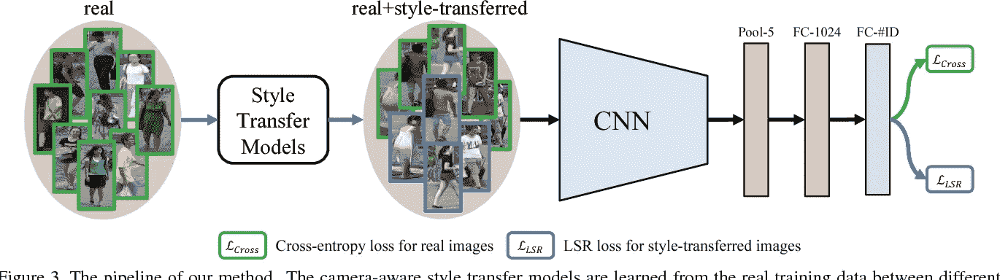
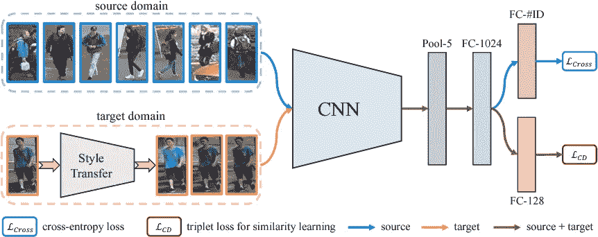

# 人员重新识别

> 原文：<https://towardsdatascience.com/person-re-identification-21625969f780?source=collection_archive---------15----------------------->

# **什么是人员重新识别**

在计算机视觉中，在其他时间或地点识别感兴趣的人是一项具有挑战性的任务。它的应用范围很广，从通过相机跟踪人们到在大型画廊中搜索他们，从将相册中的照片分组到零售店的访客分析。像许多视觉识别问题一样，姿势、视点、光照和遮挡的变化使得这个问题变得不重要。

# 论文评论

`AlignedReID: Surpassing Human-Level Performance in Person Re-Identification(arXiv 2017)`

[论文/](https://arxiv.org/pdf/1711.08184.pdf) [代码 1 /](https://github.com/huanghoujing/AlignedReID-Re-Production-Pytorch/) [代码 2 /](https://github.com/michuanhaohao/AlignedReID) [语义学者](https://www.semanticscholar.org/paper/AlignedReID%3A-Surpassing-Human-Level-Performance-in-Zhang-Luo/767ac8398e845779be111eb4ce8cb60a8b69a511)

*   AlignedReID 提取与局部特征联合学习的全局特征
*   局部特征学习通过计算两组局部特征之间的最短路径来执行对齐/匹配
*   全局特征学习极大地受益于局部特征
*   联合学习后，只需要全局特征来计算图像间的相似度。

> *aligned Reid 的框架(张璇等，2017)*

全局分支和局部分支共享相同的卷积网络来提取特征图。通过直接在特征图上应用全局池来提取全局特征。对于局部分支，在水平汇集之后应用一个 1 × 1 卷积层，这是具有水平方向的全局汇集。应用三元组硬丢失，根据全局距离通过硬样本挖掘选择三元组样本。

> *通过寻找最短路径计算的 AlignedReID 局部距离的例子(张璇等人，2017)*

黑色箭头显示右侧相应距离矩阵中的最短路径。黑线显示了左边两个图像之间的对应对齐。

`Beyond Part Models: Person Retrieval with Refined Part Pooling and A Strong Convolutional Baseline (ECCV 2018)`

[论文/](https://arxiv.org/pdf/1711.09349v3.pdf) [代码 1 /](https://github.com/layumi/Person_reID_baseline_pytorch) [代码 2 /](https://github.com/syfafterzy/PCB_RPP_for_reID) [语义学者](https://www.semanticscholar.org/paper/Beyond-Part-Models%3A-Person-Retrieval-with-Refined-A-Sun-Zheng/fc068f7f8a3b2921ec4f3246e9b6c6015165df9a)

学习用于个人检索的有区别的部分通知特征有两个贡献:

*   一种称为基于部分的卷积基线(PCB)的网络。给定一个图像输入，它输出一个由几个部分级特征组成的卷积描述符。通过统一的分区策略，PCB 实现了与最先进方法相媲美的结果。
*   一种改进的零件共享(RPP)方法。均匀划分不可避免地会在每个部分中引入异常值，这些异常值实际上与其他部分更相似。RPP 将这些异常值重新分配给它们最接近的零件，从而得到零件内部一致性增强的精细零件。

> *PCB 的结构(孙一凡等人，2018)*

输入图像从主干网络向前通过堆叠的卷积层，以形成 3D 张量 T。PCB 用传统的池层代替原始的全局池层，以在空间上将 T 下采样成 p 个列向量 g。随后的 1× 1 核大小的卷积层降低 g 的维度。最后，将每个降维的列向量 h 分别输入到分类器中。每个分类器都由一个全连接(FC)层和一个连续的 Softmax 层实现。p 个 g 或 h 片段被连接以形成输入图像的最终描述符。

> *多氯联苯结合精炼零件池(孙一凡等人，2018 年)*

当我们关注空间划分时，3D 张量 T 被简单地表示为矩形而不是立方体。T 之前的层被省略，因为它们与之前的图相比保持不变。部分分类器预测每个列向量属于 p 个部分的概率。然后从所有列向量中以相应的概率作为采样权重对每个部分进行采样。差距表示全球平均池。

`Camera Style Adaptation for Person Re-identification (CVPR 2018)`

[论文/](https://arxiv.org/pdf/1711.10295v2.pdf) [代码 1 /](https://github.com/layumi/Person_reID_baseline_pytorch) [代码 2 /](https://github.com/zhunzhong07/CamStyle) [语义学者](https://www.semanticscholar.org/paper/Camera-Style-Adaptation-for-Person-Zhong-Zheng/1822ca8db58b0382b0c64f310840f0f875ea02c0)

提出了一种用于深层人物再识别的摄像机风格自适应方法。

*   使用 CycleGAN 为每对摄像机学习摄像机感知风格转移模型，用于从原始图像生成新的训练图像。真实图像和风格转换后的图像形成新的训练集。
*   为了减轻由 CycleGAN 引起的增加的噪声水平，对生成的样本应用标签平滑正则化(LSR)。

> *管道的方法(图来自论文)*

摄像机感知风格转移模型是从不同摄像机之间的真实训练数据中学习的。对于每个真实图像，利用训练的传递模型来生成符合目标相机风格的图像。随后，真实图像(绿框)和风格转移图像(蓝框)被组合以训练重新识别的 CNN。交叉熵损失和标签平滑正则化(LSR)损失分别应用于真实图像和风格转移图像。

`Generalizing A Person Retrieval Model Hetero- and Homogeneously (ECCV 2018)`

[论文/](http://openaccess.thecvf.com/content_ECCV_2018/papers/Zhun_Zhong_Generalizing_A_Person_ECCV_2018_paper.pdf) [代码/](https://github.com/zhunzhong07/HHL) [语义学者](https://www.semanticscholar.org/paper/Generalizing-a-Person-Retrieval-Model-Hetero-and-Zhong-Zheng/d95ce873ed42b7c7facaa4c1e9c72b57b4e279f6)

给定一个有标记的源训练集和一个无标记的目标训练集，本文旨在提高 re-ID 模型在目标测试集上的泛化能力。异质同质学习(HHL)方法被用于同时加强两个属性:

*   相机不变性，通过由未标记的目标图像和它们的相机风格传递的对应物形成的正对来学习
*   域连通性，通过将源/目标图像视为目标/源图像的负匹配对。

> *管道的方法(图来自论文)*

它由两个损失函数组成:1)用于分类的交叉熵损失，通过标记源样本学习；2)用于相似性学习的三元组损失，其对模型施加相机不变性和域连通性，并且通过标记的源样本、未标记的目标样本和相机风格转移的样本来学习。

*原载于*[*amberer . git lab . io*](https://amberer.gitlab.io/papers_in_ai/person-reid.html)*。*