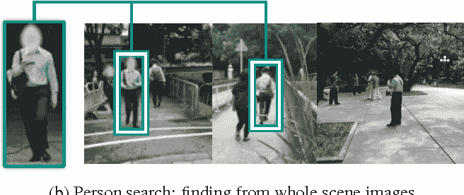
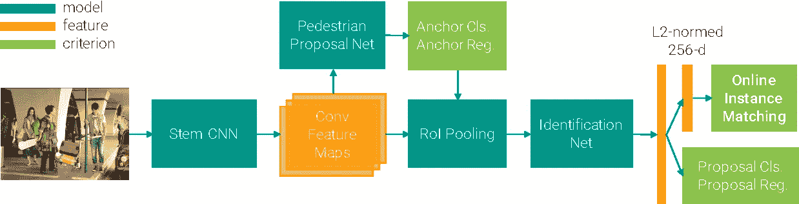
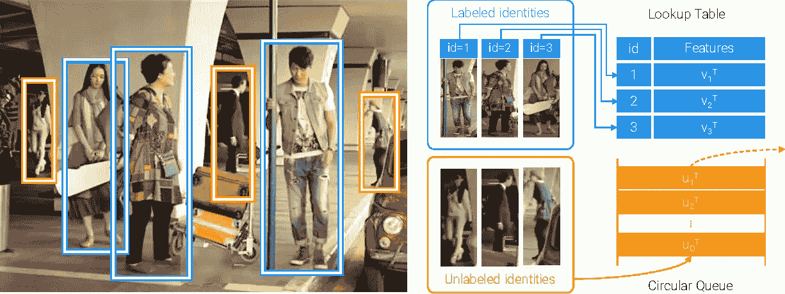
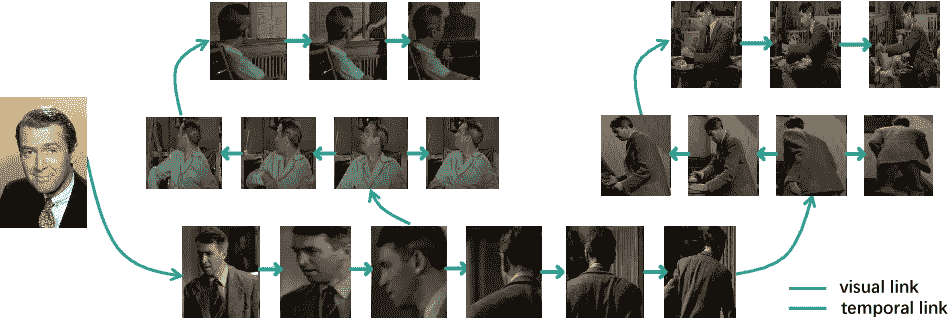
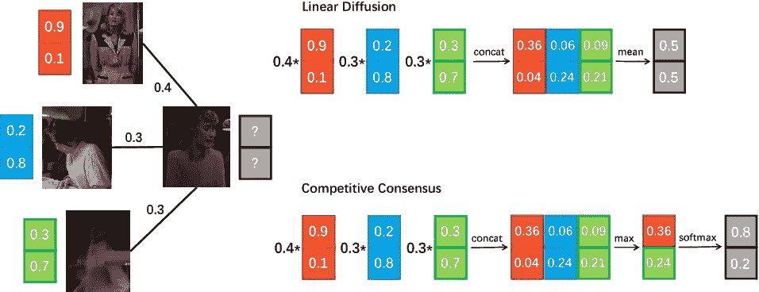

# 人员搜索

> 原文：<https://towardsdatascience.com/person-search-1f207af28bec?source=collection_archive---------17----------------------->

# 什么是人肉搜索

人物搜索是一项任务，其目的是在没有边界框注释的情况下在图库的图像中搜索相应的实例。相关联的数据类似于个人重新识别中的数据。关键的区别在于边界框在此任务中不可用。实际上，可以将行人检测和人员识别结合起来视为一项任务。

# 论文评论

`Joint Detection and Identification Feature Learning for Person Search(CVPR 2017)`

[论文/](https://arxiv.org/pdf/1604.01850v3.pdf) [代码/](https://github.com/ShuangLI59/person_search/) [语义书生](https://www.semanticscholar.org/paper/Joint-Detection-and-Identification-Feature-Learning-Xiao-Li/0c769c19d894e0dbd6eb314781dc1db3c626df57?navId=featured-content)

> *图取自论文*

人员搜索问题设置更接近真实世界的应用，并且比人员重新识别更具挑战性，因为检测行人将不可避免地产生错误警报、错误检测和错位。本文没有将人员搜索问题分解为两个独立的任务——行人检测和人员重新识别，而是在单个卷积神经网络中联合处理这两个方面。提出了一种在线实例匹配(OIM)损失函数来有效地训练网络，该函数可扩展到具有大量身份的数据集。

> *提议的框架(图取自论文)*

行人提议网络生成候选人的包围盒，将其送入识别网络进行特征提取。该特征被投影到 L2 归一化的 256 维子空间，并且用提议的在线实例匹配损失来训练。行人建议网和识别网共享基础卷积特征图。

在线实例匹配(图取自论文)

左边部分显示了图像中已标记(蓝色)和未标记(橙色)的身份建议。我们维护一个查找表(LUT)和一个循环队列(CQ)来存储特性。转发时，每个标记的身份与所有存储的特征相匹配。向后时，我们根据 id 更新 LUT，将新功能推送到 CQ，并弹出过时的功能。注意，这两种数据结构都是外部存储器，而不是 CNN 的参数。

`Person Search in Videos with One Portrait Through Visual and Temporal Links(ECCV 2018)`

[论文/](https://arxiv.org/pdf/1807.10510.pdf) [项目/](http://qqhuang.cn/projects/eccv18-person-search/) [代号/](https://github.com/hqqasw/person-search-PPCC) [语义书生](https://www.semanticscholar.org/paper/Person-Search-in-Videos-with-One-Portrait-Through-Huang-Liu/c97a5f2241cc6cd99ef0c4527ea507a50841f60b)

在一些现实世界的应用中，人们需要从长视频中通过少量的肖像来搜索特定的人。与人的重新识别相比，这是一个非常困难的问题，因为环境可能非常多。为了解决这一挑战性问题，作者提出了一种通过视觉和时间链接的标签传播策略，其中视觉链接由视觉外观特征之间的相似性定义，而时间链接由轨迹生成。使用经由竞争共识技术的渐进传播来提高传播过程的可靠性。

> *图形中的视觉链接和时间链接(黄庆秋等，2018)*

在图中执行身份传播，其中节点由检测到的人定义。该图包含两种链接，视觉链接和时间链接(这两种链接都是稀疏的，以提高图的鲁棒性)。

竞争性共识与线性扩散的比较(黄庆秋等，2018)

以防止在标签传播期间身份信息被噪声链路污染。使用竞争一致性模型，目标节点的邻居在传播期间相互竞争，并且仅保留最大的同一性元素。

*最初发布于*[*amberer . git lab . io*](https://amberer.gitlab.io/papers_in_ai/person-search.html)*。*