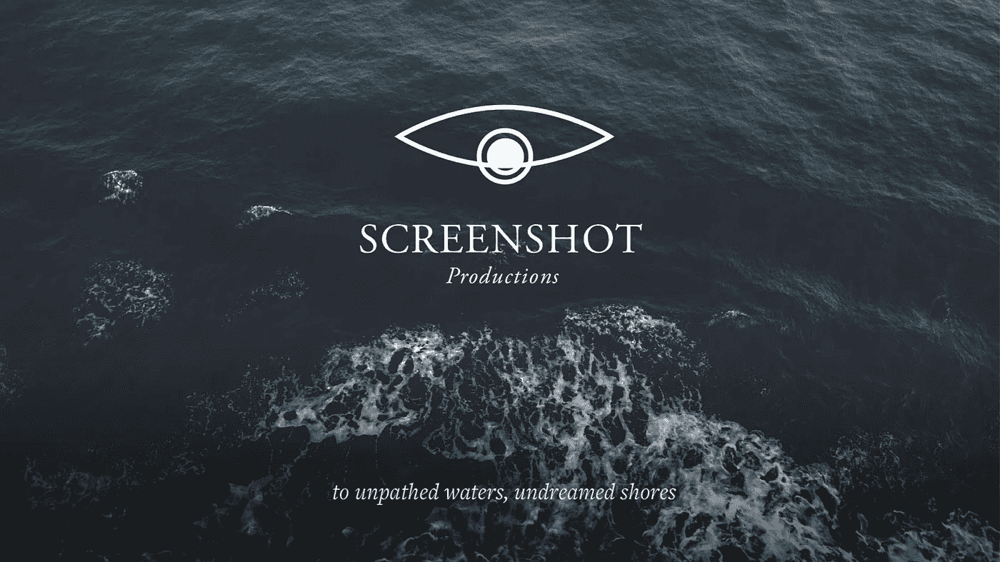
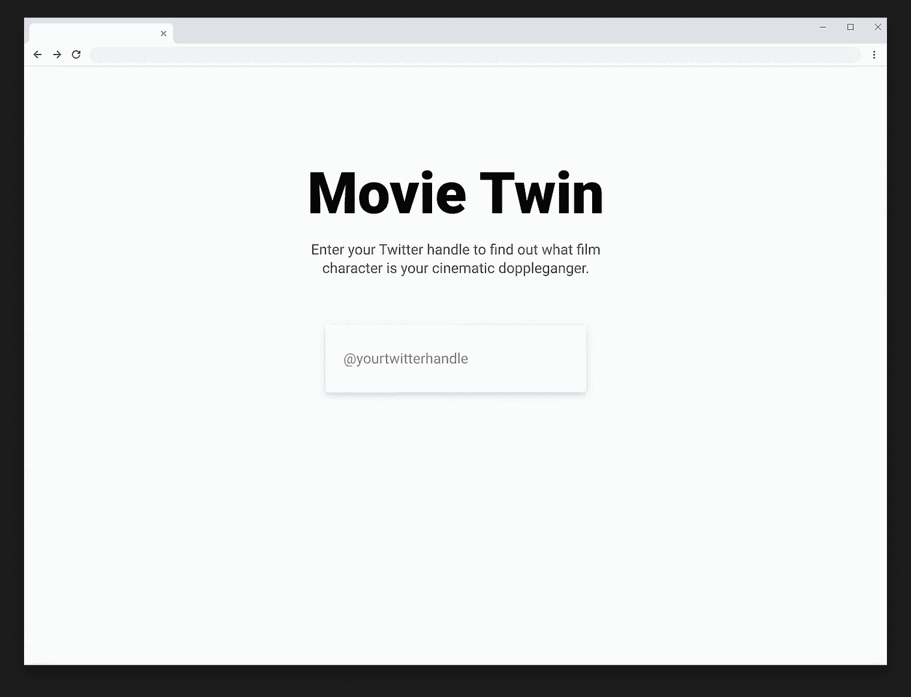
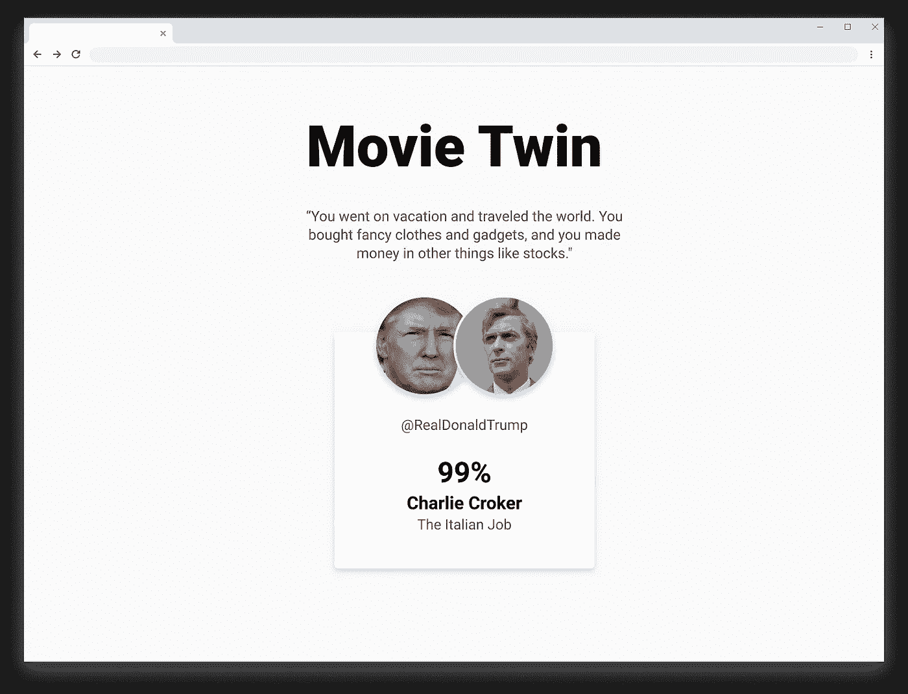

# 个性化的、生成性的叙述

> 原文：<https://towardsdatascience.com/personalized-generative-narratives-591d80caa8eb?source=collection_archive---------27----------------------->

## 使用 Tweepy、IBM Watson 和 GPT-2，根据用户的个性档案制作个性化内容

Photo by [Greg Rakozy](https://unsplash.com/@grakozy?utm_source=unsplash&utm_medium=referral&utm_content=creditCopyText) on [Unsplash](https://unsplash.com/s/photos/stars?utm_source=unsplash&utm_medium=referral&utm_content=creditCopyText)

为了我在 Metis 的顶点项目，我决定继续我在自然语言、电影人物塑造和 IBM Watson 个性洞察方面的工作。

在[我之前的项目](/visualizing-the-personality-profile-of-any-film-character-using-python-and-ibm-watson-78ad2fcee065)中，我已经成功地将单一类型电影角色的五大人格形象化。然而，对于这个项目，我决定将工作向前推进几个步骤。然而，在我开始之前，请允许我介绍一些背景…

# 愿景

Imagery from my immersive experience company

在踏上成为数据科学家的旅程之前，我的工作主要植根于沉浸式体验设计行业。虽然我已经在这个行业工作了近十年，但在 2015 年，我成立了自己的沉浸式体验公司，名为[截图制作](http://www.screenshot.productions)。

在截图中，我们通常一次为一个观众成员制作亲密的沉浸式体验，目标是将个人置于普遍的人类体验中，并挑战他们在更大的整体中考虑他们的位置和责任。我们经常为每个观众定制互动和对话，在某些情况下，我们还会根据观众对展前问卷的回答，创作出完整独特的剧本。

虽然这种形式为巨大的情感冲击提供了渠道，但它根本不可扩展。我们经常发现自己每个演出周末只能容纳 100-150 名观众，并且不得不收取(令人望而却步的)高票价，以达到收支平衡的制作成本。

因此，这个项目的核心问题是:我们能否利用数据科学，特别是生成性深度学习，通过长形式的互动叙事提供类似的有影响力的个性化体验，从而同时影响数十万个人？

另一个人说:

> 我们是否可以利用从用户的社交媒体档案中获得的个性见解，结合虚构的对话，以可扩展的格式制作强大、互动和完全个性化的叙事？

在变得过于兴奋之前，请允许我说，简短的回答是:目前没有。由于文本生成仍然是一个相对年轻的领域，我在 Metis 的时间也相对较短，所以我没有努力去创作长篇叙事。相反，我利用在 Metis 工作的机会制定了一个简短的目标，作为实现这个更大目标的垫脚石:

> 成功地创建一个生成模型，将用户的大五人格特征与一个虚构的角色结合起来，并从该角色的角度生成一个短段落或推文。

为此，我确实成功了。

# 方法、数据和流程

就像我之前的项目一样，我利用的数据来自加州大学圣克鲁斯分校编辑的大量电影文集。该语料库按类型划分，包含 960 个电影剧本，其中电影中的对话已从场景描述中分离出来。

这个过程是对数据进行清理和预处理，这样我得到了一个熊猫数据框架，这个框架按角色进行了分解，所有的对话实例都是行(完整的代码，请查看我的[项目报告](https://github.com/nicholassherwin/twitter-movie-personalities))。接下来，我过滤了具有 100 行或更多的字符的数据帧，每行至少由 3 个单词组成，这样我就可以返回任何给定电影的主角和主要角色以及实际上对确定他们的个性有一定意义的行。

在这里，我创建了一个关系数据库，其中包含以下嵌套结构的信息:电影类型、电影名称、电影角色，以及所有类型中每个角色的所有对话:

接下来，我创建了一个脚本，通过 IBM Watson Personality Insights 程序运行每个人物的对话，并返回他们详细的五大人格特征。注意，这只是通过 IBM Watson 运行每个字符的函数，但是 Watson 需要单独配置:

此时，我已经有了 3000 多个人物及其相关个性特征的数据库，所以我转到了 Twitter，在那里我使用 Tweepy 从任何给定用户那里提取最近 200 条推文，并编写了一个类似的脚本来通过 IBM 运行他们的个性:

然后将 Twitter 个人资料与关系数据库中的所有人物进行比较，并使用余弦相似度，我打印出了每个流派中与使用此功能的用户最相似的人物:

最后一步，我利用 OpenAI 的 GPT-2 架构为每个角色生成一条简短的 tweet。GPT-2 实例是使用马克斯·伍尔夫创建的 [GPT-2 简单](https://github.com/minimaxir/gpt-2-simple) python 库训练的(谢谢马克斯！)，对语料库中每个角色的对话进行单独训练，并进行微调，以打印出一条推文长度的原始内容。

# 结果的预览

所有这些调查的结果令人鼓舞！我用我的团队中的一些人的 Twitter 账号以及一些著名的个人资料进行了测试，如埃隆·马斯克(他与《星际迷航》中的斯波克最相似)，我觉得大多数情况下的结果都很有道理。

有了这些，我构建了一些基本的模型，让用户可以像 Flask 应用程序一样与之交互。下图展示了@realDonaldTrump 手柄的真实效果:

Home page for the app

Results page

在上面，我们看到特朗普与《意大利工作》中的查理·克罗克 99%相似。对这个角色的描述是:“一个伦敦犯罪团伙的头目，从监狱里释放出来，打算在意大利做一件大事，从一辆装甲保安卡车上偷走金条。”

是的……听起来很对我的胃口。

顶部的引用是生成性的、微调的 GPT-2 模型的输出，该模型基于查理·克罗克的全部对话进行训练。

# 后续步骤

Photo by [Drew Beamer](https://unsplash.com/@drew_beamer?utm_source=unsplash&utm_medium=referral&utm_content=creditCopyText) on [Unsplash](https://unsplash.com/s/photos/future?utm_source=unsplash&utm_medium=referral&utm_content=creditCopyText)

虽然我对这个项目的结果非常满意，但这仅仅是个开始。

正如本文开头所提到的，长期目标是实际创建一个动态的、长形式的叙事交付，在几个月的时间内展开，跨许多设备和媒体(文本、视频、AR/VR)交付，并动态响应用户与它的交互方式。这显然是相当雄心勃勃的(在为期 12 周的数据科学课程中肯定不可能实现)，但我将在未来一年不懈努力，使之成为现实。

除了仅仅创建一个长篇叙事，我还对使用个性方面向用户开放不同的思维模式非常感兴趣。假设一个用户在他的大五人格档案中对新体验的开放度很低。在故事开始时，他们会从一个有着类似封闭新体验倾向的角色那里获得内容。然而，随着旅程的继续，故事中人物的视角将会变得更加开放，直到旅程结束时，他们处于光谱的另一端。

这里的希望是从本质上充当类似 Youtube 算法的对立面。Youtube [根据你的观看历史](https://fortune.com/2018/03/11/youtube-extreme-content/)引导用户浏览越来越多的“极端”内容。例如，观看可能具有一些右翼倾向(或评论)的视频的用户可能会得到具有稍微更右倾观点的视频，等等。最终的结果是，用户从一个超特定的角度被内容所困扰。

对于这个项目，我想为任何给定的用户建立一个基线人格，将他们与相应的“虚构”角色结合起来，并通过定制的叙事交付让他们接触到不同的思维模式。换句话说，我希望向用户开放以前未探索过的思维模式，拓宽他们的观点，并最终帮助他们打破既定的思维模式，而不是进一步将他们束缚在现有的模式中。

# 应用+结论

这个项目的应用是令人兴奋和多样的。

我开始将这个项目视为扩展沉浸式体验类型的一种方式，虽然我认为这仍然有效，但我在治疗应用中看到了更多的好处和影响。

有充分的证据表明，我们越是使用某些神经通路，它们就变得越根深蒂固。我喜欢把这些路径想象成雪橇滑下雪山的轨迹。雪橇越往山下走，痕迹就变得越深，直到雪橇很难再走其他路下山。消极的模式，比如增加，可以这样想:除了一次又一次地从事破坏性行为，似乎不可能做任何事情。

然而，我们同样知道，我们的大脑非常灵活，通过神经可塑性，我们实际上可以重新连接我们的大脑回路。我们有无数的方法可以做到这一点:通过注意力、冥想、迷幻药、心理治疗等等。但作为一名体验设计师，我总是被故事的深刻影响所吸引和感动。

我相信，故事是一种独特而强大的方式，可以让我们拥有不同于自己的体验，我希望在这个完成的项目中，我将(随着数据和生成性深度学习的增加)能够有效地挑战个人，找到与他人体验的共鸣和联系，从而改变他们自己的操作模式。

# 附录

[Github](https://github.com/nicholassherwin) 、 [LinkedIn](https://www.linkedin.com/in/nicksherwinjr/) 、 [Portfolio](https://www.nicholassherwin.com/)