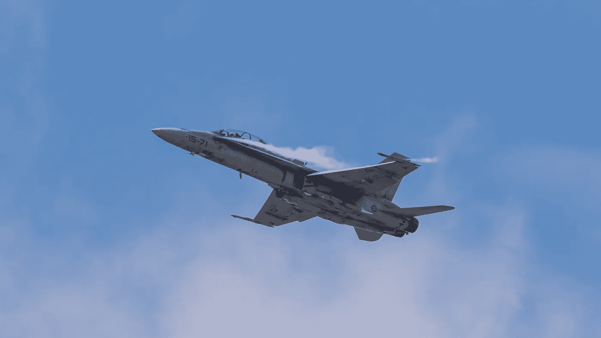

# 人脑仿真和模拟的哲学方面

> 原文：<https://towardsdatascience.com/philosophical-aspects-of-human-brain-emulation-and-simulation-d64047b26640?source=collection_archive---------37----------------------->

## 科学、技术和哲学必须协同工作

科幻小说探索了人工智能、心灵上传和意识转移的许多后果，但倾向于将科学或技术机制归结为一些模糊的解释或完全忽略它。未来主义者和超人类主义者急切地等待这些想法成为科学事实，以便他们可以体验意识或永生的新前景，但他们可能会忽视所需的开创性科学和技术的难度。

我认为，神经假体导致部分和全部替换人脑并最终上传思想是可能的，因为它没有被物理定律明确禁止，因此主要是更先进的科学和技术的问题。

即使这些可能改变人类本质的超人类和未来主义的观点在理论上是可能的，也没有相应的原则说它们是人类可以达到的，也不是在不久的将来，尤其是在我们都死之前。我们不能也不应该只是等待未来，而是必须行动起来创造未来。

> “我不想通过我的作品达到不朽；我想通过不死来达到永生。”
> 
> —伍迪·艾伦

一个重要的考虑是在通过技术描绘人脑时仿真和模拟之间的相互作用。仿真涉及更多的技术，而模拟涉及更多的科学。

**我将探索人脑在头脑上传中的仿真和模拟的差异和效用**

# 仿真和模拟的区别

为了更好地说明人脑仿真和模拟之间的区别，让我们考虑一下鸟类飞行的类比。

## 鸟类飞行的模拟

作为一个实现飞行的仿真例子，让我们简单地复制一只鸟如何用翅膀飞行。

这将涉及到精确复制鸟类生理学和解剖学的所有方面，我们认为这些方面在没有任何理解的情况下负责飞行。

我们甚至可以进一步复制诸如羽毛的颜色、眼睛的确切大小、内部消化系统的功能和交配模式等特征，但如果我们只关心实现飞行，这将超出范围。

这里的困难是确定鸟的哪些部分有助于它实现飞行，这似乎是直观的，除了翅膀之外的这些其他特征是不相关的。然而，在其他情况下，复制哪些特征可能不一定如此明显。例如，通过简单观察袋鼠如何在澳大利亚炎热的太阳下保持凉爽和不过热就不那么明显了，因为它没有汗腺。(袋鼠的前臂上有一个特殊的血管网络，所以它们舔那些前臂，唾液的蒸发带走热量。)

这种对鸟类飞行的简单模拟可能看起来很原始，但考虑到我们正在复制自然界花了数百万年才进化出来的东西，这是从单细胞生物到鸟类的远祖再到不会飞的鸟类的近亲，最后到达现在的鸟类的进步的顶点。

在不了解其他任何东西的情况下，仅仅通过观察和复制鸟类翅膀的形状就可以取得很大的进步。这种鸟的存在本身就是飞行概念的证明。

## 人脑的模拟

类似于模仿鸟来实现飞行，我们可以模仿人脑来实现意识，而不一定需要确切理解大脑的所有组成部分是如何工作的，或者意识是如何产生的。我们可以在以下水平上观察和复制大脑:

*   大脑的总体特征
*   神经网络
*   单个神经元
*   轴突和树突
*   突触
*   神经递质
*   单个分子

这里的困难是考虑成功模拟大脑需要什么样的最小抽象层。这可能不一定需要模拟单个分子的运动，但可能需要我们正确复制神经递质及其与突触的相互作用，这本身就可能非常复杂。

此外，我们将需要高度先进的技术工具来成功地探测、复制、复制、实例化，然后运行。

尽管这非常困难，但对于这种仿真过程来说，这更像是一个工程问题，不需要任何更深入的科学原理。

仿真非常有用，因为它不需要理解或发现关于大脑功能和意识的抽象科学概念，它只需要完成，这可以发生在原始人类神经元之外的基底上。

## 模拟鸟战

现在，假设我们想要“模拟”一只鸟如何飞行。这就需要飞行的原理，这是一种科学的理解。

这需要比简单复制更高层次的抽象。但是一旦我们理解了更高阶的原理，如推力、升力、阻力，以及空气动力学和物理学的原理，我们就可以设计其他的机翼来“模拟”飞行。这种飞行可能是在机翼设计上，不一定看起来像原始鸟类的翅膀形状，而完全忽略了表面的方面，如翅膀的颜色。

此外，因为我们是在抽象的层面上研究飞行原理，所以我们可以将这些原理用于基于这些相同原理的完全不同的工程。例如，我们可以建造一架直升机，其旋翼的功能不同，但基于与鸟类飞行相同的科学原理。

我们甚至可以进一步利用空气动力学和物理学原理来考虑火箭推进，这将允许我们进入一个全新的空间领域。在这里，我们能够超越鸟类在大气中的飞行，进入一个完全不同的领域。

## 人脑的模拟

同样，如果我们理解大脑解剖学和生理学的更高抽象，我们就不必像在仿真中那样精确地复制有机和天然神经元的工作方式。

这种大脑功能的模拟将更加依赖于科学原理。例如，根据波动力学复制波浪在水上的运动不依赖于特定的水体或者甚至水本身，因为波动力学已经在数学中被抽象掉了。

(题外话:更进一步说，波的概念需要一个概念上的飞跃，因为，例如，当波穿过海洋时，每个单独的水分子并没有被带走，而是波是一种从组成水分子中产生的突发现象。可以这样理解，人类意识是存在于神经元“水分子”基础成分上的“波”,也可能存在于任何其他介质上。)

虽然对大脑原理的理解将允许我们在除了有机神经元之外的其他基底上模拟人类思维，但在可预见的未来，可能很难获得对人类大脑功能的抽象科学理解，因此纯工程模拟方法在近期可能更可行。

就像鸟类的空气动力学原理可以用来建造火箭并到达全新的太空领域一样，也许大脑功能和意识背后的科学原理可以用来建立人工智能，增强我们自己的思维，甚至将它们融合在一起，探索真正新的意识前景，在抽象出鸟类飞行的特定细节之前，我们甚至无法概念化。

## 同时使用仿真和模拟

因此，似乎当试图在另一个可以产生意识的物理系统中复制人脑时，我们可能需要两种方法的结合，一种是针对我们可能不完全理解的大脑组件的工程“仿真”,另一种是针对我们在更抽象的层次上理解的方面的基于科学的“模拟”。

这样，我们就可以利用它们各自的优势，避免它们在我们当前科技进步水平下的局限性。

例如:

*   如果我们不知道每个神经元的确切内部工作情况，模拟神经元以达到相同的神经放电特征(可能涉及每个神经元内部发生的计算)可能是有用的。
*   如果我们使用更有效的科学和算法原理来运行我们完全科学理解的大体解剖特征的模拟，而不是直接仿真，则可以节省我们的能量或计算需求。

不管仿真或模拟的具体组合，以及这种组合将随着科学和技术的进步而发展到何种程度，在复制人脑时明确区分它们是有用的。

# 哲学在科学技术中的效用

## 认知偏差的存在

科学家和技术人员倾向于对哲学持有从明确和积极的厌恶到冷漠的态度。我确实相信通过对科学和技术的理解而增强的好的哲学是非常有益的，但是很容易做出没有科学和技术基础的坏的哲学。

让我们考虑人类大脑中认知偏差的存在。

*   认知偏差所涉及的任何神经架构是否也应该在仿真或模拟的人脑中复制？
*   如果没有这些认知偏差，它“仍然”是人脑吗？如果不是，那么如果我们模仿或模拟一个存在于另一个基底上的复制人脑，它又怎么可能是人类呢？如果是的话，我们可能会盲目地模仿或模拟那些认知偏见，从而盲目地跟随过去几百万年的进化，而那时我们可以更好地设计。

这可能不仅仅是一个哲学练习，因为在仿真或模拟中实现这些认知偏差可能需要对神经元进行更深入的扫描，以获得更精细的细节，更多的数据处理，以及更多的计算或能量。

这是许多例子中的一个，但其他例子可能更抽象，例如:我们应该在多大程度上更倾向于可能需要更多计算来实现相同性能的仿真，而不是可能抽象掉一些不相关部分的模拟。

## 科学、技术和哲学可以相互借鉴

以前有一个问题，是科学和工程/技术哪个更基础更重要，哪个驱动另一个。但这是一个定义不清的问题。为什么？因为它们存在于一个相互促进的良性循环中:技术可以让更强大的科学得以实现，大型强子对撞机就是一个例子，而大型强子对撞机反过来又可以推动更好的信息技术，这些信息技术可以用来建立更令人印象深刻的技术，这些技术可以用于更好的科学。

同样，哲学有很大的效用，并有希望通过将科学和技术的注意力集中在重要的事情上，或者至少是未来的事情上，以良性循环的方式促进科学和技术的发展。

如上所述的人类大脑中的认知偏差最终会有影响吗？也许吧。也许不是。但考虑这些认知偏差是否是复制人脑所必需的，并真正复制它们是至关重要的。

科学、技术和哲学的进步必须同步进行，这样它们才能相互加强。可以这样理解，哲学可能是最难的，因为问题可能是无限的，甚至是棘手的，所以我们必须满足于足够好。