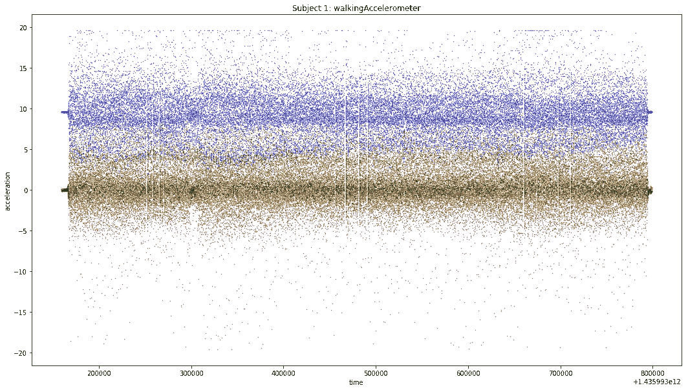
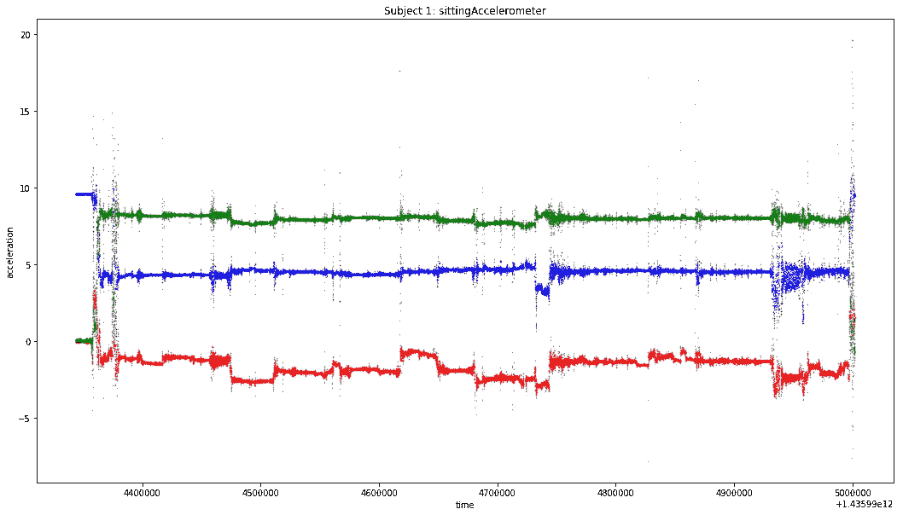
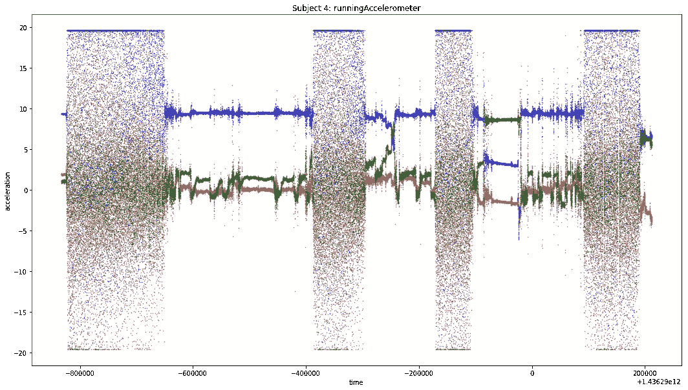
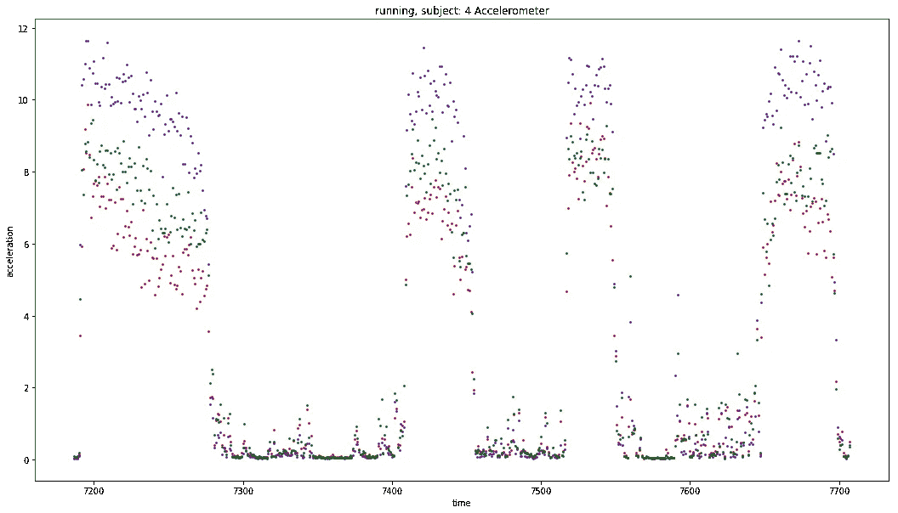
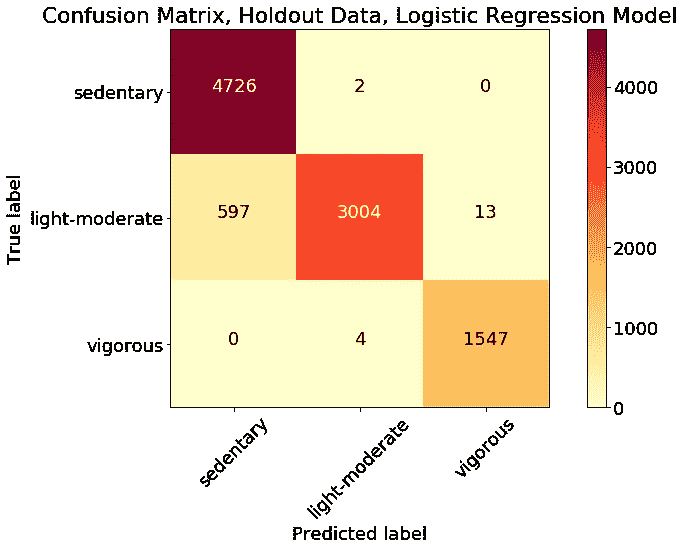
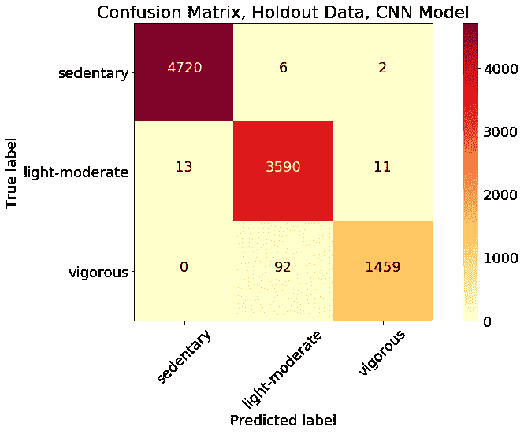

# 使用智能手机传感器和机器学习进行身体活动监控

> 原文：<https://towardsdatascience.com/physical-activity-monitoring-using-smartphone-sensors-and-machine-learning-93f51f4e744a?source=collection_archive---------16----------------------->

Photo by [CoWomen](https://unsplash.com/@cowomen?utm_source=medium&utm_medium=referral) on [Unsplash](https://unsplash.com?utm_source=medium&utm_medium=referral)

# 坐着:最危险的活动之一

久坐行为已经成为世界范围内的一个主要公共健康风险。专家告诉我们，最低量的日常体育活动对于保持健康和降低糖尿病、心脏病和癌症等慢性疾病的风险是必要的。一些研究人员提出，除了不活动的总量之外，长时间坐着本身也可能导致这个问题。2017 年发表的一项[研究发现，在控制其他因素后，一次静坐超过 30 分钟会增加死亡风险。久坐的总时间是一个独立的危险因素。同一团队的一项](https://mfprac.com/web2018/07literature/literature/Misc/SedentaryMortality_Diaz.pdf)[后续研究](https://academic.oup.com/aje/article-abstract/188/3/537/5245876)于 2019 年 1 月发表，发现减少久坐的持续时间没有任何好处，除非这些时间被身体活动(任何强度)取代。2019 年 4 月发表的一项[研究](https://jamanetwork.com/journals/jama/article-abstract/2731178)发现，从 2007 年到 2016 年，坐着的时间增加了一个小时——成年人超过 6.5 小时，青少年接近 8.5 小时。

# 每个人口袋里的多传感器

随着用于工作和娱乐的各种尺寸的屏幕的激增，许多人发现自己一天中大部分时间都坐着。然而，同样的设备可以提醒人们保持活跃。智能手机包含许多可用于对运动进行分类的传感器，包括加速度计、陀螺仪、GPS 和磁力计(指南针)。GPS 定位只能在户外使用，但其他的在任何地方都可能有效。持续轮询智能手机传感器会消耗大量电力，并会很快耗尽手机电池。因此，一个有用的算法应该能够基于相对不频繁的传感器轮询来对活动进行分类。一些消息来源表明，智能手机陀螺仪比加速度计消耗的功率大得多，因此只有在绝对有必要解决手头问题的情况下，才应使用它们。

# 人类活动识别的一个问题

关于使用智能手机和可穿戴设备的传感器来检测和分类不同类型的人类活动，有大量的文献。经常使用的 [UCI-HAR(人类活动识别)数据集](https://archive.ics.uci.edu/ml/datasets/human+activity+recognition+using+smartphones)，发表在 UCI 的机器学习知识库上，有来自 30 个对象的加速度计观察结果，这些对象被标记为行走、上楼、下楼、坐着、站着或躺着(原文如此)。

虽然 UCI 数据集和许多其他数据集要求受试者参与许多不同类型的活动，但对于提议的用例(监测和促进身体活动)，区分每种活动类型并不是必要的。我们需要能够区分活动和不活动，并且我们还想知道活动的强度，例如步行与跑步的比较。(虽然一些研究表明，坐着可能比站着更糟糕，但我们只能肯定地说，这种风险在于久坐的行为。)这个项目的目标是利用普通智能手机的传感器数据开发一个模型，可以区分 a)活跃和不活跃状态，b)剧烈和不太剧烈的身体活动。

# 真实世界的数据集

有许多公开可用的人类活动数据集可用于模型开发和测试。我使用了曼海姆大学数据和网络科学研究小组创建的[真实世界数据集](https://sensor.informatik.uni-mannheim.de/#dataset_realworld)。除了 UCI-HAR 数据集中相同的六项活动之外，该数据集还包括两项更活跃的活动(跑步和跳跃)。总共 8 个活动类别是:爬下楼梯、爬上楼梯、跳跃、躺、站、坐、跑/慢跑和步行。研究人员为 15 名受试者配备了 7 种身体姿势的智能手机或智能手表:胸部、前臂、头部、胫骨、大腿、上臂和腰部。我决定只使用“大腿”(口袋)位置的数据，假设这是测试中最常用的位置。该数据集包括来自以下传感器的读数:加速度、GPS、陀螺仪、光、磁场和声级。受试者被要求执行每项活动 10 分钟(跳跃除外)。传感器以 50 赫兹(每秒 50 次观察)记录。我的研究仅限于加速度计和陀螺仪的三轴(x、y 和 z 轴)数据。

# 探索性数据分析

我为执行 8 项活动中每一项活动的 15 名受试者分别创建了加速度计和陀螺仪数据散点图，x、y 和 z 维度以红色、蓝色和绿色显示。例如，这是一个正在行走的受试者的加速度计数据图:

同一个题材的一个情节坐看起来很不一样:

从这些图中可以看出，受试者被要求在开始指定的活动之前等待一小段时间。因此，每个活动周期的开始和结束的标签经常是不正确的。此外，通过检查这些图可以清楚地看出，并非所有的受试者都连续进行了指定的活动。例如，受试者 4 在几次跑步之间站立了几个时间段，这可以从下面看出:

# 更正标签

因为受试者并不总是在整个时间段内持续执行指定的活动，所以有必要对数据进行过滤，以去除否则会被错误标记的样本。我将原始数据分成两秒钟的窗口，每个窗口有 100 个观察值(50 赫兹)。我在每个主题/活动的每 100 个连续观察值上标注了一个样本号(去掉任何余数)。然后，我计算了每个样本的传感器数据的标准偏差。然后我画出了标准差。例如，以下是受试者 4 跑步的加速度计数据样本的标准偏差图:

可以清楚地看到对象不运行的时间。通过检查所有受试者的该图和类似的图，y 加速度计读数的标准偏差的阈值 5 被选为截止值。y 加速度计的标准偏差小于 5 的所有样本都从数据中删除。同样，为所有其他活动设定了阈值:静止活动(坐、躺)的最大值和运动活动的最小值。没有对站立进行过滤，因为受试者在记录期间没有转换到站立或从站立转换。

# 从 8 项活动到 3 节课

我最初测试了所有八个活动的模型。尽管机器学习模型可以适用于训练数据，但它们不会以足够的精度对来自未包括在训练集中的对象的数据进行概括。八项活动的最佳分类模型只能对验证数据产生 75%的准确度(当后者完全由新的受试者组成时)。这对于预期的目的来说是不够准确的，因为太多的错误会导致用户不信任、忽略和删除我们潜在的手机应用程序。此外，对于 PA 推广，没有必要知道活动的确切类型。因此，这些活动被分为以下三个 PA 类别:

*   久坐(站、坐、躺)
*   轻中度 PA(行走、上楼梯、下楼梯)
*   精力充沛的 PA(跑、跳)

下面所有的模型结果都是基于将数据分成这三组。

# 将数据分为定型集、测试集和维持集

来自前 10 名受试者的数据用于开发和训练模型。其余 5 名受试者的数据留待最终测试。训练数据分为训练样本和测试样本。我尝试了两种方法:使用 Keras 中的“验证分割”设置随机选择样本，并手动将样本分为受试者 1 至 7 的训练组和受试者 8 至 10 的测试组。我发现有必要对训练和测试数据进行基于主题的拆分。随机分割意味着在训练数据中存在来自所有 10 个对象的观察结果。虽然最终的测试分数很高，但该模型在来自以前没有见过的受试者的数据上表现不佳，因为受试者之间存在显著差异。因为我们的用例涉及检测来自任何(以前看不见的)用户的 PA 的能力，所以确保该模型可推广到新的主题是至关重要的。“K 倍交叉验证”是训练和测试数据的另一种形式的随机分裂。人类活动识别中创建重叠样本的常见实践通过在训练和测试数据中包括相同的信息而使问题复杂化。HAR 研究中心对这些问题的一项研究发现“k-fold 交叉验证人为地将识别器的性能提高了大约 10%，当使用重叠窗口时甚至提高了 16%。”

# 使用手工制作功能的模型

我创建了一个汇总数据集，其中受试者进行的活动样本被分组到 100 个观察窗口中(代表 2 秒的测量)。我计算了加速度计和陀螺仪的三轴测量值(x、y 和 z 维度)的平均值、标准偏差和范围。这 18 个(3×3×2)特征被用于各种机器学习模型来预测该类(久坐、轻中度 PA、剧烈 PA)。测试的模型有逻辑回归、KNN、各种决策树，包括 XGBoost、SVM 和朴素贝叶斯。在验证数据上，逻辑回归提供了最高的准确性(0.973)和 F1 得分(0.956)，略高于次佳模型。

# 对维持数据的测试

逻辑回归模型在由其余五名受试者组成的拒绝数据上进行测试。预测的总体准确率为 94%，加权平均 F1 得分为 0.54。这是按类别划分的混淆矩阵图:

对相关系数的检查表明，许多陀螺仪特性与加速度计特性高度相关(r > 0.9)。仅包括加速度计特征的逻辑回归模型与包括加速度计和陀螺仪特征的模型具有相同的精度和 F1 分数。在这个模型中使用陀螺仪数据没有好处。这一结果意义重大:仅使用一个传感器和简单的统计特征就可以非常准确地预测身体活动。

虽然这个简单模型的整体准确性非常高，但大约 600 个轻中度 PA 样本(全班的 11%)被错误地归类为“久坐”。更复杂的模型能做得更好吗？

# 神经网络模型

神经网络模型使用原始传感器数据，而不是使用“手工制作的特征”，在这种情况下，原始传感器数据被格式化为 100 个观察值(2 秒)x 6 个传感器读数的数组。因为数据有时间维度，所以使用递归图层是合适的。我使用门控递归单元(GRU)技术，因为它比 LSTM 具有更少的参数，并且在较小的数据集上可能具有更好的性能。卷积层可以通过帮助模型学习重要特征、防止过度拟合和减少参数数量来改善结果。批次标准化用于进一步减少过度拟合。最终模型包括:

*   两个卷积层，具有 50 个过滤器、3 个内核和 ReLU 激活，每个卷积层后面都有一个池层和一个批处理规范化层(第一个池大小设置为 4，第二个池大小设置为 2)
*   两个递归(GRU)层，每个层具有 64 个神经元和 tanh 激活(第二层具有 0.2 的递归下降)
*   辍学率为 0.1 的辍学层
*   代表要预测的三个类别的最终密集层。

在这个模型中有超过 55，000 个参数需要训练。虽然这种神经网络比逻辑回归模型的计算强度大得多，但它相对稀疏——一些神经网络有数百万个参数要训练。该模型仅在两个时期内使用 25 个样本的小批量进行训练。计算时间适中。

神经网络模型的性能甚至优于逻辑回归模型，达到 99%的准确性。大约有 100 个实际上是高强度 PA 的样本被错误地归类为轻中度 PA。这是一个非常小的错误率，并且是一个比以前的模型更好的错误类型，因为错误标记涉及身体活动的程度，而不是运动和久坐行为之间的混淆。

# 进一步的改进

这个模型只在 15 名受试者身上测试过。我想结合其他公共数据集来创建一个更强大的模型，包含更多的受试者、不同的硬件、不同的测试情况和不同的环境。此外，我想看看采样速率从 50 Hz 降至 10–25Hz 是否仍能产生稳定的模型，因为较低的采样速率意味着功耗显著降低。

这项研究的 Python 代码可以在[我的 Github 页面](https://github.com/keencyclist/movement/)上找到。