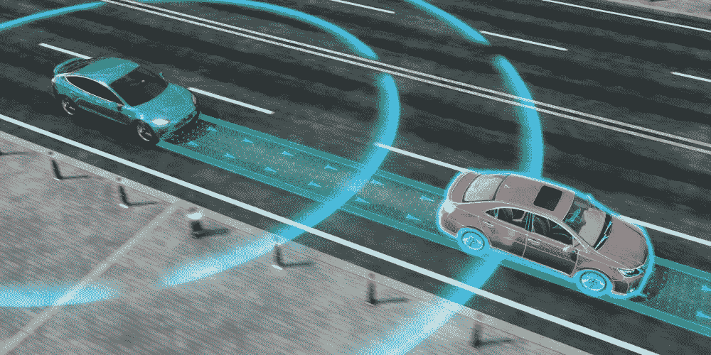
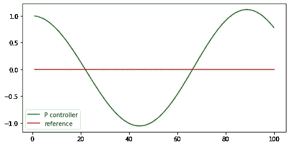
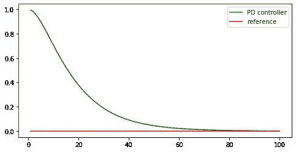
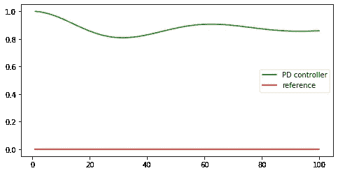
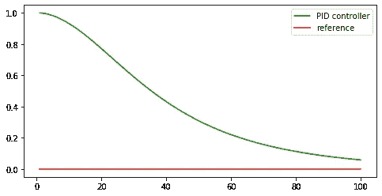

# PID 控制器介绍

> 原文：<https://towardsdatascience.com/pid-controller-intro-26fda41aaa59?source=collection_archive---------6----------------------->

## 控制自动驾驶汽车沿着路径行驶

PID 控制器是一种调节应用程序以平滑地跟随某个值或路径的方法。我在这里第一次学到了这个概念，它介绍了如何驾驶汽车沿着特定的路径行驶。虽然一个完整的应用程序解释可能非常复杂，但它以一种超级优雅和简洁的方式总结了背后的数学，并使这一思想可以很容易地扩展到许多现实生活中的问题。在本帖中，让我们跟随关键结构，探索 PID 控制器如何工作。

在本帖中，我们将遵循以下路径:

1.  **P** :比例
2.  **PD** :比例微分
3.  **PID** :比例-微分-积分



# 基础设置

让我们通过一个问题的实现来学习这个想法。假设我们有一个机器人汽车对象，我们希望汽车能够控制自己沿着一条路径行驶，在这种情况下，这条路径将是一条直线，汽车控制自己的唯一方法是调整它的转向或方向，以便它可以逐渐优雅地接近这条路径，并在到达那里后沿着这条路径行驶。简单地说，问题是:

> 通过改变方向盘来控制自动驾驶汽车沿着直线行驶

car 对象的完整实现在这里是(整个对象的解释在我们的范围后面)。基本上，机器人对象遵循以下结构:

`set`功能设置汽车的初始坐标和方向。我们需要知道的是，每次我们都需要给机器人发出`steering`的指令，这样它就可以调整自己来接近路径。

# P

p 代表比例。事情是这样的，我们的机器人坐在坐标为`(x, y)`的二维世界里。假设目标路径是`y = 0`，那么当前朝向目标的误差是`y — 0 = y`，基于该误差，我们应该相应地调整汽车的转向。*那么如何调整转向，以便我们可以快速减少误差呢？如果你驾驶的汽车偏离了你的目标路线，你会怎么办？*

一个直接的方法是根据误差按比例调整转向，这意味着你离目标越远，你驾驶汽车的角度就越大。考虑到这一点，我们有了第一个解决方案:

我们在`n`步骤中调整汽车，在每一步中，我们根据误差`robot.y`成比例地驾驶汽车:

```
steering = -tau*robot.y
```

其中`tau`是我们分配给误差的权重。(注:汽车以`speed = 1`移动，由于时间戳为 1，所以`distance = speed * 1 = speed`

让我们画出汽车的轨迹:



P Control

我们设定我们的机器人从`(0, 1)`开始水平前进。轨迹在目标路径外振荡。看起来我们的转向太过激烈，以至于赛车超过了我们的目标，当它试图转向时，又超过了目标。显然坐在这样的车里会很头疼。*那么，我们可以在接近目标时减小转向角吗？*

# 帕金森氏症

问题引出 PD 控制，其中 D 代表导数。这个想法是，随着误差的减少，我们的汽车应该反向转向，以避免超调，而不是不断转向，导致振荡。

因此，我们应该在控制过程中添加的新项是`δy/δt`，其中`δt`为 1，因此`δy = current_y — last_y`。实施将是:

这里的导数项是`dev = robot.y — prev_cte`，`tau_d`是它的权重。结果轨迹如下所示:



PD Control

看起来很完美！现在一切看起来都很好，但实际上这个模型并不稳健。我的意思是*如果存在固有的系统缺陷怎么办？如果你的车轮在开始时有一点小故障，总是转移到另一个方向，PD 能够克服这一点吗？*

答案是否定的。让我们举个例子:

这里我们`set_steering_drift`给汽车的方向添加了一些噪声，结果变成了:



PD Noise

它远离我们的目标路径振荡。原因是，虽然我们的车正在转向目标，但它不能抵消固有的系统偏差。

# PID

为了克服这个问题，我们需要第三项 I，它代表积分，它有助于监控误差，如果在一定时间内误差没有减少，汽车应该增加更多的转向。

在我们的例子中，积分实际上是每步误差的总和，实现方式如下:

在每一步，当前误差`robot.y`被加到`sum_cte`上，并且`tau_i`是该项的权重。因此*通过增加这一项，汽车避免了在远离目标的某个地方振荡的机会，因为这一项将不断变大，转向角将相应调整。*

这给出了校正后的结果:



PID Control

在同样的转向噪音下，这一次机器人汽车仍然能够到达目的地。

# 结论

另一个需要注意的是 P、I 和 d 的权重。这些参数需要仔细调整，不同的权重选择会导致显著不同的性能。您可以通过查看[的完整实现](https://github.com/MJeremy2017/Machine-Learning-Models/blob/master/Control/PID.ipynb)来测试和演示它。

总而言之，PID 控制器其实挺有意思的，尤其是被这么直观简单的讲解。你可以把三个组成部分 P、I 和 D 想象成负责一项任务的三个不同方面的三个不同的人:

*   **P** :将应用推向目标状态的主要力量
*   **I** :全程监控，遇到困境时帮助跳出困境
*   **D** :监控 P 并在必要时进行计数器测量

最后，PID 控制器的应用绝对不仅限于这个用例，您可以应用和探索更多的乐趣！

**参考**:

1.  [https://classroom . uda city . com/courses/cs 373/lessons/48743150/concepts/4a5b 7329-1df 6-48d 0-9f5b-146 F9 e 58 ad 22](https://classroom.udacity.com/courses/cs373/lessons/48743150/concepts/4a5b7329-1df6-48d0-9f5b-146f9e58ad22)