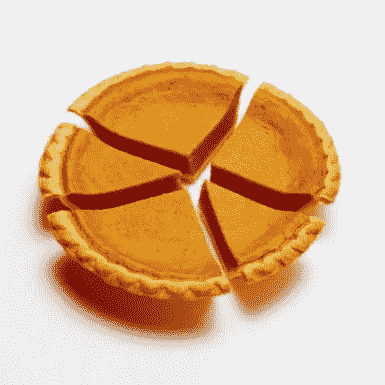
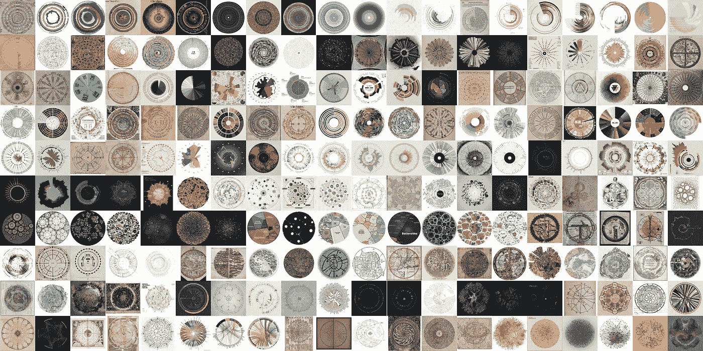
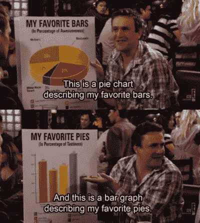

# 饼图——来饱餐一顿吧！

> 原文：<https://towardsdatascience.com/pie-charts-come-get-your-fill-ing-bad92645afdb?source=collection_archive---------41----------------------->

“Which of these pieces is biggest?” and other problems with pie charts

这是我们的感恩节。我认为这将是一个伟大的时间来谈论，你猜对了，饼状图！我知道，我知道，我怎么敢选择心爱的南瓜饼形象来谈论那些令人厌恶和最讨厌的图表/图形。底线是，尽管几万年来我们人类热爱圆圈，但饼状图与趋势背道而驰，人们完全讨厌它们。这是为什么呢？！我决定看看我们对圆圈的热爱的历史，然后看看饼状图周围的情绪，最后我会给你留下一些使用这个两极分化图的有用指南。

## **对圈子的热爱永无止境**

人们喜欢圈子。这是没有办法的。我们已经这样做了，因为我们有能力把它写下来。有一本[巨著](https://www.amazon.com/Book-Circles-Visualizing-Spheres-Knowledge/dp/1616895284)概述了人类文化圈的历史(这里见作者关于这本书的媒体博客[)。利马提出了三个普遍的理论来解释为什么我们如此热爱圆圈。第一个理论来自进化论，认为圆形和曲线形相比尖锐的边缘让我们放松，尖锐的边缘提醒我们危险，如动物的牙齿(作为参考，我建议看电影《乌鸦》)。](https://medium.com/@mslima/the-book-of-circles-4b511a5bcffc)

第二个理论是，圈子只是让我们快乐，或者至少我们把圈子等同于积极的情绪。这遵循了第一个基于进化的理论，并走得更远，声称我们认为圆形具有令人愉快的项目，如婴儿的脸。(也许我们现在已经进化到可以用同样的眼光看待南瓜派了。)

利马提出的最后一个理论与我们眼睛的形状有关(眼睛本身是圆的)。因为我们是通过异形镜片来观察世界的，所以与我们眼睛互补的形状比那些边缘粗糙或锯齿状、与我们眼睛不互补的形状更有吸引力。

From Manuel Lima’s post regarding his book. Pleases the eye, but then why do we hate pie charts so much?

## **令人讨厌的饼图——我们在哪里转错了弯？**

因此，随着数千年的进化支持我们对圆的热爱，使用形状来传达数据的意义应该是一件显而易见的事情，对吗？显然不是。问问任何一位数据科学家，或者更好的数据科学讲师，他们对饼状图有什么看法。这是我们在数据科学沉浸式课程中学到的首批数据可视化课程之一。“什么时候使用饼图合适？”响亮、响亮的回答没有留下任何解释的余地。“绝不！”

但是，等等…我们喜欢圆圈。它们补充了我们的眼睛(谁不喜欢这方面的好“赞美”呢)。我们哪里出错了？通过一些[研究](https://priceonomics.com/should-you-ever-use-a-pie-chart/)，你可以看到饼状图从一开始就被讨厌，因为它是一种向数据传达意义的低效和混乱的方式。这些论点是有道理的，我们并不擅长辨别每一块的角度，所以我们可能无法掌握一个馅饼“一块”相对于其他馅饼的大小。这违背了饼图的初衷，因为饼图旨在显示图表中类别作为整体一部分的统计比例。

Marshall Eriksen gets how to diversify his data visualization game.

这些图表的致命一击出现在 1984 年，当时统计学家 William Cleveland 和 Robert McGill [写了一篇论文](http://euclid.psych.yorku.ca/www/psy6135/papers/ClevelandMcGill1984.pdf)，将条形图与饼图进行了比较，结果是所有圆圈爱好者都吃了一个大饼。在其他图表中，条形图更容易解释和显示分类值的差异。添加的类别/变量越多，饼状图的使用就失去了有效性，它只会变得一团糟。甚至不要从[甜甜圈图](https://vizzlo.com/create/donut-chart)开始，它没有圆形那么进化，但也同样受人喜爱。

## **恰当使用饼状图**

到目前为止，我们已经看到了圆形硬币的两面:人们喜欢圆形，但是饼状图却被普遍厌恶。有折中的办法吗？在这个问题上，有什么办法可以得到一半香肠一半蔬菜？我想是的，答案可能和感恩节吃馅饼一样:饼状图可以在适当的情况下使用，但要适度使用。以下是一些使用饼图的[规则](https://www.chartblocks.com/en/support/faqs/faq/when-to-use-a-pie-chart)，基于数据科学社区的[建议](https://qz.com/1259746/when-should-you-use-a-pie-chart-according-to-experts-almost-never/):

1.  饼图只能处理一组数据！南瓜苹果派听起来不错，但是你不能把它们混合在一起并期待好的结果。
2.  负值或零值=饼图的负面使用。你不能展示一块已经吃过的馅饼。
3.  最多 7 个类别——在一个饼图上放超过 7 个类别会冲淡意义，让浏览者感到困惑。
4.  移除图例并使标签易于查看——不要让查看者的眼睛在图例上来回移动，这对于饼图来说效果不好。
5.  堆叠饼图以比较大小——也就是说，如果您真的想比较它们。
6.  最重要的是，考虑您想用数据讲述的故事。饼图最能显示类别间的不同比例，总计 100%。例如，如果我想展示这个感恩节我吃了多少，我可以用饼图来展示与火鸡和甜点相比，我吃的边数不成比例。

世界将永远喜欢圆圈，但数据可视化社区将永远讨厌饼图。也就是说，饼图有一些合适的用途。不过，当有疑问时，我的建议是坚持一些不那么两极化的东西，除非你想从精通数据的受众中获得增长。

祝大家感恩节快乐！