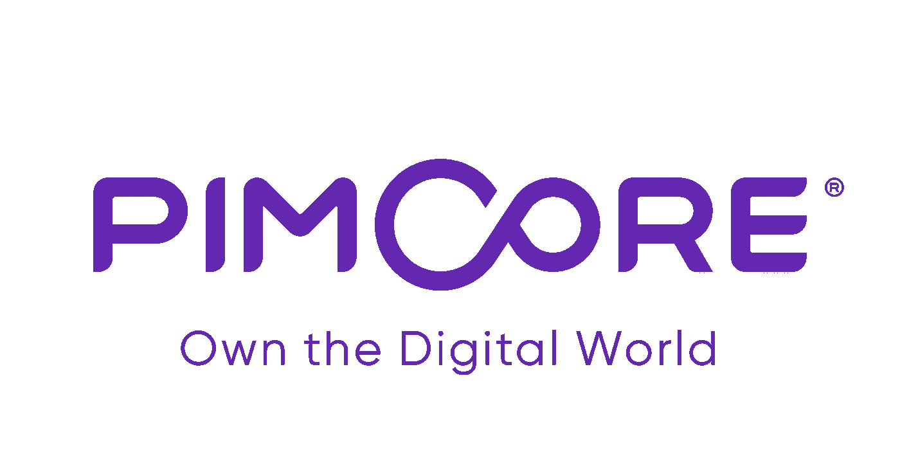
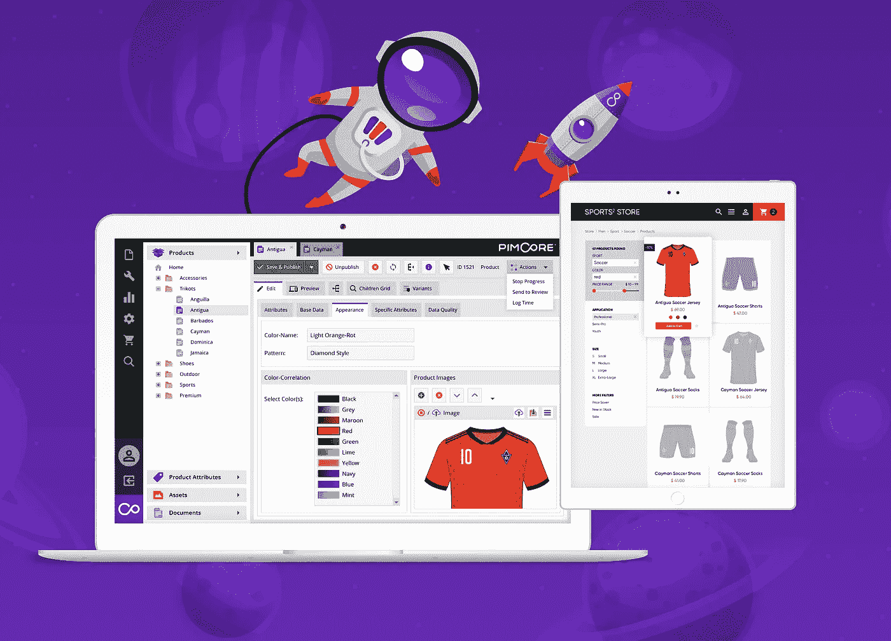

# 什么是 PIMCore:赢得 DXP 挑战赛的 PIM

> 原文：<https://towardsdatascience.com/pimcore-the-pim-that-let-you-win-the-dxp-challange-eb409a91f14e?source=collection_archive---------37----------------------->

## 发现 PIMCore，它是一款 MDM、PIM 工具，可以满足您的所有需求(或者几乎是承诺)

在我作为开发人员的职业生涯中，我讨厌很多事情，但是在列表的第一位，有读取和保存数据。我发现花时间在 ORM 上映射字段，创建 CRUD 例程，把大脑放在一个小小的业务逻辑层上是如此无聊。我不仅讨厌它，而且觉得它是对时间的极大浪费。这段时间本应该花在我能带来价值的事情上，比如基础设施、性能或提高可用性。

Pimcore logo from Pimcore press media kit

可能这就是为什么当我遇到 PIMCore 时，我爱上了它。PIMCore 拥有我见过的最聪明、最实用的数据管理。相信我，我尝试了很多数据管理工具和 RAD 框架。PIMCore 背后的想法很简单:创建一个系统，在这个系统中，你可以描述你的数据必须如何编辑和组成，并且可以很容易地使用这些数据。伟大的结果是数据定义由一个简单的 UI 管理，它甚至允许非程序员描述数据以及必须如何编辑数据。这允许创建一个快速简单的过程，分析师或非技术人员只需看一眼就知道系统在做什么。通过这种方式，所有浪费在重复工作上的开发时间都被去除了，我们可以专注于客户真正的需求。好看吗？我喜欢它。

如果您不相信阅读本文并了解 PIMCore 是一个好机会，那么您必须知道，您放入数据库的每一条记录都可以使用 GraphQL 查询进行搜索。

这一切怎么可能？感谢 PIMcore 用来存储数据的强大方法，它定义了关系、字段类型等等。

太好了！让我们详细看看 PIMCore 是如何工作的。

# PIMCore 用人类的话来说是什么

名字本身就解释了 PIMCore 是什么:一个 PIM(产品信息管理)。名字没有说出来的才是最重要的部分。PIMCore 是一把多工具的瑞士刀，帮助我们实现数字化转型。它提供了许多功能，结合在一起，让所有的军队赢得 DXP 挑战。仔细想想，将 DAM、PIM、MDM 和 DataHub 放在一个工具中是一个非常好的结果。

这种配置让您无需编写一行代码就可以管理结构化和非结构化数据。

Pimcore in action, image from Pimcore press media kit

# Pimcore 如何帮助数字化转型

Pimcore 由几个特性组成，这些特性结合在一起构成了整个 DXP 平台。在第一次安装之后，你给了客户一个强大的生态系统，里面有他需要的一切，甚至更多。根据您的需要，您可以在多种配置中使用它:

*   个人信息管理
*   主数据管理（Master Data Management 的缩写）
*   无头 CMS
*   电子商务
*   客户关系管理
*   羧甲基淀粉钠

这些功能有助于解决 DXP 挑战，推动数字化转型。怎么会？只看下面五点。

## 数据管理

如今，从技术到制造，数据是每个公司的资产。Pimcore 整合来自多个来源的数据并集中信息。好消息是，所有信息都在一个地方，无需任何额外的努力就可以交付给其他挑战。

## 数据集成

API 是 2019 年最好的集成，但我们也有遗留系统。Pimcore 通过 CVS export\import 支持遗留系统，可以通过用户界面进行配置，提高了大多数公司的集成度和接受度。对于所有新的东西，API 已经准备好了，开箱即用，没有任何惊喜。

## 免费开源，社区支持

Pimcore 是开源的，可以免费使用，不需要任何许可费用。这意味着较低的准入门槛和在采用前测试的可能性。社区很大而且很活跃，你也可以要求付费的企业支持。

## 现成的解决方案

通过安装它，你可以实现门户网站，电子商务没有任何限制。你可以编辑任何内容或任何数据，而无需询问开发者。这有助于专注于内容，而不是被技术问题分散注意力。你可以在不接触内容的情况下改变整个网站的图形，因为 CMS 与内容是分离的。您可以在一个地方编辑所有多语言产品，并在完全遵守公司政策的情况下分发给营销渠道。

## 上市时间，经济高效

都包括在内了。您可以一次性交付覆盖 DXP 多个地区的解决方案。这降低了集成、维护和开发的成本。省钱本身是好事，但更短的上市时间会带来不同。

# 利用 Pimcore 打破孤岛

Gartner 和其他大型分析师对孤岛的担忧正在减弱，他们要求我们作为顾问，如果没有任何方法可以让他们一起沟通，就打破孤岛。另一个选择是信任大型供应商，住在一个非常昂贵的大筒仓里。这两种解决方案对每个公司来说都是一个巨大的挑战。大公司有资金实现飞跃，但时间非常有限，小公司总是在寻找经济高效的解决方案。在这种情况下，PIMCore 是上市时间的替代方案，可以帮助您快速实现数字化转型。事实上，该产品是免费的，易于设置，并可以与每一个遗留系统集成，因为它的动态导入\导出系统可以处理 CSV 文件。我们所有的遗留系统的问题，但肯定我们知道，与 CSV 文件的工作是他们可以处理没有任何头痛。对于所有的新系统，都有 API rest 或 graphQL，所以我所期望的是，任何新系统都会乐于与他交互(尊重而不是处理遗留的 CSV 文件😉).在我看来，PIMCore 的方法与大型供应商非常相似。您拥有这个工具，它完成了开箱即用的大部分工作，并为您提供了大多数情况下所需的一切。只有一个能做所有事情的单一工具似乎被供应商锁定了？这就是你每次选择工具的风险。也许有许多工具可以更好地满足单一需求。你可以考虑得到最好的，购买多个垂直解决方案，让大家一起讨论，但我们再次陷入孤岛问题:沟通。所以，问题是没有什么是完美的。对于大多数情况，PIMCore 都很适合，并给出了具体的上市时间解决方案。

# 带什么回家

PIMCore 是一个非常有趣的帮助管理数据的工具。基本上是因为它的强大，可以用来将最重要的数据带入公司。推出数字化转型的最重要功能，您可以使用它来管理您的网站、门户、PIM、电子商务和 DAM。此外，您可以启用数据中心功能，在整个公司范围内共享黄金记录。

## 你为什么需要 PIMCore？

1.  一致且集中的数据
2.  筒仓破坏
3.  数字转换加速器
4.  全渠道推动者
5.  数据中心

## PIMCore 的优势

*   全在一个产品中。只需安装到公司，一次性解决多个问题
*   免费和开源。没有饲料，没有限制。由强大的社区支持
*   附带许多功能，您现在并不需要，但当时机到来时，您将做好准备
*   经济高效的定制易于实施。

## PIMCore 的局限性

*   基本上是一个单一的应用程序。也可以用在复杂的场景中，但是性能和流程的中断要管理得很好，以避免范围蔓延。