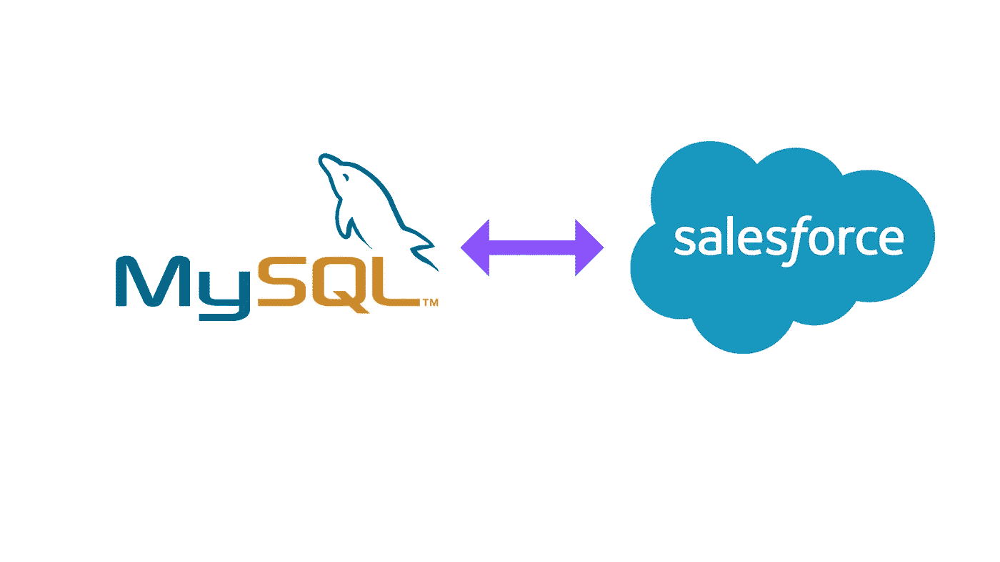
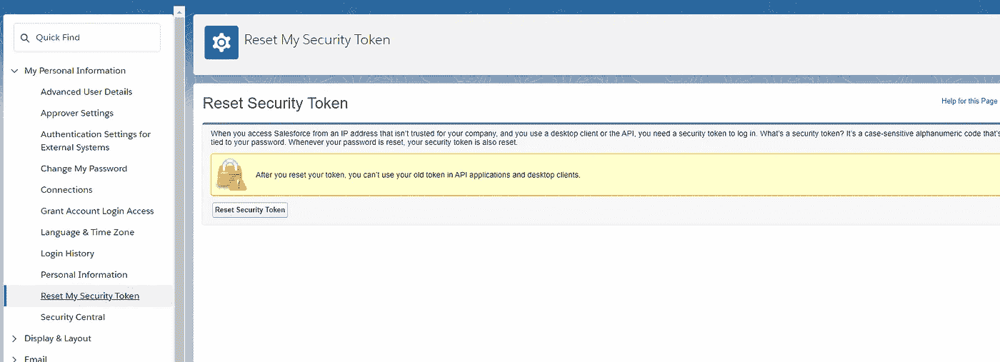
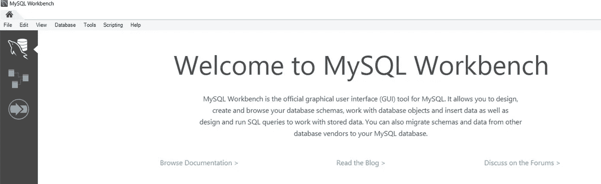
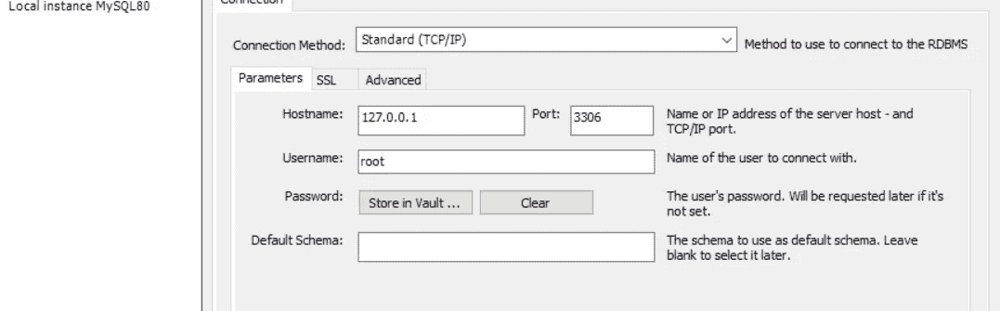
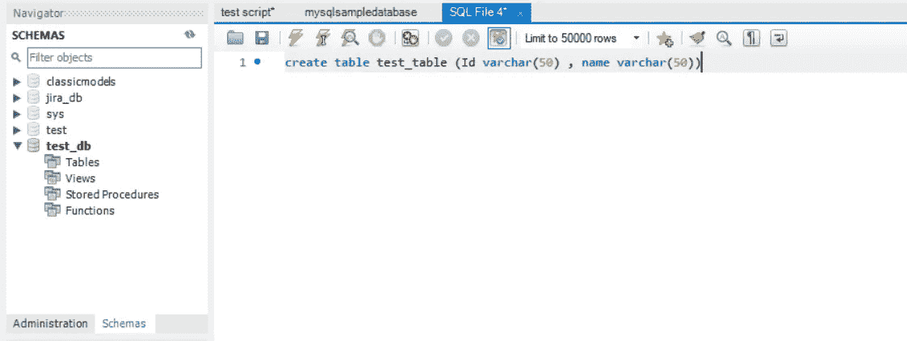
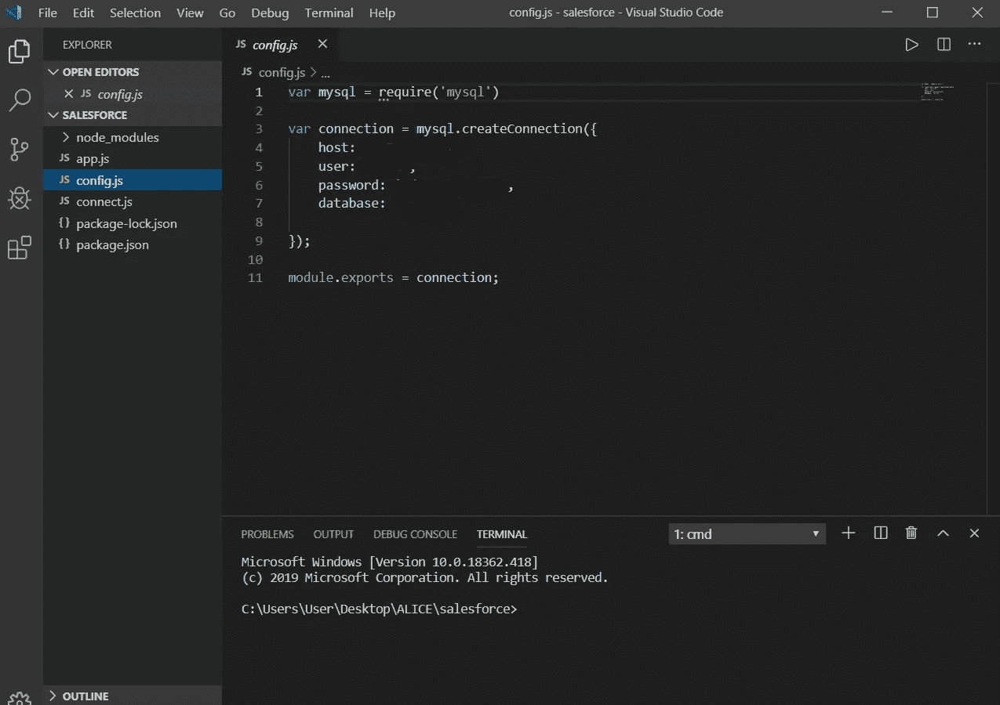
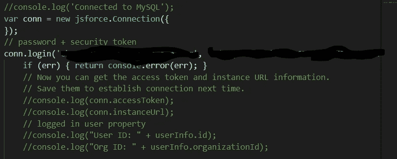
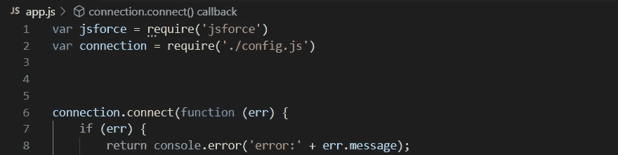
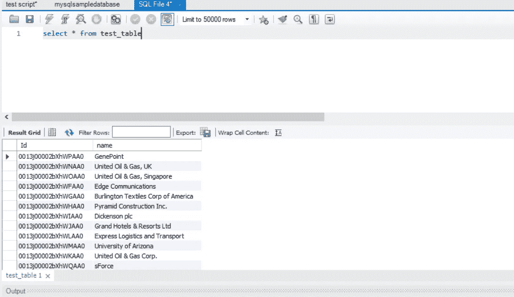

# 从 Salesforce 到 MySQL 的管道数据，无需外部连接器

> 原文：<https://towardsdatascience.com/piping-data-from-salesforce-to-mysql-without-external-connectors-57a822b1d75b?source=collection_archive---------24----------------------->



我希望这篇文章可以拯救那些需要在没有外部连接器的情况下将数据从 salesforce 传输到 MySQL 的人，因为您的上级要求您这样做。我自己在找到一个简单的方法之前遭受了很长时间，所以现在让我们走吧！

# 你需要什么

1.  Salesforce lightning 帐户(以及一些关于 Salesforce 对象的知识)
2.  MySQL 凭证
3.  使用 npm 安装的 jsforce(以及 node.js 的一些知识)
4.  一个好的代码编辑器(:

别担心，我会和你一起检查零件！

# **1。Salesforce lightning 帐户**

因此，如果您还不知道，salesforce 将帐户、案例等项目存储到对象中。对象由字段组成，每个字段都有一个类型。我们今天要做的是将所有账户数据导入 MySQL。

**获取您的安全令牌**



security token from salesforce lightning page

稍后需要安全令牌来使用 node.js 连接到 salesforce

现在这一部分已经完成，让我们转移到 mySQL

# 2.MySQL 凭证

如果你现在用的是 mySQL，你会知道有用户名和密码以及主机。因此，您将需要这些信息来连接到您的帐户+您想要连接的数据库。

你需要进入 MySQL，点击数据库



然后，从下拉列表中，单击“管理连接”

查看您的连接参数。



现在，让我们使用“创建数据库 test_db”和随后的“创建表 test_table 值”创建一个新的数据库 **test_db** (我们将在其中存储 test_table 以加载 salesforce 数据。



# 3.节点 js 脚本

创建一个您选择的目录，并执行 npm init 来获取所有需要设置的文件。如果没有，您需要安装 npm！

现在创建一个 config.js 文件来存放这些凭证。



How the config file should look like

这样，我们将使用**‘NPS install jsforce’安装 js force。**

现在让我们对 jsforce 做一个测试连接。



基于文档，使用 conn.login，conn.login(用户名、密码+ salesforce 安全令牌)。然后，您应该不会得到任何错误代码(:



是时候把所有东西放在一起了。我们的想法是，首先要连接到 mySQL，并确保它是连接的。接下来，我们将连接到 salesforce 并使用 jsforce wrapper 来查询数据，如使用 SQL langauge，然后将其导入 mySQL(:

```
var jsforce = require('jsforce')var connection = require('./config.js')connection.connect(function (err) {if (err) {return console.error('error:' + err.message);}//console.log('Connected to MySQL');var conn = new jsforce.Connection({});// password + security tokenconn.login('<login email>', '<password + security token>', function (err, userInfo) {if (err) { return console.error(err); }// Now you can get the access token and instance URL information.// Save them to establish connection next time.//console.log(conn.accessToken);//console.log(conn.instanceUrl);// logged in user property//console.log("User ID: " + userInfo.id);//console.log("Org ID: " + userInfo.organizationId);var records = []var query = conn.query("Select Id,Name FROM Account").on("record", function (record) {records.push(record);console.log(record.Id)let sql = 'INSERT INTO test_table VALUES (?,?)';let data = [record.Id, record.Name]connection.query(sql, data, (err, res, fields) => {if (err) {return console.error(err.message);}console.log('Rows affected:', res.affectedRows);})}).on("end", function () {connection.end(function (err) {if (err) {return console.log('error:' + err.message);}console.log('Close the database connection.');});//console.log(records[0].Id);//console.log("total records is :" + query.totalSize);//console.log("total fetched is :" + query.totalFetched);}).on("error", function (err) {console.log(err);}).run({ autoFetch: true, maxFetch: 4000 });});})//let sql = 'INSERT into test_db VALUES (xxx)  '
```

有了那个，你应该得到这个。



这并不难，对吧！

我希望这在某种程度上帮助了你！如果你也有这个问题，请分享给你的朋友！