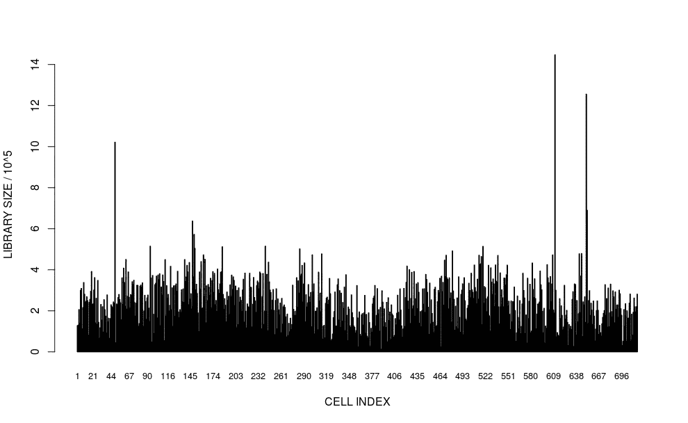
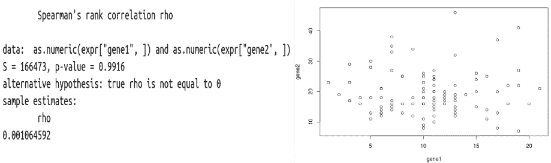
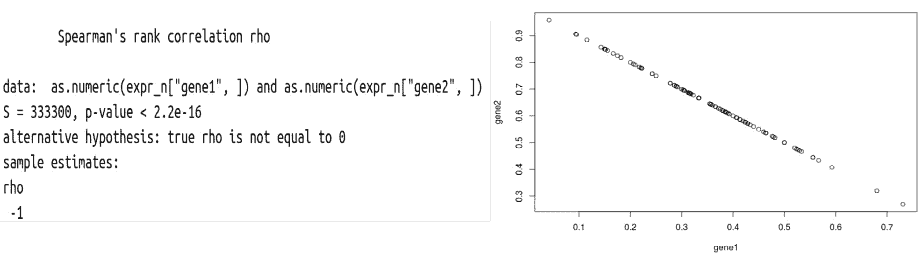
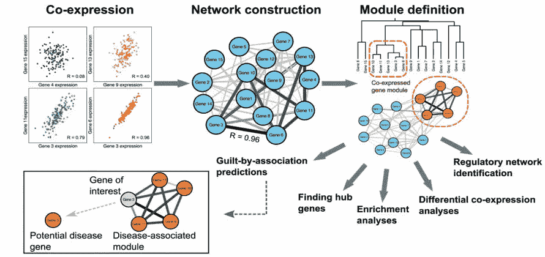
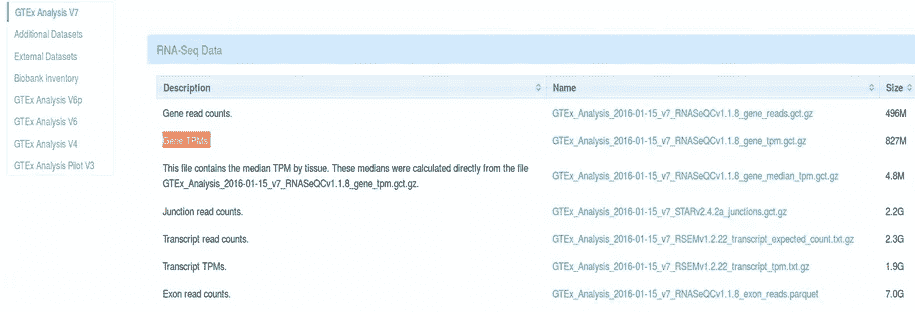

# 数据规范化的陷阱

> 原文：<https://towardsdatascience.com/pitfalls-of-data-normalization-bf05d65f1f4c?source=collection_archive---------15----------------------->

## [生命科学的数理统计和机器学习](https://towardsdatascience.com/tagged/stats-ml-life-sciences)

## 标准化如何导致单纯形中的虚假相关

[Image source](https://en.wikipedia.org/wiki/Simplex)

这是专栏[第四篇**生命科学的数理统计与机器学习**T5。在本专栏以及](https://towardsdatascience.com/tagged/stats-ml-life-sciences?source=post_page---------------------------) [**生命科学的深度学习**](https://towardsdatascience.com/tagged/dl-for-life-sciences) 中，我一直在反复强调，我们在生命科学中处理的数据是**高维度的**，这一事实我们并不总是意识到并且适当地考虑到。今天，我们将讨论另一个典型的陷阱，即如何执行**数据标准化**您可能会在**单形空间**中结束，在那里欧几里德距离不再有效，经典的频率统计数据失效。

# 为什么要归一化数据？

数据标准化对于分析[**【NGS】**](https://en.wikipedia.org/wiki/DNA_sequencing)数据，例如 [**RNA 测序(RNAseq)**](https://en.wikipedia.org/wiki/RNA-Seq) 和 [**宏基因组学**](https://en.wikipedia.org/wiki/Metagenomics) 非常重要，以避免由于技术人为因素造成的混淆效应。事实上，有时一个基因在患病个体中的表达似乎比健康个体高，这仅仅是因为由于技术噪音，所有基因的总表达，生物信息学术语中的**测序深度**或**文库大小**碰巧在患病个体中更高。例如，如果你为我在这一系列文章中一直使用的[癌症相关成纤维细胞(CAFs)](https://www.nature.com/articles/s41467-018-07582-3) 数据集绘制所有细胞的库大小，你会发现细胞与细胞之间的巨大差异，这些差异可能具有**生物学**或**技术(噪声)**性质。

Library sizes (total expression of all genes) for [Cancer Associated Fibroblasts (CAFs)](https://www.nature.com/articles/s41467-018-07582-3)

为了安全起见，通常假设细胞之间的总基因表达应该没有太大差异，观察到的测序深度的巨大差异是由于技术偏差。因此，通过简单地将每个基因的表达除以所有基因的总基因表达(文库大小)来均衡细胞间的“平均”基因表达是非常诱人的。这种方法在 RNAseq 中被称为**文库大小归一化**，在宏基因组学社区被称为**总和缩放(TSS)** 。

# 标准化会导致虚假的相关性

在这里，我们将证明如果我们天真地将文库大小标准化应用于 RNAseq 基因表达数据会发生什么。为了简单起见，让我们模拟两个基因的表达。我们独立地从 [**负二项分布**](https://bioramble.wordpress.com/2016/01/30/why-sequencing-data-is-modeled-as-negative-binomial/) 中得出它们的表达值(计数)，因此基因应该不相关，我们可以通过计算 [Spearman 相关性](https://en.wikipedia.org/wiki/Spearman%27s_rank_correlation_coefficient)容易地确认它:

我们可以看到，Spearman 相关性ρ= 0.001，p 值= 0.99，所以根本不显著相关。从基因 1 对基因 2 的图中，我们确认**两个基因之间没有可见的相关性**。现在让我们应用库大小归一化，这意味着每个计数将除以来自相应样品/柱的计数总和。之后，我们再次计算 Spearman 相关系数，并绘制两个基因的表达图。

在这里我们可以看到一些惊人的东西。现在，这些基因似乎完全相关。Spearman 系数ρ=-1，p 值非常显著，该图显示了两个基因之间的完美相关性。

> 发生了什么事？看起来，通过应用库大小标准化，我们发现了一种新的生物学！

基因在标准化之前是不相关的，但现在它们似乎一起表达(**共表达**)。等一下！我们知道，我们没有模拟两个基因相关/共表达，我们模拟了数据，所以我们知道真相:**基因** **不应该******相关，而是** **它们在文库大小标准化**之后。真是自相矛盾！**

# **合成数据和单纯形空间**

**我们刚刚观察到的效应叫做**比率的虚假相关。[卡尔·皮尔逊](https://en.wikipedia.org/wiki/Karl_Pearson)(还记得皮尔逊相关系数吗？)最初是推动库大小规范化的人。然而，在他发现虚假相关性的影响后，他强烈反对通过库大小/总和来进行数据标准化。****

****库大小标准化的问题是给定样本**的跨基因计数总计为 1** ，即它们不再是**独立的**，而是**受限的**，因此它们变成 [**组成的**](https://en.wikipedia.org/wiki/Compositional_data) 。通过构建复合数据，您不再处于传统频率统计所基于的欧几里得空间，因为欧几里得空间/距离是高斯分布的结果。事实上，你最终会进入**单形空间**，在这里传统的统计方法不再适用，因为两点之间的距离不再是欧几里德距离，而是“带约束的欧几里德距离”，即 [**艾奇逊距离**](https://en.wikipedia.org/wiki/Compositional_data#Aitchison_geometry) 。****

****如果您在单纯形空间中，您不应使用任何传统的统计方法，如线性回归、相关或主成分分析(PCA ),因为它们基于数据点之间的欧几里得距离。而且如果你在做 RNAseq 分析，文库大小归一化可能会彻底毁了 [**基因网络分析**](https://bmcbioinformatics.biomedcentral.com/articles/10.1186/1471-2105-9-559) ，这对基因表达数据的生物学解读非常重要。****

********

****Library Size Normalization may severely damage the gene network analysis, [image source](https://bmcbioinformatics.biomedcentral.com/articles/10.1186/1471-2105-9-559)****

****如果您仍然想对成分数据使用 PCA，您应该执行[对数比转换](https://en.wikipedia.org/wiki/Compositional_data#Additive_logratio_transform)之一，将数据从单纯形转换回欧几里德空间:**加法(alr)、中心(clr)或异构(ilr)对数比转换**。****

****单纯形空间的效果似乎是 [**众所周知的**](https://microbiomejournal.biomedcentral.com/articles/10.1186/s40168-017-0237-y) **在** **宏基因组学** **区域**，这里的社区通常使用对数比变换或 [**累积和缩放(CSS)**](https://www.ncbi.nlm.nih.gov/pmc/articles/PMC4010126/) 而不是总和缩放(TSS)。令人惊讶的是，我从未在 RNAseq 或 scRNAseq 文献中听到任何关于单形空间偏差的提及。对数比变换(alr，clr，ilr)使用对数函数，我假设这就是为什么 RNAseq 人喜欢对数变换他们的数据，而没有意识到**这种操作实际上允许他们放弃单纯形空间**。****

# ****为什么要 TPM 正常化？****

****有趣的是，[**【TPM】**](https://www.ncbi.nlm.nih.gov/pmc/articles/PMC2820677/)最近成了一种流行的归一化策略。 [**GTEX**](https://gtexportal.org/home/) ，也许是**最大的公共** **RNAseq 资源**，默认提供基因表达数据作为 TPM 标准化计数。****

********

****GTEX RNAseq resource provides TPM normalized gene expression by default****

****根据定义，给定样本的 TPM 计数[总计为一百万](https://www.rna-seqblog.com/rpkm-fpkm-and-tpm-clearly-explained/)，这是一个单纯形空间约束。因此 **TPM 计数并不比库大小标准化计数**更好，因为它们也遭受单形空间偏差，并且不应该天真地对这些计数应用例如 PCA。很多 GTEX 用户似乎并不知道这个陷阱，在 GTEX 门户上**没有提到** **。因此，我要问所有 GTEX 开发者、用户和 RNAseq 社区的问题是:******

> ****你们意识到你们是通过使用 TPM 标准化基因表达计数在单纯形空间中工作的吗？****

# ****摘要****

****在这篇文章中，我们了解到 **RNAseq 数据标准化**是**避免技术偏差**的重要一步，然而**文库大小**标准化可能导致**基因之间虚假的相关性**。这是因为库大小标准化的表达式值不再是欧几里德空间中的**而是单纯形空间**中的**传统的** **频数统计中断**和**对数比变换**必须被应用以避免错误的结果。****

****在下面的评论中让我知道生命科学中的哪些分析对你来说是特别神秘的，我会在这个专栏中尽力解答。在媒体[关注我，在 Twitter @NikolayOskolkov 关注我，在 Linkedin](https://medium.com/u/8570b484f56c?source=post_page-----bf05d65f1f4c--------------------------------) 关注我。我的下一个帖子将是关于**神秘的孟德尔随机化**，敬请关注。****