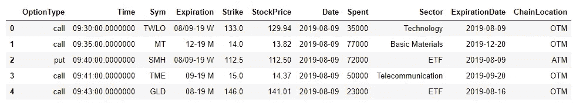
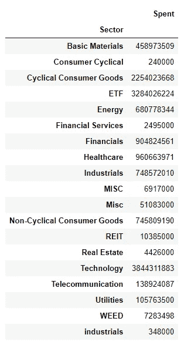
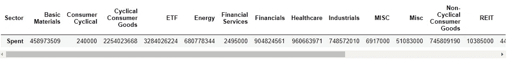
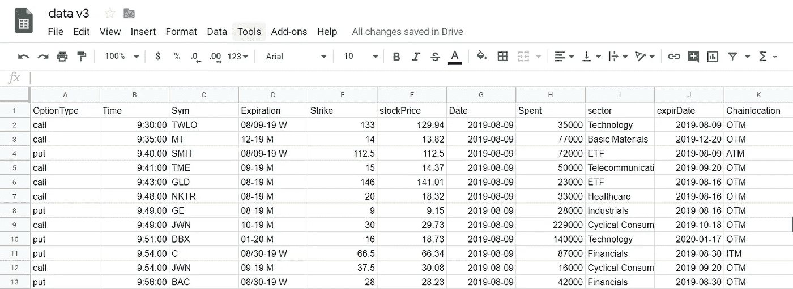
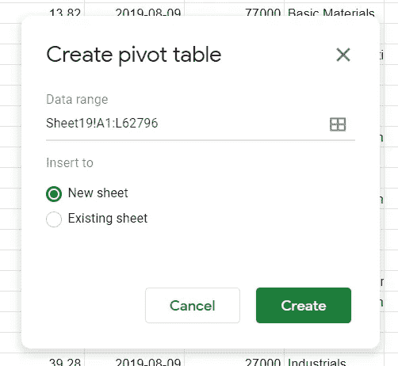
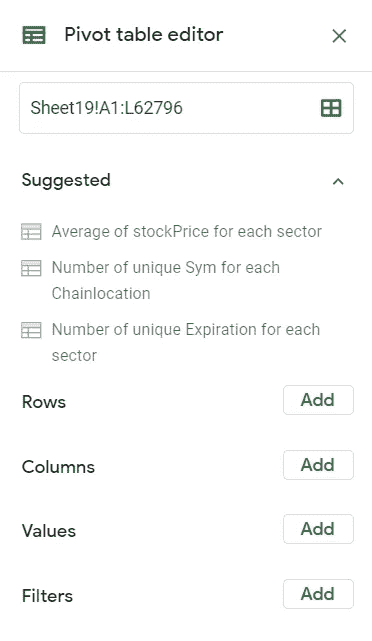
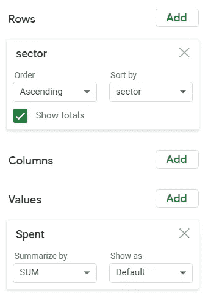
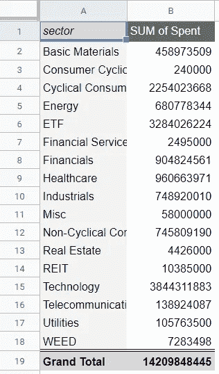
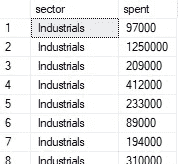
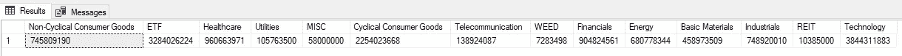

# 使用 Python、SQL 或电子表格透视数据

> 原文：<https://towardsdatascience.com/pivoting-your-data-using-python-sql-or-spreadsheets-62736ba23921?source=collection_archive---------9----------------------->


如今，收集数据似乎比以往任何时候都容易，但这并不意味着你总能以一种能提供你所寻找的洞察力的方式来收集数据。有时，您需要以改变数据组织的方式来操作数据，以便可以从一个新的角度来查看数据。透视数据通常是重新组织数据列和行的一种简单方法，可以将它们转换成组、统计数据或摘要。本文将向您展示使用 Google sheets、Microsoft SQL Server Management Studios 和 Pandas Python 库等工具透视数据的三种简单方法。

如果你想跟进，你可以从 kaggle 下载我的期权时间和销售数据:

 [## 期权市场交易

### 下载数千个项目的开放数据集+在一个平台上共享项目。探索热门话题，如政府…

www.kaggle.com](https://www.kaggle.com/bendgame/options-market-trades) 

# 使用熊猫在 Python 中旋转

Pandas 是一个强大而流行的 Python 数据分析库。它允许您创建数据框，以类似于电子表格或数据库表的结构来查看和操作数据。您可以使用熊猫创建数据透视表，只需几行代码！我将向您展示如何透视列或行:

1.  导入依赖项和数据:

```
import pandas as pd
import numpy as np#read your csv data to a Data Frame
data = pd.read_csv(r'C:\Users\Admin\Desktop\Edge\optionsTradeData.csv')#check the data
data.head() 
```



2.使用 Pandas.pivot_table 函数创建类似电子表格的数据透视表:

```
pd.pivot_table(data, index = ['Sector'], values = ['Spent'], aggfunc = np.sum)
```



**或**您可以将扇区设置为列，而不是将其用作索引:

```
pd.pivot_table(data, columns = ['Sector'], values = ['Spent'], aggfunc = np.sum)
```



# 透视您的电子表格



查看我们的数据，假设我们想要按部门合计支出金额。数据透视表使计算变得简单。Microsoft Excel 和 Google Sheets 具有内置的透视功能，可以轻松转换您的电子表格。要在 google sheets 中创建数据透视表，请遵循以下步骤:

```
1\. Data > Pivot table.
2\. Set the Data range.
3\. Select an insert option data. I recommend New sheet.
4\. Click Create.
```



您将看到一个空表和透视表编辑器，允许您设置行、列、值和过滤器。如果您对数据透视表完全陌生，Google Sheets 会为您提供建议的数据透视表，让您轻松入门:



要获得部门的总支出，我们需要设置我们的行和值:

```
1\. Click Add Rows.
2\. Select sector.
3\. Click Add Values.
4\. Select Spent.
```



您已成功透视了数据，如下所示:



# SQL 中的透视

SQL 是一种强大的查询语言，允许你在关系数据库中检索和操作数据。这是一门相当容易学习的语言，如果你不熟悉它，我强烈推荐[探索基础](https://www.w3schools.com/sql/)。我在工作和家庭中使用[微软 SQL Server 和 SQL Server Management Studios](https://www.microsoft.com/en-us/sql-server/sql-server-downloads) ，所以这是我在我的例子中使用的风格，但是有几种不同的数据库/SQL 环境可供您使用:MySQL、PostgreSQL、SQLite 和 Oracle Database，仅举几例。

Microsoft SQL Server 允许您使用 [PIVOT 关系运算符](https://docs.microsoft.com/en-us/sql/t-sql/queries/from-using-pivot-and-unpivot?view=sql-server-ver15)来旋转和聚合您的数据，将其转换为数据透视表。这是微软文档中透视语法的一个示例:

```
SELECT <non-pivoted column>,  
    [first pivoted column] AS <column name>,  
    [second pivoted column] AS <column name>,  
    ...  
    [last pivoted column] AS <column name>  
FROM  
    (<SELECT query that produces the data>)   
    AS <alias for the source query>  
PIVOT  
(  
    <aggregation function>(<column being aggregated>)  
FOR   
[<column that contains the values that will become column headers>]   
    IN ( [first pivoted column], [second pivoted column],  
    ... [last pivoted column])  
) AS <alias for the pivot table>  
<optional ORDER BY clause>;
```

从输出您想要透视的数据的 **SELECT** 语句开始:

```
(select sector, spent
from v_FlowTotal)
```



从该数据中，选择要透视的列。在我们的示例中，我们希望旋转扇区:

```
select [Non-Cyclical Consumer Goods]
,ETF
,Healthcare
,Utilities
,MISC
,[Cyclical Consumer Goods]
,Telecommunication
,WEED
,Financials
,Energy
,[Basic Materials]
,Industrials
,REIT
,Technology
FROM (
  select sector, spent FROM v_FlowTotal ft
) as SourceTable
```

然后应用 **PIVOT** 运算符以及您的聚合函数:

```
select [Non-Cyclical Consumer Goods]
,ETF
,Healthcare
,Utilities
,MISC
,[Cyclical Consumer Goods]
,Telecommunication
,WEED
,Financials
,Energy
,[Basic Materials]
,Industrials
,REIT
,Technology
FROM (
  select sector, spent FROM v_FlowTotal ft
 ) as SourceTable
PIVOT (
  sum(spent)
  for sector IN (
  [Non-Cyclical Consumer Goods]
  ,ETF
  ,Healthcare
  ,Utilities
  ,MISC
  ,[Cyclical Consumer Goods]
  ,Telecommunication
  ,WEED
  ,Financials
  ,Energy
  ,[Basic Materials]
  ,Industrials
  ,REIT
  ,Technology)
)As PivotTable
```

输出将如下所示:



# 最后备注:

虽然本文将帮助您开始使用数据透视表，但是了解它们所提供的所有功能的最好方法是通过修补和摆弄这些功能！数据透视表易于创建，并允许您通过更改查看数据的方式来获得对数据的洞察力。

# 谢谢大家！

*   *如果你喜欢这个，* [*在 Medium 上关注我*](https://medium.com/@erickleppen) *了解更多*
*   [*通过订阅*](https://erickleppen.medium.com/membership) 获得对我的内容的完全访问和帮助支持
*   *我们连线上*[*LinkedIn*](https://www.linkedin.com/in/erickleppen01/)
*   *用 Python 分析数据？查看我的* [*网站*](https://pythondashboards.com/)

[**—埃里克·克莱本**](http://pythondashboards.com/)