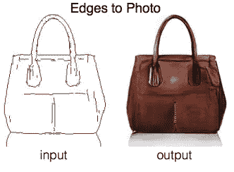
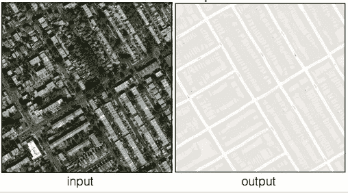
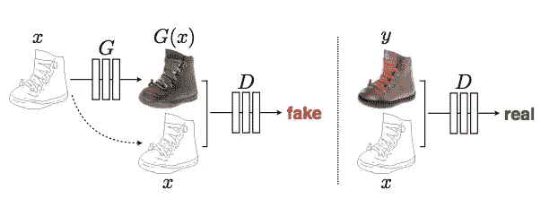
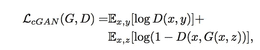
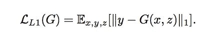
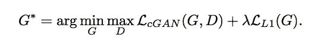
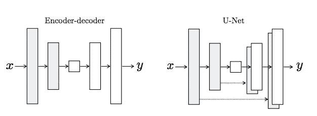
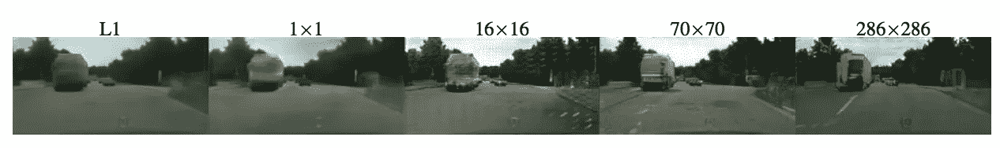
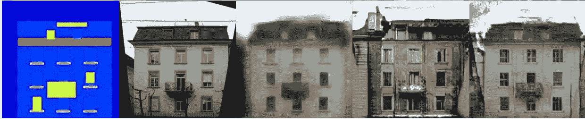

# Pix2Pix

> 原文：<https://towardsdatascience.com/pix2pix-869c17900998?source=collection_archive---------5----------------------->

Shocking result of Edges-to-Photo Image-to-Image translation using the Pix2Pix GAN Algorithm

本文将解释一篇关于使用条件 GANs 进行图像到图像翻译的流行论文 Pix2Pix 的基本机制，以下是该论文的链接:

 [## 基于条件对抗网络的图像到图像翻译

### 我们研究条件对抗网络作为图像到图像翻译问题的通用解决方案…

arxiv.org](https://arxiv.org/abs/1611.07004) 

# 文章大纲

一.导言

二。具有对抗性和 L1 损失的对偶目标函数

三。u 网生成器

四。PatchGAN 鉴别器

动词 （verb 的缩写）估价

# 介绍

图像到图像的翻译是生成对立网络(GANs)非常适合的任务的另一个例子。在这些任务中，几乎不可能对损失函数进行硬编码。大多数关于 GANs 的研究都与新颖的图像合成有关，将随机向量 z 转换成图像。图像到图像转换将一个图像转换为另一个图像，例如将上面的袋子边缘转换为照片图像。另一个有趣的例子如下所示:

Interesting idea of translating from satellite imagery into a Google Maps-style street view

图像到图像的转换在诸如彩色化和超分辨率的应用中也是有用的。然而，许多特定于 pix2pix 算法的实现思想也与那些研究新颖图像合成的人相关。

上面描述了本文中图像到图像转换架构的非常高级的视图。与许多图像合成模型类似，这使用了条件 GAN 框架。调节图像 x 被用作发生器的输入和鉴别器的输入。

# 具有对抗性和 L1 损失的对偶目标函数

进行图像到图像翻译的一个天真的方法是完全抛弃对立的框架。源图像将仅通过参数函数传递，并且结果图像和地面实况输出的差异将用于更新网络的权重。然而，用诸如 L1 和 L2 的标准距离度量来设计这个损失函数将不能捕捉这些图像之间的许多重要的区别特征。然而，作者确实发现了 L1 损失函数作为对抗性损失函数的加权助手的一些价值。

条件-对抗损失(生成器对鉴别器)非常普遍地格式化如下:

前面提到的 L1 损失函数如下所示:

结合这些功能会产生:

在实验中，作者报告说他们发现λ参数等于 100 时最成功。

# u 网生成器

GAN 发生器中使用的 U-Net 架构是本文中非常有趣的部分。图像合成架构通常采用大小为 100×1 的随机向量，将其投影为具有全连接层的更高维向量，对其进行整形，然后应用一系列去卷积操作，直到实现所需的空间分辨率。相比之下，pix2pix 中的生成器类似于自动编码器。

The Skip Connections in the U-Net differentiate it from a standard Encoder-decoder architecture

生成器接收要翻译的图像，并将其压缩成低维的“瓶颈”向量表示。然后，生成器学习如何将其上采样到输出图像中。如上图所示，考虑标准编码器-解码器结构和 U-Net 之间的差异很有意思。U-Net 类似于 ResNets，其方式是将早期层的信息集成到后面的层中。U-Net skip 连接也很有趣，因为它们不需要任何尺寸调整、投影等。因为被连接的层的空间分辨率已经彼此匹配。

# PatchGAN 鉴别器

pix2pix 中使用的 PatchGAN 鉴别器是该设计的另一个独特组件。PatchGAN / Markovian 鉴别器的工作原理是将图像中的单个(N×N)片分类为“真实对虚假”，而不是将整个图像分类为“真实对虚假”。作者认为，这加强了更多的约束，鼓励尖锐的高频细节。此外，PatchGAN 的参数更少，运行速度比分类整个图像更快。下图描述了对要分类的 N x N 个面片的大小 N 进行实验的结果:

The 70 x 70 Patch is found to produce the best results

# 估价

评估 GAN 输出很困难，有许多不同的方法。pix2pix 的作者使用两种不同的策略来评估他们的结果。

第一种策略是使用人工评分。真实图像和用 pix2pix 创建的图像随机堆叠在一起，人类评分员在观看 1 秒钟后将每张图像标记为真实或虚假。这是使用亚马逊 Mechanical Turk 平台完成的。

我发现的另一个非常有趣的评估策略是在综合生成的网络上使用语义分割网络。这类似于另一种非常流行的 GAN 输出量化评估指标，称为“初始分数”，其中基于预先训练的初始模型的分类能力来对合成图像的质量进行评级。

Far Left: Semantic Segmentation Label, Second: Ground Truth Image, Third: L1 Distance Used, Fourth: cGAN used, Far Right: L1 Distance + cGAN

# 结论

Pix2Pix 是一种非常有趣的图像到图像转换策略，它结合了 L1 距离和对抗性损失，并在生成器和鉴别器的设计上有所创新。感谢阅读，请查看论文以了解更多实施细节和对实验结果的解释！