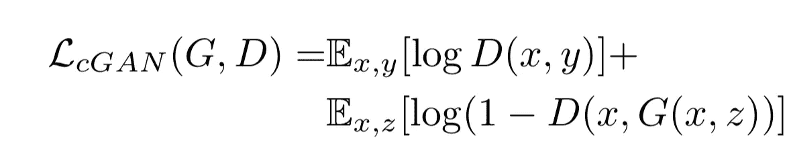
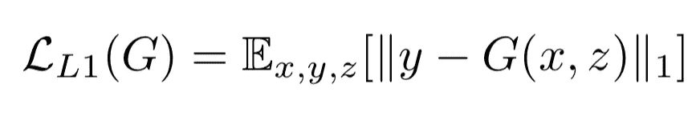
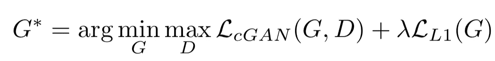
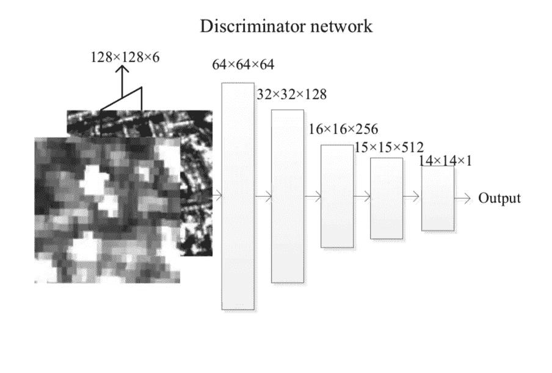
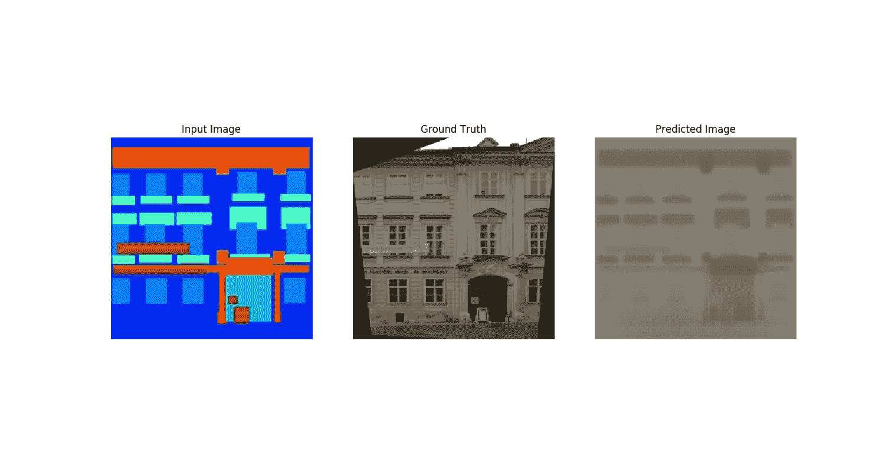
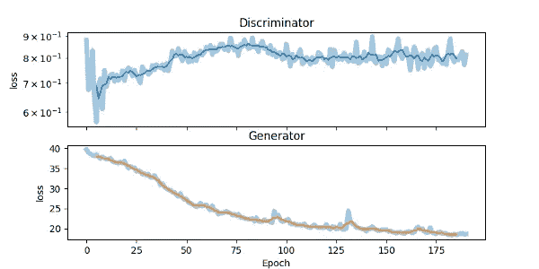
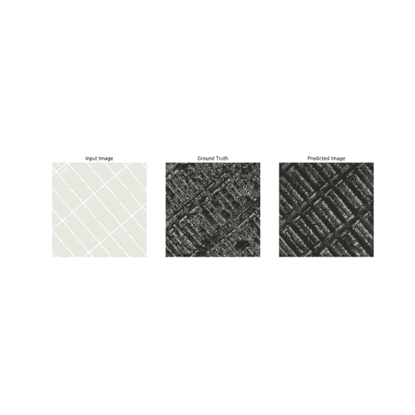
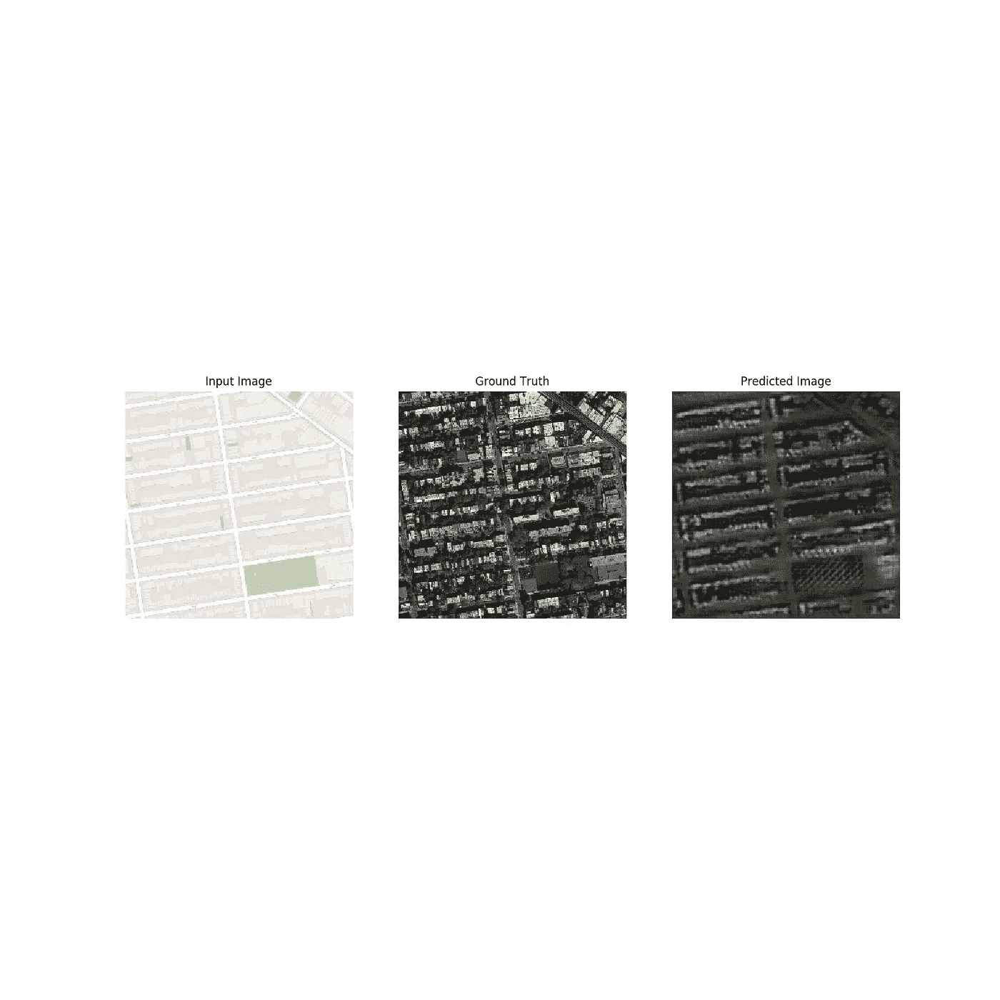

# TensorFlow 2.0 中的 pix2pix GAN

> 原文：<https://towardsdatascience.com/pix2pix-gan-in-tensorflow-2-0-fe0ab475c713?source=collection_archive---------8----------------------->

(查找代码关注本帖 [*此处*](https://gitlab.cern.ch/smaddrel/pix2pix-tf_2_0) 。)

原始代码可以在谷歌联合实验室的[这里](https://www.tensorflow.org/alpha/tutorials/generative/pix2pix)找到，但我把这当成了一个深入挖掘 TensorFlow 2.0 的好机会，以及快速原型开发的高级 API 的更新范围。

关于新特性的详细讨论，以及如何创建模型模块的子类，请看[这里](https://www.tensorflow.org/alpha)。

在这篇文章中，我将假设对用于训练神经网络(NNs)的方法有一个基本的了解，以及生成式对抗网络(GANs)在实践中是如何工作的。要更深入地介绍有条件——GANS 可以看看我以前的文章[这里](https://medium.com/@sam.maddrellmander/conditional-dcgan-in-tensorflow-336f8b03b7b6)，或者超分辨率 GANS [这里](/srgan-a-tensorflow-implementation-49b959267c60)。

这里有三个主题需要解决:首先是什么是图像到图像翻译以及 Pix2Pix 如何适应这种情况的概述；损失函数如何定义、优化以及如何反馈到网络架构决策中的数学原理；以及在两个数据集上训练的结果——分段立面数据集和卫星/谷歌地图数据集，我还将简要讨论代码和训练。

我法师处理比较辛苦。这些数据是复杂的，高度结构化的，作为人类，我们直观地知道一幅好的图像看起来像什么，即使我们不能容易地量化这意味着什么。然而与此同时，我们正在不断推进我们可以用机器学习算法自动处理的边界，从创建比清晰度高很多倍的超分辨率图像，到动态图像处理，以获得硬件无法单独完成的手机摄像头的性能。但一般来说，所有这些问题都是单独解决的；它们令人印象深刻，但我们距离使用机器学习的图像处理通用解决方案还有很长的路要走。

通常，图像到图像的翻译对于每种情况都需要特定的算法和结构，尽管事实上所有这些情况基本上都是相同的。它们都涉及获取一个像素数组并更新值以映射到另一个空间。而不是需要手握着通过这一过程，为什么缺乏通用性？

伯克利的团队开始设计图像到图像翻译问题的通用解决方案，其中底层方法可以用于几乎任意数据，以在广泛的图像域中执行通用翻译，而无需改变底层算法。他们在 2018 年发表的论文[这里](https://arxiv.org/pdf/1611.07004.pdf)，连同 *pix2pix* 软件。

但是首先，我们在谈论什么是图像到图像的翻译？图像处理通常是指我们获取一幅图像，进行一些处理，然后输出一幅新图像。说起来很琐碎，但第二个图像是第一个图像更新版本，是普通 GAN 方法的不足，甚至是基本的条件 GANS，其中输入定义为随机噪声向量。

这个想法是通过学习一组图像和另一组图像之间的映射，网络可以将相同的映射应用到新数据上。这更符合风格转换的一般情况。我要做一个相当全面的声明，图像可以大致分为两个部分。首先，是图像的内容。内容是指图像中的内容——图像中所有部分的对象、景观和空间关系。另一部分可以认为是图像的风格。风格包括颜色、阴影和每个物体的表现方式。

我们可以把这比作一张照片和一个艺术家的印象之间的区别，或者甚至是同一场景的两个艺术表现。潜在的信息和内容是一样的，尽管他们的风格可能大不相同。诀窍是找到一种方法从一个翻译到另一个。

暗示就在术语中:与其关注图像，不如想想语言，就像翻译学习英语和法语之间的映射一样。给定一个一种语言的句子，他们可以将其翻译成另一种语言，同时尽可能多地保留原始信息(内容)，并且仍然可以找到一种自然的方式来表达每种语言的情感(风格)。这就是用 *pix2pix* 的目的。

损失函数和网络体系结构的相互作用是微妙的，正如我们将看到的，解决一个问题通常有多种方法，但首先我们需要为生成性敌对网络定义一个条件损失。这里的关键原理与任何 GAN 相同，即两个网络之间的生成性对抗性最小最大博弈，以优化损失函数:

其中 G 是发生器，D 是鉴别器，x 是条件输入图像，y 是真实图像，z 是随机噪声向量。

*(这里有更详细的讨论，但是基本思想是 G 输出一个图像，使得 D(G)最大化，而 D 被优化以输出真实图像的 1。为什么这个曾经收敛，以及收敛到什么程度，我们是不是找错人了，另一个有趣的讨论是* [*这里*](https://www.researchgate.net/publication/326110520_Convergence_Problems_with_Generative_Adversarial_Networks_GANs) *。)*

这与普通的 GAN 案例已经有了一个关键的区别:它是有条件的。这里的“有条件”是指发生器不仅仅接收一个随机噪声向量，还会接收额外的信息。这可能只是 cDCGAN 中的类信息，或者在这种情况下，条件信息是原始图像。凡尼拉 GAN 依赖于 G:z -> y，条件 GAN 则依赖于 G:{x，z} -> y。

有趣的是，这实际上并不是全貌。当网络训练时，它通常学会忽略随机噪声向量，因此为了保持网络的非确定性，使用了丢失来重新引入随机行为。

在许多 GANs 中，基于通过最小化目标和生成图像之间的欧几里德距离(MSE ),生成器将学习图像的结构和颜色，L2 正则化损失被添加到优化中。然而，发现这通常导致模糊的图像，因此为了克服这一点，L1 正则化损失被添加了一些预因子权重，作为替代:

这给出了要优化的总损耗函数:

下一个关键问题是关于网络的结构。

在此分析中，发生器基于 U-Net 结构，是自动编码器的变体，而鉴别器称为 patch-GAN。

Generator Architecture

使用 U-Net 结构的要点是，网络迫使所有信息通过网络中间的一个紧密瓶颈。这迫使找到输入图像的潜在表示，该潜在表示可以被重构为原始图像，其思想是有限量的信息可以通过-网络被迫学习最佳简化映射，而不能简单地记忆训练集。

这有一个明显的局限性；输出和输入图像的很大一部分应该共享相同的描述。图像的内容应该保持不变。U-net 相对于自动编码器的变化是在 U-Net 结构的每个对称层之间增加了一个跳跃连接，如上图所示。这些级联层具有在网络中以适当的规模直接传递更高级信息的效果，并且减少了通过潜在瓶颈层所需的信息量。这里的想法是，传递的信息关注更细微的细节，而不是大规模的结构。

鉴别器更不典型，可能需要更多的上下文。一般来说，L1 和 L2 正则化是对网络的弱约束，不会产生清晰的细节，因为有许多路径可以获得小的 L 值。然而，这并没有取消损失函数的这一部分，因为它鼓励产生高层次的结构，这在鉴别器的选择中被利用。

可以通过多种途径将清晰的细节引入到生成的图像中:

1.  调整 L1/L2 损耗上的λ预因子的权重——如上所述，这导致相对模糊的图像，通常是正确的，但没有清晰的细节。
2.  增加了量化输出图像性能的额外损失-已经尝试了许多使用预训练网络来评估输出图像质量的方法。特别是在 SRGAN 的情况下，VGG 网络在目标和输出图像上的潜在空间之间的距离被最小化。
3.  更新鉴别器以提升清晰的细节——patch-GAN——似乎太明显了，不是吗？

Patch-GAN Discriminator [[here](https://www.researchgate.net/publication/328150573_Dialectical_GAN_for_SAR_image_translation_From_sentinel-1_to_TerraSAR-X)]

patch GAN 的工作方式是，不是对整个图像进行分类，而是仅对图像的一部分(NxN)进行真假分类。“补丁”扫描图像，对每个图像进行预测，并优化平均值。

这假设图像可以被视为马尔可夫随机场，其中由 N 个或更多像素分隔的像素是独立的。当考虑高层结构时，这对于整个图像来说是不正确的，但是当查看低层细节时，这是一个合理的假设。

这里的优点是用修补 GAN 保留了细节；为了通过鉴别器测试，鼓励现实的低水平细节，并且使用正则化损失来保存总体结构。与整个图像分类器相比，这种修补方法的另一个重要优点是速度快，因为小的 NxN 修补比单个鉴别器评估和训练更快。它还可以有效地缩放到任意大小的图像。

网络的训练有两个技术点。首先，训练不是最小化(1-log D)，而是最大化 log(D)。其次，鉴别器目标函数在训练期间减半，以限制鉴别器相对于发生器的训练速率。

最后，我们来看看我复制论文结果的实验结果。如上所述，我复制结果的代码可以在这里找到，使用 tensorflow 2.0 高级 API 编写。使用单个 GPU 计算节点，在 Amazon AWS EC2 单元上训练了 200 个历元来重现立面结果——每个历元花费了大约 4 分钟。在训练过程中，每 10 个时期拍摄快照图像，并全程记录发生器和鉴别器的损耗。

正如你在这些结果中看到的，建筑的结构已经被发现，并且风格从每一个被映射的部分是一致的。

一些细节显然在分割中丢失了，特别是在每个特征的正面和精细结构的边缘周围，以及窗户和柱柱顶周围的楣梁，正如预期的那样。

很明显，细节没有像论文中描述的那么好。此外，建筑物边缘的模糊性在视觉上不是很吸引人——这是训练 gif 中变化最大的区域，随着时代的增加会稳定下来。

随着训练持续时间的延长，我们可能会期待稍好的结果，因为很明显损失函数还没有完全饱和。

地图数据有一个稍微不同的问题。虽然在这些示例中恢复的一般道路布局和要素相当一致，但生成的结果似乎不如立面输出稳定，并且整个图像更经常出现错误。这些图像看起来也相当暗，可能是因为道路与建筑物或草地之间的对比度比立面上的元素之间的对比度低。

结论是，虽然 pix2pix 方法显然具有令人印象深刻的发电能力和通用性，但它的训练成本仍然相对较高，至于持续恢复最精细的细节，未来几年还需要做更多的工作。