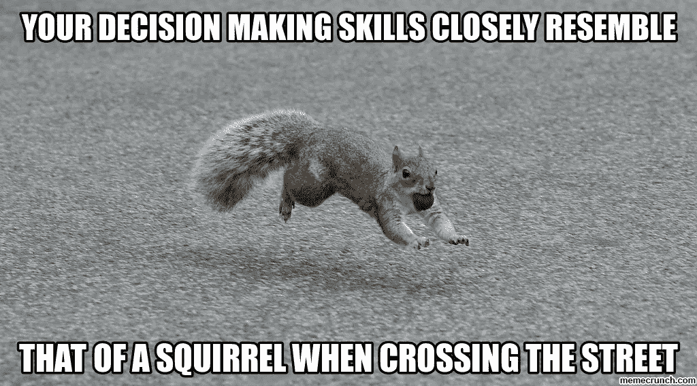
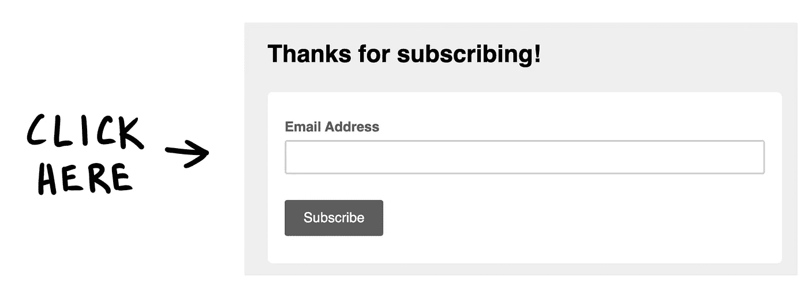

# 规划数据科学项目？需要做出的最高决策

> 原文：<https://towardsdatascience.com/planning-a-data-science-project-top-decisions-to-be-made-e131fd324f5b?source=collection_archive---------32----------------------->

Source: unsplash — free stock images

## 6 个问题让你自己不被打败

谁说选择很容易？如果我们能有一个分类模型来告诉我们是否做出了正确的决定，这不是很好吗？可惜，那是不存在的(至少现在是！)在生活的任何方面，从几个选项中选择任何一个，确实是一个挑战。不管我们是在两种不同口味的汽水中做出选择，还是从衣柜里拿出一件 t 恤，去哪里吃晚餐，或者就像在这种情况下，决定在接下来的几周里让自己沉浸在一个数据科学项目中。

毫无疑问，这从来都不容易，但有些决定显然比其他的更容易。我们面临的这种情况可能是最重要的因素，但它也关系到我们拥有的选项数量，以及我们最终评估我们是否做出了正确决定时所考虑的因素。但是还有一个额外的关键因素，那就是决策背后的人:我感兴趣的不一定是你感兴趣的。

这就是为什么我想告诉你我问自己的问题，以选择一些想法来面对一个中等长度的数据科学项目。有句名言是这样说的:

> *“好的决策来自经验，经验来自坏的决策”*

虽然不可能知道这句话是谁第一次说的，因为它被网络上许多不同的人引用，但我可以向你保证，我将详细描述的这些问题来自经验…肯定是一些错误的决定。因此，我希望您能提前发现它对您的特定项目非常有用:

1.  **应该是哪个题目？**你将带着它深入黑暗。在接下来的几个月里，一周几天，所以首先试着选择一些你有激情的事情。不要仅仅因为某个主题的公众相关性或其他有偏见的原因而选择它。
2.  **我能面对哪一级别的困难？在网上调查在这个领域或类似项目中工作过的其他人，以确保你能够掌握所有必要的工具。**
3.  哪个应该是我的目标？我将试图发现什么？也许这个话题非常有趣，但是没有真正的意义去研究它。你的目标越具体越好。这将有助于以后评估您的项目结果，不仅使用典型的数据科学指标，而且对照您的目标。
4.  你的项目会有观众吗？如果答案是肯定的，那么确保你能同时解决自己和他们的兴趣。否则，你可能会以一个除了你之外没人感兴趣或者没人理解的非常酷的项目结束。
5.  我有足够的时间吗？这似乎是显而易见的，但是当我们面对一个有固定期限的项目时(例如，我们必须提交的学校项目)，制定一个时间表是必要的。计划我们要做的每一步，确切地知道我们应该在哪个日期完成项目的每个阶段。否则，我们可能会在最后一周结束，甚至没有完成我们的数据集，因为仍然在做网络抓取。
6.  **有可能获得数据吗？**一个需要尽快得到答案的关键问题。如果你不知道如何获取信息，你就一无所有。此外，就这一点向自己提出以下问题也很重要:

*   来源:具体从哪里获取数据？
*   格式:会是哪种格式？你能处理那种格式吗？
*   采取必要的行动:你会废弃它吗？找人要数据集？

如你所见，归根结底，就是做决定。作为我们心爱的决策树，选择数据科学项目是将我们引向终点的小决策的分支:我们的项目。

如果你来到这里，你想知道更多关于我的项目，我邀请你访问我的 GitHub 个人资料，我已经上传了其中的一些:【https://github.com/gonzaferreiro。此外，不要忘记查看我的上一篇文章，关于我在训练测试分裂中犯的 6 个业余错误，以及我的[作者简介](https://towardsdatascience.com/@g.ferreiro.volpi)中的更多内容。如果你喜欢这篇文章，别忘了关注我，**如果你想直接在你的邮箱里收到我的最新文章，就订阅我的时事通讯吧:)**

感谢阅读！