# 计划环游世界，用 Python？

> 原文：<https://towardsdatascience.com/planning-to-travel-around-the-world-with-python-42fac1d21a6e?source=collection_archive---------16----------------------->

## 如何使用 Python 中的底图和 Networkx 包来规划您的环球旅程


环游世界一直是每个人的梦想，但我们中很少有人准备这样做。老实说，我们甚至不知道环游世界意味着什么。当然，我不能提供你旅行时需要的任何东西，比如钱和假期，这也是我所缺乏的。然而，你可以用从文章中学到的技巧开始计划，或者做白日梦。

本文分为两部分:

*   【第 1 部分】—这篇文章讲的是如何用 Python 中的`Basemap`包绘制地图。旅行前和旅行中需要地图，可以用 Python 中的包画出需要的东西。[[Jupyter 笔记本中的源代码](https://github.com/BarryPan/Traveling_Tool_Analysis_on_Medium/blob/master/S1_Map.ipynb)
*   [第二部分] —这篇文章是关于如何用 Python 中的`Networkx`包为我们优化环游世界的路线。`Networkx`是 Python 中一个分析复杂网络的强大软件包，它将有助于我们制定环游世界的计划，有了我们的目标。[[Jupyter 笔记本](https://github.com/BarryPan/Traveling_Tool_Analysis_on_Medium/blob/master/S2_Route.ipynb)中的源代码]

# 第一部分

# 底图简介

matplotlib 底图工具包是一个用 Python 在地图上绘制 2D 数据的库。 正如大家都认同可视化对于人们理解数据真的很重要，地图是我们在处理地理位置时最好的可视化方法(我相信没有人在没有地图的情况下擅长处理经纬度数据。)`Basemap`是 Python 中一个强大的包，我们将挑选一些重要的特性来详细解释。要对这个包有更多的了解，请查看[文档](https://matplotlib.org/basemap/users/index.html)。

## **投影**

众所周知，地球是圆的。因此，要把它做成 2D 地图，我们需要一些投影方法。在`basemap`包中，支持多种投影方式，这里的列表是。下面是两个如何在`basemap`中应用不同投影方法的例子。

**投影—正投影**

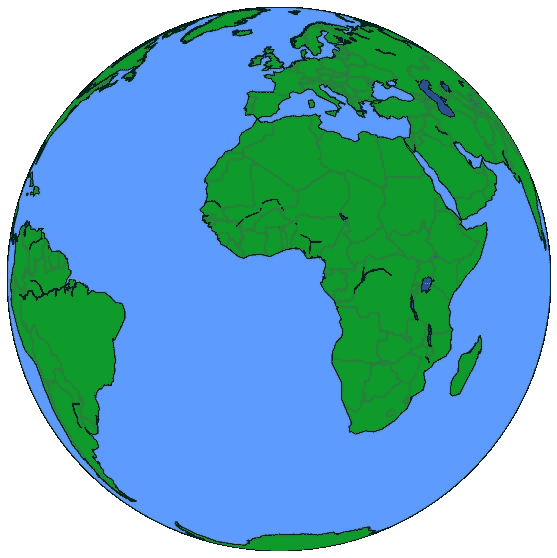

Orthographic

**投影—瘿体视学**

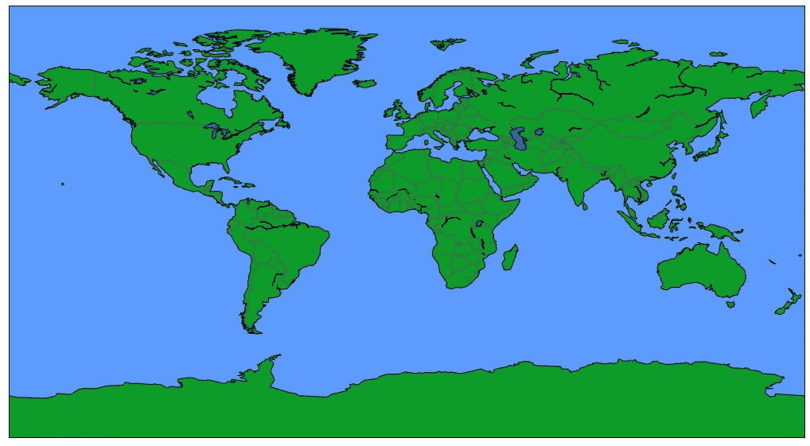

Gall Stereographic

## **绘画要点**

既然我们能画一张地图，我们就想在上面标出一些地方。在`baemap`包中，我们可以使用之前定义的`basemap`对象将纬度和经度转换到`matplotlib`中的坐标系。之后，我们可以应用`scatter`或`annotate`函数在地图上放置点。在下面的例子中，我们标记了美国的四个主要城市，纽约、华盛顿、DC、洛杉矶和旧金山。

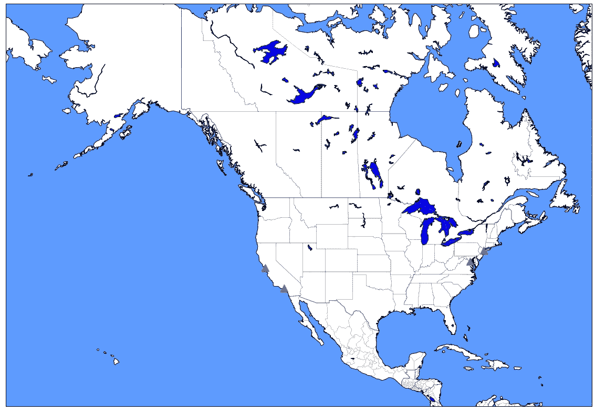

Marking the four major cities with basemap

## **绘制路线**

除了在地图上放置点之外，我们还需要画线来可视化两个地方之间的路线。我们知道，地图上两点之间最短的路线不是直线，而是[大圆路线](https://en.wikipedia.org/wiki/Great_circle)。在`basemap`包中，我们可以用`gcpoints`功能绘制路线，做出大圆路线。以下是使用`gcpoints`功能从纽约到旧金山的路线示例。

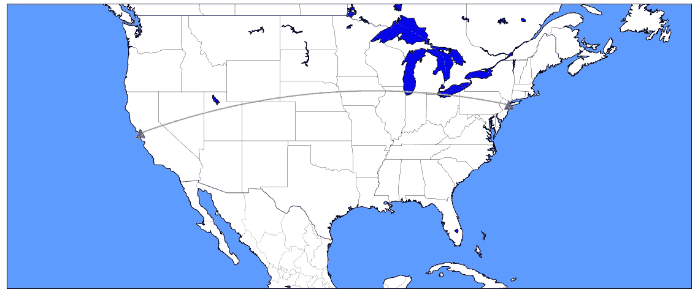

Route between New York and San Francisco

T 这里还有很多有趣的功能在`basemap`包里，让你的地图更有信息量和吸引力。例如，`arcgisimage`可以用卫星照片创建地图。然而，我们现在已经足够好，可以继续制定环游世界的计划了。

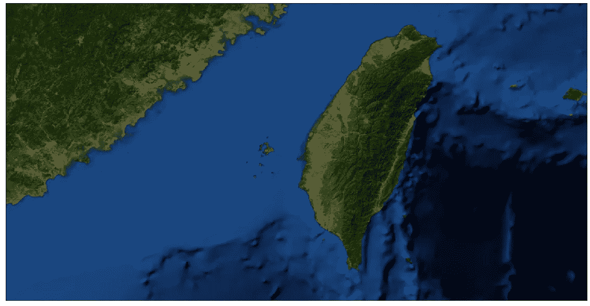

Satellite map for Taiwan with arcgisimage function in basemap package

# 玩真实数据

在我们的计划中，我们想乘飞机环游世界。在 [OpenFlights](https://openflights.org/data.html) 数据库中，我们能够访问世界各地的机场和航线信息。有了这些信息，我们可以制定环游世界的计划。不过，在此之前，我们先来看看数据，先用`basemap`工具可视化一下。

## 机场

在 OpenFlights 中，包含了全球所有 6060 个机场，完整的名称、城市、国家、IATA 代码、纬度、经度等所有信息。此外，由于它有经度和纬度信息，我们可以很容易地通过谷歌地图 api 或其他工具查找更多的细节，例如机场属于哪个洲。我们也可以使用`basemap`工具将不同大洲的机场用不同的颜色放在地图上:北美、南美、亚洲、欧洲、非洲和大洋洲，如下所示。


Airports around the world (Source: OpenFlights)

## 途径

尽管我们拥有世界各地的所有机场信息，但在考虑如何环游世界时，我们仍然需要航线信息，因为并非所有两个机场都是相连的。在 OpenFlights 中，它确实有航线信息。可惜 2014 年 6 月之后就不更新了。虽然并不完美，但我们仍然可以使用这些数据，并假设这些路线从 2014 年起没有太大变化。

OpenFlights 数据库中有 67，663 条不同的航线。它有源机场和目的地机场的信息，以及航空公司，站的数量和设备的细节。如果我们只考虑来源和目的地机场，数据中有 33，971 条不同的航线。我们可以在`basemap`中应用工具来可视化这些路线，如下所示。

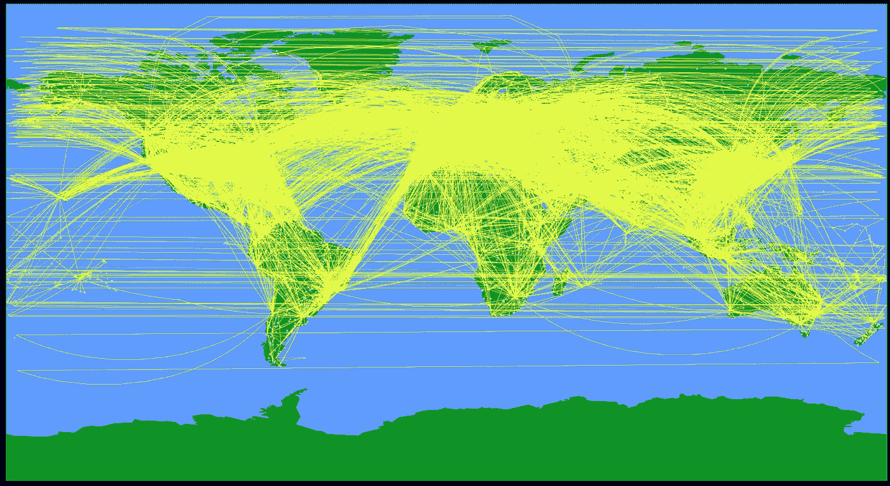

Airline routes around the world (Source: OpenFlights)

现在我们有了所有的知识:用 Python 在地图上可视化的技能集，以及关于机场和航线的信息。看起来我们已经为下一步做好了准备:优化我们环游世界的路线。

# 第二部分

# 环游世界的定义

给问题下一个好的定义总是最重要的。在我们开始分析之前，我们需要为我们定义什么是“**环游世界**”:*如果你在北美、南美、亚洲、欧洲、非洲和大洋洲的每个大洲都至少游览过一个地方，那么你就已经环游了世界。*

# 网络简介 x

etworkx 是一个 Python 包，用于创建、操作和研究复杂网络的结构、动态和功能。我们可以把机场之间的飞行路线看作一个复杂的网络，因此`Networkx` package 非常有助于我们分析它们。开始之前，我们需要先熟悉一些术语:

*   **节点:**网络中的点；在我们的例子中，机场是航空网络中的节点。
*   **边:**两点之间的连接；在我们的例子中，飞行路线是边。由于不是所有两个机场都连接，我们需要使用 OpenFlights 中的路线数据来定义它们。
*   **有向/无向图:**有向图中，从 A 到 B 的边不等于从 B 到 A 的边；相比之下，在无向图中，边 A 到 B 与 B 到 A 是相同的。在我们的例子中，我们应该使用有向图，因为从 A 到 B 的路线并不表示从 B 到 A 有相应的路线。
*   **简单/多图:**简单图中，每个点之间最多有一条边；在多图中，它允许两个节点之间有多条边，并且每条边可以有不同的属性。为了简化我们的分析，我们选择使用简单的图模型，这意味着我们不考虑航空公司的差异。

## Networkx 包中的函数

下面是一些对我们分析空中飞行网络有用的函数:

*   **dijkstra_path** :用 [Dijkstra 的算法](https://en.wikipedia.org/wiki/Dijkstra%27s_algorithm)从 A 到 B 的最短路径。我们可以在函数中放入“权重”来表示如何计算“距离”。例如，我们要查找从亚特兰大到台北的最短路径是在仁川机场(ICN)停留，代码如下。

```
nx.dijkstra_path(G, source='ATL', target='TPE', weight='Distance')>> [Output]: ['ATL', 'ICN', 'TPE']
```

*   **single_source_dijkstra** :当我们没有特定的目的地时，我们可以使用该功能计算到所有可能目的地的距离，并考虑中途停留选项。

# 使用 OpenFlights 数据

## 寻找去另一个大陆的最短路线

没有软件包，我们仍然可以对开放航班的路线数据进行一些分析。例如，我们可以通过`geopy`包中的`geodesic`函数从机场的纬度和经度计算距离。我们可以使用`pandas`包查看每个大陆到另一个大陆的最短路线，该包包含已处理的数据集，其中包含计算的里程信息，如下所示。

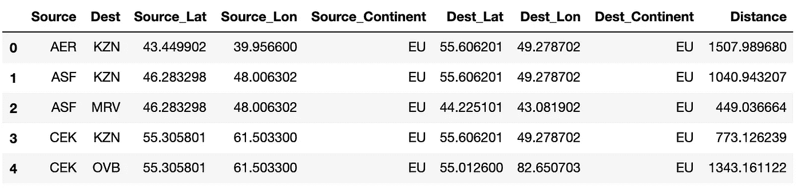

Top 5 rows for Route_Mileage table

有了这个表格，我们可以找到到另一个大陆的最短距离和相应的机场。以北美为例，到南美的最短路线是从[比阿特丽克斯女王国际机场(AUA)](https://en.wikipedia.org/wiki/Queen_Beatrix_International_Airport) 到 [Josefa Camejo 国际机场(LSP)](https://en.wikipedia.org/wiki/Josefa_Camejo_International_Airport) 。到大洋洲，最短的路线是从[HNL 井上国际机场](https://en.wikipedia.org/wiki/Daniel_K._Inouye_International_Airport)到[CXI 卡西迪国际机场](https://en.wikipedia.org/wiki/Cassidy_International_Airport)。各大洲之间的最短旅行路线可在地图上显示如下。


The shortest routes from North America to another continents

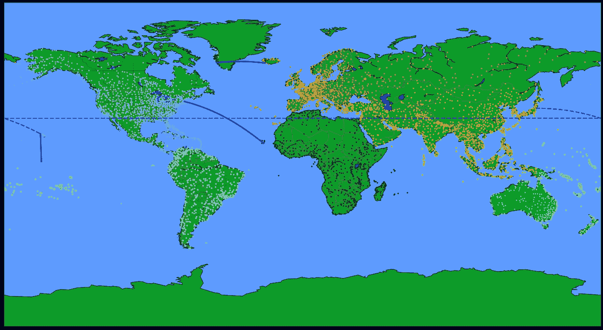

The shortest routes from North America to another continents

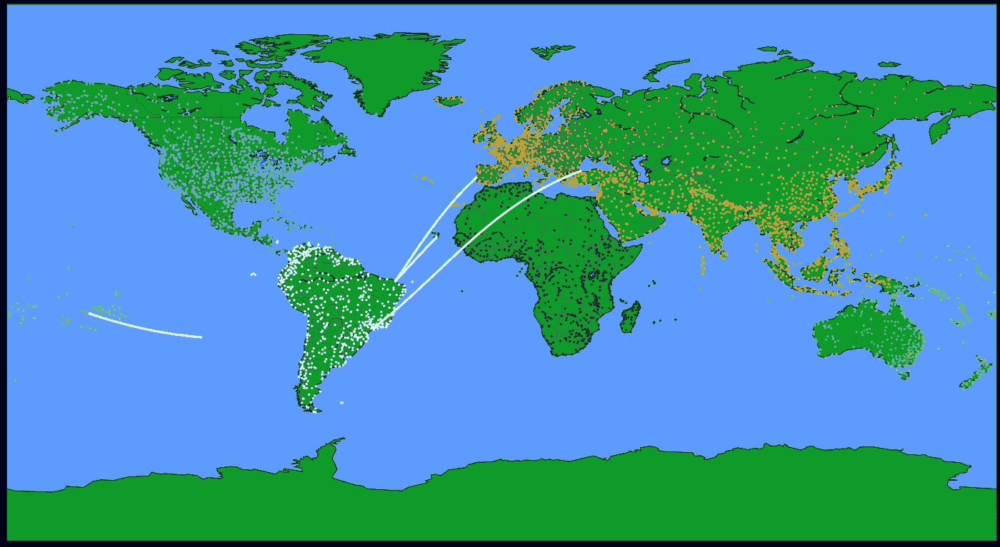

The shortest routes from South America to another continents

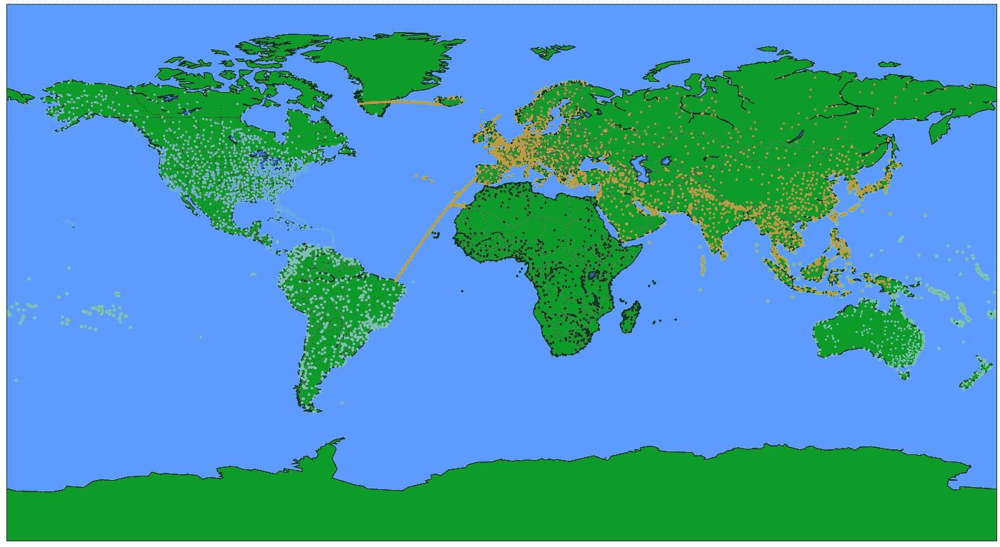

The shortest routes from Europe to another continents


The shortest routes from Africa to another continents

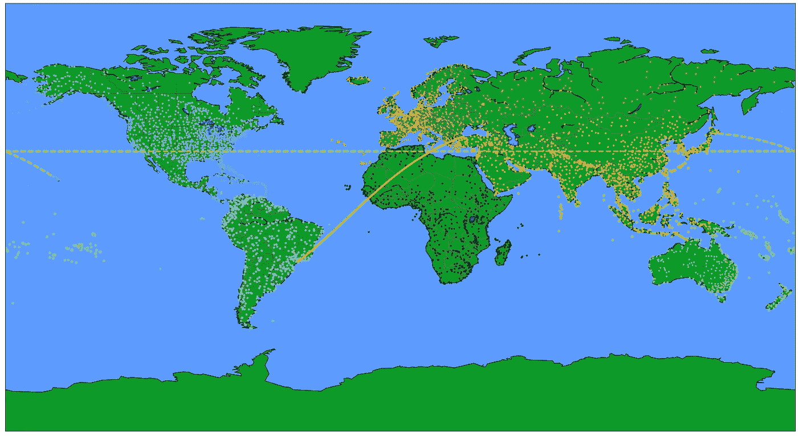

The shortest routes from Asia to another continents

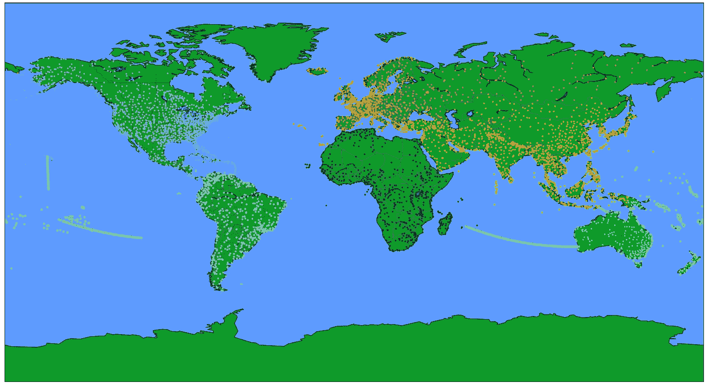

The shortest routes from Oceania to another continents

请注意，欧洲和大洋洲之间没有直达航线。然而，这并不意味着欧洲人不能去大洋洲，因为我们总是可以在其他机场转机。在这种复杂的情况下，我们可以使用`Networkx`包来有效地处理它。

## 将 OpenFlight 数据导入网络

在 F 或 Networkx 2.3 版本中，我们可以用`from_pandas_edgelist`函数从`pandas`导入边，并将其他列作为边的属性。我们可以通过`Networkx`中的`set_node_attributes`功能输入所有机场的纬度、经度和大陆信息，并通过以下代码使我们将来的分析更加容易。

Code to import data to Graph and set node attributes

# 优化我们的旅行

我们可以把我们的目标定义为以最短的距离游遍六大洲。当然，我们可以计算两个机场之间的所有距离，并优化解决方案。然而，由于世界上有 6000 多个机场，可能会有数百万对机场，计算可能会花费很长时间。因此，在给定我们当前所处的位置的情况下，我们可以通过找到离另一个大陆最近的机场来实现目标，而不是计算所有两个机场之间的距离。按照这种逻辑，我们定义一个定制的函数如下。

在函数中，我们可以更改一些输入参数:

*   **G** :全球航线网络图。应该是`Networkx`中的图形对象。
*   **Start_Airport** :我们出发的机场。
*   旅行中我们必须去的机场列表。
*   旅行中我们不想去的机场列表。

## 计划我们的旅行

有了这个工具，我们可以开始环游世界的计划。假设我们从亚特兰大(ATL)开始我们的旅行，我现在住在那里。无需放置任何`Must_go`和`Dont_go`站点，我们可以在地图上可视化结果。红色的三角形代表我们计划去的目的地机场，黑色的圆点代表我们中途停留的地方。旅行从亚特兰大开始，第一站是[南美洲**的**BAQ****](https://en.wikipedia.org/wiki/Ernesto_Cortissoz_International_Airport)**欧内斯特·科尔蒂索兹国际机场。之后我们将飞往西班牙特内里费岛的 **TFN** 、西撒哈拉的**欧洲的** ) **EUN** 、土耳其的**亚洲的**、**或帕劳的**大洋洲的**，然后返回亚特兰大。如我们所愿，我们走遍了 6 大洲，总距离 39905 公里。****

****

**Our plan for traveling around the world from Atlanta**

**正如先前的计划所示，有许多机场实际上远离“我们认为”它应该属于的大陆。例如，TFN 机场，尽管它在西班牙之下，是欧洲的一部分，但它实际上更靠近非洲。此外，我想在旅途中回到台北的家。我们可以用`Globetrotting`函数中的`Must_go`和`Dont_go`参数来完成这两个目标。这是我环游世界的最终计划。**

****

**Plan for traveling around the world from Atlanta with requirements, total distance: 41,830 km**

# **结论**

**在这篇文章中，我们应用`Networkx`软件包分析全球航线网络，并使用 matplotlib 中的`basemap`软件包将结果可视化。如前所述，`Networkx`是一个强大的复杂网络分析包，在困难的情况下提供有用的信息。有了这些工具，我们可以计划我们的环球旅行，这意味着在一些定制的要求下，访问所有 6 大洲。此外，我们可以在地图上可视化我们的计划，如图所示。**

**H 然而，尽管我们现在精通`Networkx`和`basemap`套餐，但我们仍然缺乏最重要的资源，时间和金钱，来真正地环游世界。因此，希望我们明天都有一个愉快的工作日！**

**欢迎通过 [LinkedIn](https://www.linkedin.com/in/panda0613/) 讨论任何关于 Python、R、数据分析或者 AI 的问题。只是不要在我面前炫耀你的旅行照片！**