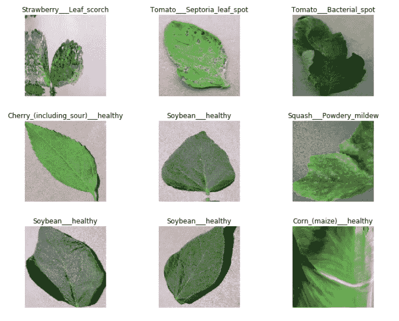
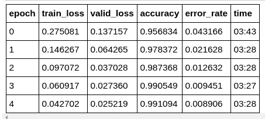
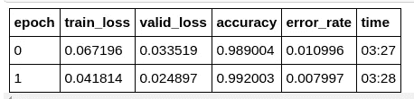
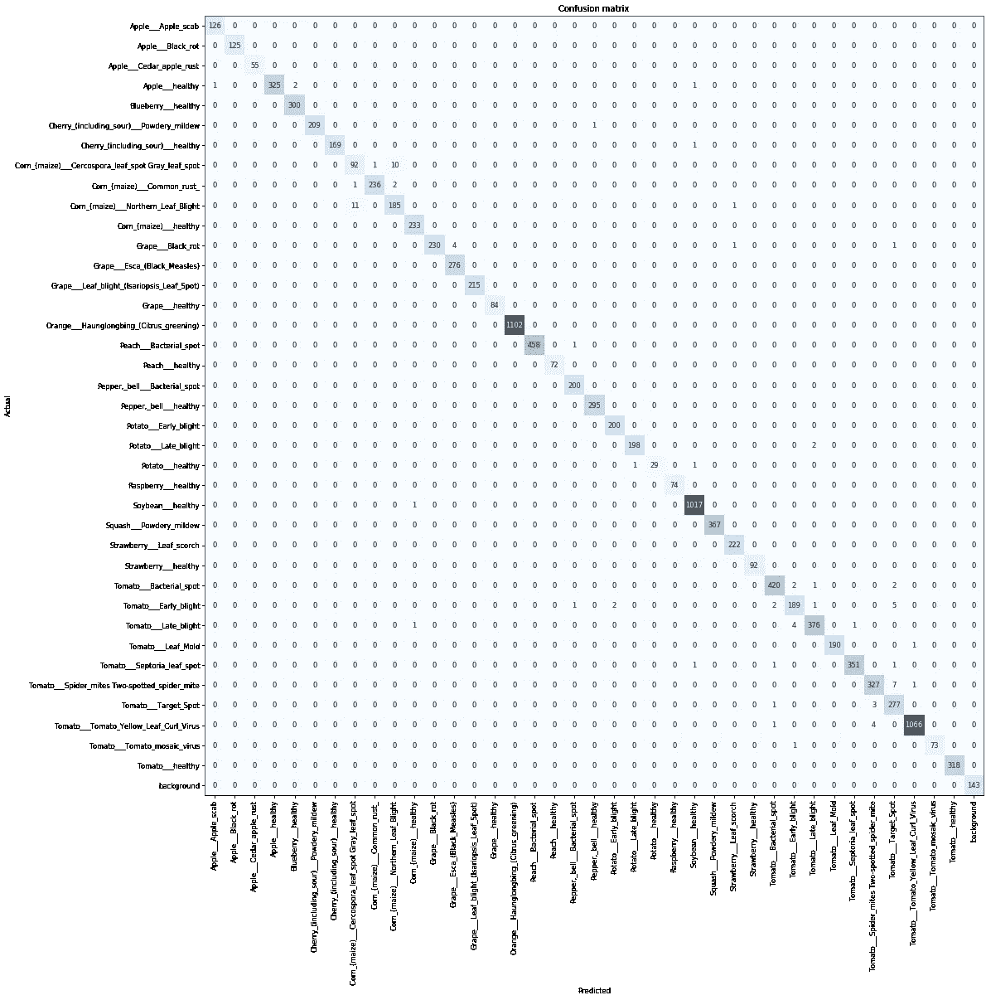
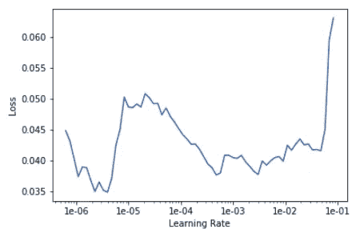
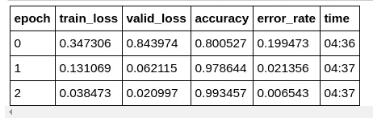
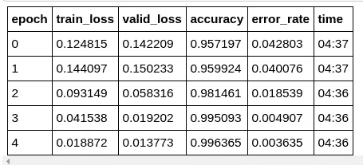
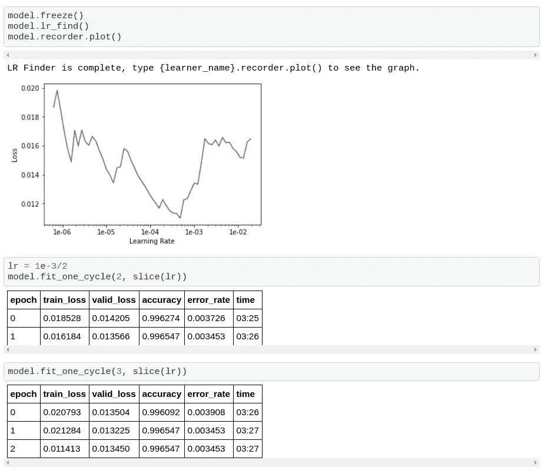

# 使用 Fastai 的植物病害检测 Web 应用程序

> 原文：<https://towardsdatascience.com/plant-disease-detection-web-application-using-fastai-b0c389b82371?source=collection_archive---------7----------------------->

## 利用 fast.ai 实现最先进的结果


# 介绍

使用 FastAi 创建一个人工智能 web 应用程序，该应用程序可以检测**植物**中的**疾病**，FastAi 构建在脸书深度学习平台 **PyTorch** 之上。据联合国粮食及农业组织(UN)称，跨境**植物害虫**和**疾病**影响粮食作物，给农民造成重大损失，威胁粮食安全。

> Resnet34 模型的准确率达到 99.654%

# 动机

对于这个挑战，我使用了"[**plan village**](https://plantvillage.psu.edu/)**"**数据集。该数据集包含一个开放的植物健康图像库，以支持移动疾病诊断的开发。该数据集包含 54，309 幅图像。这些图像涵盖了 14 种作物:*苹果、蓝莓、樱桃、葡萄、橙子、桃子、甜椒、土豆、覆盆子、大豆、南瓜、草莓和番茄*。它包含 17 种基础疾病、4 种细菌性疾病、2 种霉菌(卵菌)疾病、2 种病毒性疾病和 1 种由螨虫引起的疾病的图像。12 种作物也有健康叶片的图像，这些叶片没有明显受到疾病的影响。

# 平台


我用过 ***谷歌云平台*** ，基础平台叫`n1-highmem-8`，每小时收费 0.12 美元。安装一个 P4 图形处理器每小时要花费 0.26 美元，所以两者加起来总共是每小时 0.38 美元。以及建议的 200GB 标准磁盘存储大小，将会有每月 9.60 美元的**额外费用**。对于完整的演练，设置访问[这里](https://course.fast.ai/start_gcp.html)！

# 培养

我使用的是建立在 Pytorch 之上的 fastai。数据集由来自 [PlantVillage](https://plantvillage.org/) 数据集的 38 个疾病类别和来自斯坦福背景图像 [DAGS](http://dags.stanford.edu/projects/scenedataset.html) 开放数据集的 1 个背景类别组成。**数据集的 80%用于训练，20%用于验证。**


Source: Google Images

我们将使用预先培训的 **resnet34** 模型来解决培训中的问题。

用下面三行开始每个笔记本:

jupyter 笔记本中以' % '开头的线条称为 [**线条魔法**](https://ipython.readthedocs.io/en/stable/interactive/magics.html) 。这些不是 Python 要执行的指令，而是 Jupyter notebook 的指令。

前两行将确保每当您在库中进行任何更改时自动重新加载。第三行显示笔记本中的图表和图形。

导入所有导入库:

```
from fastai import *
from fastai.vision import *
from fastai.metrics import error_rate, accuracy
```

现在，给出数据集的路径(在我的例子中，它在根目录中):

```
PATH_IMG = Path('PlantVillage/')
```

批量意味着我们将一次输入 x 张图像，以更新我们深度学习模型的参数。如果较小的 GPU 使用 16 或 32 而不是 64，则将批量大小设置为 64。

```
bs = 64
```

`ImageDataBunch`用于根据图像进行分类。

[imagedata bunch . from _ folder](https://docs.fast.ai/vision.data#ImageDataBunch.from_folder)自动从文件夹名称中获取标签名称。fastai 库有[很棒的文档](https://docs.fast.ai/)来浏览他们的库函数，并附有如何使用它们的实例。一旦加载了数据，我们还可以通过使用。标准化为 ImageNet 参数。

```
img_data = ImageDataBunch.from_folder(path=PATH_IMG, train='train', valid='val', ds_tfms=get_transforms(), size=224, bs=bs)img_data.normalize(imagenet_stats)
```

*   `path`图片目录的路径。
*   `ds_tfms`图像所需的变换。这包括图像的居中、裁剪和缩放。
*   `size`图像要调整的大小。这通常是一个正方形的图像。这样做是因为 GPU 中的限制，即 GPU 只有在必须对所有图像进行类似计算(如矩阵乘法、加法等)时才会执行得更快。

为了查看图像的随机样本，我们可以使用。show_batch()函数 ImageDataBunch 类。

```
img_data.show_batch(rows=3, figsize=(10,8))
```



让我们打印数据中出现的所有数据类。如上所述，我们总共有 39 个类别的图像！

```
img_data.classes''' 
Output of img_data.classes:
['Apple___Apple_scab',
 'Apple___Black_rot',
 'Apple___Cedar_apple_rust',
 'Apple___healthy',
 'Blueberry___healthy',
 'Cherry_(including_sour)___Powdery_mildew',
 'Cherry_(including_sour)___healthy',
 'Corn_(maize)___Cercospora_leaf_spot Gray_leaf_spot',
 'Corn_(maize)___Common_rust_',
 'Corn_(maize)___Northern_Leaf_Blight',
 'Corn_(maize)___healthy',
 'Grape___Black_rot',
 'Grape___Esca_(Black_Measles)',
 'Grape___Leaf_blight_(Isariopsis_Leaf_Spot)',
 'Grape___healthy',
 'Orange___Haunglongbing_(Citrus_greening)',
 'Peach___Bacterial_spot',
 'Peach___healthy',
 'Pepper,_bell___Bacterial_spot',
 'Pepper,_bell___healthy',
 'Potato___Early_blight',
 'Potato___Late_blight',
 'Potato___healthy',
 'Raspberry___healthy',
 'Soybean___healthy',
 'Squash___Powdery_mildew',
 'Strawberry___Leaf_scorch',
 'Strawberry___healthy',
 'Tomato___Bacterial_spot',
 'Tomato___Early_blight',
 'Tomato___Late_blight',
 'Tomato___Leaf_Mold',
 'Tomato___Septoria_leaf_spot',
 'Tomato___Spider_mites Two-spotted_spider_mite',
 'Tomato___Target_Spot',
 'Tomato___Tomato_Yellow_Leaf_Curl_Virus',
 'Tomato___Tomato_mosaic_virus',
 'Tomato___healthy',
 'background'] 
'''
```

为了创建迁移学习模型，我们需要使用函数`cnn_learner`，它接受数据、网络和`metrics`。`metrics`仅用于打印培训的执行情况。

```
model = cnn_learner(img_data, models.resnet34, metrics=[accuracy, error_rate])
```

我们将训练 5 个纪元。

```
model.fit_one_cycle(5)
```



正如我们在上面看到的，通过在默认设置下运行五个时期，我们对这个细粒度分类任务的准确率大约是 99.10%。

再训练两个纪元吧。

```
model.fit_one_cycle(2)
```



***这次准确率 99.2%！***

现在用`.save()`保存模型。

```
model.save('train_7_cycles')
```

我们也可以画出混淆矩阵。

```
interpret = ClassificationInterpretation.from_learner(model)

interpret.plot_confusion_matrix(figsize=(20,20), dpi=60)
```



我们使用`lr_find`方法来寻找最佳学习速率。**学习率**是一个重要的超参数。我们习惯用αα来表示这个参数。如果学习速度太慢，我们需要更多的时间来达到最准确的结果。如果它太高，我们甚至可能无法得到准确的结果。[学习率](https://arxiv.org/abs/1506.01186) Finder 的想法是自动获得幻数(接近完美)，以获得最佳学习率。这是在去年的快速人工智能课程中介绍的，现在仍然有用。

```
model.lr_find()
```

运行 finder 之后，我们绘制了损失和学习率之间的图表。我们看到一个图表，通常选择损失最小的较高学习率。更高的学习速率确保机器最终学习得更快。

```
model.recorder.plot()
```



考虑到我们使用的是一个预先训练好的 ***Resnet34*** 模型，我们肯定知道这个神经网络的前几层将学习检测边缘，后几层将学习复杂的形状。我们不想破坏早期的图层，这些图层可能在检测边缘方面做得很好。但是希望在缩小图像分类范围方面改进该模型。

因此，我们将为前面的层设置较低的学习速率，为最后的层设置较高的学习速率。


`*slice*`用于提供学习率，这里我们只提供学习率的范围(它的最小值和最大值)。随着我们从较早的层移动到最新的层，学习速率被设置得逐渐更高。

让我们解冻所有层，以便我们可以使用 unfreeze()函数训练整个模型。

```
model.unfreeze() 
model.fit_one_cycle(3, max_lr=slice(1e-03, 1e-02))
```



```
model.fit_one_cycle(5, max_lr=slice(1e-03, 1e-02))
```



***准确率接近 99.63%。保存模型！***

```
model.save('train_lr_8_cycles')
```

冻结模型，找到学习率，并微调模型:



> 最后，我们使用 Resnet34 取得了接近 99.654%的准确率。


# 在 GitHub 上分叉或启动它:

[](https://github.com/imskr/Plant_Disease_Detection) [## im skr/植物疾病检测

### 使用 pyTorch 训练和评估植物病害分类任务的最新深度架构。模型…

github.com](https://github.com/imskr/Plant_Disease_Detection) 

# 部署在 AWS 上:

[访问这里！](http://plantdisease.ap-south-1.elasticbeanstalk.com/)

