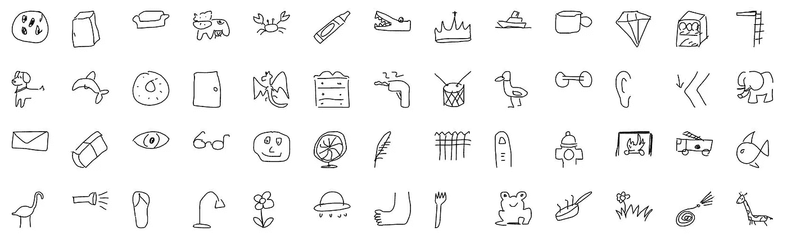
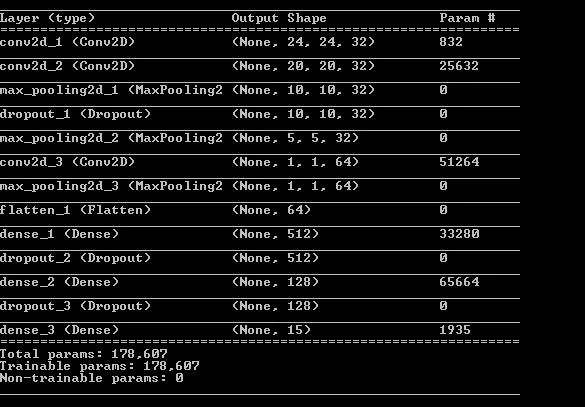

# 玩 QuickDraw:一个实时应用程序

> 原文：<https://towardsdatascience.com/play-with-quickdraw-a-real-time-application-137e66ea9b60?source=collection_archive---------13----------------------->

## 使用深度学习开发游戏应用的虚拟交互的一步。

# **什么是 QuickDraw？**

猜字谜是一种游戏，一个人在空中画出一个物体的形状或图片，另一个人必须猜出来。就像猜字谜一样，Quickdraw 是一种游戏，你在摄像机前画一个图案，然后让计算机猜你画了什么。

# 关于快速绘图数据库

这个想法的起源是由谷歌研究院的 Magenta 团队提出的。其实游戏“快，画！”最初是在 2016 年的谷歌 I/O 上推出的，后来该团队训练了基于卷积神经网络(CNN)的模型来预测绘画模式。他们在网上做了这个游戏。用于训练模型数据集由跨越 345 个类别的 5000 万个绘图组成。这 5000 万个模式如图 1 所示。图片取自[此处](https://github.com/googlecreativelab/quickdraw-dataset)。

Figure 1: Sample of database images

该团队将数据库公开使用，以帮助研究人员训练自己的 CNN 模型。整个数据集分为 4 类:

1.  [原始文件](https://console.cloud.google.com/storage/quickdraw_dataset/full/raw) ( `.ndjson`)
2.  [简化图纸文件](https://console.cloud.google.com/storage/quickdraw_dataset/full/simplified) ( `.ndjson`)
3.  [二进制文件](https://console.cloud.google.com/storage/quickdraw_dataset/full/binary) ( `.bin`)
4.  [Numpy 位图文件](https://console.cloud.google.com/storage/quickdraw_dataset/full/numpy_bitmap) ( `.npy`)

一些研究人员使用这个数据集并成功地开发了训练好的 CNN 模型来预测绘画模式。你可以在这里找到这些实验和教程[。他们还在网上制作源代码来帮助其他研究人员。](https://github.com/googlecreativelab/quickdraw-dataset#get-the-data)

# **使用 CNN 开发实时 QuickDraw 应用**

在这里，我们开发了一个基于 tensorflow 的 QuickDraw 应用程序，使用了 15 个对象，而不是使用整个数据库图像。我们下载了 15 个班级的图片。npy 格式来自[这里的](https://console.cloud.google.com/storage/browser/quickdraw_dataset/full/numpy_bitmap)。这 15 类包括苹果、蜡烛、领结、门、信封、吉他、冰淇淋、鱼、山、月亮、牙刷、星星、帐篷和手表。

下载的数据集保存在名为“data”的文件夹中。用这些图像样本训练 CNN 模型。对于小数据集，我们用 3 个卷积层训练 CNN 模型，然后是最大池和丢弃。在拉平网络后，使用两个密集层。可训练参数的数量如图 2 所示。

Figure 2: Summary of CNN model used to train with QuickDraw dataset.

我们在用 OpenCV 库中指定的默认学习速率训练网络时使用了 Adam 优化。然而，我们也使用随机梯度下降(SGD ),但在这种情况下，您必须手动设置这些参数，因为默认学习率 SGD 给出的训练和验证精度较低。我们用 50 个纪元训练它。在 6GB RAM 的 CPU 中训练 CNN 模型需要大约 2 个小时。模型的准确率在 94%左右。实时测试的输出显示在下面的视频中。Bandicam 软件用于记录桌面活动。

该应用程序找到蓝色指针，并围绕它画一个圆，然后找到圆心，用手移动来画直线或曲线。你也可以用其他颜色替换蓝色指针。为此，您需要在代码中给出适当的 RGB 颜色组合。根据绘图模式，模型猜测并显示预测的表情符号作为输出。然而，有时它不能正确地分类物体。明显的原因是实时应用对噪声、背景颜色和用于采集视频流的传感器的质量敏感。然而，系统的准确性可以通过用更多的历元训练它来提高，保持手与蓝色指针足够接近网络摄像头。

这个应用程序的源代码可以在 [GitHub](https://github.com/gautamkumarjaiswal/QucikDraw) 资源库中找到。你可以下载并使用它来训练你自己的 CNN 模型。在 [GitHub](https://github.com/gautamkumarjaiswal/QucikDraw) 页面也提到了所需软件包的安装过程。

感谢 Jayeeta Chakraborty，他帮助我开发了这个项目。我还要感谢[阿克谢·巴哈杜尔](https://github.com/akshaybahadur21/QuickDraw)的精彩教程和代码。然而，我在 CNN 架构上做了一些改进，增加了额外的卷积和丢弃层来提高系统的性能。希望本文和代码能帮助您开发其他类似的实时应用程序。