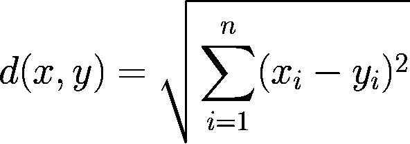
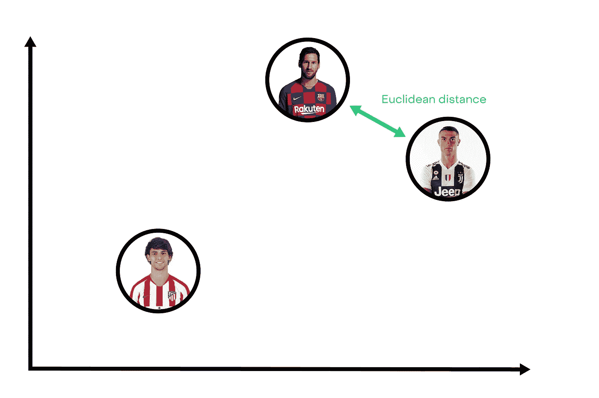
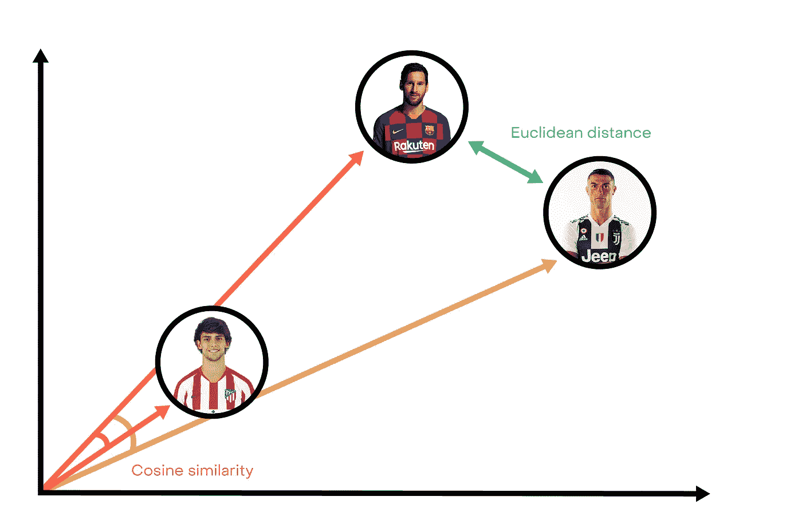

# 玩家相似性和插值

> 原文：<https://towardsdatascience.com/player-similarities-interpolation-aecbf6423c72?source=collection_archive---------11----------------------->

## 简单的数据和计算机科学增强了足球滑板车

分析视频，寻找来自类似球队的球员，在世界各地旅行来侦察球员:scooting 活动可能是漫长而挑剔的。此外，现在有超过 100 个职业联赛和职业球员。

虽然滑板车部门在世界各地都有许多专家，但要跟踪的游戏、玩家和统计数据的数量有时太多，无法仅依靠人类的能力。

这就是足球分析的用武之地。我们将在这篇文章中看到，通过一些数据和基本的计算机科学，滑行过程可以以更高的速度、效率和精度得到增强。

# 刻画玩家

我们要回答的第一个问题是如何给玩家定性？虽然滑板车部门有专家依靠他们对足球的感觉和经验，但仅凭数据很难收集这些专业知识。

足球分析社区开发了许多很好的指标来捕捉球员特征的复杂模式。在这里，我们将集中我们的探索与 [EA 体育 FIFA 20 视频游戏](https://www.ea.com/fr-fr/games/fifa/fifa-20)玩家评分。

这些评级是由该领域的一整个小组和专家计算和提炼的。众所周知，[甚至体育数据公司也在利用视频游戏](https://www.theguardian.com/technology/2014/aug/12/why-clubs-football-manager-scouting-tool)的数据来帮助真正的俱乐部招募球员。虽然这可能有点天真，但这种方法可以成为定义真正玩家属性的良好起点。

这个数据库包含了每个球员的三十多种属性:从进攻到防守，甚至是精神属性。

如你所料，我们可以将这些属性视为每个玩家的特征向量。数学开始。

同样，这是非常简单的。对于那些对更复杂的模型和衡量标准感兴趣的人来说，这里有一些值得一看的资源:

*   [利用深度学习理解 NBA 球员运动的模式](http://www.sloansportsconference.com/wp-content/uploads/2019/02/Using-Deep-Learning-to-Understand-Patterns-of-Player-Movement-in-the-NBA.pdf)Akhil nista la 和 John Guttag。
*   [OptaPro Analytics Forum 2019—player 2 vec:球员和球队风格的序列优先方法](https://www.youtube.com/watch?v=t1y5incr5Gw)作者 Ben Tovarney。

# 计算相似性

现在我们有了描述球员的向量，所以我们能够计算距离。最常见的距离是欧几里德距离，其定义如下:

Euclidean distance.

[欧几里得距离](https://en.wikipedia.org/wiki/Euclidean_distance)就像用尺子来测量距离。然而，选择这个距离很可能不是最佳选择。比如 c 罗和梅西接近，因为他们在射门、速度或者运球方面的评分都很高。但像若昂·费利克斯这样与梅西有着相同轮廓的年轻球员会离得更远，因为他的属性更弱，但比例相同。

With the Euclidean distance, Messi is closer to Ronaldo than J. Felix.

这就是[余弦相似度](https://en.wikipedia.org/wiki/Cosine_similarity)的来源。这是两个向量之间的相似性的度量，看它们之间的角度。

给定属性 x 和 y 的两个向量，余弦相似度 cos(θ)使用点积和幅度表示为:

Cosine similarity.

在我们的例子中，梅西和若昂费利克斯之间的角度小于梅西和 c 罗之间的角度。即使他们离得更远。

Looking at angles between vectors then J. Felix is closer to Messi.

余弦相似性允许我们更好地捕捉“风格”而不是纯粹的“统计”属性。为了更好地理解它，让我们看一些相似性计算的例子:

[**詹姆斯马迪森—莱斯特城**](https://www.transfermarkt.fr/james-maddison/profil/spieler/294057)

The five most similar players to James Maddison

詹姆斯·马迪森是英超联赛中最好的年轻中场之一，也是莱斯特队 2019-2020 赛季的关键球员。这里我们计算余弦相似度来得到五个最相似的玩家。

结果可能看起来有点奇怪，但我们必须记住他们是和马迪森有着“相同风格”的球员。因此，他们不会有与英国球员相似的表现，但我们可以相信他们在球场上有相同的技能和能力。值得注意的是，马丁·德加德，最受期待的年轻人之一，是第十个最像詹姆斯·马迪森的球员。

[**瓦伦丁·朗吉尔—马赛奥林匹克**](https://www.transfermarkt.fr/valentin-rongier/profil/spieler/332889)

The five most similar players to Valentin Rongier

这个例子很有意思。首先，看到阿尔坎塔拉兄弟(蒂亚戈和拉菲尼亚)彼此靠近是一件好事。虽然拜仁慕尼黑的球员比他的兄弟表现更好，但他们在逻辑上有着相同的比赛风格。

如果你曾经看过瓦伦丁·朗格的比赛，你会感觉到他的风格是多么的接近蒂亚戈。虽然弗拉迪米尔·达里达和卢卡斯·鲁普是更令人惊讶的名字，但在与瓦伦丁·朗格尔最相似的球员名单中，还有巴勃罗·福纳尔斯、阿莱克斯·加西亚(曼城的天才)、阿瑟甚至莫德里奇。没什么好惊讶的。

# 矢量插值的进一步发展

正如我们所见，相似之处已经很有趣了。例如，像曼联这样想要取代保罗·博格巴的俱乐部可以尝试找到与法国中场最相似的球员。

但是由于矢量表示的性质，我们可以更进一步。

如果曼联的工作人员想找一个像保罗·博格巴一样拥有梅苏特厄齐尔部分技能的球员呢？

这就是矢量插值的用武之地。通过将保罗·博格巴向量表示与梅苏特厄齐尔向量表示混合，我们可以创建一个插值向量，然后从我们的球员数据库中寻找最接近的向量。

所以在我们的例子中，与保罗·博格巴和梅苏特·厄齐尔最相似的球员是罗伯托·菲尔米诺。当你知道巴西前锋在球场上踢得很低时，这是很符合逻辑的。像法国人和德国人一样，他是一名技术非常娴熟的球员，对比赛有着独特的眼光和感觉。请注意，在名单中菲尔米诺之后的球员是莱昂内尔·梅西、保罗·迪巴拉、菲利佩·库蒂尼奥或凯文·德布劳内。

这里我们同样混合了 Pogba 和 Ozil 载体。在计算这个插值向量时，可以改变每个玩家向量的部分。不是取 50%的 Pogba 和 Ozil 载体，我们可以取 80%的 Pogba 和仅 20%的 Ozil 来得到更类似于保罗·博格巴的载体。

通用公式非常简单，α是我们的比例参数，x 和 y 是两个玩家的向量:

另一个有趣的用例:如果一个俱乐部想用一个更好的球员替换他的一个球员怎么办。有点像“升级”。这个俱乐部没有预算去买一个星舰球员，但是真的想找一个有类似经历的球员。

这是西汉姆和塞尔吉奥·拉莫斯的中卫安杰洛·奥博戈的例子。

通过计算许多具有不同α值的插值向量，我们将得到看起来或多或少类似于奥格本纳的不同球员。

结果相当有趣。将计算中向量的比例从奥格本纳移动到拉莫斯会导致不同的“梯度”,这两个球员或多或少地相似。

这是埃里克·拉梅拉和穆罕默德·萨拉赫的另一个例子。

这些例子证明了这种毫不费力的计算的力量:在这些例子中，被发现的球员可能是改善西汉姆或热刺阵容的好目标。利用球员的这种“梯度”，这种方法还根据俱乐部的意愿提供了许多解决方案。

# 限制和解决方法

正如我们前面提到的，用 FIFA 20 球员数据库做这个实验可能太简单了。虽然这些数据是由人类专家制作的，但它们可能缺乏每个球员更多风格属性的一些特征或细节。仅仅通过在速度、视野或视觉项目上给出好的评分，听起来很难抓住埃登·阿扎尔的比赛风格。

除了寻找好的表示向量的问题之外，这种方法很容易建立。距离很容易在任何现代“数据”软件中实现，插值计算也很直接。我们可以从整支球队中得出这个想法，然后比较每场比赛的阵容。我们甚至可以进一步研究整个游戏:考虑所有的游戏事件，最相似的游戏是什么？回答这个问题，我们可以在一个高的尺度上比较游戏，也许可以尝试在特定的时刻发现最佳选择…

这个实验到此为止。不要犹豫，在 Twitter 上与我联系或在下面留下评论。我希望你喜欢阅读这篇文章。