# 在 Google Colab 中使用无模型强化学习玩 21 点！

> 原文：<https://towardsdatascience.com/playing-blackjack-using-model-free-reinforcement-learning-in-google-colab-aa2041a2c13d?source=collection_archive---------5----------------------->

## 用于解决 21 点等游戏的蒙特卡罗控制和时差控制等算法的比较研究。

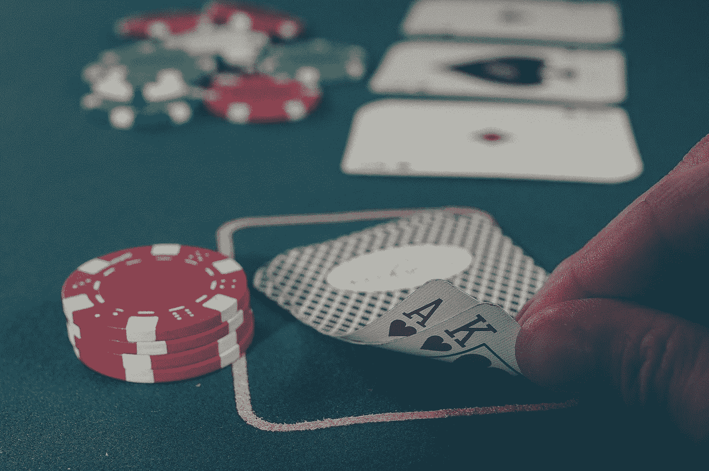

Pixabay

我觉得必须写这篇文章，因为我注意到没有多少文章详细解释蒙特卡罗方法，而是直接跳到深度 Q 学习应用。

在本文中，您将了解到

1.  强化学习中无模型算法背后的动机
2.  这些算法的内部工作，同时应用它们来解决 21 点作为一个例子，在浏览器本身的一个 Colab 笔记本(不需要安装任何东西)！

在我们开始之前，我想让你知道，这篇文章假设你对强化学习的基本概念有基本的了解，如果你不了解，没关系，这里有一个快速回顾:

*   在通常的 RL 设置中，代理在环境中采取行动，并从环境中获得观察和回报。


Illustration ([https://i.stack.imgur.com/eoeSq.png](https://i.stack.imgur.com/eoeSq.png))

> 强化是一种行为模式的强化，这是动物接受与另一种刺激或反应有适当时间关系的刺激的结果。—巴甫洛夫的专著(1927 年)

*   代理执行的这些任务可以是偶发的，也可以是持续的，这里的 21 点是一个偶发的游戏，也就是说，它以你赢或输而结束。
*   代理人期望最大化他们的累积“预期”回报，也称为“预期回报”。在这里，我们对未来可能得到的回报给予的重视程度低于眼前可能得到的回报。*即 Gt = Rt+1+* γ *Rt+2+…*
*   我们假设我们的环境具有马尔可夫性质，即给定当前状态，未来状态或回报独立于过去状态，即 P(St+1|St) = P(St+1|S1，S2，S3…St)。

代理的策略可以被认为是代理使用的策略，它通常从感知的环境状态映射到处于这些状态时要采取的行动。

*   我们定义对应于策略π的状态-值对 V(s ):作为代理如果在该状态下开始并遵循策略π将获得的期望回报。记住 V(s)总是对应于某个策略π。
*   我们还将行动值函数 Q(s，a)定义为在策略π下的状态 s 中采取行动 a 的值。
*   *V(s) = E [Gt | St = s]和 Q(s，a) = E [Gt | St = s，At=a]也可以按照下图所示的方式书写。这种形式在计算 V(s)和 Q(s，a)* 时更有用

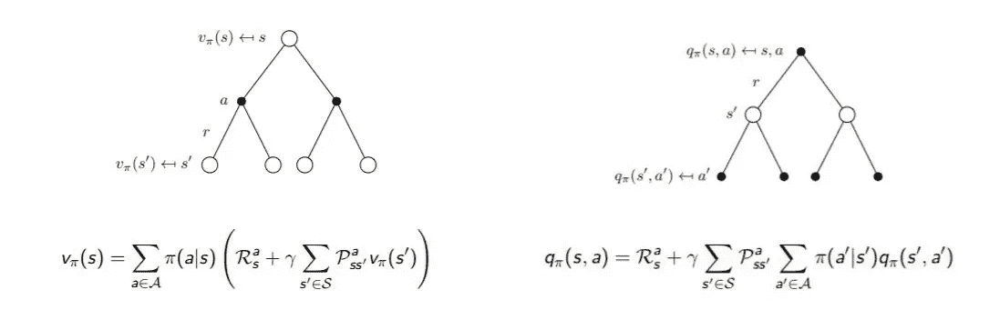

Pss’ is a property of the environment, also referred to as P(s’, r|s, a) in the book by Sutton and Barto.

各种基于模型的方法，如动态编程，使用贝尔曼方程(*V(St)和 V(St+1)* 之间的递归关系)来迭代地寻找最优值函数和 Q 函数。

总结到此结束！

## 我们所说的无模型方法是什么意思？为什么要使用它们？

要使用基于模型的方法，我们需要对环境有完整的了解，即我们需要知道*Pss’(请参考上图)*:如果代理处于状态 St=1 并在=a 采取行动，我们将结束于状态 St+1 = s’的转移概率。例如，如果一个机器人选择向前移动，它可能会在下面光滑的地板上侧向移动。在像 21 点这样的游戏中，我们的行动空间是有限的，就像我们可以选择“打”或“粘”，但我们可能会在许多可能的状态中的任何一种状态中结束，而你对这些状态的概率一无所知！在 21 点状态下，由您的总和、庄家的总和以及您是否有可用的 a 决定，如下所示:

```
env = gym.make('Blackjack-v0')
print(env.observation_space)
print(env.action_space)
```

状态: *(32*10*2 阵列)*

*   玩家当前总数:[0，31]即 32 个状态
*   庄家面朝上的牌:[1，10]即 10 个州
*   玩家是否有可用的王牌:[0]或[1]，即 2 种状态

动作:

*   坚持或击中:[0]或[1]，即 0 表示坚持，1 表示击中

— — — — — — — — — — — — — — — — — — — — — — — — — — — — — —

**当我们没有环境模型时该怎么办？**你通过一次又一次的互动来获取样本，并从中评估这些信息。无模型基本上是试错法，它不需要任何两个状态之间的环境或转移概率的明确知识。

因此，我们看到，无模型系统甚至不能思考它们的环境将如何响应某个动作而变化。这样，它们比更复杂的方法具有合理的优势，在更复杂的方法中，真正的瓶颈是难以构建足够精确的环境模型。(例如，我们不可能开始列出庄家在 21 点的每种状态下将抽出的下一张牌的概率。)

(旁注)也许第一个简明扼要地将试错学习的本质表述为学习原则的人是爱德华·桑戴克，他在 1911 年发表了《效果法则》，但试错学习的思想可以追溯到 19 世纪 50 年代。

理解了无模型方法背后的动机之后，让我们来看几个算法！

> >[现在，我们将在解释算法的同时深入研究代码，如果你在另一个标签中打开 Colab 笔记本会有所帮助](https://colab.research.google.com/drive/1zVdv5KRmWyoYZGt83QTGxPkY1Gm7WjDM)！

[](https://colab.research.google.com/drive/1zVdv5KRmWyoYZGt83QTGxPkY1Gm7WjDM) [## 谷歌联合实验室

### 编辑描述

colab.research.google.com](https://colab.research.google.com/drive/1zVdv5KRmWyoYZGt83QTGxPkY1Gm7WjDM) 

## 蒙特卡罗预测算法；

为了制定更好的政策，我们首先需要能够评估任何政策。如果一个代理人在许多事件中遵循一个策略，使用蒙特卡罗预测，我们可以从这些事件的结果中构建 Q 表(即“估计”行动值函数)。

因此，如果 sum 大于 18，我们可以从“坚持”这样的随机策略开始，概率为 80%，因为我们不想超过 21。否则，如果总和小于 18，我们将以 80%的概率“命中”。以下代码使用以下策略生成剧集，稍后我们将评估该策略:

(注意这里的“情节”,即返回的数量是对应于情节中采取的每个动作的(状态、动作、奖励)元组的列表)

现在，我们想得到给定政策的 Q 函数，它需要直接从经验中学习价值函数。请注意，在蒙特卡洛方法中，我们在一集的结尾获得奖励，其中..

插曲= S1 A1 R1，S2 A2 R2，S3 A3 R3…… ST(直到终止状态的步骤顺序)

我们将从 MDP 的样本回报中学习价值函数，从总结中回忆:

*Q(s，a) = E [Gt | St = s，At=a]且 Gt = Rt+1+* γ *Rt+2+…对于一个策略π* 。

样本返回是什么？假设我们使用一个策略玩了 10 集，当我们访问同一个州 10 次中的 4 次时，我们得到了奖励 2，6，5，7，那么样本回报将是(2+6+5+7)/4 = 20/4 = 5v(S)。因此，样本回报是剧集回报(奖励)的平均值。我们以什么顺序结束访问状态在这里并不重要，对每个值的估计是独立计算的！

这样，我们可以构建一个 V 表或 Q 表，为了创建一个 Q 表，我们需要记录我们访问一个(状态，动作)对所获得的奖励，还要记录我们访问状态 N 表的次数。

这取决于在估计 Q 值时选择的收益

*   第一次拜访 MC: **在一集**中，我们只对第一次拜访**的时间(s，a)进行平均回报。从统计学角度来看，这是一种不偏不倚的方法。**
*   每次访问 MC: **在一集**中，我们只计算每次访问时间**的平均回报。从统计学角度来看，这是一种有偏见的方法。**

比如:一集里，S1 A1 R1，S2 A2 R2，S3 A3 R3，S1 A1 R4→结束。然后第一次访问 MC 将考虑奖励，直到 R3 计算回报，而每次访问 MC 将考虑所有奖励，直到剧集结束。

在这里，在 21 点中，我们是使用首次拜访 MC 还是每次拜访 MC 并没有太大影响。以下是初诊 MC 预测的算法

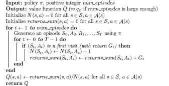

MC pred, pseudocode

但是我们将实现每次访问的 MC 预测，如下所示:

我们首先初始化一个 Q 表和 N 表来记录我们对每个[状态][动作]对的访问。

然后，在生成剧集功能中，我们使用 80–20 随机策略，如上所述。

```
sum(rewards[i:]*discounts[:-(1+i)]) #is used to calculate Gt
```

这将估计用于生成剧集的任何策略的 Q 表！一旦我们有了 Q 值，获得 V 值就相当容易了，因为 V(s) = Q (s，π(s))。让我们画出状态值 V(s)！

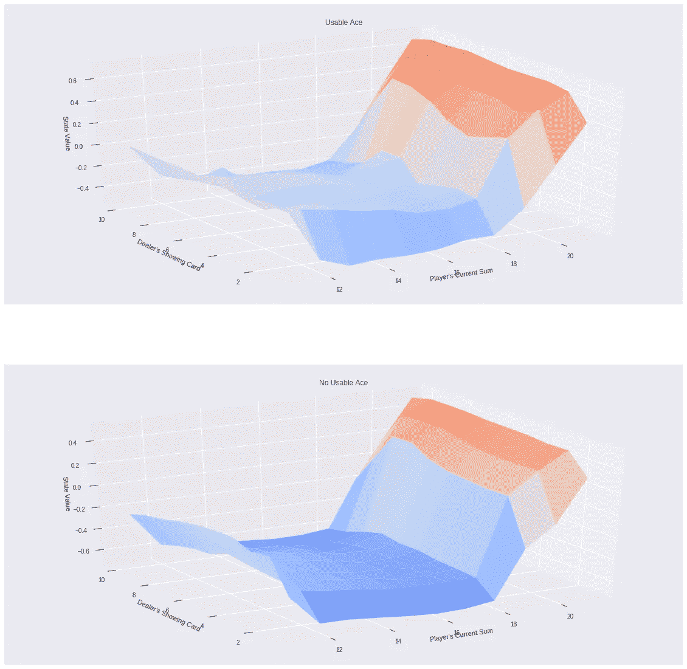

Plotted V(s) for each of 32*10*2 states, each V(s) has value between [-1,1] as the reward we get is +1,0,-1 for win, draw and loss

现在我们知道了如何估计政策的行动价值函数，我们如何改进它？使用…

## 蒙特卡罗控制算法

简单来说，计划是这样的。我们从随机策略开始，使用 MC 预测计算 Q 表。所以我们现在知道了哪些状态下的哪些动作比其他的更好，也就是说，它们有更大的 Q 值。因此，我们可以根据我们的知识，即 Q 表，贪婪地选择每个状态下的最佳行动，然后重新计算 Q 表，贪婪地选择下一个策略，以此类推，从而改进我们现有的策略！听起来不错？

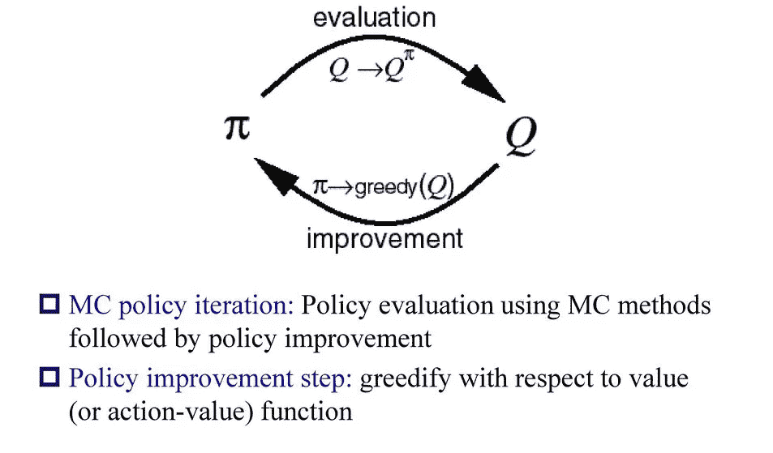

From slides based on RL book by Sutton and Barto

*   但是我们有一个问题，如果对于一个状态“St”有两个动作“stick”和“hit ”,如果代理在许多游戏的早期选择“hit”并获胜，而“stick”应该是更好的动作，它永远不会探索这个动作，因为算法继续贪婪地选择它多次。因此，为了解决这种探索-利用困境，我们将使用ε-贪婪策略，即我们将探索，以概率‘ε’(ε)采取随机行动，而不是贪婪地利用学习到的 Q 值。自然，我们希望在开始时将ε值保持在~1，并在学习结束时将它减小到接近 0(总集数)。
*   增量均值:还记得我们在 MC 预测中如何用所有回报的平均值来估计 Q 值吗？但是现在与 MC Pred 不同，在 MC Control 中，我们的政策每个周期都在变化！我们可以这样用之前的 Q 值来写同一个等式:相信我，这不是突然的，如果你看到 N(St，at) * Q(St，at)是这一步之前的 Gt，因此 Gt-Q(St，At)是增量变化，你自己也可以得到同一个等式。

> N(St，At) ← N(St，At) + 1
> 
> Q(St，At) ← Q(St，At) + (1/N(St，At))*(Gt-Q(St，At))

*   常数α:现在随着 N(St，At)的增加，即我们在互动中多次访问同一个状态-行动对，增量变化项减少，这意味着我们后面的经历对开始的经历的影响越来越小。为了解决这个问题，我们可以用一个常数α代替(1/N)项，它是一个超参数，供我们选择。

> Q(St，At) ← Q(St，At) +α *(Gt-Q(St，At))

了解了这些对仅采样返回想法的重要实际变化后，下面是首次访问 MC 控制的算法！

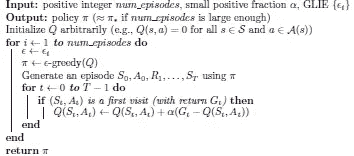

MC control, pseudocode

我们将实现每一次访问的 MC 控制，因为它只是稍微更容易编码

我们只是使用了 3 个函数来使代码看起来更整洁。要像我们对 MC 预测那样生成剧集，我们需要一个策略。但是请注意，我们不是在输入一个随机策略，而是我们的策略相对于之前的策略是ε-贪婪的。get_probs 函数给出了相同的动作概率，即π(a|s)

而 update_Q 函数只是使用增量平均值和常数α来更新 Q 值。最后我们在 MC 控件和 ta-da 中调用所有这些函数！

MC Control

请随意探索笔记本的评论和解释，以获得进一步的澄清！

这样，我们终于有了一个学习玩 21 点的算法，至少是 21 点的一个稍微简化的版本。让我们将学到的策略与萨顿和巴尔托在 RL 书中提到的最优策略进行比较。

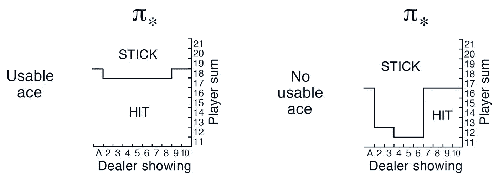

RL, Sutton Barto Fig 5.2

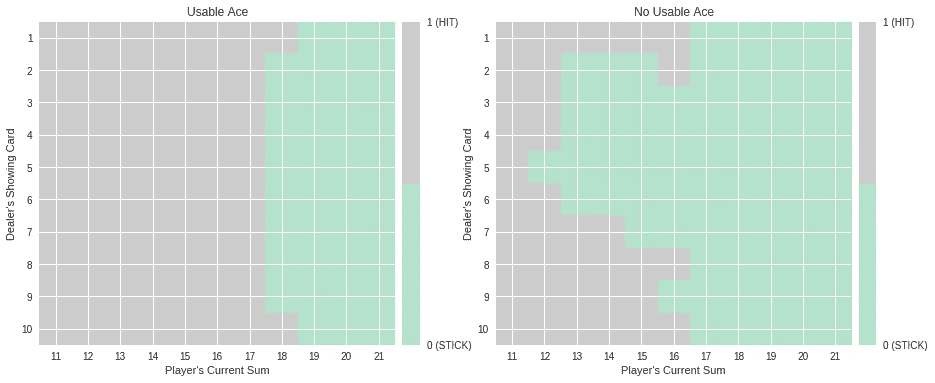

Our learnt policy (rotated by 90 deg)

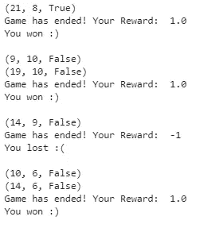

Play using our learnt policy!

沃拉。这就对了，我们有一个人工智能，它玩 21 点的时候大多数时候都会赢！但是还有更多…

## 时间差分方法

现在 21 点不是学习 TD 方法优势的最佳环境，因为 21 点是一个情节游戏，蒙特卡罗方法假设情节环境。在 MC 控制中，在每集结束时，我们更新 Q 表并更新我们的策略。因此，我们没有办法找出是哪个错误的举动导致了损失，但在像 21 点这样的短期游戏中，这并不重要。如果是像国际象棋这样的较长游戏，使用 **TD 控制方法会更有意义，因为它们是引导式的，这意味着它不会等到剧集结束时才更新预期的未来奖励估计值(V)，它只会等到下一个时间步来更新价值估计值。**

(旁注)TD 方法的独特之处在于，它是由**相同量**的时间连续估计值之间的差异驱动的。时差学习的起源部分来自动物心理学，特别是次级强化物的概念。次级强化物是一种与初级强化物(来自环境本身的简单奖励)配对的刺激，因此次级强化物具有类似的性质。

例如，在 MC 控制中:

*V(s) = E [Gt | St = s]且 Gt = Rt+1+* γ *Rt+2+…*

但是在 TD 控制中:

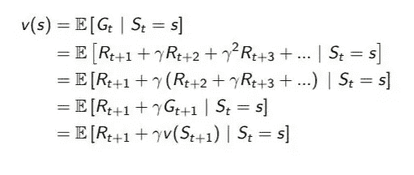

就像在动态编程中一样，TD 使用贝尔曼方程在每一步进行更新。

下图有助于解释 DP、MC 和 TD 方法之间的区别。

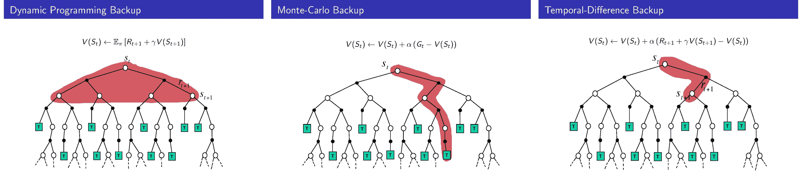

David Silver’s Slides

因此，我们可以以不同的方式考虑增量均值，就好像 Gt 是目标或我们对代理人将获得的回报的预期，但却获得了回报 Q(St，At)，因此通过α *(Gt-Q(St，At))将 Q 值推向 Gt 是有意义的。

类似地，在 TD 方法的情况下，瞬时 TD 目标是 Rt+1 +γQ(St+1，At+1)，因此 TD 误差将是(Rt+1 +γQ(St+1，At+1) -Q(St，At))

根据不同的 TD 目标和略有不同的实施方式，这三种 TD 控制方法是:

*   SARSA 或 SARSA(0)

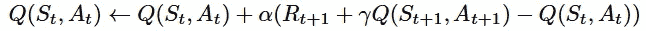

SARSA update equation

当用 python 实现时，看起来像这样:

*   SARSAMAX 或 Q-learning

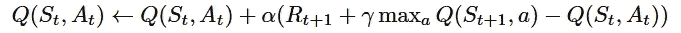

SARSAMAX update equation

当用 python 实现时，看起来像这样:

*   预期 SARSA

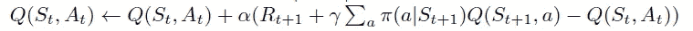

Expected SARSA update

当用 python 实现时，看起来像这样:

请注意，TD 控制方法中的 Q 表在每集的每个时间步进行更新，而 MC 控制方法中的 Q 表在每集结束时进行更新。

我知道我没有像 MC 方法那样深入地解释 TD 方法，而是以一种比较的方式进行分析，但是对于那些感兴趣的人来说，所有 3 种方法都在笔记本中实现了。欢迎您探索整个笔记本，并尝试各种功能，以便更好地理解！

那都是乡亲们！希望你喜欢！

参考资料:

1.  强化学习:导论(安德鲁·巴尔托和理查德·萨顿合著)
2.  大卫·西尔弗的幻灯片(RL 上的 UCL 课程)