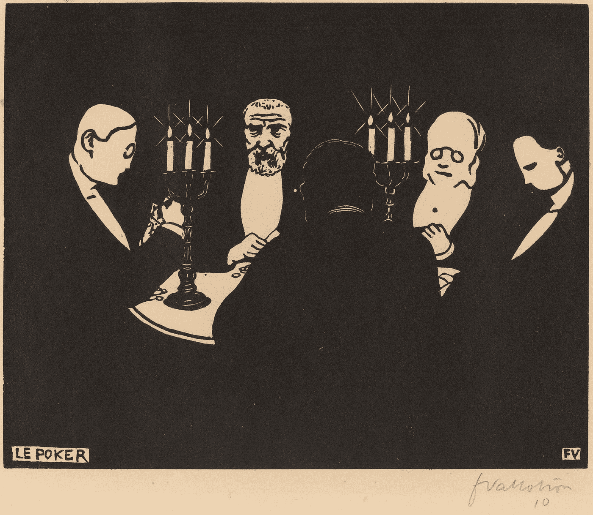
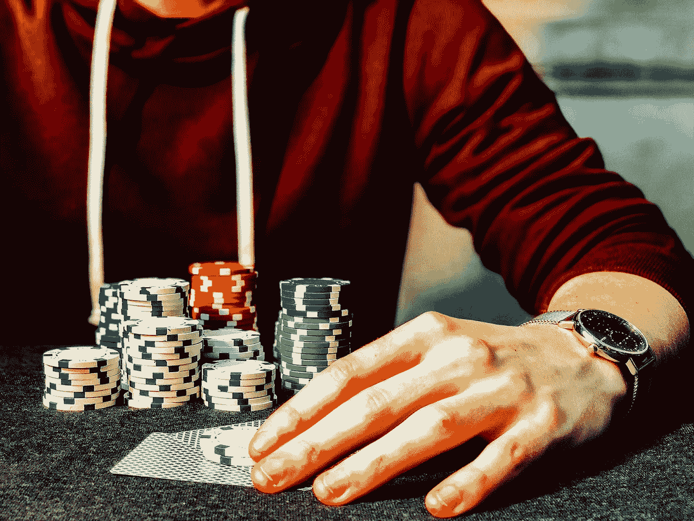
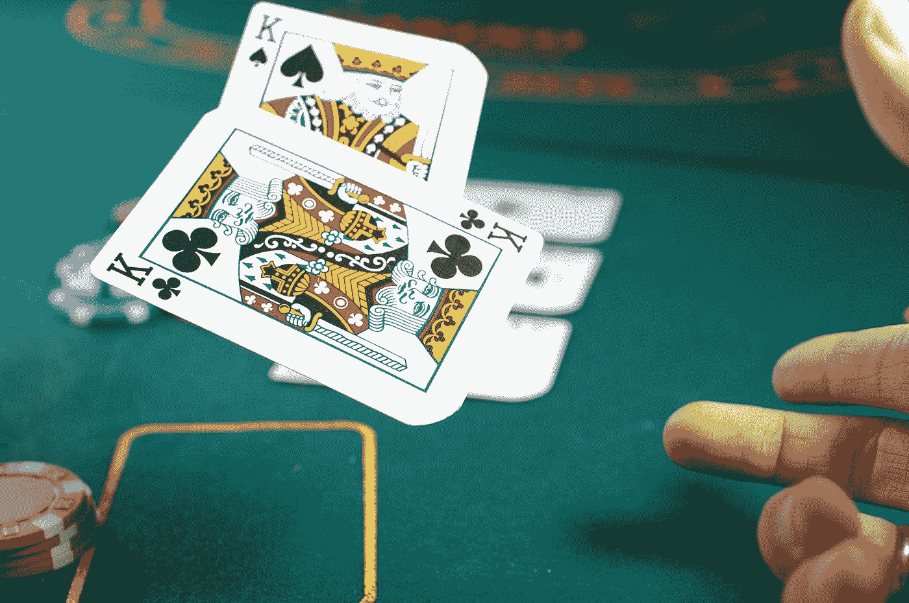

# 在火星上玩扑克:人工智能如何掌握游戏

> 原文：<https://towardsdatascience.com/playing-poker-on-mars-how-ai-mastered-the-game-52f66659f8f4?source=collection_archive---------12----------------------->

## 或者，万亿手的边缘

德克·克内梅尔和乔纳森·福利特

Figure 01: Poker, the quintessentially human game of gamblers and dreamers
[Illustration: Le Poker (Poker) by Félix Vallotton, 1896 woodcut, National Gallery of Art, Open Access]

扑克似乎是典型的人类游戏。从表面上看，扑克是一种比象棋或围棋更随意、更社会化、更平易近人的策略游戏。赌博与扑克密不可分，一方面是职业赌徒，另一方面是大量的娱乐梦想家。这也是一种很受欢迎的家庭游戏，朋友和敌人都可以聚在某人的家里——或者在线扑克大厅——进行常规游戏。扑克可以成为美国游戏的一个很好的例子，在世界其他许多地方也同样受欢迎。

扑克需要我们的原始智力，它也需要更软的技能，如阅读其他玩家，虚张声势，并以心理方式强加你的意志。尽管像国际象棋和围棋这样的游戏是完美的信息游戏——在这种游戏中，机器智能可以强行通过——但扑克将简单的数学和百分比与人类特有的各种感知技能结合在一起。或者至少我们认为。事实证明，那些软性的人类技能可能并不重要。

【2017 年 1 月，人工智能增强软件程序 Libratus 在 12 万手扑克比赛中击败了四名职业扑克玩家。这是 apex 战略游戏中软件对顶级人类的最新征服，紧随其后的是[1997 年战胜加里·卡斯帕罗夫](https://www.wired.com/2017/05/what-deep-blue-tells-us-about-ai-in-2017/)和[alpha go 2016 年战胜李·塞多尔](https://www.theatlantic.com/technology/archive/2016/03/the-invisible-opponent/475611/)。然而，与许多人的预期相反 Libratus 需要根据每个对手来改变它的玩法——人工智能反而通过完全忽略他们的个体而击败了扑克职业选手。计算机没有考虑到对一些人类专业人士的游戏理论如此核心的心理学——屡试不爽的策略，如寻找“线索”和了解玩家。它只是从大量可能的选择中选择出最好的棋，遵循一种策略，一遍又一遍地无情运用。

## **看到隐藏的信息**

我们采访了 Libratus 的联合创始人诺姆·布朗(Noam Brown)，他让我们深入了解了人工智能是如何学习扑克游戏并击败人类职业选手的。“人工智能传统上在处理完美信息游戏方面非常成功，如国际象棋或围棋，其中双方都知道任何时候正在发生什么，”布朗说。“在围棋或象棋比赛中，你需要的所有信息都可供你做出决定。但是在像扑克这样的游戏中，有隐藏的信息。你不知道对手手里拿着什么牌。所以，你总是不得不在不确定的情况下行动，不知道他们的策略是什么，或者你处于什么样的情况。这对 AI 来说尤其具有挑战性。这让事情变得更加困难。这使得计算策略变得更加困难。”

“所以很长一段时间以来，人工智能的研究人员只是忽略了这个问题，”布朗说。“他们专注于这些完美的信息游戏，如国际象棋和围棋。只是假装扑克之类的问题并不存在。这实在令人不满意。所以，我们中的一些人，包括我自己，认为这是一个我们应该解决的问题。因为事实是，*大多数真实世界的情况都涉及隐藏的信息*。你可以制造一个会下棋的人工智能，但如果涉及到隐藏的信息，它在现实世界中就没那么有用了。”

那么 Libratus 是如何工作的呢？“这些算法试图找到所谓的[纳什均衡](https://en.wikipedia.org/wiki/Nash_equilibrium)，”布朗说。“它试图找到一个完美的策略。纳什均衡被证明存在于任何博弈中。特别是，在两人零和游戏中，如果你根据纳什均衡策略进行博弈，那么无论你的对手做什么，你都保证不会输。这就是人工智能试图寻找的东西。*它并没有试图适应它的对手。*它在努力寻找这个纳什均衡策略，并按照它来博弈。因为它知道，如果它在玩这个纳什均衡，那么无论它的对手做什么，它都不会输。”

“我认为纳什均衡存在的想法，扑克中存在这种完美策略的想法让很多人感到惊讶。但是如果你想一分钟，你可以在更小的游戏中看到这一点。例如，在石头、布、剪刀中。我们都知道纳什均衡策略是什么:扔石头，布，剪刀各三分之一概率。如果你这样做，如果你只是采取这种策略，那么无论你的对手做什么，你都不会在预期中失败。在石头、剪子、布的例子中，你不会在预期中获胜。不，你只是要配合期望。”

> “但在像扑克这样复杂的游戏中，如果你能够运用纳什均衡策略，那么你的对手很可能会犯错。但是采用纳什均衡策略，实际上你会赢，因为你采用的是完美策略。所以，我们不是在努力适应对手。事实上，在比赛过程中，*我们从来不看对手的牌*，比如。我们从来不关心对手是谁。*不管对手是谁*，我们总是采用相同的策略

不过，为了让纳什均衡策略发挥作用，你需要一个人。扑克界有一句谚语，如果你环顾牌桌，却找不到那个笨蛋，那么他很可能就是你。在人工智能扑克玩家的世界里，人类是吸盘，因为无论我们如何努力，我们永远不会达到完美的纳什均衡。然而，机器可以。

Figure 02: In a world of AI poker players, the humans are the suckers
[Photo: “Gambling” by Chris Liverani on Unsplash]

尽管 AI 在国际象棋和围棋上击败了顶级职业选手，但 Libratus 的优势还是让扑克界感到惊讶。“我认为这对玩家来说可能有点丢人，”本·萨克斯顿说，他是新奥尔良的作家、教师和严肃的扑克玩家，也是一名扑克记者。“他们有点措手不及。”就在两年前，扑克职业选手击败了另一个玩人工智能引擎的扑克玩家[克劳迪奥](https://www.nbcnews.com/tech/innovation/poker-showdown-pros-beat-program-ace-n356111)，但显然没有占据主导地位。" Libratus 显然比它的前身改进了许多."

“对于一台计算机来说，打倒一个强大的玩家，打倒一个精英玩家是一回事，”萨克斯顿说。“Libratus 令人信服地击败了世界上最好的四名单挑无限注德州扑克玩家，这是另一回事，这就是所发生的事情。我不认为这是一件令人失望的事情。我认为这可能最初有点令人惊讶和谦卑，但最终我认为它再次肯定了那些强烈相信所谓的 GTO 方法的人。"

GTO 是“博弈论最优”的首字母缩写，是一种更新的、越来越占主导地位的扑克方法。你想成为职业扑克手？在一个以大数据为动力的 GTO 世界里，成为职业扑克玩家的梦想可能已经破灭。Libratus 基本上验证了 GTO 方法是击败顶级职业选手的最佳方法。然而，情况并不完全是这样:“我认为这很大程度上取决于你的对手是谁，水平如何，”萨克斯顿说。“我认为，对于你是否想在最高极限下玩 GTO 平衡策略，没有太多争议。我认为，如果你偏离了最优策略，你将会与真正精明的对手交手，他们会利用你。你真的想避免这种情况。”

这是一个重要的细微差别:Libratus 可能事实上更擅长于优化它对最好的玩家的结果，而不是更差的玩家。当玩家的技能下降时，在那一刻做出反应的开发策略是最好的，这是 Libratus 无法做到的。这为我们提供了指导，让我们了解机器在其他环境中的行为，以及它们的优势和局限性。

## **从经验中学习**

Libratus 由机器学习驱动，软件正在构建自己的策略和游戏概念，而不是由人类指导。“Libratus 这样做的方式是通过自我游戏，”布朗说。“这实际上与人类学习玩游戏的方式非常相似。你从经验中学习。所以人工智能一开始对游戏一无所知。它完全随机地玩，在那场游戏中，它玩自己的副本，进行万亿次迭代——例如，万亿手扑克。”万亿只手是一个可量化的提醒，表明今天的人工智能在理解事物方面比人类有优势。我们可能有自己的优势，如更广泛的上下文和更多样的工具集，但在某种程度上，练习万亿次的能力对机器来说是一个不可思议的优势。

Libratus AI 有三个组成部分。布朗描述了每个组成部分如何有助于 Libratus 在竞争中击败高技能人类选手:“现在第一个组成部分是…试图估计这个纳什均衡。现在我们没有通过这个自我博弈部分找到一个完美的纳什均衡，但是我们得到了纳什均衡的一个粗略的近似值。我们在比赛开始前就离线做了，所以我们带着人工智能认为非常强大的策略参加比赛。但它并不完美。”

Libratus 的第二个组成部分是比赛期间的实时平衡计算。Libratus 能够在实时向前移动时锐化其边缘。“例如，当[Libratus]实际上与一个人玩特定的一手扑克，并且它在第三轮下注时，它会实时计算它在那一刻所处情况的纳什均衡的更接近近似值，”Brown 说。有了这个实时组件，Libratus 可以为特定情况确定一个更好的策略，但这个策略必须符合它为游戏整体计算的蓝图。“我认为这实际上是 Libratus 的重大突破，”布朗说。“以前没有人真正找到在不完全信息博弈中进行实时均衡计算的有效方法。”

Libratus AI 的第三个组件使它能够从对手那里学习——但也许是以一种不寻常的方式。“现在，我想说清楚，这不是适应对手，”布朗说。“它没有试图以任何方式利用对手。…因为人工智能不是完美的，它不能计算完美的纳什均衡。在博弈树中有一些部分…不同的情况下它都处于次优状态。这是一个问题，因为如果它玩得不太好，人类就有机会在这种情况下利用它。”当然，这也是人类对手在整个比赛中不断尝试的:寻找 Libratus 的弱点，以便他们可以利用人工智能。因此，在每天比赛结束时，Libratus 会回顾人类试图利用它的情况，并为这些情况制定更好的策略——更接近纳什均衡。“第二天，[Libratus]在这些情况下会有一个更好的策略，所以这些点的可利用性会小得多，”Brown 说。“所以这导致了一种猫捉老鼠的游戏。因为每天人类都会试图找到弱点并加以利用，每天结束时，人工智能会修复这些弱点，为第二天做准备。随着比赛的进行，人工智能中的这些洞随着时间的推移越来越小。人类利用人工智能的机会就更少了。”

## **在火星上玩扑克**

因为 Libratus 以自己的方式学习扑克，不像任何人可能学习的那样，AI 享受了一些积极的意想不到的后果，重新想象了游戏。“因为[Libratus]是从自我游戏中训练出来的——从零开始，在对游戏一无所知的情况下，与自己的副本进行游戏——它从来不看人类数据。布朗说:“与人类的游戏方式相比，它采用了非常不同的策略。当 Libratus 开始一场比赛时，人类对手感觉他们在玩外星人。“这就像和一个在火星上学会打扑克的人比赛，”布朗说。

Figure 03: It was like playing somebody who learned to play poker on Mars
[Photo: “Poker Night” by Michał Parzuchowski on Unsplash]

例如，Libratus 下注的方式与人类惯例大相径庭。Brown 说:“在人类扑克世界中，你通常只下一小部分赌注。“因此，如果底池中有$300，那么您可能会下注$150。你可能会下注 300 美元。而且，也许在一些非常罕见的情况下，你最多可以下注 500 美元。”但 Libratus 没有将赌注限制在小数金额，而是选择下注 3 倍、5 倍，有时甚至是 100 倍。Brown 说:“[Libratus]在 200 美元的底池中投入 20，000 美元没有问题。”。“这对人类来说是一个巨大的冲击。这对他们来说尤其令人沮丧，因为他们可能有一手非常非常强的牌，可能是第二好的牌。突然，机器人在 500 美元的底池中下注 20，000 美元。这个机器人基本上是在说，“我要么在虚张声势，要么我有最好的牌。”“Libratus 的下注策略阻碍了人类玩家，迫使他们花大量时间考虑自己的反应。“你可以看到人类有时需要五到十分钟来做决定，”布朗说。“这让他们非常沮丧。这让我非常满意。”

“Libratus 是在虚张声势，”布朗说。“它当然学会了虚张声势，因为你必须虚张声势才能玩好扑克。但是它选择虚张声势的情况与人类会做的事情非常不同。…事实上，与[Libratus]对战的人类告诉我们，他们将采取其中一些策略，并开始在自己的游戏中使用。特别是，这些大的过度下注，在某些情况下会对底池下巨额赌注。他们说，这是他们将来与人类比赛时要做的事情。”

## **Libra tus AI 的进化**

一般来说，人工智能只能做很少的事情，然而像开发 Libratus 这样的团队正在试图创造适应性更强的引擎，这些引擎可以处理与多个领域相关的某些类型的因素。即使我们将在狭窄的人工智能世界中待上一段时间，也不奇怪会有一股力量推动创造不仅仅是一技之长的引擎。

Brown 分享了更多关于 Libratus 团队的计划:“我们正在开发的东西并不是专门针对扑克的。它们适用于任何不完美信息博弈。…金融市场是一个不完美的信息游戏，谈判也是，拍卖也是，军事形势也是。因此，我们看到了未来将这些技术应用到其他领域的巨大潜力。”

将 Libratus 扩展到谈判和金融市场等其他领域存在挑战。当然，扑克是一种零和游戏。你赢的任何钱，都是从你的对手那里拿的。“那些游戏(比如扑克)有很好的特性，使得计算均衡解更容易。…但是，如果你正在处理一个谈判，你有双赢的结果。这不是零和游戏。”

“理解这一点很重要。重要的是要明白，在这场游戏中，你和你的对手都有可能赢。所需的技术与零和设置略有不同。所以，弄清楚如何将我们拥有的技术应用到这个总的求和设置中，这是我们短期内要做的事情之一。我认为这是需要克服的较小的障碍，”布朗说。“更大的障碍是，当你从游戏转向现实世界时，你的策略和收益并不明确。”

布朗描述的双赢场景需要背景——也许是大量的背景——才能成功解决。到目前为止，人工智能在上下文方面很糟糕。它以我们无法做到的方式使用数据，但无法应用更广泛的背景，更不用说更细微的个性方面了。

然而，随着不同环境的优化或自动化，我们开始理解我们所认为的创造力确实可以被机器复制。赢得像扑克这样的游戏的方法通常回到数学，而不是人类的判断力。甚至作为我们人性概念核心的东西也越来越显得虚幻。在未来的几十年和几个世纪，由于科学的发现和思维机器的成就，我们对人类的概念可能会经历一次彻底的重新思考。

[*Creative Next*](http://www.creativenext.org) *是一个播客，探索人工智能驱动的自动化对创意工作者，如作家、研究人员、艺术家、设计师、工程师和企业家的生活的影响。本文伴随* [*第一季第五集——AI 如何解决扑克*](https://creativenext.org/episodes/how-ai-solved-poker/) *和* [*第一季第六集——扑克、人工智能、学习。*](https://creativenext.org/episodes/poker-artificial-intelligence-learning/)