# 玩物体检测

> 原文：<https://towardsdatascience.com/playing-with-object-detection-8f116ec0ce4d?source=collection_archive---------13----------------------->

几个月前，谷歌[宣布](https://ai.googleblog.com/2019/05/announcing-open-images-v5-and-iccv-2019.html)开放图像数据集(OID)的第五版，以及一些用于物体检测任务的预训练模型。让我们玩其中一个模型，看看它在视觉上的表现如何。


Photo by [Icons8 team](https://unsplash.com/@icons8?utm_source=medium&utm_medium=referral) on [Unsplash](https://unsplash.com?utm_source=medium&utm_medium=referral)

# 介绍

粗略估计， [OID](https://storage.googleapis.com/openimages/web/index.html) 的最新版本由 601 个类别上的 15M 标注包围盒、350 个类别上的 2.5M 实例分割、20k 个类别上的 36M 图像级标签、329 个关系的 391k 关系标注组成。这是一个相当大的数据量，肯定能够实现许多计算机视觉研究的可能性。

将我们的焦点放在对象检测任务上，目标不仅是将图像标记为具有特定对象，而且以高置信度检测对象周围的边界框。一个你可能听说过的著名方法是 YOLO，目前在[第三版](https://pjreddie.com/media/files/papers/YOLOv3.pdf)。

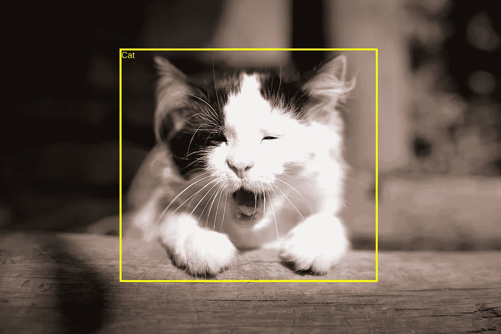

Image from Open Images Dataset V5

如前所述，一些预先在 OID 训练的模型已经发布。最新的是在数据集的第 4 版上训练的，在这篇文章中，我将使用最好的(就[地图](https://medium.com/@jonathan_hui/map-mean-average-precision-for-object-detection-45c121a31173)而言)和较慢的(就速度而言)。这些模型和许多其他模型可以在 Tensorflow 检测模型库[中找到。](https://github.com/tensorflow/models/blob/master/research/object_detection/g3doc/detection_model_zoo.md)

需要强调的是，这篇文章的目的是玩物体检测，*即*对输出进行视觉评估。此外，我想为那些对这一领域感兴趣的人提供一个易于理解的代码。然而，讨论研究领域或深入算法细节超出了本文的范围。也许我可以在另一篇文章中这样做。:-)

# 密码

我会按照我的 jupyter 笔记本，使事情更容易显示。您可以随意运行它或者自己实现代码。请记住，一些代码片段使用在前面的代码片段中实现的函数，因此出现的顺序很重要。

> 这篇文章中提到的所有文件都可以在我的 GitHub 中找到。检查[这个回购](https://github.com/caponetto/jupyter-notebooks)出！

## 设置环境

假设你熟悉 [Anaconda](https://www.anaconda.com/) ，我准备了一个 *yml* 文件，这样你就可以像我一样快速设置环境，甚至是相同的库版本。这是文件的内容。

```
name: object-detection-oidv4
channels:
  - conda-forge
  - anaconda
dependencies:
  - python=3.6.9
  - numpy=1.16.5
  - tensorflow=1.13.1
  - matplotlib=3.1.1
  - pillow=6.1.0
  - pandas=0.25.1
  - jupyter=1.0.0
  - ipython=7.8.0
```

一旦有了文件，就执行下面的命令来创建环境并安装所有必需的依赖项。

```
**$ conda env create -f environment.yml**
```

安装完成后激活环境。

```
**$ conda activate object-detection-oidv4**
```

一切就绪！让我们深入一些 python 代码。

## 验证 TensorFlow 版本

由于 Tensorflow 2.0 最近的[版本](https://medium.com/tensorflow/tensorflow-2-0-is-now-available-57d706c2a9ab)，让我们确保您使用的是构建该代码的相同版本——如果没有出现 *ImportError* ，一切正常。如果您使用我的文件创建了环境，就不必担心这个问题。

Validating TensorFlow version

## 配置绘图

如果您使用的是 [jupyter 笔记本](https://jupyter.org/)，请配置 [matplotlib](https://matplotlib.org/) 以显示内嵌图像。否则，只进行导入。

Configuring plotting

## 导入一些常用库

我们需要一些库来处理文件，所以这里是导入。我还导入了 [numpy](https://numpy.org/) ，因为我们将在整个笔记本中使用它。

Importing some common libraries

## 获取模型文件

在这篇文章中，我将使用一个有趣的模型，命名为:

```
faster_rcnn_inception_resnet_v2_atrous_oidv4
```

如果你想检查模型配置，[这里有文件](https://github.com/tensorflow/models/blob/master/research/object_detection/samples/configs/faster_rcnn_inception_resnet_v2_atrous_oid_v4.config)。

如果压缩的模型文件还不存在，现在让我们下载它。其他机型只要兼容 OID 就可以玩；否则，它将需要更多的代码更改。

Getting the model file

## 获取盒子描述文件

我们还需要盒子描述文件。正如您将看到的，推理代码将返回一些对应于类的数字(1 到 601)。因此，我们需要这个描述文件将结果数字与人类可读的类名进行映射。类似于模型文件，如果文件存在就不会下载。注意，每个类都被当作一个对象，比如动物和人。所以，如果我把一个人当作物品，请不要生气。:-)

Getting the box description file

如果你对 OID 现有的 601 类物体检测感兴趣，看看这张[漂亮的树状图](https://storage.googleapis.com/openimages/2018_04/bbox_labels_600_hierarchy_visualizer/circle.html)。

## 获取一些测试图像

我已经为那些只想运行它并查看结果的人准备了笔记本，并可能进行一些定制。事实上，它是基于 Tensorflow models [库](https://github.com/tensorflow/models)中的一些代码，但是我用我的方式修改了它，使它简单易懂。因此，继续简化事情，下面的代码将下载一些测试图像。请随意更改 URL，这样您就可以用其他图像进行测试。

Getting some test images

## 提取模型文件

既然所有必要的文件都已准备就绪，让我们从压缩的模型文件中提取文件，这样我们就可以访问推理冻结图。这个文件是为推理而优化的，*，即*所有的训练内容都被删除。

Extracting the model files

## 将盒子描述加载到字典中

让我们创建一个字典来映射类，其中键只是索引，值是另一个字典，它包含类 id 和名称，分别作为键和值。

Loading the box descriptions into a dictionary

## 检查一些标签

这就是类的映射方式，但是，我们不会使用 id。相反，我们将使用索引使它更容易。举例来说，如果我们得到类#100，那么它对应于*奶酪*。

Checking some labels

## 从文件加载冻结模型

现在我们需要从冻结的模型文件中创建我们的图表。

Loading the frozen model from file

## 检查原始测试图像

下面的代码片段定义了一个 helper 函数，它显示以文件名为标题的图像。然后，它会检查每一张测试图像并显示出来。

Checking original test images

对我挑选的图片感到好奇吗？他们在这里:

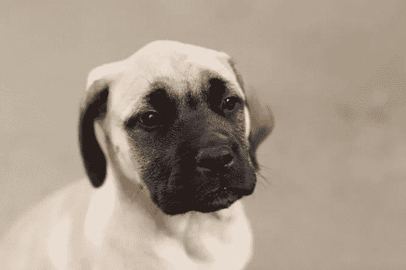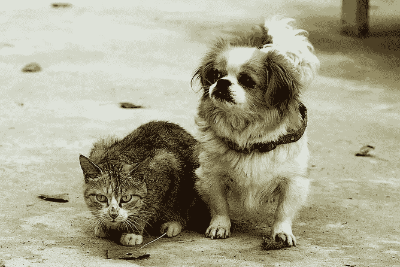

Test images taken from Flicker

狗和猫。我觉得很经典。

## 定义一些助手代码

我们需要更多的辅助代码。以下是我是如何实现它们的——我添加了一些注释，以便更容易理解。

Font and color constants

ObjectResult class

Converts a PIL image into a numpy array (height x width x channels)

Processes classes, scores, and boxes, gathering in a list of ObjectResult

Draws labeled boxes according to results on the given image

Calculates a suitable font for the image given the text and fraction

Draws the box and label on the given image.

## 运行推理

一切就绪！让我们对所有测试图像进行推断。

Running the inference

## 显示结果

现在让我们根据结果画出带标签的包围盒并显示图像。

Showing the results

正如我们在下面的图片中所看到的，使用该模型运行推理在以高置信度检测感兴趣的对象及其相应的边界框方面都提供了相当好的结果。然而，物体的位置和干净的背景很有帮助，这使得这项任务不那么具有挑战性。

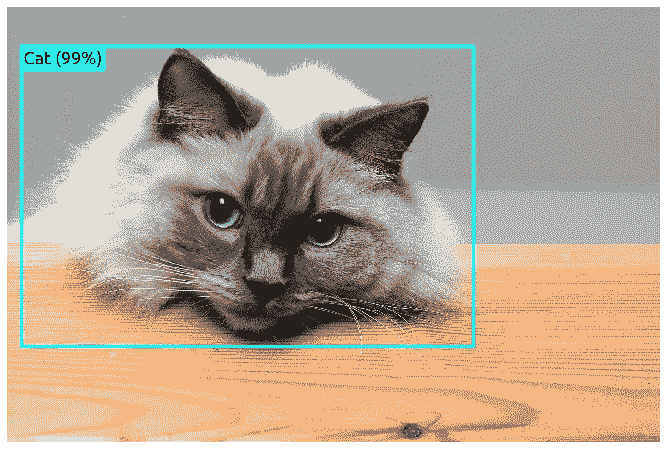

Detected objects: Cat

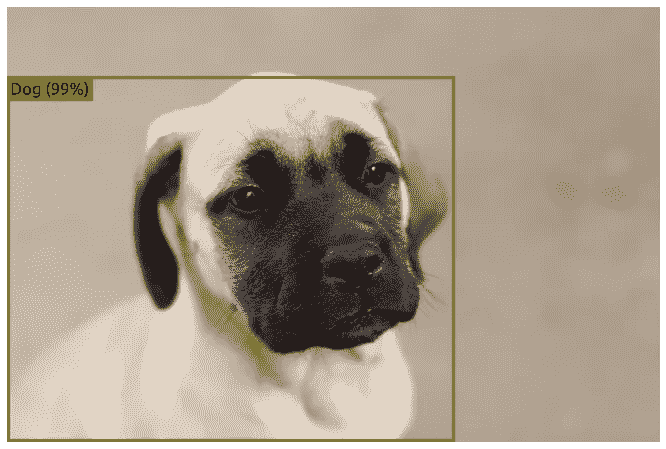

Detected objects: Dog

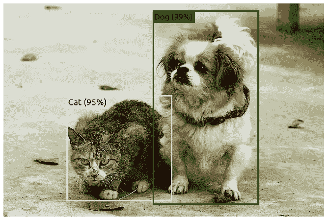

Detected objects: Cat and Dog

## 更具挑战性的结果

在现实世界中，您可能会遇到这样的情况:对象与其他对象部分重叠，或者太小，甚至处于不利于识别的位置，等等。因此，让我们对下面的图片进行推理并检查结果。

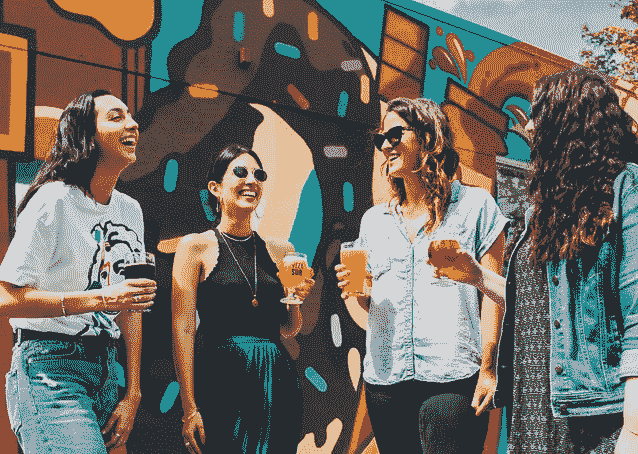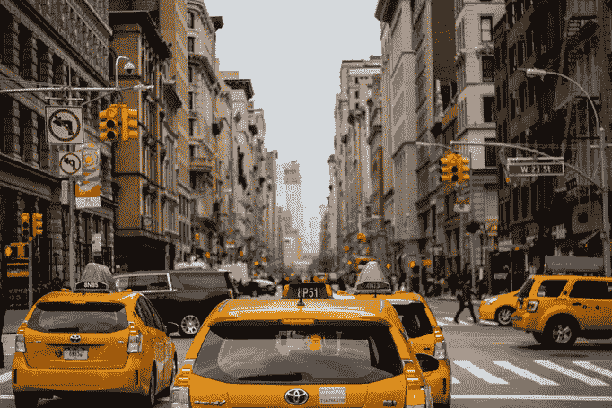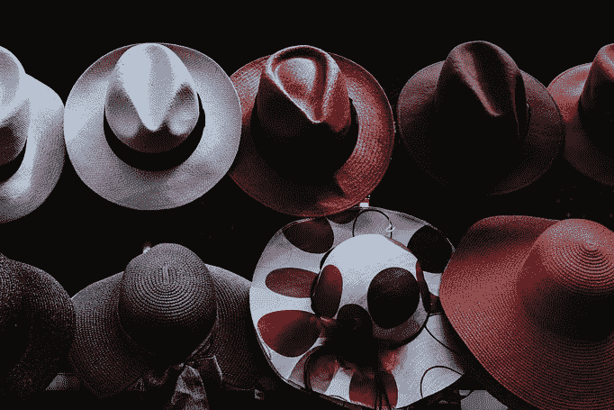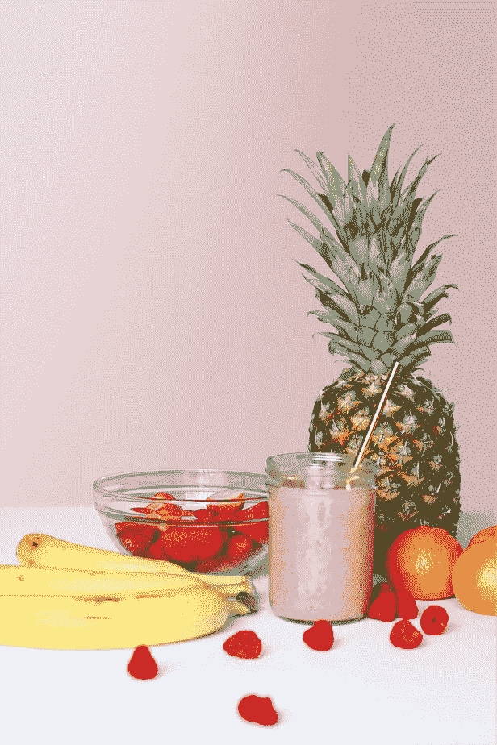

Photos taken from Unsplash

**女人和啤酒**:探测到一堆物体。然而，我选择这张图片只是因为*啤酒*类，不幸的是，还没有检测到。不管怎样，我觉得结果都很好。

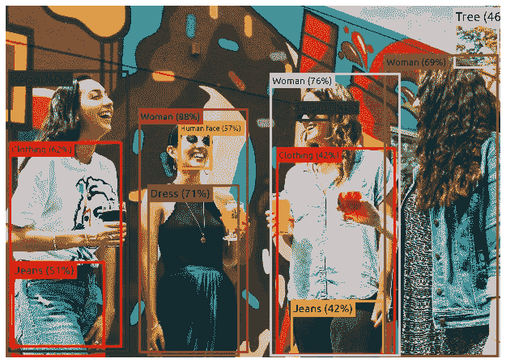

Detected objects: Jeans, Clothing, Sunglasses, Tree, Human face, Woman, and Dress

**街道**:这一条基本上已经检测到车了。我希望得到一个*建筑*，也许还有*交通标志*。也许逐渐模糊的背景使它变得更难，但是那些在左边的交通标志肯定可以被一些合理的信心检测到。

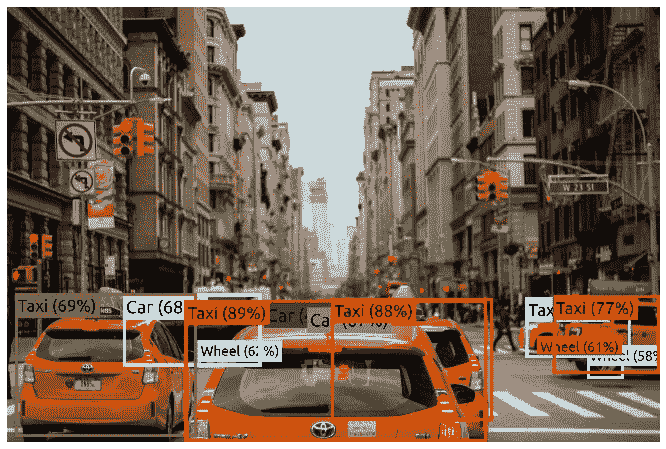

Detected objects: Car, Wheel, and Taxi

由于光线条件的原因，我对这张照片没抱太大期望。然而，三顶看得见的软呢帽中有两顶被发现了。其他可能被检测到的是*帽子*和*太阳帽子*但是让我们放它一马。

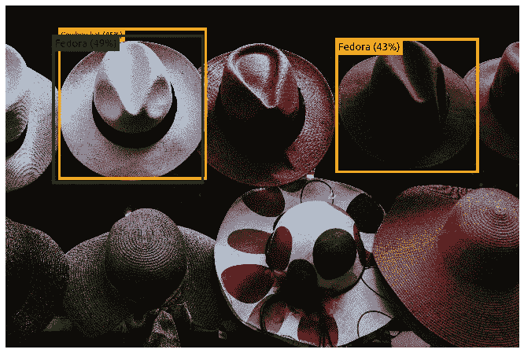

Detected objects: Fedora and Cowboy hat

**乡下房子**:我所期待的一切都被检测到了。有人可能会说*门*本可以被检测到，但门是开着的，我们看不到——模型也看不到。印象非常深刻！

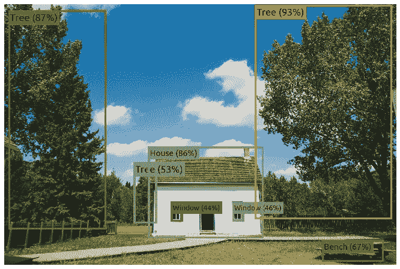

Detected objects: Window, Tree, Bench, and House

**果实**:我所期待的一切都被检测到了。由于不支持这样的类，所以对覆盆子没有操作。*草莓*则是支持的，但是姑且认为他们的立场并不偏向于检测。

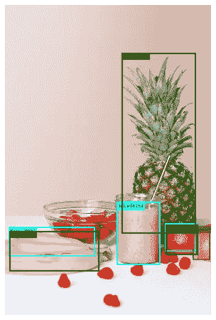

Detected objects: Grapefruit, Juice, Orange, Banana, and Pineapple

# 结束语

在这篇文章中，我展示了如何使用 Tensorflow 进行物体检测。从许多方法和大量预先训练的模型中，我选择了一个在开放图像数据集(一个巨大的带标签的图像数据集)上训练的特定方法。尽管我们已经看到了非常好的结果，但我还是会让您了解一些关于该模型的要点:

1.  如果应用要求实时处理，在 CPU 上运行太慢。如果你在 GPU 上尝试，请让我知道结果。
2.  您受限于模型提供的类。包括一个新的类将需要收集标记的图像并重新训练模型。而且，我朋友，在 OID 重新培训这种模式需要大量的时间。
3.  如果您想在应用程序中使用这个模型，您需要评估每个感兴趣对象的性能。有些职业肯定比其他职业表现得更好。此外，分数阈值在决定检测或不检测什么时起着重要作用。最后，您还需要考虑忽略一些类，因为可能不是所有的类都与您的应用程序相关。

今天到此为止。感谢阅读！🙂