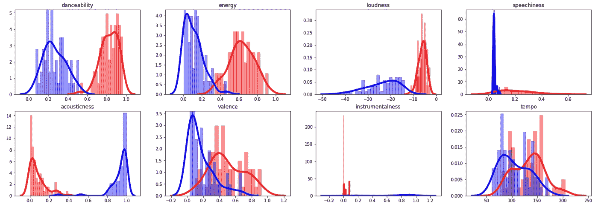
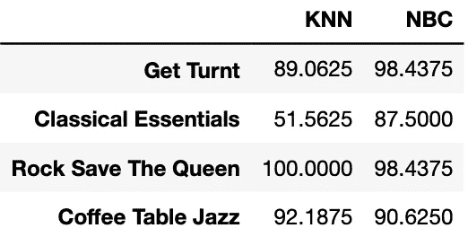

# 基于 KNN 和朴素贝叶斯分类器的 Spotify 播放列表分类

> 原文：<https://towardsdatascience.com/playlist-classification-on-spotify-using-knn-and-naive-bayes-classification-35a279b7e255?source=collection_archive---------6----------------------->


by Spencer Imbrock on Unsplash.com

有一天，我觉得如果 Spotify 在我喜欢一首歌的时候帮我挑选一个播放列表会很酷。这个想法是当我的手机锁定时，触摸加号按钮，Spotify 将它添加到我的一个播放列表而不是库中，这样我就不会进入应用程序并试图选择一个合适的播放列表。这样，我就不必在我所有的播放列表中选择一个播放列表，我只需要把它交给算法。然后，我意识到这对机器学习爱好者来说是一个很好的兼职项目。毕竟，我开始这个项目是为了避免解锁我的手机，并思考三秒钟，这对我个人来说不是最佳的解决方案。

你可以在 https://github.com/n0acar/spotify-playlist-selection 找到 Jupyter 笔记本

# 1-从 Spotify Web API 抓取数据

这实际上是一切开始的地方。我找到了 Spotify Web API 和 Spotipy 框架。通过两者的结合，我们将能够从官方 Spotify 数据中提取有用的功能。

[](https://spotipy.readthedocs.io/en/latest/) [## 欢迎来到 Spotipy！- spotipy 2.0 文档

### 编辑描述

spotipy.readthedocs.io](https://spotipy.readthedocs.io/en/latest/) [](https://developer.spotify.com/documentation/web-api/) [## Web API |面向开发者的 Spotify

### 简单来说，你的应用通过 Spotify Web API 接收 Spotify 内容。

developer.spotify.com](https://developer.spotify.com/documentation/web-api/) 

在向 Spotify Web API 发送请求之前，您需要安装并导入以下依赖项。

```
import spotipy
import spotipy.util as util
from spotipy.oauth2 import SpotifyClientCredentials
```

为了访问 API，你需要为你的应用程序创建特殊的代码。前往 https://developer.spotify.com/dashboard/[的](https://developer.spotify.com/dashboard/)，点击“创建客户端 ID”或“创建应用程序”，获取您的“客户端 ID”和“客户端密码”。之后，重定向 URI 必须被更改到你在 Spotify 应用程序的设置中决定的任何页面。

```
client_id= "YOUR_CLIENT_ID"
client_secret= "YOUR_CLIENT_SECRET"
redirect_uri='[http://google.com/'](http://google.com/')
```

接下来，从现在开始，从 Spotify 文档中声明你的范围,“sp”将是你访问 Spotify 数据的密钥。

```
username='n.acar'
client_credentials_manager = SpotifyClientCredentials(client_id=client_id, client_secret=client_secret) 
scope = 'user-library-read playlist-read-private'
try:
    token = util.prompt_for_user_token(username, scope,client_id=client_id, client_secret=client_secret, redirect_uri=redirect_uri)  
    sp=spotipy.Spotify(auth= token)
except:
    print('Token is not accesible for ' + username)
```

然后，您可以使用 sp 变量做很多事情。它是你的 Spotify 对象。例如，你可以提取你的曲库，获取一个播放列表的数据，或者更好，一个用户的所有播放列表。

```
songLibrary = sp.current_user_saved_tracks()playlist = sp.user_playlist(username, playlist_id='6TXpoloL4A7u7kgqqZk6Lb')playlists = sp.user_playlists(username)
```

要找到播放列表或曲目的 ID 号，基本上使用共享链接并从中获取代码。API 提供的所有东西都是 JSON 格式的，你可以从中提取你需要的信息。


对于 Spotify 数据的各种用法，你可以浏览 Spotify 和 Spotify Web API 的文档。有许多方法和数据类型可能很适合用于项目。

# 2-特性和洞察力的可视化

当人类听一首歌时，他们会感知到它的几个方面。一个人可能没有困难确定一个轨道是声学的还是电子的。大多数有某种音乐感觉的人可以说很多关于音乐的东西，这些东西在电脑上很难找到。然而，Spotify API 提供了一些关于平台上任何曲目的有用的[功能](https://developer.spotify.com/documentation/web-api/reference/tracks/get-audio-features/)。它们中的大部分都在 0 到 1 之间标准化，所以很容易处理。

下面是两个 Spotify 播放列表的对比，蓝色代表“古典精华”，红色代表“Get Turnt”(Spotify 的一个说唱播放列表)。



Get Turnt (RED) — Classical Essentials (BLUE)


从这些情节中，你可以看到这两个流派根据音乐的性质表现出截然不同的模式。虽然 rap 播放列表在可跳舞性、能量、响度、语速、效价和节奏方面具有更高的值，但是古典音乐播放列表具有预期的更高的声学和乐器价值。


# 3-应用机器学习算法

我使用了两种算法，即 K-最近邻和朴素贝叶斯分类。事实上，我只想从头开始实现几个基本算法，我意识到这些是最方便的开始。

**K-最近邻分类:**K-最近邻(KNN)算法是一种基于距离概念利用现有数据和新数据之间的特征相似性的分类技术。

KNN

**朴素贝叶斯分类:**朴素贝叶斯分类是一种计算每个特征的概率，就好像它们是独立的，并根据贝叶斯定理确定概率最高的结果的方法。

Naive Bayes Classification

两者之间的统计差异非常明显。我从我的功能列表中排除了速度和响度，因为它们不包含太多关于流派的信息，而且非常分散。我使用播放列表中的前 35 首歌曲进行训练，其余歌曲进行测试。由于音乐类型的主观性，测试集可能不是最客观的。由于这两个播放列表都是由 Spotify 创建的，我认为这是测试算法最安全的方式。幸运的是，我们的目标是对说唱和古典音乐进行分类，统计数据没有任何错误，我们获得了 100%的准确率。

即使所有的歌曲都被归入了正确的类别，有一首古典歌曲在使用 KNN 时也几乎被归入了错误的类别。被称为[E 大调小提琴协奏曲 BWV 1042:I .快板](https://open.spotify.com/track/3nxaPqAOxUxkLhIhbvmv4t?si=s9sYUAZlRq6dQNl-KmY5zw)。当使用朴素贝叶斯分类时，它甚至不接近说唱歌曲，但它仍然是古典音乐播放列表中最接近说唱的东西。起初，我试图找到距离最近的说唱歌曲，这是由未来粉碎的，所以这有点令人惊讶。然后，我检查了这首古典歌曲的特点，它在我看来确实有点问题。(听一听吧！至少“仪器性”特征应该大于零。)


然而，这并不是一个困难的任务。为了让事情变得更复杂，更好地评估算法，我决定增加一个播放列表，即“摇滚拯救女王”。


Accuracy Rates (%)

NBC 看起来比 KNN 更稳定。上面提到的那首古典歌曲已经不在古典音乐播放列表中了，因为有新的摇滚歌曲。尽管如此，NBC 没有犯任何错误。然而，在 Get Turnt 播放列表中，事情有点不同。这次只根据最近的邻居来决定流派对于说唱歌曲来说不是一个好主意。最混乱的说唱歌曲是“Wifisfuneral”和“Robb Bank$”的“EA”，最后在 rock bucket 结束了。

为了让事情更具挑战性，我添加了一个新的播放列表，“咖啡桌爵士乐”，由 Spotify 创建。


在向您展示结果之前，我想添加算法在最终模型中使用的四个播放列表的更新可视化。当我调查结果时，我将在最后一步参考这些。(摇滚拯救女王和茶几爵士分别用黄色和橙色表示。)


Get Turnt (RED) — Classical Essentials (BLUE) — Rock Save the Queen (YELLOW) — Coffee Table Jazz (ORANGE)



Accuracy Rates (%)

从这些，我们清楚地看到，古典音乐和爵士音乐流派在统计上彼此接近，而摇滚和说唱流派也是如此。这就是为什么当摇滚乐被引入时，新出现的歌曲没有引起古典歌曲的混乱，而是损害了 Get Turnt 的准确率。当咖啡桌爵士乐被引入系统时，也发生了同样的情况。这一次，KNN 的古典音乐分类法受到了严重的伤害。要知道古典音乐只是和爵士乐混淆，51%的准确率几乎是随机的。这表明，只考虑最近的邻居对分类流派不起作用。至少，可以肯定地说 NBC 要好得多。

NBC 不适合古典和爵士音乐，也不适合说唱和摇滚。我认为这是因为人们区分古典歌曲和爵士乐的方式是对传统上使用的不同乐器进行分类。即使他们之间在可跳性方面有一点差异，对一些歌曲来说这也是不够的。其他功能与预期的几乎相同。工具性；然而，几乎完全相同，因为它可以看到在蜘蛛图。是的，他们显然都是工具性的，然而这就是这个特征缺乏人类感觉的地方。也许，Spotify 提供另一种数据类型，说明歌曲中具体使用了哪些乐器或哪些类型的乐器，也可能解决这个问题。我认为 98.44%的准确率对于其他两个播放列表来说是很棒的。NBC 只错过了每个播放列表中的一首歌曲。他们是 Travis Scott 的[观星](https://open.spotify.com/track/7wBJfHzpfI3032CSD7CE2m?si=mb5ERmxYSYaBeY9XYvadCQ), Travis Scott 认为是摇滚，而[遥远的过去](https://open.spotify.com/track/4L2F0LcDVtNrFc1K4lmx3m?si=8V-sV5tQQkm70zJ-R2tWnQ)被所有人认为是说唱。(如果你听了他们的话，请分享你的评论。)

# 4-结论

这个项目的目的是创建给定播放列表的未确定流派，并相应地对新歌进行分类。它应该适用于任何包含相同类型歌曲的播放列表。我选择使用 Spotify 创建的四个带有明显流派标签的播放列表。我使用了两种不同的算法，如帖子中提到的 KNN 和 NBC。NBC 的整体表现优于 KNN。该系统可能遇到的挑战是区分两个具有非常接近的风格的不同播放列表。我还意识到，Spotify 提供的功能在某些情况下可能还不够。

不要犹豫提出问题并给出反馈。音乐，流派，总体来说，这部作品是主观的。我很感激任何关于结果的评论，因为这个话题是公开讨论的。

干杯，

Nev

给我更多的内容和支持关注！

在 [Twitter](https://twitter.com/nevacar_) 和 [LinkedIn](https://www.linkedin.com/in/nevzat-acar/) 上与我联系…