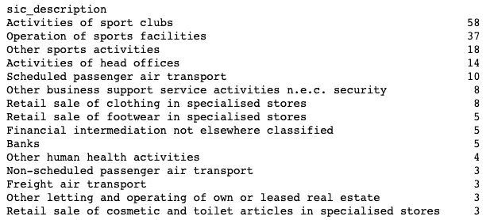
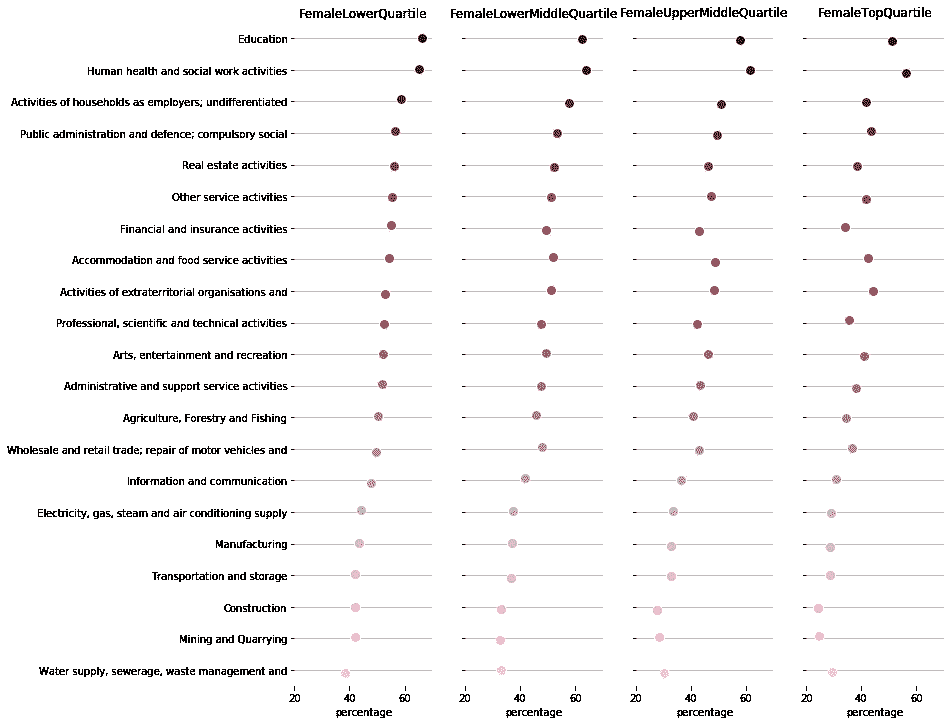

# 请注意性别工资差距

> 原文：<https://towardsdatascience.com/please-mind-the-gender-pay-gap-9162f13b4202?source=collection_archive---------29----------------------->

[Feodora Chiosea/iStock](https://www.dreamstime.com/feodoragorea_info)

# TL；DR:性别薪酬差距是一个真实的现象，来自英国性别薪酬差距服务的数据告诉我们一个重要的故事，男女是多么不平等，尤其是在职业发展方面。

性别平等是一个备受争议的重要话题，它理应如此。随着我们社会的发展，妇女在我们社会中的角色也在发展。然而，并不是我们社会的所有时间规范都跟得上变化。在本文中，我们将关注性别(不)平等问题的一个子树，即男女之间的性别薪酬差距。我们会问一些重要的问题，并根据英国政府提供的性别薪酬差距数据来回答。

# 性别薪酬差距到底是什么？

在继续讨论之前，我们应该就性别薪酬差距的定义达成一致。也许你心目中对性别工资差距的定义与实际情况有所不同。如果员工的性别不同，你可能会认为向做同样工作、有同样表现的不同员工支付不同的工资/奖金是性别工资差距。然而，这就是不平等报酬的定义，不平等报酬不一定是性别之间的。

> **报酬不平等是指从事相同(或相似)工作的男女报酬不同。自 1970 年以来，不平等报酬在英国一直是非法的。* [*【参考】*](https://gender-pay-gap.service.gov.uk/public/assets/pdf/gender-pay-gap-explained.pdf)*

*根据[英国性别薪酬差距网站](https://gender-pay-gap.service.gov.uk/public/assets/pdf/gender-pay-gap-explained.pdf) ***性别薪酬差距*** ***是整个劳动力大军中所有男女平均时薪的差异*** *。例如，如果女性在一个组织中比男性做更多的低收入工作，那么性别工资差距通常会更大。**

> ****性别薪酬差距*** ***是劳动力中所有男性和女性的平均时薪之差****

*就这一定义达成一致非常重要，因为这篇文章恰恰将关注上述性别薪酬差距的定义。薪酬不平等是一个大问题，大多数时候，人们笼统地提到性别薪酬差距。他们大多指的是不平等的报酬。*

# *那么，问题是什么呢？*

*既然我们对性别薪酬差距有了明确的定义，现在我们需要回答几个好问题。毕竟，这可能是你读这篇文章的原因，对吗？*

*   *男性的平均收入/中位数比女性高吗？*
*   **如果是，他们多赚多少？**
*   **哪些部门雇佣女性较多？**
*   **这些行业是否为女性提供了足够多的晋升和加薪机会？**
*   **哪些部门是女性最难晋升的？**
*   *对于一家我们不太了解的公司，有没有办法预测性别薪酬差距？我们能建立一个统计模型吗？*

*现在我们有几个问题，现在我们的目标是有条不紊地回答，有条不紊意味着我们需要数据！*

# *给我看看数据！*

*在英国，自 2017 年以来，拥有 250 名以上员工的大型雇主必须在自己的网站上公布性别薪酬差距数据，并提交给政府性别薪酬差距网站。这一数据公布在性别薪酬差距网站上。截至 2019 年 10 月，数据集中有超过 21000 家公司。*

## *解释性别薪酬差距数据*

*数据本身值得一个快速的解释，因为我们将在我们的帖子的其余部分使用它。*

***工资/奖金数据:***

*   **所有男性全薪相关雇员的平均时薪为 15.25 英镑，所有女性全薪相关雇员的平均时薪为 13.42 英镑的雇主，其平均性别薪酬差距为 12.0%(*`*DiffMeanHourlyPercent*`*)。**

***四分位数计算:***

*   **雇主有 322 名全薪相关员工，按照最低小时工资率到最高小时工资率对他们进行了安排，将名单分成四个四分位数，并确保相同小时工资率的员工在跨越四分位数界限时按性别均匀分布**
*   **在下四分位数的 81 名雇员中，48 名是男性，33 名是女性。这意味着 59.3%是男性，40.7%是女性。**
*   *在中下四分位数的 80 名雇员中，28 名是男性，52 名是女性。这意味着 35%是男性，65%是女性。*
*   *在中上四分位数的 81 名雇员中，40 名是男性，41 名是女性。这意味着 49.4%是男性，50.6%是女性。*
*   *在上四分位数的 80 名雇员中，58 名是男性，22 名是女性。这意味着 72.5%是男性，27.5%是女性。*

> *如果您需要更多详细信息，请参阅第 11 页 上的 [*管理性别薪酬报告、计算部分。*](https://www.acas.org.uk/media/4764/Managing-gender-pay-reporting/pdf/Managing_gender_pay_reporting_07.02.19.pdf)*

## ***薪资对比***

*在这 21000 家公司中，男性的平均收入高于女性，这可能并不令人惊讶。下图显示了所有公司中性别间平均和中位数工资差异的分布情况。*

**

*Distribution of Hourly Mean and Median salaries*

*两张图的重心都是正的，这告诉我们，在大多数公司里，男性比女性挣得多。图形的形状略有不同；中位数工资分布有一个右偏。在大多数公司中，平均工资差距略大于零。在数据集中 87%的英国公司中，男性的平均工资高于女性。同样，在 77%的英国公司中，男性的平均工资高于女性。*

> *在 87%的英国公司中，男性的平均工资高于女性。*

*下图的下半部分显示了平均工资差异远大于平均工资差异的公司(每个点代表一家公司)。平均值和中位数之间的差异告诉我们，典型的员工(男性或女性)获得相似的工资，即典型员工的性别差异较小，但很少有男性员工挣得这么多，并扭曲了平均工资差异。*

**

*Companies with higher mean salary and smaller median salary difference*

*当我们按行业来看这些公司时，我们看到体育俱乐部脱颖而出。这些体育俱乐部付给少数男性雇员(可能是运动员)的工资比女雇员高。*

**

*Sport Clubs has a few very big salary earner men and many regular earner men and women*

# *女性在事业上往上爬有多容易？*

*我们可能都有一种直觉，认为女性在职业发展方面的机会通常较少。可能有很多原因，包括女性对她们年幼的孩子承担了更多的责任，产假，提前退休..等等。确保制定政策，让妇女加入各个领域的劳动力队伍，并给予足够的晋升机会，对于缩小男女薪酬差距非常重要。*

*让我们来看看女性在四个不同收入区间的比例分布，低收入、中低收入、中高收入和高收入。他们每个人都被平均分配，这意味着他们在每个桶中有相同数量的员工。*

*这个数据讲述了一个有趣的故事。下图显示了收入最低的 25%的员工的性别分布情况:*

**

*在大约 21000 家公司中，收入最低的****女性在超过 57%的公司中占大多数**。我们大概可以推测几个原因:***

*   ***女性职业生涯的起点可能是收入较低的工作。记住这张图是同一家公司中收入最低的人的分布。它没有说他们是否做同样的工作得到不同的报酬，它只是告诉了最低收入者的比例。***
*   ***女性可能无法晋升到收入更高的工作岗位，并且收入一直低于男性。这里不讨论原因，因为我们这里的数据对此一无所知。***
*   ***女性可能会在同一家公司更长时间地从事低收入工作。***

***上面的每一个要点都是有效的研究方向，但是，我们没有数据来回答这些问题。因此，我们在这一点上停止进一步的推测。***

***下面是剩余的三个图表:***

*   ***中下四分位数的性别分布***

******

*   ***中上四分位数的性别分布***

******

*   ***最高四分位数的性别分布***

******

***趋势很明显，从底部四分之一到顶部四分之一，男性雇员的比例增加了。在收入最高的四分之一人群中，超过 65%的公司男性员工的比例高于女性员工。***

> ***超过 65%的公司在高薪员工中男性多于女性。***

# ***不同部门的细分情况如何？***

***上一节的图表显示了男女百分比的总体分布情况。在这里，我们将把它分成不同的部分。我们可能都有一个想法，男人是大多数劳动力。建筑业和采矿业就是两个例子。***

***让我们检查一下我们的直觉***

******

***Women workforce percentage in different sectors***

***在上图中，有一些观察结果符合我们的预期。正如预期的那样，女性雇员在需要较少体力的类别中占大多数，更多地集中在服务部门。采矿、运输和建筑等需要更多体力的行业较少由妇女从事。***

***真正有趣的观察是，在所有类别中，女性都不太可能晋升到高收入职位，无论是教育还是建筑。这一趋势在所有部门都是一致的。这是一个强有力的论点，即女性处于劣势，从事高薪工作的女性较少直接造成了性别薪酬差距。这可能意味着女性不容易获得晋升，或者即使获得晋升，她们的工资也比做同样工作的男性同事低(不平等的工资)，或者两者兼而有之。***

***为了了解上述现象的影响，让我们从最低收入阶段到最高收入阶段，按女性劳动力百分比的下降对行业进行排序。***

******

***Construction, Mining and Finacial Services are the most difficult for women to gain promotion.***

***在某些行业，女性比例下降幅度几乎高达 45%。即使在女性明显占多数的教育领域，下降幅度也在 23%左右。***

> ***在所有行业中，女性获得最高职位的机会始终较少。从最低到最高铲斗的落差在 14%到 45%之间。***

***根据图表，建筑和采矿部门的妇女处于最不利的地位，因为她们爬到更高收入阶层的机会更少。***

***一个有趣的观察结果是，金融和保险活动等软领域也出现大幅下降。再次纯粹猜测原因，金融部门的压力有可能因为怀孕等事情而惩罚妇女，因为工作时间损失直接影响收入，但其他部门如人类健康和社会工作活动更宽容和灵活。***

***然而，这种持续下降是一个严重的问题，解决这一问题将是解决性别薪酬差距问题的一大步。***

# ***预测未知***

***现在，我们有了大约 21000 家公司的所有数据，包括他们的工资和奖金分配以及其他元数据。如果有一个统计模型可以预测一家公司是否有或大或小的性别差距，即使他们还没有提交性别薪酬差距数据，那将是非常棒的。***

***为了建立一个模型，我们需要一些具有预测能力的特征，这些特征的组合决定了模型的成功。***

***让我们来看看性别薪酬差距数据中的三个不同变量:***

*   ***英格兰、威尔士、苏格兰和北爱尔兰。***
*   ***`sic_code:`不同的行业有不同的女性比例***
*   ***`EmployerSize`:大公司有没有消除性别薪酬差距的政策？***

***我们排除了使用与工资或奖金相关的变量作为预测因素，因为这些变量对于尚未提交数据的公司来说是不可用的。但所有其他信息，如公司规模、部门、地址..etc 是公开的。***

## ***`State Code`***

***大不列颠由四个不同的国家组成，每个国家都有所不同。因为每个国家都有权力下放的政府，而这些权力下放的政府在其行政区域内有不同的法规和法律。这可能会对女性的工作参与率产生一些影响(不同的儿童保育计划、孕产规则、工作场所的规章制度..等等)。让我们看看是否有任何明显的区别:***

******

***% of Women emplyees in top and bottom salary buckets***

***英格兰、苏格兰和威尔士的两个工资区的女性雇员比例都非常相似，北爱尔兰的女性雇员比例要低得多。`state_code`单独看起来不像一个强有力的预测者，但有一些预测能力，所以我们保留它。***

# ***SIC 代码***

***正如我们在本文前面看到的，不同的部门有不同的女性员工参与；例如，从事建筑业的女性人数(百分比)比从事教育的女性人数少。因此，SIC 代码本身可能是一个很好的预测器:***

******

***Construction has the least % of women in high earners bucket, Human health has the highest***

# ***雇主规模***

***有人可能会认为，与小公司相比，大公司可能会有一个内部政策来调节性别薪酬差距。下面的统计数据不一定告诉我们这是事实，因此这个变量的预测能力可能相当小***

******

***Biggest companies (>20000) do not have the highest % of top women earners***

## ***模型结构***

***我没有准确预测最高级别女性员工的百分比，而是决定将其分为三个同等大小的级别，也就是说在各自的级别中#低= #中= #高。截止点是:***

*   ***“低”是<22.5%***
*   ***“Middle” is between > 22.5%和<50.6%***
*   ***“High” is between > 50.6%***

> ****请注意，这是我根据数据集任意定义的，将高、中、低设置为其他值(如 66%和 33%)并相应地构建模型完全没问题。我只是想保持标签数量相等。****

***基于特征建立*决策树模型*，模型准确率为 54%。***

***该模型的准确度分数不是特别高，但这在某种程度上是意料之中的，因为我们的预测因子只是分类(离散)变量，并不像我们之前探索的那样具有很大的预测能力。尽管如此，这仍然比基线值 0.33 有适度的提高，基线值 0.33 只是一个随机的猜测。***

***当调查**个体群体**时，我们的模型具有以下成功率:***

*   ***预测低/不低标签，成功率为%63***
*   ***预测中等/非中等标签，成功率为%64***
*   ***预测高/不高标签，成功率为%82***

***尽管这个模型有一些预测能力，比随机猜测要好，但在实践中，它还不是很强大。如果我们有更多具有更强预测能力的特征(预测器)，那么我们的模型的准确性将会提高。***

# ***结论***

***不幸的是，性别薪酬差距是一个现实问题，我们需要做更多的工作来解决这个问题。联合王国政府了解和量化性别薪酬差距的举措是一个很好的举措。我们发现，总体而言，男性员工的工资水平处于中等偏上水平(然而，这并不意味着做同样工作的男性*，比女性**挣得多，这就是不平等工资的定义)。我们还发现，女性比男性更难爬上薪酬阶梯，因为公司中的高薪者大多是男性，这是所有行业的一致趋势。没有一个部门的女性雇员看不到她们的代表性从最低工资水平上升到最高工资水平。******

******我们还试图建立一个机器学习分类器，根据公开可用的元数据，如行业、公司规模和位置，预测公司的女性员工比例是低、中还是高。******

******如果你对实际分析感兴趣，jupyter 笔记本[在这里](https://github.com/oneryalcin/udacity_data_scientist_submissions/blob/master/Write_A_Data_Science_Blog_Post/uk_gender_pay_gap.ipynb)有售******

******感谢阅读…******